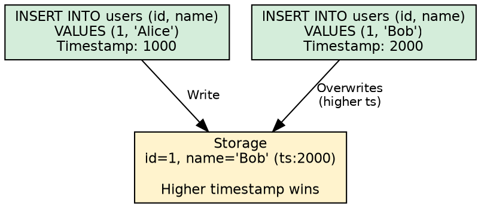

# INSERT

The INSERT statement adds rows to Cassandra tables. Unlike SQL databases, Cassandra's INSERT performs an **upsert** operation—inserting a new row if the primary key doesn't exist, or updating the existing row if it does.

---

## Overview

### Upsert Semantics

Cassandra does not distinguish between INSERT and UPDATE at the storage layer. Both operations write cells (column values) with timestamps:



**Key implications:**

- No "duplicate key" errors—second INSERT simply overwrites
- No read-before-write needed to check existence
- Conflict resolution based solely on timestamp

### INSERT vs UPDATE

| Aspect | INSERT | UPDATE |
|--------|--------|--------|
| Syntax | Specifies column list and VALUES | Uses SET assignments |
| Behavior | Upsert | Upsert |
| Null handling | Missing columns unchanged | Explicit null creates tombstone |
| Storage | Identical | Identical |

!!! note "Functional Equivalence"
    These statements produce identical storage:
    ```sql
    INSERT INTO users (id, name) VALUES (1, 'Alice');
    UPDATE users SET name = 'Alice' WHERE id = 1;
    ```

---

## Synopsis

```cqlsyntax
INSERT INTO [ *keyspace_name*. ] *table_name*
    ( *column_name* [, *column_name* ... ] )
    VALUES ( *term* [, *term* ... ] )
    [ IF NOT EXISTS ]
    [ USING *update_parameter* [ AND *update_parameter* ... ] ]
```

**JSON syntax:**

```cqlsyntax
INSERT INTO [ *keyspace_name*. ] *table_name*
    JSON '*json_string*'
    [ DEFAULT ( NULL | UNSET ) ]
    [ IF NOT EXISTS ]
    [ USING *update_parameter* [ AND *update_parameter* ... ] ]
```

**update_parameter:**

```cqlsyntax
TTL *seconds*
| TIMESTAMP *microseconds*
```

---

## Parameters

### Column List and VALUES

All primary key columns must be specified. Non-primary key columns are optional:

```sql
-- Primary key columns required
INSERT INTO users (user_id, email, name)
VALUES (uuid(), 'alice@example.com', 'Alice');

-- Partial insert (only primary key + some columns)
INSERT INTO users (user_id, email)
VALUES (uuid(), 'bob@example.com');
-- name column remains null (or unchanged if row exists)
```

### IF NOT EXISTS

Converts INSERT to a lightweight transaction using Paxos consensus:

```sql
INSERT INTO users (user_id, username, email)
VALUES (uuid(), 'alice', 'alice@example.com')
IF NOT EXISTS;
```

**Result when applied:**

```
 [applied]
-----------
      True
```

**Result when not applied (row exists):**

```
 [applied] | user_id                              | username | email
-----------+--------------------------------------+----------+------------------
     False | 550e8400-e29b-41d4-a716-446655440000 | alice    | alice@example.com
```

!!! warning "LWT Performance"
    `IF NOT EXISTS` uses Paxos consensus, adding ~4x latency compared to regular inserts. Use sparingly and only when uniqueness is critical.

### USING TTL

Sets Time-To-Live in seconds for non-primary-key columns:

```sql
-- Session expires in 24 hours
INSERT INTO sessions (session_id, user_id, token)
VALUES (uuid(), 123, 'abc123')
USING TTL 86400;
```


**TTL behavior:**

- Applied to non-primary-key columns only
- Primary key columns cannot expire (would leave orphaned row marker)
- TTL countdown starts at write time
- Expired data becomes tombstone until gc_grace_seconds passes

```sql
-- Check remaining TTL
SELECT session_id, TTL(token) FROM sessions WHERE session_id = ?;
```

### USING TIMESTAMP

Specifies the write timestamp in microseconds since Unix epoch:

```sql
INSERT INTO users (user_id, name)
VALUES (123, 'Alice')
USING TIMESTAMP 1705315800000000;
```

**Use cases:**

- Replaying events from external systems
- Ensuring specific conflict resolution order
- Data migration with preserved timestamps

!!! danger "Timestamp Pitfalls"
    - Future timestamps can make data "invisible" until that time
    - Past timestamps may be ignored if newer data exists
    - Clock skew between application servers causes inconsistencies

### USING TTL AND TIMESTAMP

Both can be combined:

```sql
INSERT INTO cache (key, value)
VALUES ('user:123', 'cached_data')
USING TTL 3600 AND TIMESTAMP 1705315800000000;
```

---

## JSON INSERT

Insert rows using JSON object syntax:

```sql
INSERT INTO users JSON '{
    "user_id": "550e8400-e29b-41d4-a716-446655440000",
    "username": "alice",
    "email": "alice@example.com",
    "created_at": "2024-01-15T10:30:00.000Z"
}';
```

### JSON Type Mapping

| CQL Type | JSON Representation |
|----------|---------------------|
| `TEXT`, `VARCHAR` | `"string"` |
| `INT`, `BIGINT` | `123` |
| `FLOAT`, `DOUBLE` | `1.23` |
| `BOOLEAN` | `true` / `false` |
| `UUID`, `TIMEUUID` | `"550e8400-e29b-41d4-a716-446655440000"` |
| `TIMESTAMP` | `"2024-01-15T10:30:00.000Z"` |
| `DATE` | `"2024-01-15"` |
| `TIME` | `"10:30:00.000000000"` |
| `BLOB` | `"0x48656c6c6f"` (hex) |
| `LIST<T>` | `[value1, value2]` |
| `SET<T>` | `[value1, value2]` |
| `MAP<K,V>` | `{"key": "value"}` |
| `TUPLE<...>` | `[value1, value2]` |
| `UDT` | `{"field1": "value1"}` |

### DEFAULT NULL vs UNSET

Controls handling of missing JSON keys:

```sql
-- DEFAULT NULL: missing keys become null (creates tombstones)
INSERT INTO users JSON '{"user_id": "...", "username": "alice"}';
-- email column set to null (tombstone if row existed)

-- DEFAULT UNSET: missing keys unchanged
INSERT INTO users JSON '{"user_id": "...", "username": "alice"}'
DEFAULT UNSET;
-- email column unchanged (no tombstone)
```

!!! tip "Prefer DEFAULT UNSET"
    For partial updates via JSON, use `DEFAULT UNSET` to avoid creating tombstones for unchanged columns.

---

## Collection Inserts

### Lists

```sql
-- Insert list
INSERT INTO users (user_id, phone_numbers)
VALUES (uuid(), ['+1-555-0100', '+1-555-0101']);

-- Empty list
INSERT INTO users (user_id, phone_numbers)
VALUES (uuid(), []);
```

### Sets

```sql
-- Insert set
INSERT INTO users (user_id, roles)
VALUES (uuid(), {'admin', 'user', 'moderator'});

-- Empty set
INSERT INTO users (user_id, roles)
VALUES (uuid(), {});
```

### Maps

```sql
-- Insert map
INSERT INTO users (user_id, preferences)
VALUES (uuid(), {
    'theme': 'dark',
    'language': 'en',
    'timezone': 'UTC'
});

-- Empty map
INSERT INTO users (user_id, preferences)
VALUES (uuid(), {});
```

### Frozen Collections

Frozen collections are stored as single blob values:

```sql
-- Table with frozen collection
CREATE TABLE events (
    event_id UUID PRIMARY KEY,
    tags FROZEN<SET<TEXT>>
);

-- Insert (entire collection replaced atomically)
INSERT INTO events (event_id, tags)
VALUES (uuid(), {'important', 'urgent', 'system'});
```

---

## User-Defined Types

Insert UDT values using object literal syntax:

```sql
-- Define UDT
CREATE TYPE address (
    street TEXT,
    city TEXT,
    zip TEXT
);

-- Insert frozen UDT
INSERT INTO users (user_id, home_address)
VALUES (uuid(), {
    street: '123 Main St',
    city: 'Boston',
    zip: '02101'
});
```

For non-frozen UDTs (rare), fields can be individually updated:

```sql
-- Insert with null fields
INSERT INTO users (user_id, profile)
VALUES (uuid(), {name: 'Alice', bio: null});
```

---

## Null Values and UNSET

### Null Creates Tombstones

Explicitly inserting null creates a tombstone:

```sql
-- Creates tombstone for email column
INSERT INTO users (user_id, username, email)
VALUES (uuid(), 'alice', null);
```

### UNSET Avoids Tombstones

In prepared statements, use UNSET to leave columns unchanged:

```java
// Java driver example
PreparedStatement ps = session.prepare(
    "INSERT INTO users (user_id, username, email) VALUES (?, ?, ?)");

// UNSET leaves email unchanged (no tombstone)
session.execute(ps.bind(userId, "alice", UNSET));
```

!!! warning "Tombstone Accumulation"
    Repeated inserts with null values accumulate tombstones, degrading read performance. Design applications to avoid null inserts:

    - Use UNSET in prepared statements
    - Use DEFAULT UNSET for JSON inserts
    - Omit columns that don't need updating

---

## Restrictions

!!! danger "Restrictions"
    **Primary Key:**

    - All primary key columns must be specified
    - Primary key values cannot be null
    - Primary key columns cannot have TTL

    **Collections:**

    - Cannot INSERT null into collection (use empty collection instead)
    - Collection elements must match declared type
    - Frozen collections replaced entirely (no partial updates)

    **Conditional Inserts:**

    - IF NOT EXISTS cannot be combined with USING TIMESTAMP
    - IF NOT EXISTS adds significant latency (Paxos)
    - Cannot use IF condition (only IF NOT EXISTS for INSERT)

    **General:**

    - Counter columns cannot be inserted (must use UPDATE with increment)
    - Cannot insert computed/derived values directly

---

## Performance Considerations

### Prepared Statements

Always use prepared statements for repeated inserts:

```java
// Prepare once
PreparedStatement ps = session.prepare(
    "INSERT INTO users (user_id, username, email) VALUES (?, ?, ?)");

// Execute many times
for (User user : users) {
    session.execute(ps.bind(user.getId(), user.getName(), user.getEmail()));
}
```

**Benefits:**

- Query parsed once, reused many times
- Reduced network overhead (only send values)
- Type validation at prepare time

### Batching Considerations

For multiple inserts to the same partition, use unlogged batches:

```sql
BEGIN UNLOGGED BATCH
    INSERT INTO user_events (user_id, event_id, type) VALUES (123, uuid(), 'login');
    INSERT INTO user_events (user_id, event_id, type) VALUES (123, uuid(), 'page_view');
    INSERT INTO user_events (user_id, event_id, type) VALUES (123, uuid(), 'click');
APPLY BATCH;
```

!!! warning "Batch Anti-Pattern"
    Do not use batches to "improve performance" for inserts to different partitions. This adds coordinator overhead without benefit. See [BATCH](batch.md) for details.

### Async Inserts

For high throughput, use asynchronous execution:

```java
// Java driver async example
List<CompletionStage<AsyncResultSet>> futures = new ArrayList<>();
for (User user : users) {
    futures.add(session.executeAsync(ps.bind(user.getId(), user.getName())));
}
// Wait for all to complete
CompletableFuture.allOf(futures.toArray(new CompletableFuture[0])).join();
```

---

## Examples

### Basic Insert

```sql
INSERT INTO users (user_id, username, email, created_at)
VALUES (
    uuid(),
    'johndoe',
    'john@example.com',
    toTimestamp(now())
);
```

### Insert with TTL

```sql
-- Password reset token expires in 1 hour
INSERT INTO password_resets (token_id, user_id, created_at)
VALUES (uuid(), 123, toTimestamp(now()))
USING TTL 3600;
```

### Conditional Insert (Unique Username)

```sql
INSERT INTO usernames (username, user_id)
VALUES ('desired_name', 123)
IF NOT EXISTS;
```

### JSON Insert for API Data

```sql
INSERT INTO api_logs JSON '{
    "request_id": "550e8400-e29b-41d4-a716-446655440000",
    "timestamp": "2024-01-15T10:30:00.000Z",
    "method": "POST",
    "path": "/api/users",
    "status_code": 201,
    "response_time_ms": 45
}';
```

### Insert with Collections

```sql
INSERT INTO products (
    product_id,
    name,
    tags,
    attributes,
    images
)
VALUES (
    uuid(),
    'Wireless Keyboard',
    {'electronics', 'computer', 'accessories'},
    {'color': 'black', 'connectivity': 'bluetooth', 'battery': 'AA'},
    ['front.jpg', 'side.jpg', 'back.jpg']
);
```

### Insert with UDT

```sql
INSERT INTO orders (
    order_id,
    customer_id,
    shipping_address,
    billing_address
)
VALUES (
    uuid(),
    123,
    {street: '123 Main St', city: 'Boston', state: 'MA', zip: '02101'},
    {street: '456 Oak Ave', city: 'Cambridge', state: 'MA', zip: '02139'}
);
```

---

## Related Documentation

- **[UPDATE](update.md)** - Modifying existing data
- **[BATCH](batch.md)** - Atomic multi-statement operations
- **[Lightweight Transactions](lightweight-transactions.md)** - IF NOT EXISTS details
- **[Data Types](../data-types/index.md)** - Type reference for INSERT values
