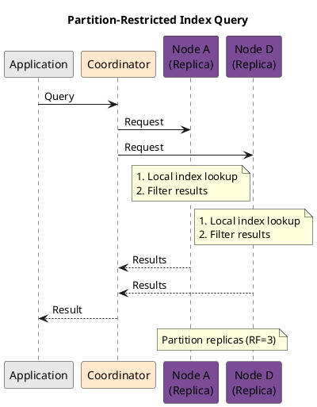
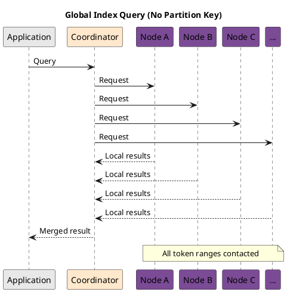
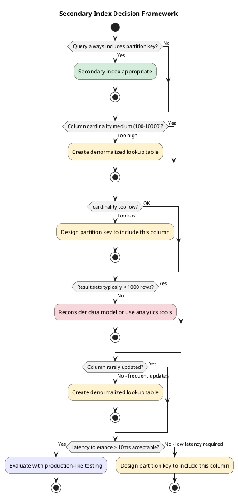

# Secondary Index Queries

Secondary indexes enable queries on non-primary-key columns without requiring the partition key. This capability comes with significant trade-offs that application developers must understand to avoid performance degradation and operational incidents.

---

## Overview

### The Fundamental Trade-off

Cassandra's data model is optimized for partition key lookups. Primary key queries contact a deterministic set of replica nodes (typically 3 in a RF=3 cluster). Secondary index queries, lacking partition key constraints, must coordinate across multiple nodes to locate matching data.

```
Primary Key Query:     Client → Coordinator → RF Replicas → Response
                                                (3 nodes)

Secondary Index Query: Client → Coordinator → Token Range Coverage → Response
                                                (potentially all nodes)
```

| Query Type | Nodes Contacted | Latency Profile | Scalability |
|------------|-----------------|-----------------|-------------|
| Partition key | RF replicas | Predictable, low | Constant with cluster growth |
| Partition key + index | RF replicas | Predictable | Constant |
| Index only (global) | All token ranges | Variable, higher | Degrades with cluster size |

### When Secondary Indexes Are Appropriate

Secondary indexes are appropriate when:

- Queries frequently include the partition key alongside the indexed predicate
- The indexed column has low-to-medium cardinality (tens to thousands of unique values)
- Query result sets are small (typically < 10,000 rows)
- The workload tolerates higher latency compared to primary key queries

Secondary indexes are inappropriate when:

- Queries never include the partition key
- The indexed column has very high cardinality (approaching uniqueness)
- The indexed column has very low cardinality (2-3 values like boolean)
- Large result sets are expected
- Low, predictable latency is required

---

## Behavioral Guarantees

### What Secondary Index Queries Guarantee

- Queries with partition key constraint contact only replicas for that partition
- Results are returned in clustering order within each partition
- Index queries respect the specified consistency level
- All matching rows visible to the consistency level are returned
- Multiple indexed predicates (AND) are evaluated correctly

### What Secondary Index Queries Do NOT Guarantee

!!! warning "Undefined Behavior"
    The following behaviors are undefined and must not be relied upon:

    - **Global result ordering**: Without partition key, results across partitions have undefined order
    - **Latency bounds**: Index queries without partition key have unbounded latency proportional to cluster size
    - **Complete results during topology changes**: Adding/removing nodes may cause temporary result inconsistencies
    - **Memory usage**: Large result sets may exhaust coordinator memory
    - **Timeout behavior**: Partial results may be returned on timeout (implementation-dependent)
    - **Performance consistency**: Query times vary significantly based on data distribution and cluster load

### Query Execution Contract

| Query Pattern | Execution Model | Node Contact |
|---------------|-----------------|--------------|
| `WHERE pk = ? AND indexed_col = ?` | Single partition scan | RF replicas |
| `WHERE indexed_col = ?` | Scatter-gather | All nodes (token range coverage) |
| `WHERE indexed_col = ? LIMIT n` | Scatter-gather with limit | All nodes, stops when limit reached |
| `WHERE indexed_col > ? AND indexed_col < ?` | Range scan (SAI/SASI) | All nodes |

### Consistency Level Contract

| Consistency Level | Behavior on Index Query |
|-------------------|------------------------|
| ONE/LOCAL_ONE | Each node returns from local index; coordinator merges |
| QUORUM/LOCAL_QUORUM | Each shard uses QUORUM; coordinator merges |
| ALL | All replicas for each shard must respond |

### Result Completeness Contract

| Scenario | Completeness |
|----------|--------------|
| All nodes healthy | Complete results (within consistency level) |
| Some nodes down | Results from available nodes only |
| Index building on some nodes | Partial results from those nodes |
| Coordinator timeout | Partial results possible |

### Failure Semantics

| Failure Mode | Outcome | Client Action |
|--------------|---------|---------------|
| Some nodes unavailable | Partial results (if CL can be met) | Retry or accept partial data |
| Coordinator timeout | Partial results or timeout exception | Add partition key or reduce scope |
| Index not found | Query fails | Create index or use ALLOW FILTERING |
| Memory exhaustion | Query fails | Add LIMIT or partition constraints |

### Version-Specific Behavior

| Version | Behavior |
|---------|----------|
| All | Legacy secondary indexes (2i) |
| 3.4+ | SASI indexes (experimental, not recommended for production) |
| 5.0+ | Storage-Attached Indexes (SAI), recommended for new deployments |

---

## Index Types and Query Capabilities

Cassandra provides three secondary index implementations, each with different query capabilities:

| Capability | Legacy 2i | SASI | SAI |
|------------|-----------|------|-----|
| **Availability** | All versions | 3.4+ (experimental) | 5.0+ |
| **Production status** | Supported | Not recommended | Recommended |
| **Equality (`=`)** | Yes | Yes | Yes |
| **Range (`<`, `>`, `<=`, `>=`)** | No | Yes | Yes |
| **LIKE prefix (`'foo%'`)** | No | Yes | Yes |
| **LIKE suffix (`'%foo'`)** | No | CONTAINS mode | Yes |
| **LIKE contains (`'%foo%'`)** | No | CONTAINS mode | Yes |
| **IN clause** | Yes | Yes | Yes |
| **Multiple predicates (AND)** | Scatter-gather | Single-pass | Single-pass |
| **Collection indexing** | Yes | Limited | Yes |
| **Vector search (ANN)** | No | No | Yes |

---

## Query Syntax by Index Type

### Legacy Secondary Index (2i)

Legacy indexes support only equality predicates:

```sql
-- Create legacy secondary index
CREATE INDEX users_country_idx ON users (country);

-- Equality query (supported)
SELECT * FROM users WHERE country = 'US';

-- With partition key (optimal)
SELECT * FROM users WHERE user_id = ? AND country = 'US';

-- Range query (NOT supported - will error)
SELECT * FROM users WHERE country > 'A';  -- ERROR
```

#### Collection Queries with 2i

```sql
-- Index on SET
CREATE INDEX ON users (tags);
SELECT * FROM users WHERE tags CONTAINS 'premium';

-- Index on MAP keys
CREATE INDEX ON users (KEYS(attributes));
SELECT * FROM users WHERE attributes CONTAINS KEY 'department';

-- Index on MAP values
CREATE INDEX ON users (VALUES(attributes));
SELECT * FROM users WHERE attributes CONTAINS 'engineering';

-- Index on MAP entries
CREATE INDEX ON users (ENTRIES(attributes));
SELECT * FROM users WHERE attributes['role'] = 'admin';
```

### SASI Index

SASI extends query capabilities with range and text search operations:

```sql
-- Create SASI index with PREFIX mode (default)
CREATE CUSTOM INDEX ON users (email)
    USING 'org.apache.cassandra.index.sasi.SASIIndex'
    WITH OPTIONS = {'mode': 'PREFIX'};

-- Prefix matching
SELECT * FROM users WHERE email LIKE 'john%';

-- Create SASI index with CONTAINS mode
CREATE CUSTOM INDEX ON products (description)
    USING 'org.apache.cassandra.index.sasi.SASIIndex'
    WITH OPTIONS = {
        'mode': 'CONTAINS',
        'analyzer_class': 'org.apache.cassandra.index.sasi.analyzer.StandardAnalyzer',
        'case_sensitive': 'false'
    };

-- Substring matching
SELECT * FROM products WHERE description LIKE '%database%';

-- Range queries on numeric SASI index
CREATE CUSTOM INDEX ON products (price)
    USING 'org.apache.cassandra.index.sasi.SASIIndex';

SELECT * FROM products WHERE price >= 100 AND price <= 500;
```

!!! warning "SASI Production Status"
    SASI is marked as experimental and is not recommended for production use. Known issues include:

    - Unbounded memory consumption during queries
    - No compaction-aware index maintenance
    - Limited testing at scale

    Use SAI (Cassandra 5.0+) for production deployments requiring these capabilities.

### SAI (Storage-Attached Index)

SAI provides the most comprehensive query capabilities with production-grade reliability:

```sql
-- Create SAI index
CREATE CUSTOM INDEX ON users (email)
    USING 'StorageAttachedIndex';

-- Case-insensitive text index
CREATE CUSTOM INDEX ON users (username)
    USING 'StorageAttachedIndex'
    WITH OPTIONS = {'case_sensitive': 'false'};

-- Equality
SELECT * FROM users WHERE email = 'user@example.com';

-- Range queries
SELECT * FROM orders WHERE total >= 100.00 AND total < 1000.00;

-- Text pattern matching
SELECT * FROM users WHERE username LIKE 'john%';
SELECT * FROM users WHERE username LIKE '%smith';
SELECT * FROM users WHERE username LIKE '%admin%';

-- Multiple SAI predicates (efficient single-pass)
SELECT * FROM orders
WHERE status = 'pending'
  AND total > 100
  AND created_at > '2024-01-01';
```

#### SAI Collection and UDT Queries

```sql
-- Index SET/LIST elements
CREATE CUSTOM INDEX ON users (tags) USING 'StorageAttachedIndex';
SELECT * FROM users WHERE tags CONTAINS 'vip';

-- Index MAP entries
CREATE CUSTOM INDEX ON users (ENTRIES(metadata)) USING 'StorageAttachedIndex';
SELECT * FROM users WHERE metadata['tier'] = 'enterprise';

-- Index UDT field (non-frozen UDT)
CREATE CUSTOM INDEX ON customers (address.city) USING 'StorageAttachedIndex';
SELECT * FROM customers WHERE address.city = 'New York';
```

#### SAI Vector Search

```sql
-- Create vector index
CREATE CUSTOM INDEX ON documents (embedding)
    USING 'StorageAttachedIndex'
    WITH OPTIONS = {'similarity_function': 'cosine'};

-- Approximate nearest neighbor search
SELECT doc_id, title, similarity_cosine(embedding, ?) AS score
FROM documents
ORDER BY embedding ANN OF ?
LIMIT 10;

-- Combined filtering with vector search
SELECT doc_id, title
FROM documents
WHERE category = 'technical'
ORDER BY embedding ANN OF ?
LIMIT 5;
```

---

## Query Execution Models

Understanding how secondary index queries execute is essential for predicting performance.

### Partition-Restricted Queries (Optimal)

When the partition key is included, the query contacts only RF replica nodes:

```sql
-- Efficient: partition key + index predicate
SELECT * FROM orders
WHERE customer_id = ?        -- partition key
  AND status = 'pending';    -- indexed column
```



**Performance characteristics:**

- Latency comparable to primary key queries
- Bounded by RF, not cluster size
- Predictable resource consumption

### Global Queries (Use with Caution)

Without partition key, the coordinator must contact nodes across all token ranges:

```sql
-- Expensive: index predicate only
SELECT * FROM orders WHERE status = 'pending';
```



**Performance characteristics:**

- Latency increases with cluster size
- Bounded by slowest responding node (tail latency)
- Resource consumption proportional to cluster size
- With SAI: Adaptive execution may reduce nodes contacted for LIMIT queries

---

## Performance Implications

### Latency Expectations

| Query Pattern | Expected Latency | Variability |
|---------------|------------------|-------------|
| Partition key only | 1-5 ms | Low |
| Partition key + index | 2-10 ms | Low |
| Global index (small result) | 10-100 ms | Medium |
| Global index (large result) | 100 ms - seconds | High |
| Global index + poor selectivity | Seconds - timeout | Very high |

### Factors Affecting Index Query Performance

| Factor | Impact | Mitigation |
|--------|--------|------------|
| **Cluster size** | Global queries scale linearly | Include partition key when possible |
| **Index selectivity** | Low selectivity = more data scanned | Choose columns with medium cardinality |
| **Result set size** | Large results consume memory and network | Use LIMIT clause |
| **Node heterogeneity** | Slowest node determines latency | Monitor tail latency, maintain consistent hardware |
| **Compaction backlog** | More SSTables = slower index lookups | Monitor compaction, tune strategy |

### Memory and Resource Consumption

Index queries consume resources differently than primary key queries:

| Resource | Primary Key Query | Global Index Query |
|----------|-------------------|-------------------|
| Coordinator memory | Minimal | Proportional to result aggregation |
| Network bandwidth | RF × result size | Nodes × local results |
| Disk I/O (per node) | Target partition only | Full index scan |
| CPU | Minimal | Index traversal + filtering |

---

## Anti-Patterns

### Anti-Pattern 1: Indexing High-Cardinality Columns

```sql
-- ANTI-PATTERN: Indexing nearly-unique values
CREATE INDEX ON users (user_id);      -- Already a primary key
CREATE INDEX ON events (event_id);    -- UUID, unique per row
CREATE INDEX ON logs (timestamp);     -- Microsecond precision, near-unique
```

**Why it fails:**

- Index becomes as large as the data itself
- Each index lookup returns very few rows
- Read amplification: many SSTables consulted for few results

**Alternative approaches:**

- Use the column as part of the primary key
- Create a denormalized lookup table

### Anti-Pattern 2: Indexing Very Low-Cardinality Columns

```sql
-- ANTI-PATTERN: Indexing columns with 2-3 values
CREATE INDEX ON users (is_active);    -- true/false
CREATE INDEX ON orders (status);      -- pending/completed/cancelled (if few values)
```

**Why it fails:**

- Each index entry points to a large fraction of all rows
- Queries return excessive data
- No selectivity benefit

**Alternative approaches:**

- Include in composite partition key if appropriate
- Create separate tables per status
- Combine with other predicates that provide selectivity

### Anti-Pattern 3: Global Queries Without LIMIT

```sql
-- ANTI-PATTERN: Unbounded global query
SELECT * FROM orders WHERE status = 'pending';

-- BETTER: Bounded result set
SELECT * FROM orders WHERE status = 'pending' LIMIT 100;
```

**Why it fails:**

- Coordinator accumulates all results in memory
- Network transfer of potentially millions of rows
- Client memory exhaustion
- Long query times leading to timeouts

### Anti-Pattern 4: Using Indexes for Batch Analytics

```sql
-- ANTI-PATTERN: Full-table scan via index
SELECT COUNT(*) FROM events WHERE level = 'ERROR';
SELECT * FROM logs WHERE timestamp > '2024-01-01' ALLOW FILTERING;
```

**Why it fails:**

- Secondary indexes are designed for OLTP, not analytics
- Full scans should use Spark/analytics tools
- Consumes cluster resources affecting production queries

**Alternative approaches:**

- Use Apache Spark with Cassandra connector
- Maintain pre-aggregated summary tables
- Use dedicated analytics cluster

### Anti-Pattern 5: Querying Frequently Updated Indexed Columns

```sql
-- ANTI-PATTERN: Index on frequently changing column
CREATE INDEX ON sessions (last_activity);

-- Every user action updates this:
UPDATE sessions SET last_activity = now() WHERE session_id = ?;
```

**Why it fails:**

- Each update creates new index entries
- Old entries become tombstones
- Tombstone accumulation degrades read performance
- Compaction overhead increases

**Alternative approaches:**

- Store mutable data separately from indexed data
- Use TTL-based expiration instead of updates
- Reconsider whether this query pattern is necessary

### Anti-Pattern 6: Relying on ALLOW FILTERING

```sql
-- ANTI-PATTERN: Using ALLOW FILTERING instead of proper indexes
SELECT * FROM users WHERE age > 25 ALLOW FILTERING;
SELECT * FROM events WHERE type = 'click' AND value > 100 ALLOW FILTERING;
```

**Why it fails:**

- Full table scan regardless of selectivity
- Contacts every node, reads every partition
- No optimization possible
- Performance degrades as data grows

**Alternative approaches:**

- Create appropriate secondary indexes
- Redesign data model for query patterns
- Use denormalized tables

---

## Best Practices

### Query Design

| Practice | Rationale |
|----------|-----------|
| **Always include LIMIT** | Bounds memory consumption and latency |
| **Include partition key when possible** | Restricts query to RF nodes |
| **Prefer SAI over 2i/SASI** | Better performance, production-ready |
| **Use prepared statements** | Reduces parsing overhead, enables caching |
| **Avoid SELECT \*** | Retrieve only needed columns |

### Index Design

| Practice | Rationale |
|----------|-----------|
| **Index medium-cardinality columns** | Best selectivity/overhead ratio |
| **Create indexes during low-traffic periods** | Index building consumes resources |
| **Monitor index size relative to data** | Detect cardinality issues early |
| **Test with production-like data volumes** | Performance varies with scale |

### Application Architecture

```sql
-- Pattern: Partition-first query design
-- Store order status per customer for efficient queries
CREATE TABLE orders_by_customer_status (
    customer_id UUID,
    status TEXT,
    order_date TIMESTAMP,
    order_id UUID,
    total DECIMAL,
    PRIMARY KEY ((customer_id, status), order_date, order_id)
) WITH CLUSTERING ORDER BY (order_date DESC);

-- Efficient: queries specific customer's pending orders
SELECT * FROM orders_by_customer_status
WHERE customer_id = ? AND status = 'pending'
LIMIT 50;
```

```sql
-- Pattern: Secondary index for cross-partition queries
CREATE TABLE orders (
    order_id UUID PRIMARY KEY,
    customer_id UUID,
    status TEXT,
    total DECIMAL,
    created_at TIMESTAMP
);

CREATE CUSTOM INDEX orders_status_idx ON orders (status)
    USING 'StorageAttachedIndex';

CREATE CUSTOM INDEX orders_total_idx ON orders (total)
    USING 'StorageAttachedIndex';

-- Acceptable: global query with LIMIT and high selectivity
SELECT * FROM orders
WHERE status = 'fraud_review'
  AND total > 10000
LIMIT 100;
```

---

## Monitoring Index Query Performance

### Key Metrics

```
# Per-table read latency (includes index queries)
org.apache.cassandra.metrics:type=Table,keyspace=*,scope=*,name=ReadLatency

# SAI-specific metrics
org.apache.cassandra.metrics:type=StorageAttachedIndex,name=*

# Index condition processing time
org.apache.cassandra.metrics:type=Table,keyspace=*,scope=*,name=IndexSummaryOffHeapMemoryUsed
```

### Diagnostic Queries

```sql
-- Identify slow queries in system log
-- Look for: "Slow query" messages with index predicates

-- Check index size and status
SELECT * FROM system_schema.indexes WHERE keyspace_name = 'my_keyspace';

-- Examine table statistics including index info
-- Use: nodetool tablestats keyspace.table
```

### Warning Signs

| Symptom | Possible Cause | Investigation |
|---------|----------------|---------------|
| High P99 read latency | Global index queries | Check for missing partition keys in queries |
| Timeouts on index queries | Large result sets | Add LIMIT, check selectivity |
| Memory pressure | Result accumulation | Monitor coordinator heap, add LIMIT |
| Increasing read latency | Index size growth | Check cardinality, consider redesign |

---

## Decision Framework

Use this framework to determine whether a secondary index is appropriate:



---

## Related Documentation

- **[Index DDL Commands](../ddl/create-index.md)** - CREATE INDEX and DROP INDEX syntax
- **[Index Architecture](../../architecture/storage-engine/indexes/index.md)** - Internal implementation details
- **[Secondary Index Query Execution](../../architecture/distributed-data/secondary-index-queries.md)** - Distributed query coordination
- **[SAI](../../architecture/storage-engine/indexes/sai.md)** - Storage-Attached Index deep dive
- **[Data Modeling](../../data-modeling/index.md)** - Query-first design principles
