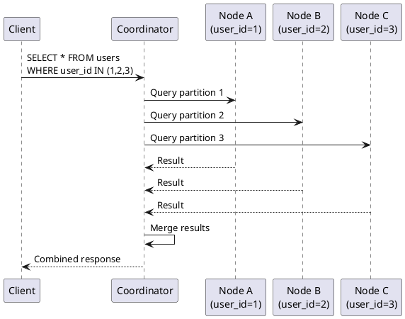
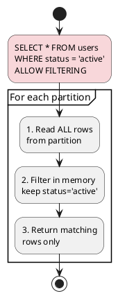

# SELECT

The SELECT statement retrieves rows and columns from Cassandra tables. Unlike SQL databases where queries are flexible, Cassandra requires queries to align with the table's primary key structure for efficient execution.

---

## Behavioral Guarantees

### What SELECT Guarantees

- The query must contact the number of replicas specified by the consistency level
- Results from a single partition must reflect a consistent snapshot (no partial rows)
- Rows within a partition must be returned in clustering column order (or reverse if specified)
- Individual column values must be atomic (no partial cell reads)

### What SELECT Does NOT Guarantee

!!! warning "Undefined Behavior"
    The following behaviors are undefined and must not be relied upon:

    - **Cross-partition ordering**: Without ORDER BY, the order of rows from different partitions is undefined and may vary between queries, replicas, or Cassandra versions
    - **Read-your-writes without QUORUM**: A write at CL=ONE followed by a read at CL=ONE may not return the written data
    - **Consistent snapshots across partitions**: A SELECT touching multiple partitions may see different points in time for each partition
    - **Result stability during compaction**: The same query may return rows in different order as SSTables are compacted
    - **Deterministic tie-breaking**: When timestamps are equal, the "winner" is undefined

### Consistency Level Contracts

| Consistency Level | Guarantee |
|-------------------|-----------|
| `ONE` | At least one replica responds; data may be stale |
| `QUORUM` | Majority of replicas respond; read-repair may occur |
| `ALL` | All replicas respond; highest consistency, lowest availability |
| `LOCAL_ONE` | At least one replica in local DC responds |
| `LOCAL_QUORUM` | Majority in local DC responds |
| `SERIAL` | Linearizable read (Paxos); sees all committed LWT operations |
| `LOCAL_SERIAL` | Linearizable read within local DC only |

### Version-Specific Behavior

| Version | Behavior |
|---------|----------|
| 3.0+ | PER PARTITION LIMIT supported (CASSANDRA-7017) |
| 4.0+ | Virtual tables queryable, improved paging (CASSANDRA-7622) |
| 4.0+ | GROUP BY supports aggregate functions (CASSANDRA-10707) |
| 5.0+ | Vector search with ORDER BY ... ANN OF (CEP-30) |

---

## Overview

### Query Model Philosophy

Cassandra's query model follows a fundamental principle: **queries must specify how to find data, not just what data to find**. This design enables:

- **Predictable performance**: Queries execute in bounded time
- **Linear scalability**: Response time independent of cluster size
- **Partition locality**: Data retrieved from minimal nodes

```plantuml
@startuml
skinparam backgroundColor #FFFFFF
skinparam defaultFontName Arial

participant "Client" as client
participant "Coordinator" as coord
participant "Node A\n(Tokens: 0-100)" as node1
participant "Node B\n(Tokens: 101-200)" as node2 #d4edda
participant "Node C\n(Tokens: 201-300)" as node3

client -> coord : SELECT * FROM users\nWHERE user_id = 123
coord -> coord : Hash(123) → Token 150
coord -> node2 : Token 150 belongs here
node2 --> coord : Result
coord --> client : Response

@enduml
```



### Evolution of SELECT

| Version | Feature Added |
|---------|---------------|
| CQL 1.0 | Basic SELECT with WHERE |
| CQL 3.0 | Compound primary keys, IN clause |
| CQL 3.1 | Lightweight transaction reads |
| CQL 3.2 | JSON output, user-defined functions |
| CQL 3.3 | GROUP BY, aggregate functions |
| CQL 3.4 | PER PARTITION LIMIT |
| 4.0+ | Virtual tables, improved paging |

---

## Synopsis

```cqlsyntax
SELECT [ JSON | DISTINCT ] *select_clause*
    FROM [ *keyspace_name*. ] *table_name*
    [ WHERE *where_clause* ]
    [ GROUP BY *group_by_clause* ]
    [ ORDER BY *order_by_clause* ]
    [ PER PARTITION LIMIT *integer* ]
    [ LIMIT *integer* ]
    [ ALLOW FILTERING ]
```

**select_clause**:

```cqlsyntax
*
| *column_name* [ AS *alias* ] [, *column_name* [ AS *alias* ] ... ]
| *function_name* ( [ *arguments* ] ) [ AS *alias* ] [, ... ]
| COUNT (*) | COUNT (1)
| CAST ( *column_name* AS *data_type* )
| WRITETIME ( *column_name* )
| TTL ( *column_name* )
```

**where_clause**:

```cqlsyntax
*relation* [ AND *relation* ... ]
```

**relation**:

```cqlsyntax
*column_name* *operator* *term*
| *column_name* IN ( *term* [, *term* ... ] )
| ( *column_name* [, *column_name* ... ] ) IN ( ( *term* [, *term* ... ] ) [, ... ] )
| TOKEN ( *column_name* [, *column_name* ... ] ) *operator* *term*
```

**operator**:

```cqlsyntax
= | < | > | <= | >= | != | CONTAINS | CONTAINS KEY | LIKE
```

---

## Query Execution

### Partition Key Queries (Optimal)

Queries specifying the complete partition key execute against a known set of nodes:

```sql
-- Single partition query (fastest)
SELECT * FROM users WHERE user_id = 123;

-- Equivalent performance with clustering column filter
SELECT * FROM user_events
WHERE user_id = 123
  AND event_time > '2024-01-01';
```

**Execution characteristics:**

- Coordinator calculates token from partition key
- Request sent only to replicas owning that token
- Response time: typically < 10ms

### Multi-Partition Queries

The `IN` clause queries multiple partitions in a single request:

```sql
SELECT * FROM users WHERE user_id IN (123, 456, 789);
```



!!! warning "IN Clause Limitations"
    - Each value in IN creates a separate internal query
    - Coordinator must wait for all responses
    - Recommended limit: 10-20 values
    - Large IN lists cause coordinator memory pressure

### Full Table Scans

Queries without partition key restrictions scan all partitions:

```sql
-- Requires ALLOW FILTERING (dangerous)
SELECT * FROM users WHERE status = 'active' ALLOW FILTERING;

-- Token range scan (for analytics)
SELECT * FROM users
WHERE TOKEN(user_id) > -9223372036854775808
  AND TOKEN(user_id) <= 9223372036854775807;
```

!!! danger "Full Table Scans"
    Full table scans:

    - Contact every node in the cluster
    - Do not scale with cluster size
    - Can cause timeouts on tables > 1M rows
    - Block coordinator resources

    Never use in production application code. Use Spark or analytics tools for full scans.

---

## WHERE Clause

### Partition Key Restrictions

The partition key determines query routing. Restrictions vary by key type:

#### Simple Partition Key

```sql
-- Table: PRIMARY KEY (user_id)

-- Required: equality
SELECT * FROM users WHERE user_id = 123;

-- Allowed: IN clause
SELECT * FROM users WHERE user_id IN (123, 456);

-- Not allowed without ALLOW FILTERING
SELECT * FROM users WHERE user_id > 100;  -- Error
```

#### Composite Partition Key

```sql
-- Table: PRIMARY KEY ((tenant_id, region), user_id)

-- Required: all partition key columns
SELECT * FROM users
WHERE tenant_id = 'acme' AND region = 'us-east';

-- Not allowed: partial partition key
SELECT * FROM users WHERE tenant_id = 'acme';  -- Error
```

### Clustering Column Restrictions

Clustering columns filter within partitions. Restrictions must follow primary key order:

```sql
-- Table: PRIMARY KEY ((sensor_id), year, month, day, hour)

-- Valid: prefix of clustering columns
SELECT * FROM readings WHERE sensor_id = 'temp-1' AND year = 2024;
SELECT * FROM readings WHERE sensor_id = 'temp-1' AND year = 2024 AND month = 1;

-- Valid: range on last specified column
SELECT * FROM readings
WHERE sensor_id = 'temp-1'
  AND year = 2024
  AND month >= 1 AND month <= 6;

-- Invalid: skip clustering column
SELECT * FROM readings
WHERE sensor_id = 'temp-1'
  AND year = 2024
  AND day = 15;  -- Error: month not specified
```

#### Clustering Column Operators

| Operator | Example | Notes |
|----------|---------|-------|
| `=` | `year = 2024` | Equality |
| `<`, `>`, `<=`, `>=` | `month > 6` | Range (last column only) |
| `IN` | `month IN (1, 2, 3)` | Multiple values |
| `!=` | `status != 'deleted'` | Requires ALLOW FILTERING |

### Slice Queries

Range queries on clustering columns return contiguous rows:

```sql
-- All events for user in January 2024
SELECT * FROM user_events
WHERE user_id = 123
  AND event_time >= '2024-01-01 00:00:00'
  AND event_time < '2024-02-01 00:00:00';
```

### Multi-Column Restrictions

Tuple syntax enables complex clustering column restrictions:

```sql
-- Table: PRIMARY KEY (pk, c1, c2, c3)

-- Single tuple comparison
SELECT * FROM t WHERE pk = 1 AND (c1, c2) > (10, 20);

-- IN with tuples
SELECT * FROM t
WHERE pk = 1
  AND (c1, c2) IN ((1, 2), (3, 4), (5, 6));
```

### Collection Column Restrictions

Collections require secondary indexes for filtering:

```sql
-- With index on tags (SET<TEXT>)
SELECT * FROM posts WHERE tags CONTAINS 'cassandra';

-- With index on metadata (MAP<TEXT, TEXT>)
SELECT * FROM posts WHERE metadata CONTAINS KEY 'author';
SELECT * FROM posts WHERE metadata['author'] = 'Alice';
```

---

## Selecting Complex Types

### Collections

Collections (LIST, SET, MAP) are returned as their complete values by default.

#### Selecting Entire Collections

```sql
-- Returns complete collection
SELECT user_id, phone_numbers FROM users WHERE user_id = 123;
-- phone_numbers: ['+1-555-0100', '+1-555-0101']

SELECT user_id, roles FROM users WHERE user_id = 123;
-- roles: {'admin', 'user'}

SELECT user_id, preferences FROM users WHERE user_id = 123;
-- preferences: {'theme': 'dark', 'language': 'en'}
```

#### Accessing Collection Elements

Map elements can be accessed by key in the SELECT clause:

```sql
-- Select specific map entry
SELECT user_id, preferences['theme'] AS theme FROM users WHERE user_id = 123;
-- theme: 'dark'

-- Multiple map entries
SELECT user_id, preferences['theme'], preferences['language']
FROM users WHERE user_id = 123;
```

!!! note "List and Set Element Access"
    Unlike maps, LIST and SET elements cannot be accessed by index or value in the SELECT clause. The entire collection is always returned. To access specific elements, retrieve the collection and process in the application.

#### Collection Functions

```sql
-- Collection size (requires Cassandra 4.0+)
-- Note: No built-in SIZE() function; use application code

-- Check if collection is null/empty
SELECT user_id, phone_numbers FROM users
WHERE user_id = 123 AND phone_numbers != null;
```

#### Frozen Collection Behavior

Frozen collections behave as single values:

```sql
-- Frozen collections return as complete unit
SELECT event_id, tags FROM events WHERE event_id = ?;
-- tags (FROZEN<SET<TEXT>>): {'important', 'system'}

-- Cannot access individual elements of frozen collections in CQL
-- Must deserialize in application code
```

### User-Defined Types (UDTs)

UDTs can be selected as complete objects or by individual fields.

#### Selecting Entire UDT

```sql
-- Table with UDT column
-- CREATE TYPE address (street TEXT, city TEXT, state TEXT, zip TEXT);
-- CREATE TABLE users (user_id UUID PRIMARY KEY, home_address address);

-- Select complete UDT
SELECT user_id, home_address FROM users WHERE user_id = ?;
-- home_address: {street: '123 Main St', city: 'Boston', state: 'MA', zip: '02101'}
```

#### Selecting UDT Fields

Individual UDT fields can be selected using dot notation:

```sql
-- Select specific fields
SELECT user_id,
       home_address.city,
       home_address.state
FROM users WHERE user_id = ?;

-- With aliases
SELECT user_id,
       home_address.city AS city,
       home_address.zip AS postal_code
FROM users WHERE user_id = ?;
```

#### Nested UDT Access

For nested UDTs, chain the dot notation:

```sql
-- Nested UDT: contact contains address
-- CREATE TYPE contact (name TEXT, primary_address FROZEN<address>);

SELECT user_id,
       contact_info.name,
       contact_info.primary_address.city
FROM users WHERE user_id = ?;
```

#### Frozen vs Non-Frozen UDT Selection

| Aspect | Frozen UDT | Non-Frozen UDT |
|--------|------------|----------------|
| Field selection | Allowed | Allowed |
| Partial updates | No (replace entire UDT) | Yes (update fields) |
| Storage | Single blob | Separate cells per field |
| NULL fields | Stored as part of blob | No storage cost |

```sql
-- Both frozen and non-frozen support field selection
SELECT home_address.city FROM users WHERE user_id = ?;
```

### Tuples

Tuples are fixed-length ordered collections of typed elements.

#### Selecting Tuples

```sql
-- Table with tuple column
-- coordinates TUPLE<DOUBLE, DOUBLE, DOUBLE>

-- Select entire tuple
SELECT location_id, coordinates FROM locations WHERE location_id = ?;
-- coordinates: (42.3601, -71.0589, 0.0)
```

#### Tuple Element Access

Individual tuple elements cannot be accessed in CQL. The entire tuple is always returned:

```sql
-- Must select entire tuple
SELECT coordinates FROM locations WHERE location_id = ?;

-- No way to select coordinates[0] or coordinates.lat in CQL
-- Process tuple elements in application code
```

### BLOBs

BLOB columns contain arbitrary binary data.

```sql
-- Select BLOB column
SELECT document_id, content FROM documents WHERE document_id = ?;
-- content: 0x48656c6c6f20576f726c64 (hex representation in cqlsh)

-- BLOBs in JSON output
SELECT JSON document_id, content FROM documents WHERE document_id = ?;
-- content appears as hex string: "0x48656c6c6f..."
```

#### BLOB Functions

```sql
-- Convert BLOB to/from other types
SELECT blobAsText(content) FROM documents WHERE document_id = ?;
SELECT blobAsBigint(binary_counter) FROM counters WHERE id = ?;

-- Get BLOB size
SELECT document_id, blobAsText(content) FROM documents WHERE document_id = ?;
```

### Static Columns

Static columns have one value per partition, shared across all rows.

```sql
-- Table with static column
-- CREATE TABLE sensors (
--     sensor_id TEXT,
--     reading_time TIMESTAMP,
--     location TEXT STATIC,
--     value DOUBLE,
--     PRIMARY KEY (sensor_id, reading_time)
-- );

-- Static column returned with every row
SELECT sensor_id, reading_time, location, value
FROM sensors WHERE sensor_id = 'temp-1';

-- Selecting only static columns (one row per partition)
SELECT DISTINCT sensor_id, location FROM sensors;
```

### Counter Columns

Counter columns return their current accumulated value:

```sql
-- Counter table
-- CREATE TABLE page_stats (
--     page_id TEXT PRIMARY KEY,
--     view_count COUNTER,
--     unique_visitors COUNTER
-- );

SELECT page_id, view_count, unique_visitors
FROM page_stats WHERE page_id = 'homepage';
-- view_count: 15234
-- unique_visitors: 8921
```

!!! warning "Counter Limitations"
    - Cannot use WRITETIME() or TTL() on counter columns
    - Counter columns cannot be part of WHERE clause
    - Cannot SELECT counter columns with non-counter columns from same table (counter tables are separate)

---

## ALLOW FILTERING

`ALLOW FILTERING` permits queries that cannot be executed efficiently:

```sql
-- Without index on status column
SELECT * FROM users WHERE status = 'active' ALLOW FILTERING;

-- Filtering on non-prefix clustering column
SELECT * FROM events
WHERE sensor_id = 'temp-1'
  AND day = 15
ALLOW FILTERING;
```

### What ALLOW FILTERING Actually Does



!!! danger "ALLOW FILTERING Dangers"
    1. **Reads more data than returned**: Must read all rows to filter
    2. **Unpredictable latency**: Time proportional to total data, not result size
    3. **Memory pressure**: Rows held in memory during filtering
    4. **No scaling benefit**: More nodes means more data to scan

### Full Table Scan Risk

`ALLOW FILTERING` causes a full table scan when no partition key is specified:

| Data Size | Nodes | Approximate Scan Time | Memory Risk |
|-----------|-------|----------------------|-------------|
| 10 MB | 3 | < 1 second | Low |
| 1 GB | 10 | 10-60 seconds | Medium |
| 100 GB | 20 | Minutes to hours | High |
| 1 TB+ | 50+ | Query may never complete | Critical |

```sql
-- DANGER: Scans entire cluster
SELECT * FROM events WHERE event_type = 'login' ALLOW FILTERING;

-- Query coordinator must:
-- 1. Contact ALL nodes in cluster
-- 2. Each node scans ALL its partitions
-- 3. Filter results in memory
-- 4. Aggregate and return
```

### Unpredictable Performance in Large Datasets

!!! danger "Performance Cannot Be Predicted"
    `ALLOW FILTERING` queries have **no performance bounds**:

    - A query returning 10 rows may scan 10 million rows
    - Query time varies based on total data volume, not result size
    - Same query may take 100ms with little data, timeout with more data
    - No way to estimate query cost before execution

    **Real-world failure scenario:**

    ```sql
    -- Development: Works fine (1,000 users)
    SELECT * FROM users WHERE country = 'US' ALLOW FILTERING;
    -- Result: 50ms, 100 rows

    -- Production: Disaster (10 million users)
    SELECT * FROM users WHERE country = 'US' ALLOW FILTERING;
    -- Result: Timeout after 30s, coordinator OOM, cascading failures
    ```

    **Impact cascade:**

    1. Query consumes coordinator memory
    2. GC pauses affect other queries
    3. Client timeouts trigger retries
    4. More ALLOW FILTERING queries pile up
    5. Cluster becomes unresponsive

### When ALLOW FILTERING Is Acceptable

| Scenario | Acceptable? | Reason |
|----------|-------------|--------|
| Small tables (< 10K rows) | Sometimes | Limited data to scan |
| Development/debugging | Yes | Convenience over performance |
| One-time analytics | Sometimes | If Spark unavailable |
| Production application queries | **Never** | Unpredictable, doesn't scale |
| Queries with partition key | Sometimes | Limits scan to single partition |

**Safe usage pattern** (with partition key):

```sql
-- Acceptable: Filters within a single partition
SELECT * FROM user_events
WHERE user_id = 123
  AND event_type = 'login'
ALLOW FILTERING;
-- Only scans one user's events, not entire table
```

---

## Result Ordering

### ORDER BY

Results can be ordered by clustering columns only:

```sql
-- Table: PRIMARY KEY (user_id, created_at) WITH CLUSTERING ORDER BY (created_at DESC)

-- Default order (as defined in table)
SELECT * FROM posts WHERE user_id = 123;  -- Newest first

-- Reverse order
SELECT * FROM posts WHERE user_id = 123 ORDER BY created_at ASC;
```

#### Restrictions

```sql
-- Invalid: order by partition key
SELECT * FROM users ORDER BY user_id;  -- Error

-- Invalid: order by non-clustering column
SELECT * FROM posts WHERE user_id = 123 ORDER BY title;  -- Error

-- Invalid: partial reverse with multiple clustering columns
-- Table: PRIMARY KEY (pk, c1, c2)
SELECT * FROM t WHERE pk = 1 ORDER BY c1 ASC, c2 DESC;  -- Error
```

!!! note "Ordering Rules"
    - ORDER BY only works when partition key is fully specified
    - Can only reverse **all** clustering columns together
    - Order matches or completely reverses table definition

### LIMIT and PER PARTITION LIMIT

```sql
-- Global limit (total rows returned)
SELECT * FROM events WHERE sensor_id = 'temp-1' LIMIT 100;

-- Per partition limit (rows per partition)
SELECT * FROM events
WHERE sensor_id IN ('temp-1', 'temp-2', 'temp-3')
PER PARTITION LIMIT 10
LIMIT 100;
```

**Execution order:**

1. PER PARTITION LIMIT applied first (within each partition)
2. LIMIT applied to combined results

---

## Aggregations

### Built-in Aggregate Functions

| Function | Description | Example |
|----------|-------------|---------|
| `COUNT(*)` | Number of rows | `SELECT COUNT(*) FROM users` |
| `COUNT(column)` | Non-null values | `SELECT COUNT(email) FROM users` |
| `SUM(column)` | Sum of numeric values | `SELECT SUM(amount) FROM orders` |
| `AVG(column)` | Average of numeric values | `SELECT AVG(price) FROM products` |
| `MIN(column)` | Minimum value | `SELECT MIN(created_at) FROM users` |
| `MAX(column)` | Maximum value | `SELECT MAX(score) FROM results` |

### GROUP BY

Aggregate results by partition and clustering columns:

```sql
-- Group by partition key
SELECT user_id, COUNT(*), SUM(amount)
FROM orders
WHERE user_id IN (1, 2, 3)
GROUP BY user_id;

-- Group by partition + clustering column
SELECT sensor_id, date, AVG(temperature)
FROM readings
WHERE sensor_id = 'temp-1'
GROUP BY sensor_id, date;
```

#### GROUP BY Restrictions

```sql
-- Must follow primary key order
-- Table: PRIMARY KEY ((tenant), year, month, day)

-- Valid
GROUP BY tenant
GROUP BY tenant, year
GROUP BY tenant, year, month

-- Invalid: skip column
GROUP BY tenant, month  -- Error: year required

-- Invalid: include non-primary-key column
GROUP BY tenant, category  -- Error
```

---

## Special Selectors

### JSON Output

```sql
-- Entire row as JSON
SELECT JSON * FROM users WHERE user_id = 123;
-- Returns: {"user_id": 123, "name": "Alice", "email": "alice@example.com"}

-- Specific columns as JSON
SELECT JSON user_id, name FROM users WHERE user_id = 123;
-- Returns: {"user_id": 123, "name": "Alice"}
```

### DISTINCT

Return unique partition key values:

```sql
-- List all partition keys
SELECT DISTINCT user_id FROM user_events;

-- With composite partition key
SELECT DISTINCT tenant_id, region FROM events;
```

!!! warning "DISTINCT Performance"
    DISTINCT scans all partitions to find unique keys. Use only on small tables or for administrative purposes.

### WRITETIME and TTL

```sql
-- When was the value written
SELECT username, WRITETIME(email) FROM users WHERE user_id = 123;
-- Returns timestamp in microseconds since epoch

-- Remaining TTL in seconds
SELECT session_id, TTL(token) FROM sessions WHERE session_id = 'abc';
-- Returns seconds until expiration, or null if no TTL
```

### CAST

Convert column types in results:

```sql
SELECT user_id, CAST(created_at AS DATE) FROM users WHERE user_id = 123;
SELECT CAST(count AS DOUBLE) / total AS ratio FROM stats WHERE id = 1;
```

---

## Paging

Large result sets are automatically paged by drivers:

```sql
-- cqlsh paging (default 100 rows)
PAGING ON;
SELECT * FROM large_table;

-- Disable paging in cqlsh
PAGING OFF;
```

### Driver Paging

```java
// Java driver example
Statement stmt = SimpleStatement.builder("SELECT * FROM users")
    .setPageSize(1000)
    .build();

ResultSet rs = session.execute(stmt);
for (Row row : rs) {
    // Automatically fetches next page when needed
    process(row);
}
```

### Manual Paging with Tokens

For analytics or export, use token ranges:

```sql
-- First page
SELECT * FROM users
WHERE TOKEN(user_id) >= -9223372036854775808
  AND TOKEN(user_id) < -6148914691236517206
LIMIT 10000;

-- Next page (use last token from previous page)
SELECT * FROM users
WHERE TOKEN(user_id) >= -6148914691236517206
  AND TOKEN(user_id) < -3074457345618258604
LIMIT 10000;
```

---

## Restrictions

!!! danger "Restrictions"
    **WHERE Clause:**

    - Partition key must be fully specified for efficient queries
    - Clustering columns must be restricted in primary key order
    - Range queries only on the last restricted clustering column
    - `!=` operator requires ALLOW FILTERING

    **ORDER BY:**

    - Only clustering columns allowed
    - Partition key must be equality-restricted
    - Must match or completely reverse table clustering order

    **Aggregations:**

    - GROUP BY must follow primary key column order
    - Cannot GROUP BY non-primary-key columns
    - Aggregates without GROUP BY scan entire result set

    **General:**

    - No JOINs between tables
    - No subqueries
    - No UNION, INTERSECT, or EXCEPT

---

## Performance Considerations

### Query Patterns to Avoid

| Pattern | Problem | Alternative |
|---------|---------|-------------|
| `SELECT *` on wide rows | Fetches all columns | Select specific columns |
| Large `IN` clauses | Coordinator bottleneck | Multiple single queries |
| `ALLOW FILTERING` | Full table scan | Add index or redesign model |
| `DISTINCT` on large tables | Scans all partitions | Maintain separate lookup table |
| No LIMIT on unbounded queries | Memory exhaustion | Always specify LIMIT |

### Monitoring Slow Queries

```yaml
# cassandra.yaml
slow_query_log_timeout_in_ms: 500
```

```bash
# Check slow query log
tail -f /var/log/cassandra/debug.log | grep "slow query"
```

---

## Examples

### Time-Series Query

```sql
-- Latest 100 readings from sensor
SELECT timestamp, temperature, humidity
FROM sensor_readings
WHERE sensor_id = 'temp-001'
  AND date = '2024-01-15'
ORDER BY timestamp DESC
LIMIT 100;
```

### User Activity Feed

```sql
-- User's recent activity across event types
SELECT event_type, event_time, details
FROM user_events
WHERE user_id = 123
  AND event_time > '2024-01-01'
PER PARTITION LIMIT 10
LIMIT 50;
```

### Analytics Aggregation

```sql
-- Daily order totals by customer
SELECT customer_id, order_date,
       COUNT(*) as order_count,
       SUM(total) as daily_total,
       AVG(total) as avg_order
FROM orders
WHERE customer_id = 456
  AND order_date >= '2024-01-01'
  AND order_date < '2024-02-01'
GROUP BY customer_id, order_date;
```

### Existence Check

```sql
-- Check if user exists (minimal data transfer)
SELECT user_id FROM users WHERE user_id = 123 LIMIT 1;
```

---

## Related Documentation

- **[INSERT](insert.md)** - Adding data
- **[Data Modeling](../../data-modeling/index.md)** - Designing for query patterns
- **[Secondary Indexes](../ddl/create-index.md)** - Indexing for flexible queries
- **[Functions](../functions/index.md)** - Using functions in SELECT
