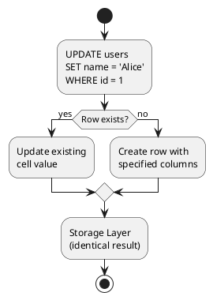
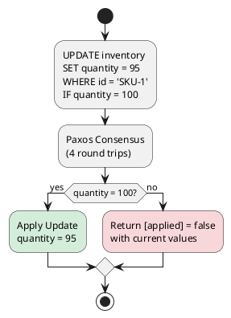

# UPDATE

The UPDATE statement modifies column values in Cassandra tables. Like INSERT, UPDATE performs an **upsert** operation—creating the row if it doesn't exist. UPDATE is particularly useful for collection modifications and counter operations.

---

## Overview

### UPDATE as Upsert

UPDATE does not require the row to exist:



**Key implications:**

- No "row not found" errors
- Same behavior as INSERT for non-existent rows
- Must specify all partition key columns in WHERE

### When to Use UPDATE vs INSERT

| Scenario | Recommended | Reason |
|----------|-------------|--------|
| New row with all columns | INSERT | Clearer intent |
| Modify specific columns | UPDATE | Cleaner syntax |
| Collection operations | UPDATE | Required syntax |
| Counter increments | UPDATE | Only option |
| Conditional modifications | UPDATE | IF conditions |

---

## Synopsis

```cqlsyntax
UPDATE [ *keyspace_name*. ] *table_name*
    [ USING *update_parameter* [ AND *update_parameter* ... ] ]
    SET *assignment* [, *assignment* ... ]
    WHERE *where_clause*
    [ IF *condition* [ AND *condition* ... ] | IF EXISTS ]
```

**update_parameter:**

```cqlsyntax
TTL *seconds*
| TIMESTAMP *microseconds*
```

**assignment:**

```cqlsyntax
*column_name* = *term*
| *column_name* = *column_name* + *term*
| *column_name* = *term* + *column_name*
| *column_name* = *column_name* - *term*
| *column_name* [ *index* ] = *term*
| *column_name* [ *key* ] = *term*
| *column_name*.*field_name* = *term*
```

**condition:**

```cqlsyntax
*column_name* *operator* *term*
| *column_name* [ *index* ] *operator* *term*
| *column_name* [ *key* ] *operator* *term*
| *column_name* IN ( *term* [, *term* ... ] )
```

---

## Parameters

### USING TTL

Sets or updates Time-To-Live for modified columns:

```sql
-- Set TTL on updated columns
UPDATE sessions USING TTL 3600
SET token = 'new_token', refreshed_at = toTimestamp(now())
WHERE session_id = ?;
```

**TTL special values:**

```sql
-- Remove TTL (column lives forever)
UPDATE users USING TTL 0
SET temp_data = temp_data
WHERE user_id = ?;

-- Note: TTL 0 resets TTL, doesn't delete
```

!!! note "TTL Scope"
    TTL applies only to columns in the SET clause, not the entire row. Different columns can have different TTLs.

### USING TIMESTAMP

Specifies write timestamp for conflict resolution:

```sql
UPDATE users USING TIMESTAMP 1705315800000000
SET email = 'new@example.com'
WHERE user_id = ?;
```

**Timestamp effects:**

- Updates only apply if timestamp > existing cell timestamp
- Older timestamps silently ignored
- Cannot be used with IF conditions (LWT)

### SET Clause

#### Simple Assignment

```sql
UPDATE users
SET email = 'new@example.com',
    updated_at = toTimestamp(now())
WHERE user_id = ?;
```

#### Null Assignment

Setting a column to null creates a tombstone:

```sql
-- Creates tombstone (avoid in high-frequency updates)
UPDATE users
SET middle_name = null
WHERE user_id = ?;
```

### WHERE Clause

The WHERE clause identifies rows to update:

```sql
-- Single partition, single row
UPDATE users SET name = 'Alice' WHERE user_id = 123;

-- Single partition, multiple rows (range)
UPDATE sensor_data SET status = 'archived'
WHERE sensor_id = 'temp-1'
  AND reading_time < '2024-01-01';

-- Multiple partitions (IN clause)
UPDATE users SET status = 'inactive'
WHERE user_id IN (1, 2, 3);
```

!!! warning "IN Clause Performance"
    `IN` on partition key creates multiple internal updates. Limit to small sets of values.

### IF EXISTS / IF Condition

Converts UPDATE to lightweight transaction:

```sql
-- Only update if row exists
UPDATE users
SET last_login = toTimestamp(now())
WHERE user_id = ?
IF EXISTS;

-- Conditional on column value
UPDATE inventory
SET quantity = 95
WHERE product_id = 'SKU-001'
IF quantity = 100;

-- Multiple conditions
UPDATE accounts
SET balance = balance - 100
WHERE account_id = ?
IF balance >= 100 AND status = 'active';
```

---

## Collection Operations

Collections support in-place modifications without reading the entire collection.

### List Operations

**Original List:** `['a', 'b', 'c']`

| Operation | Syntax | Result | Notes |
|-----------|--------|--------|-------|
| Append | `list + ['d']` | `['a', 'b', 'c', 'd']` | Safe |
| Prepend | `['z'] + list` | `['z', 'a', 'b', 'c']` | Safe |
| Remove | `list - ['b']` | `['a', 'c']` | Safe |
| Index | `list[0] = 'x'` | `['x', 'b', 'c']` | **Dangerous** |

#### Append Elements

```sql
UPDATE users
SET phone_numbers = phone_numbers + ['+1-555-0103']
WHERE user_id = ?;

-- Append multiple
UPDATE users
SET phone_numbers = phone_numbers + ['+1-555-0104', '+1-555-0105']
WHERE user_id = ?;
```

#### Prepend Elements

```sql
UPDATE users
SET phone_numbers = ['+1-555-0000'] + phone_numbers
WHERE user_id = ?;
```

!!! warning "Prepend Performance"
    Prepending to lists is expensive—Cassandra must read the list to calculate new positions. Prefer appending or use a different data model.

#### Remove Elements by Value

```sql
UPDATE users
SET phone_numbers = phone_numbers - ['+1-555-0100']
WHERE user_id = ?;

-- Remove multiple values
UPDATE users
SET phone_numbers = phone_numbers - ['+1-555-0100', '+1-555-0101']
WHERE user_id = ?;
```

#### Update by Index

```sql
-- Update first element
UPDATE users
SET phone_numbers[0] = '+1-555-9999'
WHERE user_id = ?;
```

!!! danger "Index Updates"
    Index-based updates are **read-before-write** operations:

    - Cassandra reads list to find element at index
    - Race conditions possible with concurrent updates
    - Avoid in high-concurrency scenarios

### Set Operations

Sets provide efficient add/remove without read-before-write:

```sql
-- Add elements
UPDATE users
SET roles = roles + {'moderator', 'reviewer'}
WHERE user_id = ?;

-- Remove elements
UPDATE users
SET roles = roles - {'guest', 'temp'}
WHERE user_id = ?;
```

**Set characteristics:**

- Elements automatically deduplicated
- Add is idempotent (adding existing element no-op)
- Order not preserved (stored sorted)

### Map Operations

Maps support key-based access:

```sql
-- Add or update entries
UPDATE users
SET preferences = preferences + {'theme': 'dark', 'language': 'en'}
WHERE user_id = ?;

-- Update single key
UPDATE users
SET preferences['timezone'] = 'America/New_York'
WHERE user_id = ?;

-- Remove by key (use DELETE)
DELETE preferences['deprecated_key'] FROM users
WHERE user_id = ?;
```

### Collection Replacement

Complete replacement overwrites the collection:

```sql
-- Replace entire list
UPDATE users
SET phone_numbers = ['+1-555-1111', '+1-555-2222']
WHERE user_id = ?;

-- Replace entire set
UPDATE users
SET roles = {'admin', 'superuser'}
WHERE user_id = ?;

-- Replace entire map
UPDATE users
SET preferences = {'theme': 'light'}
WHERE user_id = ?;
```

!!! note "Replacement Creates Tombstones"
    Replacing a collection creates tombstones for all previous elements. For large collections with frequent replacements, consider a different data model.

---

## Counter Updates

Counter columns require special UPDATE syntax:

### Counter Table Design

```sql
CREATE TABLE page_stats (
    page_id TEXT PRIMARY KEY,
    view_count COUNTER,
    unique_visitors COUNTER
);
```

### Increment Counters

```sql
UPDATE page_stats
SET view_count = view_count + 1
WHERE page_id = 'homepage';

-- Increment by larger value
UPDATE page_stats
SET view_count = view_count + 100
WHERE page_id = 'popular-article';
```

### Decrement Counters

```sql
UPDATE page_stats
SET view_count = view_count - 1
WHERE page_id = 'homepage';
```

### Multiple Counter Updates

```sql
UPDATE page_stats
SET view_count = view_count + 1,
    unique_visitors = unique_visitors + 1
WHERE page_id = 'homepage';
```

### Counter Restrictions

!!! danger "Counter Restrictions"
    - Counters cannot be set to absolute values (only increment/decrement)
    - Counter tables can only contain counter columns (plus primary key)
    - Cannot mix counter and non-counter columns
    - Cannot use TTL with counters
    - Cannot use IF conditions with counters
    - Counter deletes are problematic (value may not reset to 0)

---

## UDT Field Updates

Non-frozen UDTs allow field-level updates:

```sql
-- Table with non-frozen UDT
CREATE TABLE users (
    user_id UUID PRIMARY KEY,
    profile address  -- Non-frozen UDT
);

-- Update single field
UPDATE users
SET profile.city = 'Cambridge'
WHERE user_id = ?;

-- Update multiple fields
UPDATE users
SET profile.street = '456 Oak Ave',
    profile.zip = '02139'
WHERE user_id = ?;
```

!!! note "Frozen UDT Updates"
    Frozen UDTs must be replaced entirely:
    ```sql
    UPDATE users
    SET address = {street: '456 Oak Ave', city: 'Cambridge', zip: '02139'}
    WHERE user_id = ?;
    ```

---

## Range Updates

Update multiple rows within a partition using clustering column ranges:

```sql
-- Update all rows in time range
UPDATE sensor_readings
SET status = 'archived'
WHERE sensor_id = 'temp-001'
  AND reading_time >= '2024-01-01'
  AND reading_time < '2024-02-01';

-- Update with TTL for future cleanup
UPDATE events USING TTL 86400
SET archived = true
WHERE tenant_id = 'acme'
  AND event_date = '2024-01-15';
```

---

## Conditional Updates (LWT)

Lightweight transactions ensure atomic read-modify-write:



### IF EXISTS

```sql
UPDATE users
SET last_seen = toTimestamp(now())
WHERE user_id = ?
IF EXISTS;
```

### IF Condition

```sql
-- Optimistic locking
UPDATE documents
SET content = 'new content',
    version = 2
WHERE doc_id = ?
IF version = 1;

-- Inventory management
UPDATE inventory
SET quantity = quantity - 1
WHERE product_id = ?
IF quantity > 0;
```

### Multiple Conditions

```sql
UPDATE accounts
SET balance = balance - 100
WHERE account_id = ?
IF balance >= 100
  AND status = 'active'
  AND locked = false;
```

### Handling LWT Results

```sql
-- Result when applied:
--  [applied]
--  True

-- Result when not applied:
--  [applied] | quantity | ...
--  False     | 97       | ...
```

!!! warning "LWT Performance"
    - ~4x latency compared to regular updates
    - Serializes all LWT operations on same partition
    - Contention causes retries and failures
    - Use only when correctness requires it

---

## Restrictions

!!! danger "Restrictions"
    **WHERE Clause:**

    - All partition key columns required
    - Cannot update partition key columns
    - Cannot update clustering columns

    **SET Clause:**

    - Cannot SET primary key columns
    - Counter columns only support +/- operations
    - Collection operations have specific syntax requirements

    **Conditional Updates:**

    - IF cannot be used with USING TIMESTAMP
    - IF conditions cannot reference clustering columns in range updates
    - Counters do not support IF conditions

    **Collections:**

    - List index operations require read-before-write
    - Cannot mix collection operations with replacement
    - Frozen collections must be replaced entirely

---

## Performance Considerations

### Prepared Statements

```java
PreparedStatement ps = session.prepare(
    "UPDATE users SET email = ?, updated_at = ? WHERE user_id = ?");

// Execute many times
session.execute(ps.bind(email, timestamp, userId));
```

### Avoid Read-Before-Write

Design to avoid reading data before updating:

```sql
-- Bad: requires read to get current value
-- SELECT balance FROM accounts WHERE id = ?;
-- UPDATE accounts SET balance = [calculated] WHERE id = ?;

-- Better: use counter or LWT
UPDATE accounts SET balance = balance + 100 WHERE id = ?;
-- OR
UPDATE accounts SET balance = 200 WHERE id = ? IF balance = 100;
```

### Batch Same-Partition Updates

```sql
BEGIN UNLOGGED BATCH
    UPDATE user_profile SET name = 'Alice' WHERE user_id = 123;
    UPDATE user_profile SET email = 'alice@new.com' WHERE user_id = 123;
    UPDATE user_profile SET updated_at = toTimestamp(now()) WHERE user_id = 123;
APPLY BATCH;
```

---

## Examples

### Basic Column Update

```sql
UPDATE users
SET email = 'newemail@example.com',
    username = 'newusername',
    updated_at = toTimestamp(now())
WHERE user_id = 550e8400-e29b-41d4-a716-446655440000;
```

### Session Refresh with TTL

```sql
UPDATE sessions USING TTL 3600
SET token = 'refreshed_token_xyz',
    last_activity = toTimestamp(now())
WHERE session_id = ?;
```

### Shopping Cart Update

```sql
-- Add item to cart (map)
UPDATE shopping_carts
SET items = items + {'SKU-123': 2}
WHERE cart_id = ?;

-- Update quantity
UPDATE shopping_carts
SET items['SKU-123'] = 5
WHERE cart_id = ?;

-- Remove item
DELETE items['SKU-123'] FROM shopping_carts
WHERE cart_id = ?;
```

### Atomic Balance Transfer

```sql
-- Requires application logic to coordinate
BEGIN BATCH
    UPDATE accounts SET balance = balance - 100 WHERE account_id = 'from';
    UPDATE accounts SET balance = balance + 100 WHERE account_id = 'to';
APPLY BATCH;
```

### Optimistic Locking Pattern

```sql
-- Read current version
SELECT content, version FROM documents WHERE doc_id = ?;

-- Update with version check
UPDATE documents
SET content = 'updated content',
    version = 6
WHERE doc_id = ?
IF version = 5;

-- Retry if [applied] = false
```

---

## Related Documentation

- **[INSERT](insert.md)** - Adding new data
- **[DELETE](delete.md)** - Removing data
- **[BATCH](batch.md)** - Atomic multi-statement operations
- **[Lightweight Transactions](lightweight-transactions.md)** - Conditional updates
- **[Data Types](../data-types/index.md)** - Collection types reference
