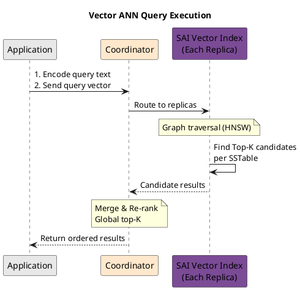

# Vector Search

Vector search enables similarity-based queries on high-dimensional numerical data, supporting use cases such as semantic search, recommendation systems, and image retrieval. Cassandra 5.0 introduced native vector support with the `VECTOR` data type and approximate nearest neighbor (ANN) queries via Storage-Attached Indexes (SAI).

---

## Overview

### What is Vector Search?

Vector search finds data items similar to a query vector based on mathematical distance or similarity measures. Unlike traditional equality or range queries that match exact values, vector search returns results ordered by proximity in high-dimensional space.

```
Traditional Query:  WHERE status = 'active'     → Exact match
Vector Query:       ORDER BY embedding ANN OF ? → Similarity ranked
```

### How Vectors Represent Data

Machine learning models transform unstructured data (text, images, audio) into fixed-dimension numerical vectors called embeddings. Similar items produce vectors that are mathematically close to each other.

| Data Type | Embedding Model Examples | Typical Dimensions |
|-----------|-------------------------|-------------------|
| Text | OpenAI ada-002, Cohere, Sentence-BERT | 384 - 3072 |
| Images | ResNet, CLIP, ViT | 512 - 2048 |
| Audio | Wav2Vec, OpenL3 | 512 - 1024 |
| Multimodal | CLIP, BLIP | 512 - 1024 |

!!! info "Embedding Generation"
    Cassandra stores and queries vectors but does not generate embeddings. Applications must use external ML models or embedding APIs to convert source data into vectors before insertion.

---

## Behavioral Guarantees

### What Vector Search Guarantees

- Vector columns store fixed-dimension floating-point arrays
- SAI vector indexes support approximate nearest neighbor (ANN) queries
- `ORDER BY ... ANN OF` returns results ordered by similarity to the query vector
- `LIMIT` controls the maximum number of results returned
- Similarity functions (`similarity_cosine`, `similarity_euclidean`, `similarity_dot_product`) compute distances consistently

### What Vector Search Does NOT Guarantee

!!! warning "Undefined Behavior"
    The following behaviors are undefined and must not be relied upon:

    - **Exact nearest neighbors**: ANN queries return approximate results; the true k-nearest neighbors may not be included
    - **Result stability**: Identical queries may return slightly different results due to ANN approximation
    - **Cross-partition ordering**: When querying multiple partitions, global ordering is approximate
    - **Recall guarantees**: The percentage of true nearest neighbors found varies by index configuration and data distribution
    - **Performance with filters**: Combining ANN with WHERE clauses may significantly impact performance
    - **Dimension mismatch handling**: Query vectors with wrong dimensions cause errors; no automatic padding or truncation

### ANN Query Contract

| Aspect | Guarantee |
|--------|-----------|
| Result ordering | Approximate similarity order (best matches first) |
| Result count | At most LIMIT rows returned |
| Index requirement | SAI index with `'similarity_function'` option required |
| Query vector dimension | Must match column dimension exactly |

### Similarity Function Contract

| Function | Range | Best Match | Use Case |
|----------|-------|------------|----------|
| `similarity_cosine` | -1 to 1 | 1 (identical direction) | Normalized embeddings, text similarity |
| `similarity_euclidean` | 0 to ∞ | 0 (identical) | Spatial data, unnormalized vectors |
| `similarity_dot_product` | -∞ to ∞ | Higher is more similar | Pre-normalized vectors, performance |

### Index Build Contract

| State | Query Behavior |
|-------|---------------|
| Building | ANN queries may fail or return incomplete results |
| Built | ANN queries return approximate results from all indexed data |
| Missing | ANN queries fail with error |

### Failure Semantics

| Failure Mode | Outcome | Client Action |
|--------------|---------|---------------|
| Dimension mismatch | Query rejected | Ensure query vector matches column dimension |
| Missing ANN index | Query fails | Create SAI index with similarity function |
| Index building | Partial or no results | Wait for index build completion |
| Query timeout | Partial results possible | Reduce LIMIT or add partition constraints |

### Version-Specific Behavior

| Version | Behavior |
|---------|----------|
| 5.0+ | VECTOR type and ANN queries introduced (CEP-30) |
| 5.0+ | SAI vector indexes with similarity functions |

---

## Vector Data Type

### Syntax

```sql
VECTOR<element_type, dimension>
```

| Parameter | Description | Constraints |
|-----------|-------------|-------------|
| `element_type` | Numeric type for elements | `FLOAT` (recommended), `DOUBLE` |
| `dimension` | Number of elements | Fixed at table creation, typically 128-3072 |

### Creating Tables with Vectors

```sql
-- Semantic search table
CREATE TABLE documents (
    doc_id UUID,
    title TEXT,
    content TEXT,
    embedding VECTOR<FLOAT, 1536>,
    created_at TIMESTAMP,
    PRIMARY KEY (doc_id)
);

-- Product recommendations
CREATE TABLE products (
    product_id UUID,
    category TEXT,
    name TEXT,
    description TEXT,
    image_embedding VECTOR<FLOAT, 512>,
    text_embedding VECTOR<FLOAT, 768>,
    PRIMARY KEY ((category), product_id)
);

-- Multi-modal search
CREATE TABLE media_assets (
    asset_id UUID,
    asset_type TEXT,
    visual_embedding VECTOR<FLOAT, 1024>,
    audio_embedding VECTOR<FLOAT, 512>,
    PRIMARY KEY (asset_id)
);
```

!!! warning "Dimension Immutability"
    Vector dimensions cannot be changed after table creation. Migrating to a different embedding model with different dimensions requires creating a new table and re-embedding all data.

---

## Inserting Vector Data

### Basic Insert

```sql
-- Insert with vector literal
INSERT INTO documents (doc_id, title, content, embedding, created_at)
VALUES (
    uuid(),
    'Introduction to Cassandra',
    'Apache Cassandra is a distributed database...',
    [0.023, -0.142, 0.089, ...],  -- 1536 float values
    toTimestamp(now())
);
```

### Parameterized Insert (Recommended)

```sql
-- Prepared statement with vector parameter
INSERT INTO documents (doc_id, title, content, embedding, created_at)
VALUES (?, ?, ?, ?, ?);
```

**Driver examples:**

```python
# Python driver
from cassandra.cluster import Cluster

cluster = Cluster(['127.0.0.1'])
session = cluster.connect('my_keyspace')

# Embedding from ML model (list of floats)
embedding = model.encode("Apache Cassandra is a distributed database...")

prepared = session.prepare("""
    INSERT INTO documents (doc_id, title, content, embedding, created_at)
    VALUES (?, ?, ?, ?, toTimestamp(now()))
""")

session.execute(prepared, [
    uuid.uuid4(),
    'Introduction to Cassandra',
    'Apache Cassandra is a distributed database...',
    embedding  # Pass as list or array
])
```

```java
// Java driver
import com.datastax.oss.driver.api.core.data.CqlVector;

PreparedStatement prepared = session.prepare(
    "INSERT INTO documents (doc_id, title, content, embedding, created_at) " +
    "VALUES (?, ?, ?, ?, toTimestamp(now()))"
);

float[] embeddingArray = model.encode("Apache Cassandra is a distributed database...");
CqlVector<Float> embedding = CqlVector.newInstance(embeddingArray);

session.execute(prepared.bind(
    UUID.randomUUID(),
    "Introduction to Cassandra",
    "Apache Cassandra is a distributed database...",
    embedding
));
```

!!! tip "Batch Embedding"
    For bulk data loading, batch embedding requests to the ML model for efficiency. Most embedding APIs support batching multiple texts in a single request.

### Updating Vectors

```sql
-- Update existing vector
UPDATE documents
SET embedding = [0.031, -0.128, 0.095, ...]
WHERE doc_id = ?;
```

!!! note "Update Implications"
    Updating vectors triggers index updates. For frequently changing vectors, consider the write amplification impact on SAI indexes.

---

## Vector Indexing

Vector similarity search requires an SAI index with a specified similarity function.

### Creating Vector Indexes

```sql
-- Cosine similarity (default, recommended for text embeddings)
CREATE CUSTOM INDEX documents_embedding_idx ON documents (embedding)
    USING 'StorageAttachedIndex';

-- Explicit similarity function
CREATE CUSTOM INDEX ON documents (embedding)
    USING 'StorageAttachedIndex'
    WITH OPTIONS = {'similarity_function': 'cosine'};

-- Euclidean distance (L2)
CREATE CUSTOM INDEX ON products (image_embedding)
    USING 'StorageAttachedIndex'
    WITH OPTIONS = {'similarity_function': 'euclidean'};

-- Dot product
CREATE CUSTOM INDEX ON products (text_embedding)
    USING 'StorageAttachedIndex'
    WITH OPTIONS = {'similarity_function': 'dot_product'};
```

### Similarity Functions

| Function | Formula | Range | Best For |
|----------|---------|-------|----------|
| `cosine` | 1 - cos(θ) | 0 to 2 | Normalized embeddings, text similarity |
| `euclidean` | √Σ(aᵢ - bᵢ)² | 0 to ∞ | Spatial data, image features |
| `dot_product` | Σ(aᵢ × bᵢ) | -∞ to ∞ | Pre-normalized vectors, performance |

!!! tip "Choosing Similarity Functions"
    - **Cosine**: Default choice for most text embeddings. Measures angle between vectors, insensitive to magnitude.
    - **Euclidean**: Use when absolute distances matter, such as geographic or spatial embeddings.
    - **Dot product**: Fastest computation. Requires normalized vectors (magnitude = 1) for meaningful results.

!!! warning "Similarity Function Consistency"
    The similarity function must match how the embedding model was trained. Most text embedding models (OpenAI, Cohere, Sentence-BERT) are optimized for cosine similarity.

---

## Querying Vectors

### Approximate Nearest Neighbor (ANN) Search

The `ORDER BY ... ANN OF` clause performs similarity search:

```sql
-- Find 10 most similar documents
SELECT doc_id, title, similarity_cosine(embedding, ?) AS similarity
FROM documents
ORDER BY embedding ANN OF ?
LIMIT 10;
```

!!! danger "LIMIT Required"
    ANN queries require a `LIMIT` clause. Queries without LIMIT will fail. The maximum allowed LIMIT is 1000.

### Query Execution Flow



### Similarity Score Functions

Retrieve similarity scores in the result set:

```sql
-- Cosine similarity score
SELECT doc_id, title, similarity_cosine(embedding, ?) AS score
FROM documents
ORDER BY embedding ANN OF ?
LIMIT 10;

-- Euclidean distance score
SELECT product_id, name, similarity_euclidean(image_embedding, ?) AS distance
FROM products
ORDER BY image_embedding ANN OF ?
LIMIT 10;

-- Dot product score
SELECT doc_id, similarity_dot_product(embedding, ?) AS score
FROM documents
ORDER BY embedding ANN OF ?
LIMIT 10;
```

| Function | Return Value | Interpretation |
|----------|--------------|----------------|
| `similarity_cosine` | 0 to 1 | Higher = more similar |
| `similarity_euclidean` | 0 to ∞ | Lower = more similar |
| `similarity_dot_product` | -∞ to ∞ | Higher = more similar |

### Filtered Vector Search

Combine vector search with scalar predicates:

```sql
-- Vector search with equality filter
SELECT doc_id, title, similarity_cosine(embedding, ?) AS score
FROM documents
WHERE category = 'technical'
ORDER BY embedding ANN OF ?
LIMIT 10;

-- Vector search with partition key (most efficient)
SELECT product_id, name, similarity_cosine(image_embedding, ?) AS score
FROM products
WHERE category = 'electronics'
ORDER BY image_embedding ANN OF ?
LIMIT 20;

-- Multiple filters
SELECT doc_id, title
FROM documents
WHERE category = 'science'
  AND created_at > '2024-01-01'
ORDER BY embedding ANN OF ?
LIMIT 10;
```

!!! tip "Filter Order Matters"
    For optimal performance, design partition keys to support common filter combinations. Queries that include the partition key with vector search perform significantly better than global vector scans.

!!! note "Filter Selectivity"
    SAI applies filters before or after vector search based on estimated selectivity. Highly selective filters (matching few rows) are applied first, reducing the vector search space.

---

## Complete Application Example

### Semantic Document Search

```sql
-- Schema
CREATE TABLE IF NOT EXISTS knowledge_base (
    doc_id UUID,
    title TEXT,
    content TEXT,
    category TEXT,
    embedding VECTOR<FLOAT, 1536>,
    created_at TIMESTAMP,
    PRIMARY KEY (doc_id)
);

-- Indexes
CREATE CUSTOM INDEX ON knowledge_base (embedding)
    USING 'StorageAttachedIndex'
    WITH OPTIONS = {'similarity_function': 'cosine'};

CREATE CUSTOM INDEX ON knowledge_base (category)
    USING 'StorageAttachedIndex';

CREATE CUSTOM INDEX ON knowledge_base (created_at)
    USING 'StorageAttachedIndex';
```

```python
# Python application
from cassandra.cluster import Cluster
import openai

class SemanticSearch:
    def __init__(self):
        self.cluster = Cluster(['127.0.0.1'])
        self.session = self.cluster.connect('my_keyspace')
        self.openai = openai.Client()

        # Prepare statements
        self.insert_stmt = self.session.prepare("""
            INSERT INTO knowledge_base
            (doc_id, title, content, category, embedding, created_at)
            VALUES (?, ?, ?, ?, ?, toTimestamp(now()))
        """)

        self.search_stmt = self.session.prepare("""
            SELECT doc_id, title, content, similarity_cosine(embedding, ?) AS score
            FROM knowledge_base
            ORDER BY embedding ANN OF ?
            LIMIT ?
        """)

        self.filtered_search_stmt = self.session.prepare("""
            SELECT doc_id, title, content, similarity_cosine(embedding, ?) AS score
            FROM knowledge_base
            WHERE category = ?
            ORDER BY embedding ANN OF ?
            LIMIT ?
        """)

    def get_embedding(self, text):
        """Generate embedding using OpenAI API"""
        response = self.openai.embeddings.create(
            model="text-embedding-ada-002",
            input=text
        )
        return response.data[0].embedding

    def insert_document(self, doc_id, title, content, category):
        """Insert document with generated embedding"""
        embedding = self.get_embedding(f"{title} {content}")
        self.session.execute(self.insert_stmt, [
            doc_id, title, content, category, embedding
        ])

    def search(self, query, limit=10, category=None):
        """Semantic search with optional category filter"""
        query_embedding = self.get_embedding(query)

        if category:
            rows = self.session.execute(
                self.filtered_search_stmt,
                [query_embedding, category, query_embedding, limit]
            )
        else:
            rows = self.session.execute(
                self.search_stmt,
                [query_embedding, query_embedding, limit]
            )

        return [
            {
                'doc_id': row.doc_id,
                'title': row.title,
                'content': row.content,
                'score': row.score
            }
            for row in rows
        ]

# Usage
search = SemanticSearch()

# Insert documents
search.insert_document(
    uuid.uuid4(),
    "Cassandra Data Modeling",
    "Learn how to design tables for query patterns...",
    "database"
)

# Search
results = search.search("How do I design Cassandra tables?", limit=5)
for result in results:
    print(f"{result['title']} (score: {result['score']:.4f})")
```

---

## Strengths

!!! success "Native Database Integration"
    Vector search is integrated directly into Cassandra's storage and query engine:

    - Single system for both vector and scalar data
    - Transactional consistency with other column updates
    - No separate vector database infrastructure required
    - Familiar CQL interface

!!! success "Distributed Scalability"
    Inherits Cassandra's distributed architecture:

    - Vectors partitioned and replicated like other data
    - Horizontal scaling by adding nodes
    - No single point of failure
    - Multi-datacenter replication supported

!!! success "Combined Queries"
    Filter vector results using standard CQL predicates:

    - Combine ANN search with equality, range, and CONTAINS filters
    - Leverage existing SAI indexes on scalar columns
    - Single query for hybrid search patterns

!!! success "Storage Efficiency"
    SAI vector indexes are storage-attached:

    - Indexes compact with SSTables
    - No separate index storage management
    - Consistent with Cassandra's LSM-tree architecture

---

## Limitations

!!! warning "Approximate Results"
    ANN search returns approximate nearest neighbors, not exact results:

    - Results are ranked by estimated similarity
    - True nearest neighbors may be missed (recall < 100%)
    - Recall accuracy depends on index parameters and data distribution
    - No guarantee of deterministic ordering for equal similarity scores

!!! warning "Dimension Constraints"
    Vector dimensions have practical limits:

    - Maximum recommended dimension: 4096
    - Higher dimensions increase storage and computation costs
    - Dimension reduction may be needed for very large embeddings
    - Dimension is fixed at table creation

!!! warning "Query Restrictions"
    Vector queries have specific requirements:

    - `LIMIT` clause is mandatory (max 1000)
    - `ORDER BY ... ANN OF` required for similarity search
    - Cannot combine with `GROUP BY` or aggregations
    - Cannot use in materialized view definitions

!!! warning "Memory Requirements"
    Vector indexes consume significant memory:

    - HNSW graph structures reside partially in memory
    - Memory usage scales with vector count and dimensions
    - Large vector tables may require memory tuning
    - Monitor heap usage during index builds

!!! warning "Index Build Time"
    Building vector indexes on existing data takes time:

    - Proportional to vector count and dimensions
    - CPU-intensive graph construction
    - Monitor with `nodetool compactionstats`
    - Consider off-peak index creation for large tables

!!! danger "No Cross-Partition Vector Aggregation"
    Vector search within partitions differs from global search:

    - Global ANN scans all partitions (resource-intensive)
    - Partition-restricted ANN is more efficient
    - Design partition keys to align with common query patterns

---

## Performance Tuning

### Index Configuration

```sql
-- Tune graph construction parameters (advanced)
CREATE CUSTOM INDEX ON documents (embedding)
    USING 'StorageAttachedIndex'
    WITH OPTIONS = {
        'similarity_function': 'cosine'
        -- Additional SAI tuning options may be available
        -- in future Cassandra versions
    };
```

### Query Optimization

| Technique | Impact | Implementation |
|-----------|--------|----------------|
| Include partition key | High | Design schema for partition-restricted vector queries |
| Reduce LIMIT | Medium | Request only needed results |
| Pre-filter with selective predicates | Medium | Add SAI indexes on filter columns |
| Normalize vectors | Low | Pre-normalize for dot_product similarity |

### Capacity Planning

| Factor | Estimation |
|--------|------------|
| Vector storage | `rows × dimensions × 4 bytes` (FLOAT) |
| Index overhead | ~1.5x vector storage |
| Memory per node | Monitor during index build, tune heap |
| Query latency | Benchmark with production-like data |

!!! tip "Benchmarking"
    Always benchmark vector operations with production-representative data volumes and query patterns. Performance characteristics vary significantly based on:

    - Vector dimensions
    - Dataset size
    - Query concurrency
    - Cluster configuration

---

## Use Cases

### Semantic Search

Search documents by meaning rather than keywords:

```sql
-- User searches for "database performance issues"
-- Returns documents about optimization, tuning, slow queries, etc.
SELECT doc_id, title, similarity_cosine(embedding, ?) AS relevance
FROM documentation
ORDER BY embedding ANN OF ?
LIMIT 20;
```

### Recommendation Systems

Find similar products or content:

```sql
-- Given a product the user viewed, find similar products
SELECT product_id, name, similarity_cosine(embedding,
    (SELECT embedding FROM products WHERE product_id = ?)) AS similarity
FROM products
WHERE category = ?
ORDER BY embedding ANN OF (SELECT embedding FROM products WHERE product_id = ?)
LIMIT 10;
```

!!! note "Subquery Limitation"
    The above subquery syntax is illustrative. In practice, retrieve the source embedding first, then use it as a parameter.

### Image Similarity

Find visually similar images:

```sql
-- Reverse image search
SELECT image_id, filename, similarity_euclidean(visual_embedding, ?) AS distance
FROM image_catalog
ORDER BY visual_embedding ANN OF ?
LIMIT 25;
```

### Anomaly Detection

Identify outliers by finding items distant from cluster centroids:

```sql
-- Find transactions dissimilar to normal patterns
SELECT transaction_id, amount,
       similarity_cosine(feature_vector, ?) AS normality_score
FROM transactions
WHERE account_id = ?
ORDER BY feature_vector ANN OF ?
LIMIT 100;
-- Filter for low similarity scores in application
```

### RAG (Retrieval-Augmented Generation)

Retrieve context for LLM prompts:

```sql
-- Find relevant context chunks for RAG
SELECT chunk_id, content, similarity_cosine(embedding, ?) AS relevance
FROM knowledge_chunks
WHERE domain = 'product_documentation'
ORDER BY embedding ANN OF ?
LIMIT 5;
-- Pass retrieved content to LLM as context
```

---

## Migration and Compatibility

### Version Requirements

| Feature | Minimum Version |
|---------|-----------------|
| `VECTOR` data type | Cassandra 5.0 |
| SAI vector index | Cassandra 5.0 |
| `similarity_*` functions | Cassandra 5.0 |
| `ORDER BY ... ANN OF` | Cassandra 5.0 |

!!! danger "Pre-5.0 Alternatives"
    Cassandra versions before 5.0 do not support native vector search. Alternatives include:

    - External vector databases (Pinecone, Weaviate, Milvus)
    - DataStax Astra DB (managed Cassandra with vector support)
    - Application-level vector search with stored BLOBs

### Schema Evolution

When changing embedding models:

```sql
-- 1. Add new vector column
ALTER TABLE documents ADD embedding_v2 VECTOR<FLOAT, 768>;

-- 2. Create new index
CREATE CUSTOM INDEX ON documents (embedding_v2)
    USING 'StorageAttachedIndex';

-- 3. Backfill embeddings (application-side)
-- 4. Update queries to use new column
-- 5. Drop old column and index when migration complete
DROP INDEX documents_embedding_idx;
ALTER TABLE documents DROP embedding;
```

---

## Related Documentation

- **[Vector Data Type](../ddl/table.md#vector-type-cassandra-50)** - DDL syntax for vector columns
- **[SAI Architecture](../../architecture/storage-engine/indexes/sai.md)** - Index internals
- **[Secondary Index Queries](secondary-index-queries.md)** - General index query patterns
- **[Data Modeling](../../data-modeling/index.md)** - Schema design principles
