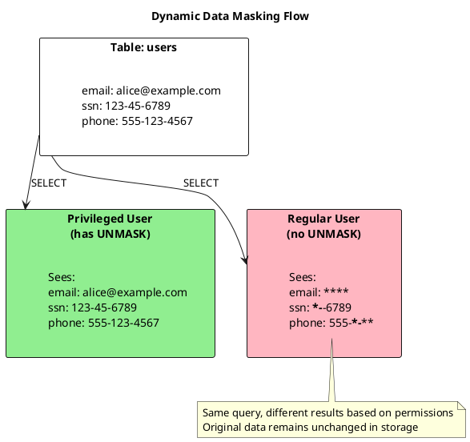
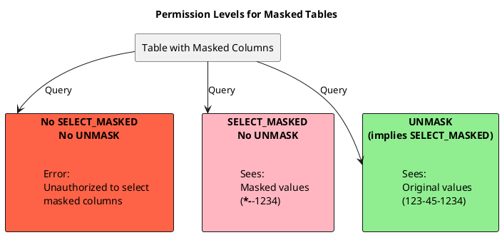

# Dynamic Data Masking

Dynamic Data Masking (DDM) allows sensitive column data to be automatically obfuscated when read by users without specific permissions, while storing the original data intact. This enables fine-grained access control where different users see different representations of the same data based on their roles.

---

## Overview

### What is Dynamic Data Masking?

Dynamic Data Masking transforms column values at read time based on user permissions:



| Aspect | Description |
|--------|-------------|
| **Storage** | Original data stored unchanged |
| **Transformation** | Masking applied at read time only |
| **Control** | Per-column masking functions |
| **Access** | Permissions determine who sees what |

### Key Benefits

| Benefit | Description |
|---------|-------------|
| Data protection | Sensitive data hidden from unauthorized users |
| Compliance support | Helps meet GDPR, HIPAA, PCI-DSS requirements |
| Application transparency | No application code changes required |
| Flexible access control | Different users see different data views |
| Original data preserved | Full access available to authorized users |

---

## Behavioral Guarantees

### What DDM Operations Guarantee

- Masking functions are applied at read time on the coordinator node
- Original data is never modified; masking is purely a read transformation
- Users with UNMASK permission see original unmasked values
- Users with SELECT_MASKED permission see masked values
- Masking is applied before results are returned to the client
- ALTER TABLE can add or remove masking from existing columns

### What DDM Operations Do NOT Guarantee

!!! warning "Undefined Behavior"
    The following behaviors are undefined and must not be relied upon:

    - **Materialized view masking**: Views may expose unmasked data depending on permissions at view creation
    - **Index leakage**: Secondary indexes may allow inference of masked values through query patterns
    - **UDF security**: User-defined masking functions may have implementation vulnerabilities
    - **Prepared statement caching**: Cached statements may retain permission state from preparation time
    - **CDC and backup exposure**: Change Data Capture and backup files contain unmasked data

### Permission Resolution Contract

| Permission | Can SELECT | Sees Masked | Sees Unmasked |
|------------|------------|-------------|---------------|
| Neither | ❌ No | - | - |
| SELECT only | ❌ No | - | - |
| SELECT_MASKED | ✅ Yes | ✅ Yes | ❌ No |
| UNMASK | ✅ Yes | - | ✅ Yes |
| Both | ✅ Yes | - | ✅ Yes |

### Masking Function Contract

| Function | Input | Output | Notes |
|----------|-------|--------|-------|
| `mask_default` | Any | Type-specific mask | Returns `****` for text, `0` for numbers |
| `mask_null` | Any | `null` | Always returns null |
| `mask_replace` | Text | Replacement | Replaces with specified character |
| `mask_inner` | Text | Partial mask | Masks middle characters |
| `mask_outer` | Text | Partial mask | Masks outer characters |
| Custom UDF | Any | Any | User-defined transformation |

### Failure Semantics

| Failure Mode | Outcome | Client Action |
|--------------|---------|---------------|
| Missing SELECT_MASKED or UNMASK | Query denied | Request appropriate permission |
| Masking function fails | Query fails | Fix masking function |
| Custom UDF throws exception | Query fails with masked column error | Fix UDF implementation |
| Column type mismatch | Query may fail or return unexpected results | Ensure function matches column type |

### Version-Specific Behavior

| Version | Behavior |
|---------|----------|
| 5.0+ | Dynamic Data Masking introduced (CEP-20, CASSANDRA-17940) |

---

## History and Development

### Design Background

Dynamic Data Masking was proposed through the Cassandra Enhancement Proposal (CEP) process and implemented as a major security feature.

| Milestone | Reference | Description |
|-----------|-----------|-------------|
| CEP-20 | [CEP-20: Dynamic Data Masking](https://cwiki.apache.org/confluence/display/CASSANDRA/CEP-20%3A+Dynamic+Data+Masking) | Design proposal defining DDM architecture |
| CASSANDRA-17940 | [CASSANDRA-17940](https://issues.apache.org/jira/browse/CASSANDRA-17940) | Main implementation ticket |
| Release | Cassandra 5.0 | First version with DDM support |

### Design Goals

The CEP-20 proposal established several requirements:

1. **Column-level granularity** - Masking defined per column, not per table
2. **Native functions** - Built-in masking functions for common patterns
3. **Custom functions** - User-defined functions (UDFs) for specialized masking
4. **Permission-based** - UNMASK permission controls access to original data
5. **Backward compatible** - Existing applications work without modification

### Related Implementations

DDM in Cassandra follows patterns established in other databases:

| Database | Feature Name | Available Since |
|----------|-------------|-----------------|
| SQL Server | Dynamic Data Masking | 2016 |
| Oracle | Data Redaction | 12c |
| PostgreSQL | Data Masking Extension | Community extension |
| MySQL | Enterprise Data Masking | 8.0 Enterprise |
| **Cassandra** | **Dynamic Data Masking** | **5.0** |

---

## Configuration

### Enabling DDM

DDM is disabled by default and must be enabled in `cassandra.yaml`:

```yaml
# Enable dynamic data masking (default: false)
dynamic_data_masking_enabled: true
```

!!! warning "Configuration Requirement"
    DDM must be explicitly enabled. Without this setting, masking functions cannot be attached to columns and UNMASK/SELECT_MASKED permissions have no effect.

### Enabling User-Defined Functions

Custom masking functions require UDFs to be enabled:

```yaml
# Required for custom masking functions
user_defined_functions_enabled: true

# Optional: allow Java UDFs (more powerful but higher security risk)
user_defined_functions_threads_enabled: true
```

### Restart Required

Configuration changes require a rolling restart of all nodes in the cluster.

---

## Masking Functions

Cassandra provides six built-in masking functions for common data protection scenarios.

### mask_null

Replaces the column value with `null`.

**Signature:**
```sql
mask_null(value)
```

**Use cases:**

- Complete data hiding
- Columns that should be invisible to regular users

**Example:**

```sql
CREATE TABLE users (
    user_id uuid PRIMARY KEY,
    name text,
    secret_notes text MASKED WITH mask_null()
);

INSERT INTO users (user_id, name, secret_notes)
VALUES (uuid(), 'Alice', 'Internal: High priority customer');

-- Regular user sees:
-- user_id                              | name  | secret_notes
-- -------------------------------------+-------+--------------
-- a1b2c3d4-...                         | Alice | null

-- User with UNMASK sees:
-- user_id                              | name  | secret_notes
-- -------------------------------------+-------+---------------------------------
-- a1b2c3d4-...                         | Alice | Internal: High priority customer
```

### mask_default

Replaces the value with a default value based on the column's data type.

**Signature:**
```sql
mask_default(value)
```

**Default values by type:**

| Data Type | Default Value |
|-----------|---------------|
| text, varchar, ascii | Empty string `''` |
| int, bigint, smallint, tinyint | `0` |
| float, double | `0.0` |
| decimal | `0` |
| boolean | `false` |
| uuid, timeuuid | `00000000-0000-0000-0000-000000000000` |
| timestamp | `1970-01-01 00:00:00+0000` (epoch) |
| date | `1970-01-01` (epoch) |
| blob | Empty blob |
| list, set, map | Empty collection |

**Example:**

```sql
CREATE TABLE accounts (
    account_id uuid PRIMARY KEY,
    holder_name text,
    balance decimal MASKED WITH mask_default(),
    is_premium boolean MASKED WITH mask_default()
);

INSERT INTO accounts (account_id, holder_name, balance, is_premium)
VALUES (uuid(), 'Bob Smith', 50000.00, true);

-- Regular user sees:
-- account_id | holder_name | balance | is_premium
-- -----------+-------------+---------+-----------
-- ...        | Bob Smith   | 0       | false

-- User with UNMASK sees actual values
```

### mask_replace

Replaces the value with a specified constant.

**Signature:**
```sql
mask_replace(value, replacement)
```

**Parameters:**

| Parameter | Description |
|-----------|-------------|
| value | The column value (automatic) |
| replacement | Constant value to show instead |

**Example:**

```sql
CREATE TABLE employees (
    emp_id uuid PRIMARY KEY,
    name text,
    department text,
    salary int MASKED WITH mask_replace(0),
    ssn text MASKED WITH mask_replace('XXX-XX-XXXX')
);

INSERT INTO employees (emp_id, name, department, salary, ssn)
VALUES (uuid(), 'Carol', 'Engineering', 95000, '123-45-6789');

-- Regular user sees:
-- emp_id | name  | department  | salary | ssn
-- -------+-------+-------------+--------+-------------
-- ...    | Carol | Engineering | 0      | XXX-XX-XXXX
```

### mask_inner

Masks the inner portion of a string, preserving outer characters.

**Signature:**
```sql
mask_inner(value, prefix_length, suffix_length)
mask_inner(value, prefix_length, suffix_length, replacement_char)
```

**Parameters:**

| Parameter | Description | Default |
|-----------|-------------|---------|
| value | The column value (automatic) | - |
| prefix_length | Characters to show at start | Required |
| suffix_length | Characters to show at end | Required |
| replacement_char | Character for masking | `*` |

**Example:**

```sql
CREATE TABLE customers (
    customer_id uuid PRIMARY KEY,
    name text,
    email text MASKED WITH mask_inner(2, 4),
    credit_card text MASKED WITH mask_inner(0, 4, '#')
);

INSERT INTO customers (customer_id, name, email, credit_card)
VALUES (uuid(), 'David', 'david.jones@example.com', '4532-1234-5678-9012');

-- Regular user sees:
-- customer_id | name  | email                  | credit_card
-- ------------+-------+------------------------+--------------------
-- ...         | David | da***************m.com | ###############9012

-- Email: 'da' (first 2) + masked + '.com' (last 4)
-- Card: all masked except last 4
```

### mask_outer

Masks the outer portions of a string, preserving inner characters.

**Signature:**
```sql
mask_outer(value, prefix_length, suffix_length)
mask_outer(value, prefix_length, suffix_length, replacement_char)
```

**Parameters:**

| Parameter | Description | Default |
|-----------|-------------|---------|
| value | The column value (automatic) | - |
| prefix_length | Characters to mask at start | Required |
| suffix_length | Characters to mask at end | Required |
| replacement_char | Character for masking | `*` |

**Example:**

```sql
CREATE TABLE contacts (
    contact_id uuid PRIMARY KEY,
    name text,
    phone text MASKED WITH mask_outer(0, 4),
    account_number text MASKED WITH mask_outer(4, 4, 'X')
);

INSERT INTO contacts (contact_id, name, phone, account_number)
VALUES (uuid(), 'Eve', '555-123-4567', 'ACCT-78901234-USD');

-- Regular user sees:
-- contact_id | name | phone        | account_number
-- -----------+------+--------------+------------------
-- ...        | Eve  | 555-123-**** | XXXX-78901234XXXX

-- Phone: last 4 masked
-- Account: first 4 and last 4 masked
```

### mask_hash

Replaces the value with a hash using a specified algorithm.

**Signature:**
```sql
mask_hash(value)
mask_hash(value, algorithm)
```

**Parameters:**

| Parameter | Description | Default |
|-----------|-------------|---------|
| value | The column value (automatic) | - |
| algorithm | Hash algorithm name | `SHA-256` |

**Supported algorithms:**

| Algorithm | Output Length | Notes |
|-----------|--------------|-------|
| MD5 | 32 hex chars | Not recommended for security |
| SHA-1 | 40 hex chars | Legacy, use SHA-256 instead |
| SHA-256 | 64 hex chars | Recommended default |
| SHA-384 | 96 hex chars | Higher security |
| SHA-512 | 128 hex chars | Maximum security |

**Example:**

```sql
CREATE TABLE audit_log (
    log_id uuid PRIMARY KEY,
    timestamp timestamp,
    user_id text MASKED WITH mask_hash(),
    action text,
    ip_address text MASKED WITH mask_hash('SHA-256')
);

INSERT INTO audit_log (log_id, timestamp, user_id, action, ip_address)
VALUES (uuid(), toTimestamp(now()), 'alice', 'LOGIN', '192.168.1.100');

-- Regular user sees:
-- log_id | timestamp | user_id                          | action | ip_address
-- -------+-----------+----------------------------------+--------+----------------------------------
-- ...    | ...       | 2bd806c97f0e00af1a1fc3328fa763a9 | LOGIN  | a7b9d4f2e1c3... (SHA-256 hash)
```

!!! note "Hash Determinism"
    Hash output is deterministic—the same input always produces the same hash. This enables:

    - Joining masked tables on hashed columns
    - Comparing masked values for equality
    - Tracking unique values without revealing them

    However, common values may be vulnerable to dictionary attacks.

---

## Permissions

Two permissions control DDM access:

### UNMASK Permission

Grants ability to see original (unmasked) column values.

```sql
-- Grant UNMASK on specific table
GRANT UNMASK ON my_keyspace.users TO admin_role;

-- Grant UNMASK on all tables in keyspace
GRANT UNMASK ON KEYSPACE my_keyspace TO admin_role;

-- Grant UNMASK on all keyspaces
GRANT UNMASK ON ALL KEYSPACES TO superadmin;
```

| Scenario | Result |
|----------|--------|
| User has UNMASK | Sees original values |
| User lacks UNMASK | Sees masked values |
| Superuser | Always sees original values |

### SELECT_MASKED Permission

Grants ability to query tables with masked columns (seeing masked values).

```sql
-- Grant SELECT_MASKED on specific table
GRANT SELECT_MASKED ON my_keyspace.users TO analyst_role;

-- Grant SELECT_MASKED on keyspace
GRANT SELECT_MASKED ON KEYSPACE my_keyspace TO analyst_role;
```

!!! info "Permission Hierarchy"
    - **SELECT** alone: Cannot query tables with masked columns (error)
    - **SELECT + SELECT_MASKED**: Can query, sees masked values
    - **SELECT + UNMASK**: Can query, sees original values
    - **UNMASK** implies SELECT_MASKED

### Permission Examples



**Setup example:**

```sql
-- Create roles
CREATE ROLE app_service WITH PASSWORD = 'secret' AND LOGIN = true;
CREATE ROLE analyst WITH PASSWORD = 'secret' AND LOGIN = true;
CREATE ROLE admin WITH PASSWORD = 'secret' AND LOGIN = true;

-- app_service: Can query, sees masked data
GRANT SELECT ON KEYSPACE production TO app_service;
GRANT SELECT_MASKED ON KEYSPACE production TO app_service;

-- analyst: Same as app_service (explicit permissions)
GRANT SELECT ON KEYSPACE production TO analyst;
GRANT SELECT_MASKED ON KEYSPACE production TO analyst;

-- admin: Can see original data
GRANT SELECT ON KEYSPACE production TO admin;
GRANT UNMASK ON KEYSPACE production TO admin;
```

---

## Defining Masked Columns

### CREATE TABLE with Masking

Apply masking when creating a table:

```sql
CREATE TABLE customers (
    customer_id uuid PRIMARY KEY,
    email text MASKED WITH mask_inner(2, 4),
    phone text MASKED WITH mask_outer(0, 4),
    ssn text MASKED WITH mask_replace('XXX-XX-XXXX'),
    credit_score int MASKED WITH mask_default(),
    notes text MASKED WITH mask_null()
);
```

### ALTER TABLE to Add Masking

Add masking to existing columns:

```sql
-- Add masking to existing column
ALTER TABLE customers ALTER email MASKED WITH mask_inner(2, 4);

-- Add masking to another column
ALTER TABLE customers ALTER ssn MASKED WITH mask_replace('REDACTED');
```

### ALTER TABLE to Remove Masking

Remove masking from columns:

```sql
-- Remove masking from column
ALTER TABLE customers ALTER email DROP MASKED;
```

### View Masking Configuration

Check which columns have masking:

```sql
DESCRIBE TABLE customers;
```

Output includes masking function definitions:

```
CREATE TABLE my_keyspace.customers (
    customer_id uuid PRIMARY KEY,
    email text MASKED WITH mask_inner(2, 4),
    phone text MASKED WITH mask_outer(0, 4),
    ssn text MASKED WITH mask_replace('XXX-XX-XXXX'),
    ...
)
```

---

## Custom Masking Functions

User-defined functions (UDFs) can serve as custom masking functions for specialized requirements.

### Requirements

1. UDFs must be enabled in `cassandra.yaml`
2. Function must accept the column value as the first parameter
3. Function must return the same type as the column (or compatible type)
4. Function should be deterministic for consistent results

### Example: Email Domain Masking

Mask the local part of an email while preserving the domain:

```sql
-- Create custom masking function
CREATE FUNCTION mask_email_local(email text)
RETURNS NULL ON NULL INPUT
RETURNS text
LANGUAGE java
AS $$
    int atIndex = email.indexOf('@');
    if (atIndex <= 0) return "****";
    return "****" + email.substring(atIndex);
$$;

-- Apply to column
CREATE TABLE contacts (
    id uuid PRIMARY KEY,
    name text,
    email text MASKED WITH mask_email_local()
);

INSERT INTO contacts (id, name, email) VALUES (uuid(), 'Alice', 'alice.smith@company.com');

-- Regular user sees:
-- id  | name  | email
-- ----+-------+------------------
-- ... | Alice | ****@company.com
```

### Example: Partial Phone Masking

Show area code, mask the rest:

```sql
CREATE FUNCTION mask_phone_partial(phone text)
RETURNS NULL ON NULL INPUT
RETURNS text
LANGUAGE java
AS $$
    if (phone == null || phone.length() < 7) return "***-***-****";
    // Keep first 3 chars (area code), mask rest
    String cleaned = phone.replaceAll("[^0-9]", "");
    if (cleaned.length() < 10) return "***-***-****";
    return cleaned.substring(0, 3) + "-***-****";
$$;

-- Apply to column
ALTER TABLE customers ALTER phone MASKED WITH mask_phone_partial();
```

### Example: Date Year-Only Masking

Show only the year of a date:

```sql
CREATE FUNCTION mask_date_year(d date)
RETURNS NULL ON NULL INPUT
RETURNS date
LANGUAGE java
AS $$
    java.time.LocalDate localDate = java.time.LocalDate.ofEpochDay(d.getDaysSinceEpoch());
    return com.datastax.driver.core.LocalDate.fromYearMonthDay(
        localDate.getYear(), 1, 1);
$$;

-- Show only birth year
ALTER TABLE users ALTER birth_date MASKED WITH mask_date_year();
```

---

## Use Cases and Examples

### Healthcare: HIPAA Compliance

Protect patient information while allowing necessary access:

```sql
CREATE TABLE patients (
    patient_id uuid PRIMARY KEY,
    name text,
    date_of_birth date MASKED WITH mask_default(),
    ssn text MASKED WITH mask_inner(0, 4),
    diagnosis_codes list<text>,
    insurance_id text MASKED WITH mask_inner(2, 2),
    attending_physician text,
    room_number text
);

-- Medical staff: Full access
CREATE ROLE medical_staff;
GRANT SELECT ON healthcare.patients TO medical_staff;
GRANT UNMASK ON healthcare.patients TO medical_staff;

-- Billing staff: Limited access (sees masked PHI)
CREATE ROLE billing_staff;
GRANT SELECT ON healthcare.patients TO billing_staff;
GRANT SELECT_MASKED ON healthcare.patients TO billing_staff;

-- Research staff: Anonymized access
CREATE ROLE research_staff;
GRANT SELECT ON healthcare.patients TO research_staff;
GRANT SELECT_MASKED ON healthcare.patients TO research_staff;
-- Only sees: patient_id, masked dates, diagnosis_codes, attending_physician
```

### Financial: PCI-DSS Card Data

Protect cardholder data:

```sql
CREATE TABLE transactions (
    transaction_id uuid PRIMARY KEY,
    timestamp timestamp,
    card_number text MASKED WITH mask_inner(0, 4),
    cardholder_name text MASKED WITH mask_replace('CARDHOLDER'),
    amount decimal,
    merchant_id text,
    authorization_code text MASKED WITH mask_hash()
);

-- Payment processors: Full access
CREATE ROLE payment_processor;
GRANT SELECT ON financial.transactions TO payment_processor;
GRANT UNMASK ON financial.transactions TO payment_processor;

-- Fraud analysts: Partial access (last 4 of card visible)
CREATE ROLE fraud_analyst;
GRANT SELECT ON financial.transactions TO fraud_analyst;
GRANT SELECT_MASKED ON financial.transactions TO fraud_analyst;

-- Reporting: Aggregates only, no card data
CREATE ROLE reporting;
GRANT SELECT ON financial.transactions TO reporting;
GRANT SELECT_MASKED ON financial.transactions TO reporting;
```

### E-commerce: Customer Data Protection

Protect customer PII:

```sql
CREATE TABLE customers (
    customer_id uuid PRIMARY KEY,
    email text MASKED WITH mask_inner(2, 4),
    phone text MASKED WITH mask_outer(0, 4),
    shipping_address text MASKED WITH mask_replace('[ADDRESS HIDDEN]'),
    payment_method_token text MASKED WITH mask_null(),
    preferences map<text, text>,
    created_at timestamp
);

CREATE TABLE orders (
    order_id uuid,
    customer_id uuid,
    order_date timestamp,
    items list<frozen<order_item>>,
    shipping_address text MASKED WITH mask_replace('[ADDRESS]'),
    total decimal,
    PRIMARY KEY (customer_id, order_id)
);

-- Customer service: Can see contact info
CREATE ROLE customer_service;
GRANT SELECT ON ecommerce.customers TO customer_service;
GRANT SELECT ON ecommerce.orders TO customer_service;
GRANT SELECT_MASKED ON KEYSPACE ecommerce TO customer_service;
-- Sees partial email/phone for verification

-- Fulfillment: Needs shipping addresses
CREATE ROLE fulfillment;
GRANT SELECT ON ecommerce.orders TO fulfillment;
GRANT UNMASK ON ecommerce.orders TO fulfillment;
-- Sees full shipping addresses

-- Analytics: No PII access
CREATE ROLE analytics;
GRANT SELECT ON ecommerce.orders TO analytics;
GRANT SELECT_MASKED ON ecommerce.orders TO analytics;
-- Sees order data with masked addresses
```

### Multi-tenant SaaS Application

Isolate tenant data with masking:

```sql
CREATE TABLE tenant_users (
    tenant_id uuid,
    user_id uuid,
    email text MASKED WITH mask_inner(1, 4),
    api_key text MASKED WITH mask_hash(),
    permissions set<text>,
    PRIMARY KEY (tenant_id, user_id)
);

-- Tenant admins: Full access to own tenant
-- (Enforce tenant_id filtering at application layer)
CREATE ROLE tenant_admin;
GRANT SELECT ON saas.tenant_users TO tenant_admin;
GRANT UNMASK ON saas.tenant_users TO tenant_admin;

-- Platform support: Cross-tenant but masked
CREATE ROLE platform_support;
GRANT SELECT ON saas.tenant_users TO platform_support;
GRANT SELECT_MASKED ON saas.tenant_users TO platform_support;
```

---

## Operational Considerations

### Performance Impact

| Aspect | Impact | Notes |
|--------|--------|-------|
| Read latency | Minimal | Masking functions are lightweight |
| Write latency | None | Masking only applies at read time |
| Memory | Minimal | Functions executed per-row |
| CPU | Low | Simple string operations |
| Storage | None | Original data stored unchanged |

### Aggregations and Masked Data

Aggregations operate on masked values for users without UNMASK:

```sql
-- User without UNMASK
SELECT COUNT(*) FROM customers;              -- Works
SELECT AVG(balance) FROM accounts;           -- Returns AVG of masked values (likely 0)
SELECT customer_id, balance FROM accounts;   -- Shows masked balance
```

!!! warning "Aggregate Accuracy"
    Numeric aggregations (SUM, AVG, MIN, MAX) produce incorrect results when run by users seeing masked values. Grant UNMASK to roles requiring accurate aggregates on sensitive columns.

### Indexes on Masked Columns

Indexes can be created on masked columns:

```sql
CREATE INDEX ON customers (email);
```

| User Type | Index Behavior |
|-----------|----------------|
| With UNMASK | Index queries return matching rows |
| Without UNMASK | Index queries use masked values (unlikely to match) |

### Backup and Restore

- **Backups** contain original (unmasked) data
- **Restore** operations preserve masking definitions
- Backup access should be restricted to authorized personnel

### Schema Export

`DESCRIBE TABLE` output includes masking definitions:

```sql
DESCRIBE TABLE customers;
-- Shows: email text MASKED WITH mask_inner(2, 4),
```

---

## Limitations

| Limitation | Description |
|------------|-------------|
| Column types | Some masking functions only work with specific types |
| UDF security | Custom functions run with database permissions |
| Materialized views | Masking applies to base table, not MV |
| Secondary indexes | Queries by masked values usually return no results |
| Partition keys | Cannot mask partition key columns |
| Clustering keys | Cannot mask clustering key columns |

### Columns That Cannot Be Masked

```sql
CREATE TABLE example (
    pk uuid,                    -- Cannot mask (partition key)
    ck timestamp,               -- Cannot mask (clustering key)
    regular_col text,           -- Can mask
    static_col text STATIC,     -- Can mask
    PRIMARY KEY (pk, ck)
);
```

---

## Migration Guide

### Adding DDM to Existing Tables

1. **Enable DDM** in `cassandra.yaml` across all nodes
2. **Rolling restart** the cluster
3. **Add masking** to columns using ALTER TABLE
4. **Create/update roles** with appropriate permissions
5. **Test** with different user roles

```sql
-- Step 3: Add masking
ALTER TABLE customers ALTER ssn MASKED WITH mask_inner(0, 4);
ALTER TABLE customers ALTER email MASKED WITH mask_inner(2, 4);

-- Step 4: Update permissions
GRANT SELECT_MASKED ON my_keyspace.customers TO app_role;
GRANT UNMASK ON my_keyspace.customers TO admin_role;
```

### Testing DDM Configuration

```sql
-- Connect as regular user
-- Should see masked values
SELECT * FROM customers LIMIT 5;

-- Connect as admin user
-- Should see original values
SELECT * FROM customers LIMIT 5;

-- Verify permissions
LIST ALL PERMISSIONS OF app_role;
LIST ALL PERMISSIONS OF admin_role;
```

---

## Quick Reference

### Masking Function Summary

| Function | Purpose | Example Output |
|----------|---------|----------------|
| `mask_null()` | Replace with null | `null` |
| `mask_default()` | Replace with type default | `0`, `''`, `false` |
| `mask_replace(val)` | Replace with constant | `'REDACTED'` |
| `mask_inner(p, s)` | Mask inner characters | `he***rld` |
| `mask_outer(p, s)` | Mask outer characters | `**llo wo**` |
| `mask_hash()` | Replace with hash | `a7b9d4f2...` |

### Permission Summary

| Permission | Grants |
|------------|--------|
| `SELECT` | Basic query access (errors on masked tables without SELECT_MASKED) |
| `SELECT_MASKED` | Query masked tables, see masked values |
| `UNMASK` | Query masked tables, see original values |

### Configuration Summary

```yaml
# cassandra.yaml
dynamic_data_masking_enabled: true      # Enable DDM
user_defined_functions_enabled: true    # Enable custom masking UDFs
```

---

## Related Documentation

- **[Security Commands](index.md)** - Role and permission management
- **[DDL Commands](../ddl/index.md)** - Table creation and modification
- **[Functions](../functions/index.md)** - Built-in and user-defined functions
