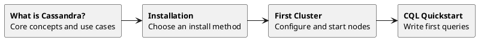

# Getting Started with Apache Cassandra

Getting Cassandra running takes about five minutes with Docker—the real learning curve is understanding how to use it effectively. Cassandra is not a drop-in replacement for PostgreSQL or MySQL; it requires a different mental model.

The core difference: in relational databases, the schema is designed first and queried as needed. In Cassandra, tables are designed around specific queries. This means denormalized tables, no JOINs, and knowing access patterns upfront. This is a trade-off—query flexibility is exchanged for predictable performance at any scale.

This guide walks through installation, initial configuration, and initial queries.

## Learning Path



## Quick Start Options

Choose the appropriate path:

### 5-Minute Quick Start (Docker)

Get Cassandra running in 5 minutes for development:

```bash
# Pull and run Cassandra
docker run --name cassandra -d -p 9042:9042 cassandra:latest

# Wait for startup (about 60 seconds)
sleep 60

# Connect with cqlsh
docker exec -it cassandra cqlsh
```

### Production Installation

For production deployments, follow our detailed guides:

1. **[Installation Overview](installation/index.md)** - Various installation methods
2. **[Cloud Deployment](../cloud/index.md)** - AWS, GCP, Azure

## Getting Started Guides

### 1. Understanding Cassandra

- **[What is Cassandra?](what-is-cassandra.md)**
  - Core concepts and terminology
  - When to use Cassandra
  - Cassandra vs other databases

### 2. Installation

- **[Installation Overview](installation/index.md)** - Various installation methods
  - [Cloud Providers](../cloud/index.md) - AWS, GCP, Azure

### 3. First Cluster Setup

- **[First Cluster Setup](first-cluster.md)**
  - Single-node development setup
  - Multi-node cluster configuration
  - Basic configuration options

### 4. CQL Quickstart

- **[CQL Tutorial](quickstart-cql.md)**
  - Connect to Cassandra
  - Create keyspaces and tables
  - Insert and query data
  - Basic operations

### 5. Connect the Application

- **[Driver Setup](drivers/index.md)** - Client drivers for various languages

### 6. Production Readiness

- **[Production Checklist](production-checklist.md)**
  - Hardware requirements
  - Configuration recommendations
  - Security setup
  - Monitoring setup

## Essential Concepts

Before diving in, familiarize yourself with these key concepts:

| Concept | Description |
|---------|-------------|
| **Cluster** | A collection of nodes that together store data |
| **Node** | A single Cassandra server instance |
| **Keyspace** | A namespace that defines data replication (like a database) |
| **Table** | A collection of rows with a defined schema |
| **Partition Key** | Determines which node stores the data |
| **Clustering Column** | Determines sort order within a partition |
| **Replication Factor** | Number of copies of data stored across nodes |
| **Consistency Level** | How many replicas must respond for a successful operation |

## Example: First 10 Minutes

Here is what can be accomplished in the first 10 minutes:

### 1. Start Cassandra (2 minutes)

```bash
# Using Docker
docker run --name my-cassandra -d -p 9042:9042 cassandra:5.0
```

### 2. Connect (1 minute)

```bash
# Wait for startup, then connect
docker exec -it my-cassandra cqlsh
```

### 3. Create a Keyspace (1 minute)

```sql
CREATE KEYSPACE my_app WITH replication = {
    'class': 'SimpleStrategy',
    'replication_factor': 1
};

USE my_app;
```

### 4. Create a Table (2 minutes)

```sql
CREATE TABLE users (
    user_id UUID PRIMARY KEY,
    username TEXT,
    email TEXT,
    created_at TIMESTAMP
);
```

### 5. Insert Data (2 minutes)

```sql
INSERT INTO users (user_id, username, email, created_at)
VALUES (uuid(), 'john_doe', 'john@example.com', toTimestamp(now()));

INSERT INTO users (user_id, username, email, created_at)
VALUES (uuid(), 'jane_smith', 'jane@example.com', toTimestamp(now()));
```

### 6. Query Data (2 minutes)

```sql
-- Get all users
SELECT * FROM users;

-- Get specific columns
SELECT username, email FROM users;
```

## Common Questions

### What is the minimum hardware for development?

For development, Cassandra can run with:
- 2 CPU cores
- 4GB RAM (8GB recommended)
- 10GB disk space

### Should I use SimpleStrategy or NetworkTopologyStrategy?

- **SimpleStrategy**: Only for single-datacenter, development/testing
- **NetworkTopologyStrategy**: Always use for production, even single DC

### What is the difference between cqlsh and CQLAI?

| Feature | cqlsh | CQLAI |
|---------|-------|-------|
| Language | Python | Go (single binary) |
| AI Query Generation | No | Yes |
| Tab Completion | Basic | Context-aware |
| Output Formats | Basic | Table, JSON, CSV, Parquet |
| Dependencies | Python required | None |

[Learn more about CQLAI](../tools/cqlai/index.md)

## Next Steps

After getting started:

1. **[Learn Data Modeling](../data-modeling/index.md)** - Design effective schemas
2. **[Understand Architecture](../architecture/index.md)** - How Cassandra works
3. **[Explore CQL](../cql/index.md)** - Full query language reference
4. **[Set Up Monitoring](../monitoring/index.md)** - Monitor the cluster

## Getting Help

- **[Troubleshooting Guide](../troubleshooting/index.md)** - Common issues and solutions
- **[AxonOps Community](https://axonops.com)** - Community support
- **[Apache Cassandra Slack](https://cassandra.apache.org/community/)** - Community chat
