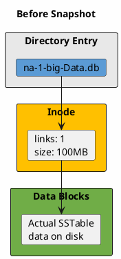
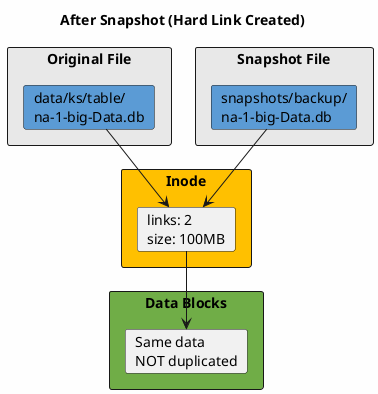
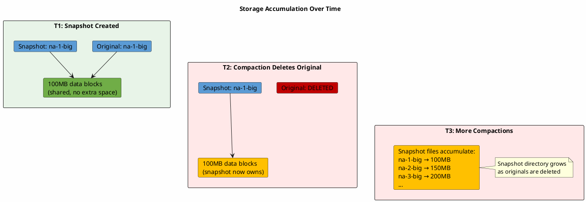
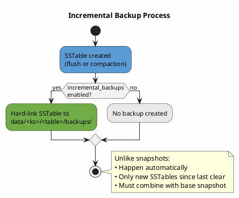

# Backup Procedures

This page covers the mechanics of Cassandra backups: how snapshots work, incremental backups, and commit log archiving.

---

## Snapshot Backups

### How Snapshots Work: POSIX Hard Links

The `nodetool snapshot` command creates snapshots using POSIX hard links, not file copies. Understanding hard links is essential for proper snapshot management.

**What is a hard link?**

In UNIX filesystems, files consist of two parts:

1. **Inode**: Metadata structure containing file attributes (size, permissions, timestamps) and pointers to data blocks on disk
2. **Directory entry**: A name pointing to an inode

A hard link is an additional directory entry pointing to the same inode. Multiple filenames can reference the same underlying data:





**Why hard links are efficient:**

| Aspect | Hard Link | File Copy |
|--------|-----------|-----------|
| Disk space used | 0 bytes (just directory entry) | Full file size |
| Creation time | Instantaneous | Proportional to file size |
| I/O impact | None | Heavy disk read/write |

A 1TB database can be snapshotted in milliseconds with zero additional disk space—initially.

### The Storage Accumulation Problem

Hard links share data blocks only while both links exist. When compaction deletes the original SSTable file, the snapshot's hard link becomes the sole owner of those data blocks:



**Consequence:** Snapshots that initially consumed zero space can grow to consume significant storage as compaction removes original files. A week-old snapshot may consume more disk space than the current live data.

**Best practice:** Clear snapshots promptly after copying to remote storage.

---

### Snapshot Commands

| Command | Description |
|---------|-------------|
| `nodetool flush` | Flush memtables to disk before snapshot |
| `nodetool snapshot` | Snapshot all keyspaces |
| `nodetool snapshot <keyspace>` | Snapshot specific keyspace |
| `nodetool snapshot -t <name> <keyspace>` | Named snapshot (recommended) |
| `nodetool snapshot -t <name> -kt <ks>.<table>` | Snapshot specific table |
| `nodetool listsnapshots` | List all snapshots |
| `nodetool clearsnapshot -t <name>` | Clear specific snapshot |
| `nodetool clearsnapshot` | Clear all snapshots |

### Snapshot Location

Snapshots are stored at:

```
/var/lib/cassandra/data/<keyspace>/<table-uuid>/snapshots/<snapshot_name>/
```

Each snapshot directory contains all SSTable components:

| File | Description |
|------|-------------|
| `*-Data.db` | Actual row data |
| `*-Index.db` | Partition index |
| `*-Filter.db` | Bloom filter |
| `*-Statistics.db` | SSTable metadata |
| `*-CompressionInfo.db` | Compression metadata |
| `*-TOC.txt` | Table of contents |
| `manifest.json` | Snapshot manifest |

---

## Automatic Snapshot Configuration

Cassandra provides automatic snapshot options in `cassandra.yaml`:

| Parameter | Default | Description |
|-----------|---------|-------------|
| `auto_snapshot` | true | Create snapshot before DROP KEYSPACE/TABLE |
| `snapshot_before_compaction` | false | Create snapshot before each compaction |

### auto_snapshot

When enabled, Cassandra automatically creates a snapshot before `DROP TABLE` or `DROP KEYSPACE` operations. This provides a safety net against accidental schema drops.

The automatic snapshot is stored at:
```
/var/lib/cassandra/data/<keyspace>/<table-uuid>/snapshots/dropped-<timestamp>-<table>/
```

These auto-snapshots must still be cleared manually to reclaim space.

### snapshot_before_compaction

**Warning:** This setting is for debugging only.

When enabled, creates a snapshot of SSTables before each compaction. Since compactions run frequently (potentially hundreds per day), this causes unbounded disk usage growth. Only enable temporarily when diagnosing compaction-related data issues.

---

## Incremental Backups

Incremental backups automatically hard-link each new SSTable to a `backups/` directory.

### Configuration

| Parameter | Default | Description |
|-----------|---------|-------------|
| `incremental_backups` | false | Hard-link new SSTables to backups directory |

Runtime commands:

| Command | Description |
|---------|-------------|
| `nodetool enablebackup` | Enable incremental backups |
| `nodetool disablebackup` | Disable incremental backups |
| `nodetool statusbackup` | Check incremental backup status |

### How Incremental Backups Work



### Incremental Backup Location

```
/var/lib/cassandra/data/<keyspace>/<table-uuid>/backups/
```

### Incremental Backup Strategy

| Day | Action |
|-----|--------|
| 0 | Full snapshot → copy to remote → clear backups directory |
| 1 | Incremental accumulates → copy to remote → clear directory |
| 2 | Incremental accumulates → copy to remote → clear directory |
| ... | ... |
| 7 | New full snapshot → copy to remote → clear backups |

Restore requires: Base snapshot + all incrementals since that snapshot.

---

## Commit Log Archiving

Commit log archiving enables point-in-time recovery (PITR) by preserving all writes.

### Configuration

The `commitlog_archiving` section in `cassandra.yaml`:

| Parameter | Description |
|-----------|-------------|
| `enabled` | Enable commit log archiving |
| `archive_command` | Command to archive completed commit log segments |
| `restore_command` | Command to restore commit logs during PITR |
| `restore_directories` | Directory containing archived commit logs |
| `restore_point_in_time` | Target time for PITR restore |

Placeholders for commands:
- `%path` - Full path to commit log file
- `%name` - Commit log filename only

### Storage Considerations

Commit logs are generated continuously. Storage requirements depend on write throughput:

| Write Rate | Commit Log Generation | Daily Storage |
|------------|----------------------|---------------|
| 1,000 writes/sec | ~50 MB/hour | ~1.2 GB |
| 10,000 writes/sec | ~500 MB/hour | ~12 GB |
| 100,000 writes/sec | ~5 GB/hour | ~120 GB |

Plan retention based on RPO requirements and storage capacity.

---

## Multi-DC Backup Considerations

| Consideration | Recommendation |
|---------------|----------------|
| Which DC to backup | Choose one DC only—data is replicated |
| DC selection | DC closest to backup storage location |
| Timing | Stagger backups across nodes |
| Consistency | Ensure RF covers the backup DC |

### Why Stagger Backups

Taking snapshots on all nodes simultaneously causes:

- I/O spikes across all nodes
- Network congestion during transfer to remote storage
- Resource contention affecting production workloads

Stagger snapshots across nodes (e.g., 10-minute intervals) to distribute load.

---

## Backup Monitoring

### Key Metrics

| Metric | Alert Threshold |
|--------|-----------------|
| Last successful backup age | > 36 hours |
| Backup size deviation | > 50% from baseline |
| Backup storage free space | < 20% |
| Local snapshot disk usage | Growing unexpectedly |
| Incremental backup count | Accumulating (not being cleared) |

### Verification Requirements

A backup that has never been tested is not a backup.

| Check | Description |
|-------|-------------|
| SSTable completeness | Each Data.db has matching Index.db, Filter.db, Statistics.db |
| Schema included | Schema export present with backup |
| File integrity | No truncated or corrupted files |
| Restore success | Actually restore to staging environment |

---

## Related Documentation

- **[Backup and Restore Overview](index.md)** - Why backups are necessary, disaster scenarios, RPO/RTO
- **[Restore Guide](restore.md)** - Failure scenarios and recovery approaches
