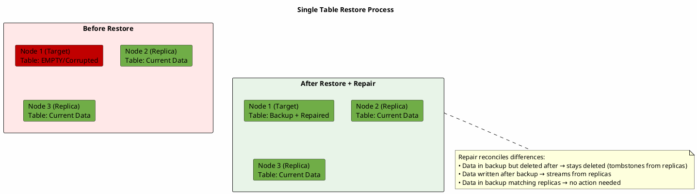
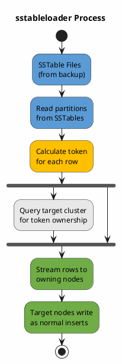
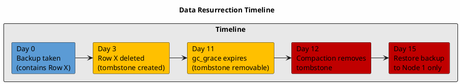
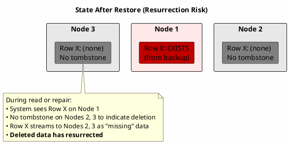

# Restore Guide

Restoring a Cassandra cluster requires understanding both the failure scenario and the appropriate recovery method. The correct approach depends on:

- **Scope of failure**: Single table, single node, rack, datacenter, or entire cluster
- **Availability of replicas**: Whether healthy replicas exist to stream data from
- **Backup age**: Whether the backup is within `gc_grace_seconds` (default 10 days)
- **Topology match**: Whether source and target clusters have the same token assignments

This guide covers each failure scenario, the decision factors involved, and the restore methods available.

---

## Data Directory Structure

Understanding Cassandra's data directory structure is essential for correct file placement during restore.

### Directory Layout

```
/var/lib/cassandra/data/
├── system/                           ← System keyspace
│   ├── local-7ad54392bcdd35a684174e047860b377/
│   ├── peers_v2-c4325fec8a5a3595bd614e9f3c27c461/
│   └── ...
├── system_schema/                    ← Schema definitions
│   ├── tables-afddfb9dbc1e30688056eed6c302ba09/
│   ├── columns-24101c25a2ae3af787c1b40ee1aca33f/
│   └── ...
├── my_keyspace/                      ← User keyspace
│   ├── users-a1b2c3d4e5f6g7h8i9j0k1l2/     ← Table directory
│   │   ├── na-1-big-Data.db
│   │   ├── na-1-big-Index.db
│   │   ├── na-1-big-Filter.db
│   │   └── ...
│   └── orders-m3n4o5p6q7r8s9t0u1v2w3x4/
│       └── ...
└── another_keyspace/
    └── ...
```

### Table Directory Naming

Each table directory follows the pattern:

```
<table_name>-<table_uuid>
```

| Component | Description | Example |
|-----------|-------------|---------|
| Table name | The table name as defined in schema | `users` |
| Separator | Hyphen | `-` |
| Table UUID | 32-character unique identifier | `a1b2c3d4e5f6g7h8i9j0k1l2` |

The UUID is assigned when the table is created and is stored in `system_schema.tables`. This UUID is critical for restore operations.

### Why the UUID Matters

The table UUID links the physical files to the schema definition:

```
Schema (system_schema.tables):
┌─────────────────────────────────────────────────────────┐
│ keyspace_name │ table_name │ id                         │
├───────────────┼────────────┼────────────────────────────┤
│ my_keyspace   │ users      │ a1b2c3d4-e5f6-g7h8-...    │
└─────────────────────────────────────────────────────────┘
                                        │
                                        ▼
Data Directory:
/var/lib/cassandra/data/my_keyspace/users-a1b2c3d4e5f6g7h8i9j0k1l2/
```

If the UUID in the directory name does not match the UUID in `system_schema.tables`, Cassandra will not recognize the files.

---

## File Placement During Restore

The correct file placement depends on whether the schema already exists on the target.

### Scenario A: Schema Already Exists

When restoring to a running cluster where the table schema exists (e.g., after `TRUNCATE` or data corruption):

**The table directory already exists with its UUID.** SSTable files must be placed in this existing directory.

| Step | Action |
|------|--------|
| 1 | Identify existing table directory with its UUID |
| 2 | Copy SSTable files from backup into this directory |
| 3 | Set correct file ownership |
| 4 | Run `nodetool refresh` to load the files |

**Finding the existing table directory:**

The table directory is located at:
```
/var/lib/cassandra/data/<keyspace>/<table>-<uuid>/
```

Since the table name is known but the UUID may not be, locate it by listing the keyspace directory. There will be only one directory starting with the table name.

**Important:** Do not create a new directory with a different UUID. The files must go into the existing directory that matches the schema.

### Scenario B: Schema Does Not Exist (Table Was Dropped)

When the table was dropped and must be recreated:

| Step | Action |
|------|--------|
| 1 | Recreate the table using the original schema |
| 2 | A new table directory is created with a **new UUID** |
| 3 | Copy SSTable files from backup into the new directory |
| 4 | Set correct file ownership |
| 5 | Run `nodetool refresh` to load the files |

**Critical consideration:** The new table has a different UUID than the backup. This works because:
- SSTable files contain the data, not references to table UUIDs
- `nodetool refresh` loads SSTables into whatever table directory they reside in
- The schema (column definitions, types, clustering order) must match exactly

**Schema compatibility requirements:**

| Schema Element | Requirement |
|----------------|-------------|
| Column names | Must match exactly |
| Column types | Must match exactly |
| Primary key | Must match exactly |
| Clustering order | Must match exactly |
| Table options | Should match (compression, compaction, etc.) |

If the schema differs, the restore will fail or produce corrupt/unreadable data.

### Scenario C: Full Node Restore (Before Cassandra Starts)

When restoring an entire node from backup before starting Cassandra:

| Step | Action |
|------|--------|
| 1 | Ensure Cassandra is stopped |
| 2 | Copy entire data directory structure from backup |
| 3 | Set correct file ownership recursively |
| 4 | Start Cassandra |

**Directory structure must be preserved exactly:**

```
Backup structure:
/backup/node1/
├── system/
│   └── ...
├── system_schema/
│   └── ...
├── my_keyspace/
│   └── users-a1b2c3d4e5f6g7h8i9j0k1l2/
│       └── ...

Restore to:
/var/lib/cassandra/data/
├── system/
│   └── ...
├── system_schema/
│   └── ...
├── my_keyspace/
│   └── users-a1b2c3d4e5f6g7h8i9j0k1l2/
│       └── ...
```

When restoring `system_schema` along with data directories, the UUIDs will match because the schema came from the same backup.

### Scenario D: Restore to Different Cluster

When restoring to a cluster with different schema (different table UUIDs):

**Direct file copy will not work.** The target cluster has different table UUIDs in its schema.

Options:

| Option | Description |
|--------|-------------|
| Use `sstableloader` | Streams data to correct locations automatically |
| Match UUIDs manually | Copy `system_schema` from source (complex, not recommended) |
| Recreate schema, copy files | Works if schema matches exactly (see Scenario B) |

`sstableloader` is the recommended approach—it reads SSTables and streams rows to the correct nodes regardless of table UUIDs or token assignments.

---

## File Ownership and Permissions

Restored files must have correct ownership for Cassandra to read them.

| Requirement | Value |
|-------------|-------|
| Owner | `cassandra` (or configured user) |
| Group | `cassandra` (or configured group) |
| Permissions | Files: 644, Directories: 755 (typical) |

After copying files, set ownership recursively on the restored directories.

**Common mistake:** Copying files as root and forgetting to change ownership. Cassandra will fail to read the files and may not log a clear error.

---

## SSTable File Components

When restoring, all components of each SSTable must be present:

| File Suffix | Purpose | Required |
|-------------|---------|----------|
| `-Data.db` | Row data | Yes |
| `-Index.db` | Partition index | Yes |
| `-Filter.db` | Bloom filter | Yes |
| `-Statistics.db` | SSTable metadata | Yes |
| `-CompressionInfo.db` | Compression offsets | If compressed |
| `-Digest.crc32` | Checksum | Yes |
| `-TOC.txt` | Component listing | Yes |
| `-Summary.db` | Index summary | Pre-4.0 |

**All components share the same prefix** (e.g., `na-1-big-`). If any required component is missing, the SSTable cannot be loaded.

---

## Failure Scenarios and Recovery Approaches

### Scenario 1: Single Table on Single Node

**Situation:** Accidental `TRUNCATE`, localized data corruption, or need to recover specific table data. Other replicas are healthy and contain current data.

#### Prerequisites

| Requirement | Details |
|-------------|---------|
| Backup age | Must be < `gc_grace_seconds` (default 10 days) to avoid data resurrection |
| Schema state | Table must exist with matching schema, or schema must be recreated first |
| Token ownership | Backup SSTables must originate from this node's token range |
| Disk space | Sufficient space for restored SSTables plus compaction overhead |

#### Understanding the Restore

When restoring a single table to a single node:



#### If Table Was Truncated

`TRUNCATE` removes all data but preserves the table schema. The table directory and UUID remain the same.

| Component | State After TRUNCATE |
|-----------|---------------------|
| Schema | Preserved |
| Table UUID | Preserved |
| Data directory | Exists but empty |
| SSTables | Deleted |

Restore process:
1. Copy backup SSTables to existing table directory
2. Run `nodetool refresh`
3. Run repair to reconcile with replicas

#### If Table Was Dropped

`DROP TABLE` removes the schema and all data. If `auto_snapshot` was enabled (default), a snapshot exists.

| Component | State After DROP |
|-----------|-----------------|
| Schema | Removed from cluster |
| Table UUID | No longer exists |
| Data directory | Deleted (or in snapshot) |
| SSTables | Deleted (or in snapshot) |

Restore process:
1. Recreate table schema (must match original exactly)
2. New table directory created with new UUID
3. Copy backup SSTables to new directory
4. Run `nodetool refresh`
5. Run repair to reconcile

**Schema matching requirement:** The restored SSTables were written with a specific schema. If the recreated schema differs (different column types, missing columns, different clustering order), the restore will fail or produce corrupt data.

#### Post-Restore Behavior

After `nodetool refresh` loads the SSTables:

| Event | Result |
|-------|--------|
| Read request for restored data | Data served from restored SSTables |
| Read repair triggered | Compares with replicas, reconciles differences |
| Explicit repair run | Full reconciliation with replicas |
| Compaction | Restored SSTables compacted normally |

**Recommendation:** Run `nodetool repair` on the restored table to ensure full consistency with replicas.

---

### Scenario 2: Single Node Failure

**Situation:** Complete node loss due to hardware failure, disk corruption, VM termination, or need to replace infrastructure.

#### Failure Types and Implications

| Failure Type | Data State | Recovery Options |
|--------------|------------|------------------|
| Disk failure (data only) | Lost | Rebuild or restore |
| Disk failure (OS + data) | Lost | Replace node, rebuild or restore |
| Memory/CPU failure | Intact on disk | Repair disk, restart |
| VM terminated (ephemeral) | Lost | Rebuild or restore |
| VM terminated (persistent) | Intact on volume | Reattach, restart |
| Corruption detected | Partially intact | Depends on extent |

#### Option A: Rebuild from Replicas

The cluster reconstructs the node's data by streaming from other replicas. No backup required.

**When to choose rebuild:**

| Factor | Favors Rebuild |
|--------|----------------|
| Backup availability | No recent backup available |
| Data freshness | Need current data, not point-in-time |
| Cluster capacity | Other nodes can handle streaming load |
| Network bandwidth | Sufficient for data transfer |

**Process overview:**

1. Provision replacement node with same IP address
2. Configure with same tokens (or use `auto_bootstrap`)
3. Start Cassandra—node joins cluster
4. Data streams from replicas automatically
5. Run repair after streaming completes

**Token assignment considerations:**

| Approach | When to Use |
|----------|-------------|
| Same tokens | Replacing failed node, want predictable data distribution |
| auto_bootstrap | Joining as "new" node, cluster rebalances |
| replace_address | Taking over dead node's tokens without full bootstrap |

**Using replace_address:**

When a node fails and cannot be restarted, use `replace_address` to have the replacement node assume the dead node's tokens:

Configure in cassandra.yaml or JVM options:
```
-Dcassandra.replace_address=<dead_node_ip>
```

The replacement node streams data for the dead node's token ranges from replicas.

#### Option B: Restore from Backup

Copy the node's backup to local storage before starting Cassandra.

**When to choose restore:**

| Factor | Favors Restore |
|--------|----------------|
| Cluster load | Other nodes already stressed |
| Data volume | Large dataset would take hours to stream |
| Network constraints | Limited bandwidth between nodes |
| Backup recency | Recent backup available locally |

**Process overview:**

1. Provision replacement node
2. Copy backup files to data directories (before starting Cassandra)
3. Set correct file ownership
4. Start Cassandra
5. Run repair to synchronize changes since backup

**Directory structure for restore:**

```
/var/lib/cassandra/data/
├── system/                     ← System tables (restore recommended)
├── system_schema/              ← Schema tables (restore recommended)
├── <keyspace>/
│   └── <table>-<uuid>/
│       ├── na-1-big-Data.db
│       ├── na-1-big-Index.db
│       └── ...
```

**What to restore:**

| Directory | Restore? | Notes |
|-----------|----------|-------|
| User keyspaces | Yes | Primary data |
| system | Optional | Local node state, can regenerate |
| system_schema | Yes | Required for schema consistency |
| system_auth | Yes | If using internal authentication |
| system_distributed | Optional | Repair history, can regenerate |
| system_traces | No | Trace data, not critical |

#### Option C: Hybrid Approach

Restore from backup to get the node online quickly, then repair to synchronize.

```
Timeline comparison:

Full Rebuild:
|─────── Streaming (hours) ───────|── Repair ──|
                                              ↑ Node serving reads

Hybrid (Restore + Repair):
|── Restore ──|── Repair ──|
              ↑ Node serving reads (with backup data)
```

The hybrid approach gets the node serving reads faster, though initially with potentially stale data.

---

### Scenario 3: Rack Failure

**Situation:** Multiple nodes fail simultaneously due to shared infrastructure failure (top-of-rack switch, PDU, cooling zone).

#### Prerequisites for Recovery

| Requirement | Details |
|-------------|---------|
| Rack-aware replication | `NetworkTopologyStrategy` with rack configuration |
| Sufficient RF | RF ≥ number of racks for full redundancy |
| Other racks healthy | At least one complete replica set available |

#### Verifying Rack-Aware Placement

Before a failure occurs, verify that data is distributed across racks:

| Check | Expected Result |
|-------|-----------------|
| `nodetool status` | Shows rack assignments for all nodes |
| Keyspace RF | Matches or exceeds rack count |
| Data distribution | Each rack has replica for all token ranges |

If RF < rack count, some data may exist on only one rack, making rack failure cause data unavailability.

#### Recovery Approaches

| Approach | When to Use |
|----------|-------------|
| Wait for rack recovery | Hardware issue temporary, data intact |
| Rebuild from other racks | No backup, other racks have data |
| Restore from backup | Minimize load on surviving racks |

#### Parallel Restore Coordination

When restoring multiple nodes simultaneously:

| Consideration | Recommendation |
|---------------|----------------|
| Restore order | Can restore all nodes in parallel |
| Startup sequence | Start nodes after all restores complete |
| Repair coordination | Stagger repairs to avoid overload |

**Repair strategy for rack restore:**

| Option | Description |
|--------|-------------|
| Sequential repair | One node at a time, minimal impact |
| Parallel with `-pr` | Each node repairs only primary range |
| Subrange repair | Divide ranges for finer control |

Using `-pr` (primary range only) prevents redundant work when repairing multiple nodes:

```
Without -pr:
Node 1 repairs: A, B, C (including replicas)
Node 2 repairs: A, B, C (overlapping work)
Node 3 repairs: A, B, C (overlapping work)

With -pr:
Node 1 repairs: A (primary only)
Node 2 repairs: B (primary only)
Node 3 repairs: C (primary only)
```

---

### Scenario 4: Datacenter Failure

**Situation:** Complete loss of a datacenter due to major disaster, facility failure, or regional outage.

#### Single-DC Cluster: Full Restore Required

With only one datacenter, all data must come from backups. No replicas exist elsewhere.

**Critical requirements:**

| Requirement | Details |
|-------------|---------|
| Complete backup set | Backups from all nodes at consistent point |
| Schema backup | Must restore before data |
| Configuration backup | cassandra.yaml, JVM settings for each node |
| Topology information | Token assignments, rack layout |

**Restore sequence:**

| Step | Action | Notes |
|------|--------|-------|
| 1 | Provision infrastructure | Same or new hardware |
| 2 | Configure Cassandra | Same tokens, same cluster name |
| 3 | Restore schema | On one node, schema replicates |
| 4 | Restore data to all nodes | Parallel restore |
| 5 | Start all nodes | Coordinate startup |
| 6 | Verify cluster | `nodetool status`, data queries |

**Token assignment for full restore:**

| Approach | When to Use |
|----------|-------------|
| Same tokens as original | Restoring to same topology |
| New tokens | Restoring to different topology, use sstableloader |

If restoring with original tokens, SSTables can be copied directly. If tokens differ, data must be loaded via `sstableloader` for remapping.

**Schema restoration:**

The schema must be restored before data loading. Schema is stored in `system_schema` keyspace and replicates automatically once one node has it.

Options:
- Restore `system_schema` directory from backup
- Execute saved schema CQL (from `DESC SCHEMA` output)

#### Multi-DC Cluster: Rebuild or Restore

With surviving datacenters, multiple recovery options exist.

**Rebuild from surviving DC:**

| Advantage | Disadvantage |
|-----------|--------------|
| Gets current data | High network traffic |
| No backup required | Loads surviving DC heavily |
| Simpler process | May take hours for large datasets |

Uses `nodetool rebuild <source_dc>` on each restored node.

**Restore from backup + repair:**

| Advantage | Disadvantage |
|-----------|--------------|
| Minimal impact on surviving DC | Requires recent backup |
| Faster initial availability | Data initially stale |
| Predictable load | More complex process |

**Choosing between approaches:**

| Factor | Favors Rebuild | Favors Restore |
|--------|----------------|----------------|
| Surviving DC capacity | High | Low (already stressed) |
| Data volume | Small to medium | Large |
| Backup availability | None available | Recent backup exists |
| Network bandwidth | High | Limited |
| RTO requirements | Flexible | Aggressive |

#### Cross-DC Network Considerations

Rebuilding a datacenter streams significant data across the WAN:

| Data Volume | Estimated Time (100 Mbps) | Estimated Time (1 Gbps) |
|-------------|---------------------------|------------------------|
| 100 GB | ~2.5 hours | ~15 minutes |
| 1 TB | ~25 hours | ~2.5 hours |
| 10 TB | ~10 days | ~25 hours |

Consider:
- Time of day (avoid peak traffic)
- Throttling to prevent network saturation
- Impact on production traffic sharing the link

---

### Scenario 5: Point-in-Time Recovery (PITR)

**Situation:** Need to restore the cluster to a specific moment in time, typically to recover from data corruption or accidental bulk deletion that affected all replicas.

#### When PITR is Necessary

| Situation | Why Regular Restore Fails |
|-----------|---------------------------|
| Application bug wrote bad data | Bad data replicated everywhere |
| Bulk DELETE ran too broadly | Deletions replicated everywhere |
| Ransomware encrypted data | Encryption replicated everywhere |
| Need exact transaction state | Regular snapshot may be before or after |

#### PITR Components

| Component | Purpose | Storage Location |
|-----------|---------|------------------|
| Base snapshot | Starting point for replay | Remote backup storage |
| Commit logs | Record of all writes since snapshot | Archive storage |
| Target timestamp | Desired recovery point | Administrator-specified |

**Commit log archiving must be configured before the incident.** PITR is not possible without archived commit logs.

#### How Commit Log Replay Works

```
Timeline:
├── Snapshot taken (Day 1, 00:00)
│   └── Commit logs archived continuously
├── Normal operations (Day 1-3)
│   └── Commit logs archived continuously
├── Data corruption event (Day 3, 14:30)
│   └── Commit logs archived continuously
└── PITR initiated (Day 3, 16:00)
    └── Target: Day 3, 14:00 (before corruption)

Replay process:
1. Restore snapshot (Day 1, 00:00 state)
2. Replay commit logs from Day 1, 00:00 to Day 3, 14:00
3. Stop replay at target timestamp
4. Cluster now reflects Day 3, 14:00 state
```

#### PITR Configuration

The `commitlog_archiving` section in cassandra.yaml controls PITR:

| Parameter | Purpose |
|-----------|---------|
| `restore_point_in_time` | Target timestamp for recovery |
| `restore_directories` | Path to archived commit logs |
| `restore_command` | Command to retrieve commit logs |

**Timestamp format:** `yyyy-MM-dd HH:mm:ss`

Example: `2024-01-15 14:00:00`

#### PITR Limitations

| Limitation | Implication |
|------------|-------------|
| Cluster-wide only | Cannot PITR a single table or keyspace |
| All nodes required | Every node must restore to same point |
| Commit log continuity | Gaps in archived logs = incomplete recovery |
| Storage requirements | Must retain all commit logs since last usable snapshot |
| gc_grace_seconds | Target time must be within gc_grace window |
| Processing time | Replay can take significant time for large log volumes |

#### Commit Log Storage Requirements

Commit logs accumulate continuously. Storage planning:

| Write Rate | Daily Volume | 7-Day Retention | 30-Day Retention |
|------------|--------------|-----------------|------------------|
| 1,000/sec | ~1.2 GB | ~8.4 GB | ~36 GB |
| 10,000/sec | ~12 GB | ~84 GB | ~360 GB |
| 100,000/sec | ~120 GB | ~840 GB | ~3.6 TB |

Multiply by node count for cluster-wide storage.

---

### Scenario 6: Migration to Different Cluster (Same Topology)

**Situation:** Moving data to new infrastructure with identical node count, or creating a staging environment from production.

#### Determining Token Compatibility

Before choosing a restore method, compare token assignments:

| Scenario | Token State | Recommended Method |
|----------|-------------|-------------------|
| Same tokens, same node count | Compatible | Direct file copy + refresh |
| Different tokens, same node count | Incompatible | sstableloader |
| Intentionally matching | Made compatible | Direct file copy + refresh |

**Checking token assignments:**

Compare `nodetool ring` output between clusters. Tokens must match exactly for direct file copy.

#### Direct File Copy (Matching Tokens)

When tokens match, SSTables can be copied directly because each node's backup contains exactly the data that node should own.

**Process:**

| Step | Action |
|------|--------|
| 1 | Verify token match between clusters |
| 2 | Restore schema on target cluster |
| 3 | Copy node1-source backup → node1-target |
| 4 | Copy node2-source backup → node2-target |
| 5 | ... (repeat for all nodes) |
| 6 | Run `nodetool refresh` on each node |

**Advantages:**
- Fastest possible restore method
- No data streaming or remapping
- Minimal resource usage

**Requirements:**
- Exact token match
- Same node count
- Schema pre-created on target

#### Using sstableloader (Non-Matching Tokens)

When tokens differ, sstableloader reads each SSTable and streams rows to their correct owners in the target cluster.

**Why tokens might differ:**

| Reason | Explanation |
|--------|-------------|
| Default token assignment | Cassandra generates random tokens |
| Different num_tokens | Different virtual node count |
| Cluster created independently | No coordination of token ranges |

See Scenario 7 for detailed sstableloader usage.

---

### Scenario 7: Migration to Different Cluster (Different Topology)

**Situation:** Moving data to a cluster with different node count, different replication factor, or completely different architecture.

#### When sstableloader is Required

| Source | Target | Method Required |
|--------|--------|-----------------|
| 6 nodes | 6 nodes, different tokens | sstableloader |
| 6 nodes | 12 nodes | sstableloader |
| 6 nodes | 3 nodes | sstableloader |
| RF=3 | RF=5 | sstableloader |
| Single DC | Multi DC | sstableloader |

#### How sstableloader Works



#### sstableloader Options

| Option | Purpose |
|--------|---------|
| `-d <hosts>` | Contact points in target cluster |
| `-u <username>` | Authentication username |
| `-pw <password>` | Authentication password |
| `--throttle <MB/s>` | Limit streaming bandwidth |
| `-f <config>` | Path to cassandra.yaml for SSL settings |
| `--connections-per-host <n>` | Parallel connections per node |

#### Performance Considerations

| Factor | Impact | Mitigation |
|--------|--------|------------|
| Network bandwidth | Primary bottleneck | Use `--throttle`, run from multiple sources |
| Target cluster load | Writes increase | Run during off-peak, throttle |
| Compaction on target | CPU and I/O spike | Monitor, may need to pause |
| Memory on loader | Holds data in transit | Ensure sufficient heap |

#### Parallelizing sstableloader

For large datasets, run sstableloader from multiple sources simultaneously:

```
Source cluster nodes:
├── Node 1: Load keyspace1, keyspace2
├── Node 2: Load keyspace3, keyspace4
└── Node 3: Load keyspace5, keyspace6

Each node loads its local backup in parallel.
Target cluster receives streams from all sources.
```

**Coordination considerations:**

| Aspect | Recommendation |
|--------|----------------|
| Total throughput | Sum of all loaders, may need throttling |
| Contact points | Distribute across target nodes |
| Monitoring | Watch target cluster metrics |
| Failure handling | Loader failure = restart that loader only |

#### Schema Considerations

The target cluster must have matching schema before loading data:

| Schema Aspect | Requirement |
|---------------|-------------|
| Keyspace | Must exist with appropriate replication |
| Table | Must exist with matching structure |
| Column types | Must match source exactly |
| Clustering order | Must match source exactly |
| Indexes | Recreate after data load (faster) |
| MVs | Recreate after data load (will rebuild) |

**Recommendation:** Export schema from source (`DESC SCHEMA`), apply to target before loading.

---

## Restore Decision Matrix

Quick reference for choosing a restore approach:

| Scenario | Backup Age | Replicas Available | Recommended Approach |
|----------|------------|-------------------|---------------------|
| Single table | < gc_grace | Yes | Copy + refresh + repair |
| Single table | > gc_grace | Yes | Restore to ALL nodes or accept resurrection |
| Single node | < gc_grace | Yes | Restore + repair or rebuild |
| Single node | > gc_grace | Yes | Rebuild from replicas preferred |
| Rack | Any | Yes (other racks) | Restore parallel + staggered repair |
| Datacenter (multi-DC) | Any | Yes (other DC) | Rebuild or restore + repair |
| Datacenter (single-DC) | Any | No | Full restore, must have backup |
| Full cluster | Any | No | Full restore, same point-in-time |
| PITR | Within gc_grace | N/A | Snapshot + commit log replay |
| Migration (same topo) | N/A | N/A | Direct copy if tokens match |
| Migration (diff topo) | N/A | N/A | sstableloader required |

---

## The gc_grace_seconds Constraint

The `gc_grace_seconds` parameter (default: 10 days) fundamentally constrains restore options.

#### Why gc_grace_seconds Exists

Cassandra uses tombstones (deletion markers) instead of immediately removing data. Tombstones must propagate to all replicas before being removed, or deleted data can "resurrect."

| Phase | Duration | State |
|-------|----------|-------|
| Delete issued | T=0 | Tombstone created |
| Tombstone propagation | T=0 to gc_grace | Tombstone on all replicas |
| Tombstone removal eligible | T > gc_grace | Compaction can remove tombstone |
| Tombstone removed | After compaction | No record deletion occurred |

#### The Resurrection Problem





#### Safe Restore Practices

| Backup Age | Scope | Safe? | Notes |
|------------|-------|-------|-------|
| < gc_grace | Single node | Yes | Tombstones still exist on replicas |
| < gc_grace | Single table | Yes | Tombstones still exist on replicas |
| < gc_grace | Full cluster | Yes | All nodes at same state |
| > gc_grace | Single node | No | Resurrection risk |
| > gc_grace | Single table | No | Resurrection risk |
| > gc_grace | Full cluster | Yes | All nodes at same state, no conflict |

#### Checking gc_grace_seconds

Default is 864000 seconds (10 days).

Per-table setting viewable via:
- Schema: `DESC TABLE keyspace.table`
- System tables: Query `system_schema.tables`

#### Strategies for Old Backups

If restoring a backup older than gc_grace_seconds:

| Option | Description | Trade-off |
|--------|-------------|-----------|
| Full cluster restore | Restore all nodes from same backup | Lose data newer than backup |
| Accept resurrection | Restore anyway, deal with resurrected data | May have data inconsistency |
| Increase gc_grace first | Set higher gc_grace, wait for propagation, then restore | Complex, delays restore |
| Manual cleanup | Restore, identify resurrected data, delete again | Labor intensive |

---

## Restore Methods Reference

### nodetool refresh

**Purpose:** Load SSTables from disk into a running Cassandra node.

**How it works:**
1. Scans table's data directory for SSTable files not yet loaded
2. Adds new SSTables to the table's live SSTable set
3. Data immediately available for reads
4. No streaming—purely local operation

**Requirements:**
- Cassandra must be running
- SSTables must be in correct table directory
- File ownership must be correct (cassandra:cassandra)
- SSTables must belong to this node's token range

**Limitations:**
- Does not remap data to different token ranges
- Does not validate SSTable integrity
- Does not trigger repair

### nodetool rebuild

**Purpose:** Stream all data for the local node's token ranges from another datacenter.

**How it works:**
1. Contacts specified source datacenter
2. Identifies all token ranges owned locally
3. Streams data for those ranges from source DC
4. Writes received data as local SSTables

**When to use:**
- Rebuilding a datacenter from surviving DC
- Adding a new datacenter to existing cluster
- No backup available but other DC has data

**Requirements:**
- At least one other datacenter with complete data
- Network connectivity to source DC
- Sufficient bandwidth for data volume

### sstableloader

**Purpose:** Stream SSTable data to a cluster with automatic token-based routing.

**How it works:**
1. Reads SSTable files from specified directory
2. Contacts target cluster for token ring information
3. For each partition, calculates owning nodes
4. Streams data to appropriate nodes
5. Target nodes write data normally

**When to use:**
- Migrating between clusters with different topologies
- Restoring when token assignments don't match
- Loading data from any source to any target

**Considerations:**
- Slower than direct copy (full streaming)
- Target cluster experiences write load
- May trigger compaction on target nodes
- Schema must exist before loading

### Direct File Copy

**Purpose:** Copy SSTable files directly to data directory for fastest possible restore.

**How it works:**
1. Copy SSTable files to table directory
2. Set correct ownership
3. Use `nodetool refresh` to load

**When to use:**
- Restoring to same node or identical topology
- Token ranges match exactly between source and target
- Maximum restore speed required

**Requirements:**
- Exact token match between source and target
- Correct directory structure
- Correct file permissions
- Schema must exist

---

## Post-Restore Verification

### Immediate Verification

| Check | Purpose | Method |
|-------|---------|--------|
| Cluster status | All nodes joined | `nodetool status` |
| Table accessible | Schema correct | Query table |
| Data present | Rows exist | `SELECT COUNT(*)` or sample queries |
| No errors in logs | Clean startup | Check system.log |

### Consistency Verification

| Check | Purpose | Method |
|-------|---------|--------|
| Run repair | Synchronize replicas | `nodetool repair` |
| Verify data | SSTable integrity | `nodetool verify` |
| Compare counts | Expected vs actual | Application-level checks |

### Application-Level Verification

| Check | Purpose |
|-------|---------|
| Known record queries | Verify specific expected data |
| Application health checks | End-to-end functionality |
| Integration tests | Full application flow |
| User acceptance | Business validation |

---

## Related Documentation

- **[Backup and Restore Overview](index.md)** - Why backups are necessary, disaster scenarios, RPO/RTO
- **[Backup Procedures](backup.md)** - Snapshots, incremental backups, commit log archiving
