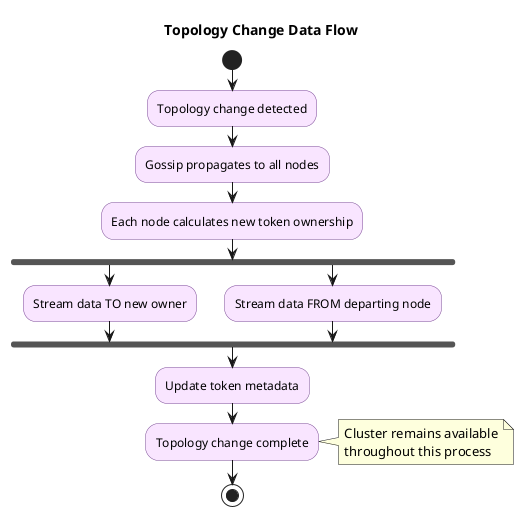

# Cluster Management Operations

This guide covers operational procedures for managing Cassandra cluster topology: adding capacity, removing nodes, replacing failed hardware, and maintaining cluster health.

!!! info "No Single Point of Failure"
    Cassandra's peer-to-peer architecture enables online topology changes. Every node knows the cluster state through gossip, and token ranges determine data ownership. Topology changes trigger automatic data streaming in the background while the cluster continues serving traffic.

---

## Understanding Topology Changes

### How Cassandra Handles Topology Changes

When cluster membership changes, Cassandra automatically redistributes data:



### Token Ownership and Streaming

| Scenario | Data Movement | Cleanup Required |
|----------|---------------|------------------|
| Add node | Existing nodes stream data to new node | Yes, on existing nodes |
| Remove node (decommission) | Departing node streams to remaining nodes | No |
| Remove node (dead) | Remaining nodes stream among themselves | No |
| Replace node | Remaining nodes stream to replacement | No |

!!! warning "Always Run Cleanup After Adding Nodes"
    After adding nodes, existing nodes retain copies of data they no longer own. Run `nodetool cleanup` on each existing node to reclaim disk space. Schedule this during low-traffic periods as cleanup involves reading and rewriting SSTables.

---

## Cluster Operations Overview

| Operation | When to Use | Command/Method | Impact |
|-----------|-------------|----------------|--------|
| **Add node** | Scaling capacity | Start new node with proper config | Streaming ~hours |
| **Decommission** | Graceful removal (node up) | `nodetool decommission` | Streaming ~hours |
| **Remove node** | Forced removal (node down) | `nodetool removenode` | Streaming ~hours |
| **Replace node** | Hardware replacement | `replace_address_first_boot` | Streaming ~hours |
| **Move token** | Rebalancing (rarely needed) | `nodetool move` | Streaming |
| **Cleanup** | After adding nodes | `nodetool cleanup` | I/O intensive |
| **Assassinate** | Last resort (stuck node) | `nodetool assassinate` | Immediate |

---

## Adding Nodes

### Pre-flight Checklist

Before adding a node, verify:

- [ ] Same Cassandra version as existing cluster
- [ ] Same JDK version and vendor
- [ ] Adequate disk space (check existing node usage)
- [ ] Network connectivity to all existing nodes (storage port 7000, native port 9042)
- [ ] Firewall rules configured
- [ ] NTP synchronized across all nodes
- [ ] Seed nodes identified (use 2-3 existing stable nodes)

### Adding a Single Node

**Step 1: Prepare the new node**

```bash
# Install Cassandra (same version as cluster)
# Configure cassandra.yaml

cluster_name: 'Production'           # Must match existing cluster
num_tokens: 256                      # Match existing nodes (or 16 for vnodes)
seeds: "10.0.1.1,10.0.1.2"          # 2-3 existing nodes, NOT the new node
listen_address: 10.0.1.10           # This node's IP
rpc_address: 10.0.1.10              # Or 0.0.0.0
endpoint_snitch: GossipingPropertyFileSnitch
auto_bootstrap: true                 # Default, ensures data streaming
```

**Step 2: Configure rack and datacenter**

```bash
# /etc/cassandra/cassandra-rackdc.properties
dc=dc1
rack=rack1
```

**Step 3: Start the node**

```bash
sudo systemctl start cassandra

# Monitor bootstrap progress
watch -n 5 'nodetool netstats | head -30'

# Check joining status
nodetool status
# New node shows UJ (Up, Joining) during bootstrap
```

**Step 4: Verify bootstrap completion**

```bash
# Node should show UN (Up, Normal)
nodetool status

# Verify data distribution
nodetool ring | grep <new_node_ip>

# Check no streaming in progress
nodetool netstats
```

**Step 5: Run cleanup on existing nodes**

```bash
# On EACH existing node (not the new one)
# Schedule during low-traffic period
nodetool cleanup

# Monitor progress
nodetool compactionstats
```

### Adding Multiple Nodes

!!! danger "Never Bootstrap Multiple Nodes Simultaneously"
    Adding multiple nodes at once can overwhelm the cluster with streaming operations. Add nodes sequentially, waiting for each to complete bootstrap before starting the next.

**Sequential addition procedure:**

```bash
# Add first node
# Wait for bootstrap complete (UN status)
# Add second node
# Wait for bootstrap complete
# ... repeat ...
# Run cleanup on ALL original nodes after all additions complete
```

**Recommended timing:**

| Cluster Size | Wait Between Additions |
|--------------|------------------------|
| < 10 nodes | 1-2 hours |
| 10-50 nodes | 2-4 hours |
| 50+ nodes | 4-8 hours or overnight |

### Bootstrap Performance Tuning

For faster bootstrap (at cost of cluster performance):

```yaml
# cassandra.yaml on NEW node only
stream_throughput_outbound_megabits_per_sec: 400  # Default 200
stream_entire_sstables: true                       # Cassandra 4.0+
```

```bash
# On existing nodes, temporarily increase streaming
nodetool setstreamthroughput 400
```

### Troubleshooting Bootstrap

**Bootstrap stuck or slow:**

```bash
# Check streaming status
nodetool netstats

# Check for errors in logs
tail -f /var/log/cassandra/system.log | grep -i stream

# If stuck, check network connectivity
nc -zv <seed_node> 7000
```

**Bootstrap failed:**

```bash
# Clear data and retry
sudo systemctl stop cassandra
rm -rf /var/lib/cassandra/data/*
rm -rf /var/lib/cassandra/commitlog/*
rm -rf /var/lib/cassandra/saved_caches/*
sudo systemctl start cassandra
```

---

## Removing Nodes

### Graceful Decommission (Node is Healthy)

Use decommission when the node is up and responsive:

```bash
# On the node being removed
nodetool decommission

# Monitor streaming progress (from another node)
nodetool netstats
watch 'nodetool status'

# Node transitions: UN → UL (Leaving) → removed from ring
```

**Decommission takes time** based on data volume:

| Data per Node | Approximate Time |
|---------------|------------------|
| 100 GB | 1-2 hours |
| 500 GB | 4-8 hours |
| 1 TB+ | 8-24 hours |

!!! warning "Cannot Cancel Decommission"
    Once started, decommission cannot be safely cancelled. The node will stream all its data before leaving the ring. Plan accordingly.

### Forced Removal (Node is Down)

When a node is unrecoverable and cannot be decommissioned:

```bash
# Get the host ID of the dead node
nodetool status
# Note the host ID (UUID) of the DN (Down, Normal) node

# Remove from any surviving node
nodetool removenode <host_id>

# Monitor progress
nodetool removenode status

# If removenode hangs (>1 hour with no progress)
nodetool removenode force <host_id>
```

**When to use force:**

- `removenode` stuck for extended period
- Other nodes show repeated connection failures to dead node
- Streaming progress at 0% for >30 minutes

### Assassinate (Last Resort)

Use only when removenode fails completely:

```bash
# Only if removenode force doesn't work
nodetool assassinate <node_ip>
```

!!! danger "Assassinate Risks"
    Assassinate immediately removes the node from gossip without data redistribution. Use only when the node's data is recoverable through repair from other replicas.

### Post-Removal Verification

```bash
# Verify node removed
nodetool status
# Dead node should not appear

# Check cluster health
nodetool describecluster

# Run full repair to ensure data consistency
nodetool repair -full
```

---

## Replacing Nodes

Node replacement is used when hardware fails but the IP address or host identity needs to be preserved (or when replacing with new hardware).

### Replace with Same IP Address

**Step 1: Ensure dead node is recognized as down**

```bash
# From any live node
nodetool status
# Dead node should show DN (Down, Normal)
```

**Step 2: Prepare replacement node**

```bash
# Same configuration as dead node
# cassandra.yaml: same settings

# Add JVM option for replacement
# In jvm.options or jvm-server.options (Cassandra 4.0+)
-Dcassandra.replace_address_first_boot=<dead_node_ip>
```

**Step 3: Start replacement**

```bash
sudo systemctl start cassandra

# Monitor replacement streaming
nodetool netstats
```

**Step 4: Remove JVM option and restart**

```bash
# After replacement complete (node shows UN)
# Remove the replace_address_first_boot option
# Restart is optional but recommended

sudo systemctl restart cassandra
```

### Replace with Different IP Address

```bash
# Use replace_address_first_boot with the OLD (dead) node's IP
-Dcassandra.replace_address_first_boot=<dead_node_ip>

# Configure cassandra.yaml with NEW IP
listen_address: <new_node_ip>
rpc_address: <new_node_ip>
```

### Replace with Different Host ID

Starting Cassandra 4.0, use host ID instead of IP:

```bash
# Get dead node's host ID
nodetool status

# On new node
-Dcassandra.replace_address_first_boot=<dead_node_host_id>
```

### Replacement vs Removenode + Bootstrap

| Approach | Pros | Cons |
|----------|------|------|
| **Replace** | Faster (streams from replicas) | Must match token count |
| **Remove + Add** | Clean slate | Two streaming operations |

**Use replacement when:**

- Hardware failure with recoverable scenario
- Same token configuration
- Need faster recovery

**Use remove + add when:**

- Changing token configuration
- Datacenter restructuring
- Clean start preferred

---

## Scaling Operations

### Scaling Up (Adding Capacity)

**Calculate nodes needed:**

```
Current: 6 nodes, 80% disk utilization
Target: 50% utilization for growth headroom

New node count = 6 × (80/50) = 9.6 → 10 nodes
Add 4 nodes
```

**Scaling procedure:**

1. Add nodes one at a time (see Adding Nodes)
2. Wait for each bootstrap to complete
3. Run cleanup on original nodes after all additions
4. Verify data distribution with `nodetool status`

### Scaling Down (Reducing Capacity)

**Verify data fits on remaining nodes:**

```bash
# Check current disk usage
nodetool status

# Ensure remaining nodes have capacity
# Rule: Post-removal utilization < 70%
```

**Scale-down procedure:**

1. Decommission nodes one at a time
2. Wait for each decommission to complete
3. Verify data integrity after each removal

!!! warning "Replication Factor Constraint"
    The remaining cluster must have at least RF nodes per datacenter. Removing below RF makes writes impossible at QUORUM consistency.

---

## Multi-Datacenter Operations

### Adding a New Datacenter

**Step 1: Configure replication for existing keyspaces**

```sql
-- Update keyspace to include new DC (before adding nodes)
ALTER KEYSPACE my_keyspace WITH replication = {
    'class': 'NetworkTopologyStrategy',
    'dc1': 3,
    'dc2': 3  -- New datacenter
};
```

**Step 2: Add nodes to new datacenter**

```bash
# cassandra-rackdc.properties on new nodes
dc=dc2
rack=rack1

# cassandra.yaml - use seeds from BOTH datacenters
seeds: "dc1-node1,dc1-node2,dc2-node1"
```

**Step 3: Rebuild data in new datacenter**

```bash
# On EACH new node in dc2
nodetool rebuild dc1

# This streams data from dc1 to populate dc2
```

### Removing a Datacenter

**Step 1: Update replication to exclude DC**

```sql
ALTER KEYSPACE my_keyspace WITH replication = {
    'class': 'NetworkTopologyStrategy',
    'dc1': 3
    -- dc2 removed
};

-- For ALL keyspaces including system_auth, system_distributed
```

**Step 2: Decommission all nodes in the DC**

```bash
# Decommission each node in dc2
nodetool decommission
```

---

## Monitoring Topology Operations

### Key Metrics During Topology Changes

| Metric | Source | Alert Threshold |
|--------|--------|-----------------|
| Streaming progress | `nodetool netstats` | Stalled >30 min |
| Pending compactions | `nodetool compactionstats` | >100 sustained |
| Heap usage | JMX | >80% |
| Disk usage | OS | >85% |

### Streaming Progress Monitoring

```bash
# Detailed streaming status
nodetool netstats

# Watch for progress
watch -n 30 'nodetool netstats | grep -A 20 "Streaming"'

# Estimate completion
# Progress shown as bytes transferred / total bytes
```

### Health Verification Commands

```bash
# Cluster membership
nodetool status

# Schema agreement (should show single version)
nodetool describecluster

# Token distribution
nodetool ring

# Gossip state
nodetool gossipinfo
```

---

## AxonOps Cluster Management

Managing cluster topology through command-line tools requires careful coordination, monitoring, and expertise. [AxonOps](https://axonops.com) provides operational automation that simplifies and safeguards these procedures.

### Automated Node Operations

AxonOps provides:

- **Visual cluster topology**: Real-time view of all nodes, their status, and token distribution
- **Guided node operations**: Step-by-step wizards for adding, removing, and replacing nodes
- **Pre-flight validation**: Automatic checks before topology changes (disk space, network, version compatibility)
- **Progress monitoring**: Real-time streaming progress with ETA and throughput metrics
- **Automatic cleanup scheduling**: Post-addition cleanup orchestrated across nodes

### Topology Change Safeguards

- **Impact analysis**: Projected data movement and time estimates before operations
- **Rollback guidance**: Clear procedures if operations need to be aborted
- **Audit logging**: Complete history of who performed what topology changes
- **Alerting**: Notifications for stalled operations or failures

### Multi-Datacenter Management

- **Cross-DC visibility**: Unified view of all datacenters
- **Coordinated operations**: Manage topology changes across datacenters
- **Replication monitoring**: Verify data consistency across DCs

See the [AxonOps documentation](../../../operations/cassandra/repair/index.md) for detailed configuration and usage guides.

---

## Troubleshooting

### Node Won't Join Cluster

**Symptoms:** New node starts but doesn't appear in `nodetool status`

**Checks:**

```bash
# Verify cluster name matches
grep cluster_name /etc/cassandra/cassandra.yaml

# Check seed connectivity
nc -zv <seed_ip> 7000

# Check gossip
nodetool gossipinfo

# Review logs for errors
tail -100 /var/log/cassandra/system.log | grep -i error
```

**Common causes:**

| Cause | Solution |
|-------|----------|
| Cluster name mismatch | Fix cassandra.yaml, clear data directory |
| Firewall blocking 7000 | Open port 7000 between all nodes |
| Seeds unreachable | Verify seed IPs and connectivity |
| Schema disagreement | Wait for agreement or restart seeds |

### Decommission Stuck

**Symptoms:** Node stays in UL (Leaving) state for extended time

```bash
# Check streaming progress
nodetool netstats

# If no progress, check for streaming errors
grep -i stream /var/log/cassandra/system.log | tail -50

# Check target nodes are healthy
nodetool status
```

**Resolution:**

- If target nodes are overloaded, reduce concurrent streaming
- If network issues, resolve connectivity
- As last resort, stop the node and use `nodetool removenode` from another node

### Streaming Failures

**Symptoms:** Topology operation fails with streaming errors

```bash
# Check for failed streams
nodetool netstats | grep -i failed

# Common causes:
# - Network timeouts (increase streaming_socket_timeout_in_ms)
# - Disk space exhaustion
# - Memory pressure
```

**Mitigation:**

```yaml
# cassandra.yaml - increase timeouts
streaming_socket_timeout_in_ms: 86400000  # 24 hours
stream_throughput_outbound_megabits_per_sec: 200  # Reduce if overwhelming
```

---

## Best Practices

### Planning Topology Changes

1. **Schedule during low-traffic periods**: Streaming competes with client requests
2. **Monitor throughout**: Watch netstats, logs, and metrics
3. **One operation at a time**: Never overlap topology changes
4. **Have rollback plan**: Know how to recover if operation fails

### Capacity Management

1. **Maintain headroom**: Keep disk utilization below 50% for operational flexibility
2. **Plan for failures**: Size cluster to survive losing a rack
3. **Regular assessment**: Review capacity quarterly

### Documentation

1. **Record all changes**: Date, operator, reason, outcome
2. **Maintain runbooks**: Step-by-step procedures for common operations
3. **Post-mortems**: Document issues and resolutions

---

## Related Documentation

- **[Repair Operations](../repair/index.md)** - Post-topology-change repair
- **[Backup & Restore](../backup-restore/index.md)** - Data protection during changes
- **[Maintenance](../maintenance/index.md)** - Rolling restarts and cleanup
- **[Architecture: Gossip](../../architecture/cluster-management/gossip.md)** - How nodes discover each other
- **[Architecture: Node Lifecycle](../../architecture/cluster-management/node-lifecycle.md)** - Node states and transitions
