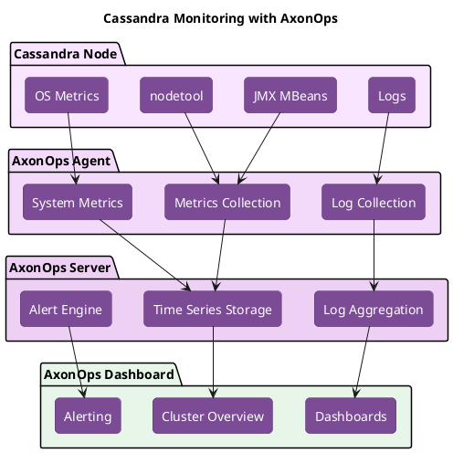

# Monitoring Operations

Effective Cassandra operations require continuous monitoring of cluster health, performance metrics, and resource utilization. This guide covers what to monitor, how to interpret metrics, and how to respond to alerts.

!!! tip "Proactive vs Reactive Operations"
    The goal of monitoring is to detect and resolve issues before they impact users. Establish baselines during normal operation, set alerts on deviations, and investigate anomalies promptly.

---

## Monitoring Architecture

### Data Collection Layers



### Metric Sources

| Source | Type | Access Method |
|--------|------|---------------|
| JMX MBeans | Performance metrics | JMX client, exporters |
| nodetool | Operational commands | CLI |
| System tables | Internal state | CQL queries |
| OS metrics | Resource utilization | Node exporter |
| Logs | Events, errors | Log aggregation |

---

## Critical Metrics

### Cluster Health Metrics

**Must-monitor metrics for cluster stability:**

| Metric | JMX Path | Healthy Range | Alert Threshold |
|--------|----------|---------------|-----------------|
| Live nodes | StorageService.LiveNodes | All nodes | Any node down |
| Unreachable nodes | StorageService.UnreachableNodes | Empty | Any node unreachable |
| Schema versions | StorageService.SchemaVersion | Single version | Multiple versions >5 min |
| Pending compactions | Compaction.PendingTasks | <50 | >100 sustained |
| Dropped messages | DroppedMessage.Dropped | 0 | Any drops |

### Read Performance

| Metric | Description | Healthy Range | Alert |
|--------|-------------|---------------|-------|
| Read latency (P99) | 99th percentile read time | <50ms | >100ms |
| Read timeouts | Timed out read requests | 0 | >0 |
| Key cache hit rate | Cache efficiency | >80% | <50% |
| Row cache hit rate | Row cache efficiency | >90% (if enabled) | <70% |
| Tombstone scans | Tombstones per read | <1000 | >5000 |

### Write Performance

| Metric | Description | Healthy Range | Alert |
|--------|-------------|---------------|-------|
| Write latency (P99) | 99th percentile write time | <20ms | >50ms |
| Write timeouts | Timed out write requests | 0 | >0 |
| Memtable size | Memory used by memtables | <heap/3 | >heap/2 |
| Commit log size | Pending commit log | <1GB | >2GB |
| Hints stored | Pending hints | 0 | >1000 |

### Resource Utilization

| Metric | Source | Healthy Range | Alert |
|--------|--------|---------------|-------|
| Heap usage | JMX | <70% | >85% |
| GC pause time | JMX | <500ms | >1s |
| GC frequency | JMX | <5/min | >10/min |
| Disk usage | OS | <70% | >80% |
| Disk I/O wait | OS | <20% | >40% |
| CPU usage | OS | <70% | >85% |
| Network throughput | OS | Within capacity | Near saturation |

---

## nodetool Monitoring Commands

### Quick Health Check

```bash
#!/bin/bash
# daily-health-check.sh

echo "=== Cluster Status ==="
nodetool status

echo -e "\n=== Schema Agreement ==="
nodetool describecluster | grep -A 5 "Schema versions"

echo -e "\n=== Pending Compactions ==="
nodetool compactionstats | head -20

echo -e "\n=== Thread Pool Status ==="
nodetool tpstats | grep -v "^$"

echo -e "\n=== Dropped Messages ==="
nodetool tpstats | grep -i dropped
```

### Detailed Performance Analysis

```bash
# Table statistics for specific keyspace
nodetool tablestats <keyspace>

# Per-table read/write latencies
nodetool tablestats <keyspace>.<table> | grep -E "latency|Bloom"

# Compaction throughput
nodetool compactionstats

# GC statistics
nodetool gcstats

# Streaming status
nodetool netstats

# Client connections
nodetool clientstats
```

### Ring and Token Information

```bash
# Token distribution
nodetool ring

# Endpoints for a key
nodetool getendpoints <keyspace> <table> <key>

# Ownership percentages
nodetool status | awk '{print $1, $2, $6}'
```

---

## JMX Metrics Reference

### Key MBean Paths

**Cluster metrics:**
```
org.apache.cassandra.metrics:type=Storage,name=Load
org.apache.cassandra.metrics:type=Storage,name=Exceptions
org.apache.cassandra.metrics:type=ClientRequest,scope=Read,name=Latency
org.apache.cassandra.metrics:type=ClientRequest,scope=Write,name=Latency
```

**Table metrics:**
```
org.apache.cassandra.metrics:type=Table,keyspace=<ks>,scope=<table>,name=ReadLatency
org.apache.cassandra.metrics:type=Table,keyspace=<ks>,scope=<table>,name=WriteLatency
org.apache.cassandra.metrics:type=Table,keyspace=<ks>,scope=<table>,name=LiveSSTableCount
org.apache.cassandra.metrics:type=Table,keyspace=<ks>,scope=<table>,name=TombstoneScannedHistogram
```

**Thread pool metrics:**
```
org.apache.cassandra.metrics:type=ThreadPools,path=request,scope=ReadStage,name=PendingTasks
org.apache.cassandra.metrics:type=ThreadPools,path=request,scope=MutationStage,name=PendingTasks
org.apache.cassandra.metrics:type=ThreadPools,path=internal,scope=CompactionExecutor,name=PendingTasks
```

**Compaction metrics:**
```
org.apache.cassandra.metrics:type=Compaction,name=PendingTasks
org.apache.cassandra.metrics:type=Compaction,name=TotalCompactionsCompleted
org.apache.cassandra.metrics:type=Compaction,name=BytesCompacted
```

### Querying JMX

```bash
# Using jmxterm
java -jar jmxterm.jar -l localhost:7199
> domain org.apache.cassandra.metrics
> bean type=ClientRequest,scope=Read,name=Latency
> get 99thPercentile

# Using jconsole (GUI)
jconsole localhost:7199
```

---

## Log Monitoring

### Log Levels and Locations

| Log | Location | Purpose |
|-----|----------|---------|
| system.log | /var/log/cassandra/system.log | Main operational log |
| debug.log | /var/log/cassandra/debug.log | Detailed debugging |
| gc.log | /var/log/cassandra/gc.log | GC activity |

### Critical Log Patterns

```bash
# Errors requiring immediate attention
grep -E "ERROR|FATAL" /var/log/cassandra/system.log | tail -50

# OutOfMemory events
grep -i "OutOfMemory\|OOM" /var/log/cassandra/system.log

# Compaction issues
grep -i "compaction" /var/log/cassandra/system.log | grep -i "error\|fail"

# Streaming problems
grep -i "stream" /var/log/cassandra/system.log | grep -i "error\|fail"

# Gossip issues
grep -i "gossip" /var/log/cassandra/system.log | grep -i "error\|fail"

# Dropped messages
grep -i "dropped" /var/log/cassandra/system.log

# Slow queries (if enabled)
grep "SLOW" /var/log/cassandra/system.log
```

### Enabling Slow Query Logging

```yaml
# cassandra.yaml
slow_query_log_timeout_in_ms: 500
```

---

## Alert Configuration

### Alert Severity Levels

| Severity | Response Time | Examples |
|----------|---------------|----------|
| **Critical** | Immediate | Node down, disk full, OOM |
| **Warning** | Within 1 hour | High latency, compaction backlog |
| **Info** | Next business day | Elevated tombstones, GC time increase |

### Recommended Alerts

**Critical Alerts (Page immediately):**

| Alert | Condition | Response |
|-------|-----------|----------|
| Node Down | Any node unreachable | Investigate immediately, check network/process |
| Disk Full | Disk usage >85% | Add capacity or clean up snapshots |
| OOM/Frequent GC | Full GC >5 times in 5 min | Investigate heap usage, potential memory leak |
| Schema Disagreement | Multiple schema versions >5 min | Check for stuck schema migrations |

**Warning Alerts:**

| Alert | Condition | Response |
|-------|-----------|----------|
| High Read Latency | P99 >100ms sustained | Check compaction, tombstones, GC |
| Compaction Backlog | Pending >100 for 30 min | Increase throughput or investigate blockers |
| Dropped Messages | Any message drops | Check thread pools, network, timeouts |
| Hints Growing | >1000 hints stored | Check target node health |

AxonOps provides pre-configured alerts for these conditions. See [Setup Alert Rules](/how-to/setup-alert-rules/) for configuration details.

---

## Dashboard Design

### Essential Dashboard Panels

**Cluster Overview:**

- Node status (up/down) per DC
- Total cluster load
- Request rates (reads/writes per second)
- Error rates

**Performance:**

- P50/P95/P99 read latency
- P50/P95/P99 write latency
- Requests per second (by node)
- Timeouts per second

**Resources:**

- Heap usage per node
- Disk usage per node
- CPU usage per node
- Network I/O per node

**Operations:**

- Pending compactions
- SSTable count
- Tombstone ratios
- Hint storage

### AxonOps Dashboards

AxonOps provides pre-built dashboards for Cassandra monitoring:

- **Cluster Overview**: Node status, load distribution, request rates across all nodes
- **Node Details**: Per-node metrics including heap, disk, CPU, and thread pools
- **Table Metrics**: Per-table read/write latency, SSTable counts, partition sizes
- **Compaction**: Pending tasks, throughput, history across the cluster
- **Repair**: Repair coverage, progress, and scheduling status

See [Metrics Dashboard](/monitoring/metricsdashboards/cassandra/) for dashboard usage and customization.

---

## System Table Queries

### Cluster State

```sql
-- Node status from system tables
SELECT peer, data_center, rack, release_version, tokens
FROM system.peers;

-- Local node info
SELECT cluster_name, data_center, rack, release_version
FROM system.local;

-- Schema versions
SELECT schema_version, peer FROM system.peers;
```

### Size and Distribution

```sql
-- Table sizes
SELECT keyspace_name, table_name,
       mean_partition_size,
       partitions_count
FROM system_schema.tables;

-- Compaction history
SELECT keyspace_name, columnfamily_name, compacted_at, bytes_in, bytes_out
FROM system.compaction_history
WHERE compacted_at > '2024-01-01'
ALLOW FILTERING;
```

---

## Baseline and Capacity Planning

### Establishing Baselines

Record metrics during normal operation periods:

```bash
#!/bin/bash
# baseline-capture.sh

DATE=$(date +%Y%m%d_%H%M)
OUTPUT="baseline_${DATE}.txt"

echo "Capturing baseline at $(date)" > $OUTPUT

echo -e "\n=== Table Stats ===" >> $OUTPUT
nodetool tablestats >> $OUTPUT

echo -e "\n=== Thread Pools ===" >> $OUTPUT
nodetool tpstats >> $OUTPUT

echo -e "\n=== GC Stats ===" >> $OUTPUT
nodetool gcstats >> $OUTPUT

echo -e "\n=== Compaction Stats ===" >> $OUTPUT
nodetool compactionstats >> $OUTPUT
```

### Capacity Metrics

Track these for capacity planning:

| Metric | Purpose | Growth Trigger |
|--------|---------|----------------|
| Disk usage | Storage capacity | >60% |
| Data per node | Node sizing | >500GB |
| Write rate | Throughput capacity | Near limits |
| P99 latency | Performance capacity | >SLA threshold |

---

## AxonOps Monitoring Platform

[AxonOps](https://axonops.com) provides purpose-built monitoring for Apache Cassandra, eliminating the complexity of assembling custom monitoring stacks.

### Key Capabilities

| Capability | Description |
|------------|-------------|
| **Zero-configuration collection** | Agent automatically discovers and collects all relevant Cassandra metrics |
| **Pre-built dashboards** | Production-tested dashboards for cluster, node, and table views |
| **Historical analysis** | Long-term metric storage with efficient compression |
| **Cross-cluster visibility** | Monitor multiple clusters from a single interface |
| **Intelligent alerting** | Pre-configured alerts with anomaly detection |
| **Centralized logging** | Aggregate and analyze logs from all nodes |

### Operational Integration

AxonOps extends beyond metrics collection:

- **Repair monitoring**: Track repair progress and coverage across the cluster
- **Backup monitoring**: Verify backup completion and health status
- **Capacity forecasting**: Predict when resources will be exhausted
- **Performance analysis**: Identify slow queries and hot partitions

### Getting Started

- [AxonOps Cloud Setup](/get_started/cloud/) - Quick start with AxonOps Cloud
- [Agent Installation](/get_started/agent_setup/) - Deploy the AxonOps agent
- [Metrics Dashboards](/monitoring/metricsdashboards/cassandra/) - Using the monitoring dashboards
- [Alert Configuration](/how-to/setup-alert-rules/) - Configure alerting rules

---

## Troubleshooting with Metrics

### High Read Latency Investigation

```bash
# 1. Check if specific tables affected
nodetool tablestats | grep -A 10 "Table: problem_table"

# 2. Check tombstone counts
nodetool tablestats <ks>.<table> | grep -i tombstone

# 3. Check SSTable count
nodetool tablestats <ks>.<table> | grep "SSTable count"

# 4. Check compaction pending
nodetool compactionstats

# 5. Check GC activity
nodetool gcstats
```

### High Write Latency Investigation

```bash
# 1. Check commit log disk
df -h /var/lib/cassandra/commitlog

# 2. Check memtable flush status
nodetool tpstats | grep -i memtable

# 3. Check mutation stage
nodetool tpstats | grep -i mutation

# 4. Check hints
nodetool tpstats | grep -i hint

# 5. Check disk I/O
iostat -x 1 5
```

### Dropped Messages Investigation

```bash
# 1. Identify which message types dropped
nodetool tpstats | grep -i dropped

# 2. Check thread pool queues
nodetool tpstats | grep -i pending

# 3. Check if specific nodes affected
# (Check each node)

# 4. Check network connectivity
ping -c 5 <other_node>
nc -zv <other_node> 7000
```

---

## Best Practices

### Monitoring Strategy

1. **Start with cluster-level metrics**: Node count, total throughput, overall latency
2. **Drill down on anomalies**: Identify affected nodes, tables, operations
3. **Correlate across metrics**: High latency often correlates with GC, compaction, or disk I/O
4. **Keep historical data**: Compare current vs baseline

### Alert Hygiene

1. **Alert on symptoms, not causes**: Alert on high latency, not high CPU (unless CPU is the issue)
2. **Avoid alert fatigue**: Too many alerts lead to ignoring alerts
3. **Include runbook links**: Every alert should link to resolution steps
4. **Review and tune regularly**: Adjust thresholds based on experience

### Documentation

1. **Document normal ranges**: What does "healthy" look like for this cluster?
2. **Record incidents**: What happened, how it was detected, how it was resolved
3. **Maintain runbooks**: Step-by-step procedures for common alerts

---

## Related Documentation

- **[Cluster Management](../cluster-management/index.md)** - Node operations to monitor
- **[Repair Operations](../repair/index.md)** - Repair progress monitoring
- **[Compaction Management](../compaction-management/index.md)** - Compaction metrics
- **[Maintenance](../maintenance/index.md)** - Scheduled maintenance monitoring
