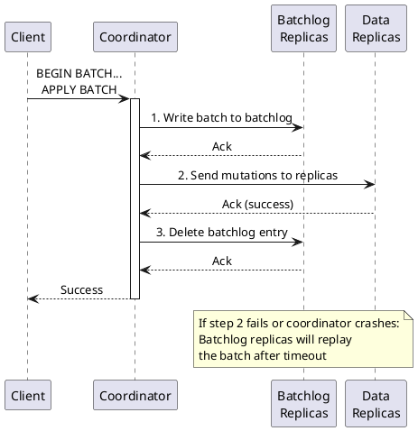

# nodetool replaybatchlog

Forces immediate replay of pending batch mutations stored in the batchlog.

---

## Synopsis

```bash
nodetool [connection_options] replaybatchlog
```

## Description

`nodetool replaybatchlog` triggers immediate processing of any pending batches stored in the local node's batchlog. Under normal operation, Cassandra automatically replays the batchlog, but this command forces immediate replay without waiting for the scheduled interval.

### What is a Batch in Cassandra?

A batch in Cassandra groups multiple CQL mutations (INSERT, UPDATE, DELETE) into a single logical operation. Batches come in two types:

| Type | CQL Syntax | Atomicity | Use Case |
|------|------------|-----------|----------|
| **Logged batch** | `BEGIN BATCH ... APPLY BATCH;` | Guaranteed | Mutations to same partition or requiring atomicity |
| **Unlogged batch** | `BEGIN UNLOGGED BATCH ... APPLY BATCH;` | Not guaranteed | Performance optimization for same-partition writes |

```cql
-- Logged batch (uses batchlog)
BEGIN BATCH
    INSERT INTO users (id, name) VALUES (1, 'Alice');
    INSERT INTO user_emails (user_id, email) VALUES (1, 'alice@example.com');
APPLY BATCH;

-- Unlogged batch (does NOT use batchlog)
BEGIN UNLOGGED BATCH
    INSERT INTO events (id, data) VALUES (uuid(), 'event1');
    INSERT INTO events (id, data) VALUES (uuid(), 'event2');
APPLY BATCH;
```

### What is the Batchlog?

The batchlog is a mechanism that guarantees **atomicity** for logged batches—ensuring that either all mutations in a batch are applied, or none are (in case of failure, the batch will be retried).

The batchlog is stored in the `system.batches` table:

```cql
-- View pending batches (for debugging)
SELECT * FROM system.batches;
```

### How the Batchlog Works



**Step-by-step process:**

1. **Coordinator receives batch** - Client sends a logged batch to coordinator node
2. **Write to batchlog** - Coordinator writes the entire batch to batchlog replicas (nodes in different racks for durability)
3. **Execute mutations** - Coordinator sends individual mutations to data replicas
4. **Delete batchlog entry** - On successful completion, batchlog entry is removed
5. **Automatic replay** - If coordinator fails before completing, batchlog replicas detect the stale entry and replay the batch

### Why the Batchlog Exists

Without the batchlog, a logged batch could be partially applied if:

- The coordinator crashes mid-execution
- Network partitions occur during mutation delivery
- Some replicas fail while others succeed

The batchlog ensures that incomplete batches are eventually completed by having other nodes replay them.

---

## When to Use `replaybatchlog`

### Scenario 1: After Node Recovery

When a node recovers from a crash or extended downtime, it may have pending batches that were written to its batchlog but never completed:

```bash
# After node restart, force immediate replay
nodetool replaybatchlog
```

**Why:** The automatic replay happens on a schedule. Forcing replay ensures pending batches are processed immediately rather than waiting for the next scheduled interval.

### Scenario 2: Investigating Stuck Batches

If monitoring shows growing pending batches or application logs indicate batch timeouts:

```bash
# Check for pending batches
cqlsh -e "SELECT COUNT(*) FROM system.batches;"

# Force replay to clear backlog
nodetool replaybatchlog

# Verify batches were processed
cqlsh -e "SELECT COUNT(*) FROM system.batches;"
```

### Scenario 3: Before Node Decommission

Ensure all pending batches are replayed before removing a node:

```bash
# Replay any pending batches
nodetool replaybatchlog

# Verify no pending batches
cqlsh -e "SELECT COUNT(*) FROM system.batches;"

# Proceed with decommission
nodetool decommission
```

### Scenario 4: After Network Partition Resolution

Following a network partition that may have caused batch failures:

```bash
# Once network is restored
nodetool replaybatchlog
```

### Scenario 5: Debugging Batch-Related Issues

When troubleshooting data consistency issues that may be related to incomplete batches:

```bash
# Check batch replay thread status
nodetool tpstats | grep -i batch

# Force replay
nodetool replaybatchlog

# Monitor progress
nodetool tpstats | grep -i batch
```

---

## Examples

### Basic Usage

```bash
nodetool replaybatchlog
```

### On Remote Node

```bash
nodetool -h 192.168.1.100 replaybatchlog
```

### Replay on All Nodes

```bash
#!/bin/bash
# replay_all_batchlogs.sh

nodes=$(nodetool status | grep "^UN" | awk '{print $2}')

for node in $nodes; do
    echo "Replaying batchlog on $node..."
    nodetool -h $node replaybatchlog
done

echo "Batchlog replay triggered on all nodes."
```

### With Verification

```bash
#!/bin/bash
# Check pending batches, replay, and verify

echo "Pending batches before replay:"
cqlsh -e "SELECT COUNT(*) FROM system.batches;"

echo "Triggering batchlog replay..."
nodetool replaybatchlog

# Wait for replay to process
sleep 5

echo "Pending batches after replay:"
cqlsh -e "SELECT COUNT(*) FROM system.batches;"
```

---

## Batchlog Automatic Replay

Under normal operation, Cassandra automatically replays the batchlog:

| Parameter | Default | Description |
|-----------|---------|-------------|
| Replay interval | 60 seconds | How often the batchlog is checked for stale entries |
| Batch timeout | 2x write timeout | Time before a batch is considered stale and needs replay |

The automatic replay process:

1. Each node periodically scans batchlogs stored on it
2. Identifies batches older than the timeout threshold
3. Replays those batches to the appropriate replicas
4. Deletes successfully replayed entries

### When Automatic Replay Occurs

- **Periodically** - Every 60 seconds by default
- **On node startup** - Stale batches are replayed during bootstrap
- **When triggered manually** - Via `nodetool replaybatchlog`

---

## Batchlog Configuration

### cassandra.yaml Settings

```yaml
# Throttle for batchlog replay (KB/s)
# Limits I/O impact during replay
batchlog_replay_throttle_in_kb: 1024

# Write request timeout affects batch timeout
write_request_timeout_in_ms: 2000
```

### Runtime Configuration

```bash
# View current replay throttle
nodetool getbatchlogreplaythrottle

# Adjust throttle (in KB/s)
nodetool setbatchlogreplaythrottle 2048
```

---

## Monitoring Batchlog

### Check Pending Batches

```cql
-- Count pending batches
SELECT COUNT(*) FROM system.batches;

-- View batch details (use sparingly)
SELECT id, version, writetime(version) FROM system.batches LIMIT 10;
```

### Monitor Replay Threads

```bash
# Check batch replay thread pool
nodetool tpstats | grep -i batch
```

Example output:

```
Pool Name                    Active   Pending      Completed   Blocked
BatchlogTasks                     0         0           1523         0
```

### Watch for Batch-Related Metrics

Key metrics to monitor:

| Metric | Meaning | Concern Threshold |
|--------|---------|-------------------|
| Pending BatchlogTasks | Batches waiting for replay | > 100 |
| system.batches count | Entries in batchlog table | Growing over time |
| Batch replay errors | Failed replay attempts | Any non-zero |

---

## Impact on Cluster

### During Replay

| Aspect | Impact |
|--------|--------|
| **CPU** | Low - batch processing is lightweight |
| **Disk I/O** | Moderate - reads batchlog, writes to data tables |
| **Network** | Moderate - sends mutations to replicas |
| **Latency** | Minimal impact on regular operations |

### Throttling

The `batchlog_replay_throttle_in_kb` setting limits replay speed to prevent overwhelming the cluster:

```bash
# Check current throttle
nodetool getbatchlogreplaythrottle

# If replay is slow but cluster can handle more
nodetool setbatchlogreplaythrottle 4096

# Force replay with higher throughput
nodetool replaybatchlog
```

---

## Batchlog and Consistency

### What Batchlog Guarantees

- **Atomicity** - All mutations in a batch will eventually be applied
- **Durability** - Batch survives coordinator failure (stored on batchlog replicas)

### What Batchlog Does NOT Guarantee

- **Isolation** - Other reads may see partial batch results during execution
- **Immediate consistency** - Replayed batches still follow normal replication rules

### Batchlog Replica Selection

Cassandra selects batchlog replicas to maximize durability:

- Prefers nodes in **different racks** than the coordinator
- Falls back to same-rack nodes if necessary
- Typically stores on 2 batchlog replicas

---

## Troubleshooting

### Batchlog Growing Continuously

If `system.batches` keeps growing:

```bash
# Check for failing replays
grep -i "batch" /var/log/cassandra/system.log | grep -i "error\|fail"

# Check target replicas are healthy
nodetool status

# Check for resource constraints
nodetool tpstats
```

**Common causes:**

- Target replicas are down
- Network connectivity issues
- Throttle set too low for batch volume

### Replay Not Completing

```bash
# Check thread pool status
nodetool tpstats | grep -i batch

# Look for blocked threads
nodetool tpstats | grep -i blocked

# Check logs for errors
tail -100 /var/log/cassandra/system.log | grep -i batch
```

### Batches Taking Too Long

```bash
# Increase replay throttle
nodetool setbatchlogreplaythrottle 4096

# Force replay
nodetool replaybatchlog

# Monitor progress
watch -n 5 'cqlsh -e "SELECT COUNT(*) FROM system.batches;"'
```

---

## Best Practices

!!! tip "Batchlog Guidelines"

    1. **Use logged batches sparingly** - They add overhead; use only when atomicity is required
    2. **Prefer unlogged batches** for same-partition operations - No batchlog overhead
    3. **Keep batches small** - Large batches increase batchlog storage and replay time
    4. **Monitor batchlog size** - Growing `system.batches` indicates issues
    5. **Run replay after recovery** - Don't wait for automatic replay after incidents

!!! warning "Batch Anti-Patterns"

    Avoid these common mistakes:

    - Using batches for bulk loading (use `UNLOGGED` or async writes instead)
    - Batching unrelated mutations across many partitions
    - Very large batches (>100 mutations)
    - Using batches as a "transaction" mechanism across tables

---

## Logged vs Unlogged Batches

| Aspect | Logged Batch | Unlogged Batch |
|--------|--------------|----------------|
| Batchlog used | Yes | No |
| Atomicity guaranteed | Yes | No |
| Coordinator failure handling | Batch replayed | Partial write possible |
| Performance overhead | Higher | Lower |
| Use case | Cross-partition atomicity | Same-partition optimization |

```cql
-- Use LOGGED (default) when atomicity matters
BEGIN BATCH
    UPDATE account SET balance = balance - 100 WHERE id = 1;
    UPDATE account SET balance = balance + 100 WHERE id = 2;
APPLY BATCH;

-- Use UNLOGGED when atomicity doesn't matter (same partition)
BEGIN UNLOGGED BATCH
    INSERT INTO user_events (user_id, event_id, data) VALUES (123, uuid(), 'e1');
    INSERT INTO user_events (user_id, event_id, data) VALUES (123, uuid(), 'e2');
APPLY BATCH;
```

---

## Related Commands

| Command | Relationship |
|---------|--------------|
| [tpstats](tpstats.md) | View BatchlogTasks thread pool status |
| [getbatchlogreplaythrottle](getbatchlogreplaythrottle.md) | View current replay throttle |
| [setbatchlogreplaythrottle](setbatchlogreplaythrottle.md) | Adjust replay throttle |
| [status](status.md) | Check replica node health |
