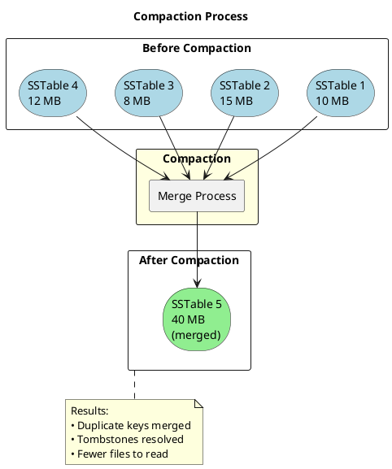
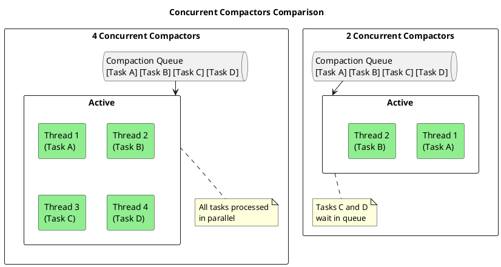

# nodetool setconcurrentcompactors

Sets the number of concurrent compactor threads.

---

## Synopsis

```bash
nodetool [connection_options] setconcurrentcompactors <value>
```

---

## Description

`nodetool setconcurrentcompactors` changes the number of threads available for concurrent compaction operations at runtime. Each compactor thread can process one compaction task independently, allowing multiple compactions to run simultaneously across different tables or SSTables.

!!! info "What Is Compaction?"
    Compaction is Cassandra's background process that merges SSTables, removes deleted data (tombstones), and consolidates data for efficient reads. Without compaction, read performance degrades as the number of SSTables grows.

---

## What Are Concurrent Compactors?

### The Compaction Process

When data is written to Cassandra, it first goes to the memtable (in memory), then gets flushed to SSTables (on disk). Over time, multiple SSTables accumulate for each table. Compaction merges these SSTables:



### How Concurrent Compactors Work

Each compactor is a thread that can process one compaction task at a time. With multiple compactors, Cassandra can run multiple compaction operations simultaneously:



### Why This Matters

| Scenario | With Few Compactors | With More Compactors |
|----------|---------------------|----------------------|
| Heavy write load | Compaction falls behind, SSTable count grows | Keeps up with writes |
| Many tables | Tables compete for compaction time | Multiple tables compacted simultaneously |
| Large SSTables | Single compaction blocks others | Parallel compactions continue |
| Read latency | Degrades as SSTables accumulate | Stays stable |

---

## Arguments

| Argument | Description |
|----------|-------------|
| `value` | Number of concurrent compactor threads (required). Must be a positive integer ≥ 1. |

---

## Default Value Calculation

If not explicitly configured, Cassandra calculates the default based on:

```
concurrent_compactors = min(number_of_data_directories, number_of_cpu_cores)
```

| System Configuration | Default Compactors |
|---------------------|-------------------|
| 8 cores, 1 disk | 1 |
| 8 cores, 4 disks (JBOD) | 4 |
| 16 cores, 8 disks | 8 |
| 4 cores, 8 disks | 4 |

The rationale:
- **Disk-limited**: Each disk can only do one compaction efficiently at a time
- **CPU-limited**: Each compaction thread consumes CPU for data processing

---

## Impact of Changing This Setting

### Increasing Concurrent Compactors

**Benefits:**

| Aspect | Effect |
|--------|--------|
| Compaction throughput | Faster - more tasks processed in parallel |
| SSTable count | Lower - compaction keeps up with writes |
| Read latency | Improved - fewer SSTables to merge |
| Compaction backlog | Clears faster |

**Costs:**

| Resource | Impact |
|----------|--------|
| CPU usage | **Increases** - more threads doing work |
| Disk I/O | **Increases** - more parallel reads/writes |
| Memory | **Slight increase** - buffers per compaction |
| Read/write latency during compaction | **May increase** - resource contention |

### Decreasing Concurrent Compactors

**Benefits:**

| Aspect | Effect |
|--------|--------|
| CPU usage | Lower - fewer active threads |
| Disk I/O | Lower - less parallel activity |
| Foreground operations | More resources available |
| Latency during compaction | More predictable |

**Costs:**

| Resource | Impact |
|----------|--------|
| Compaction throughput | **Decreases** - slower processing |
| SSTable accumulation | **Risk increases** - may fall behind |
| Read latency over time | **May degrade** - more SSTables |
| Pending compaction tasks | **Grows** - longer backlog |

---

## When to Increase Compactors

### Scenario 1: Compaction Backlog Growing

**Symptoms:**
- `nodetool compactionstats` shows many pending compactions
- SSTable count per table is growing over time
- Read latency slowly increasing

```bash
# Check for compaction backlog
nodetool compactionstats

# Sample output showing problem:
# pending tasks: 847
# - my_keyspace.my_table: 245
# - my_keyspace.events: 602
```

**Solution:**

```bash
# Check current compactors
nodetool getconcurrentcompactors
# Output: 2

# Increase to clear backlog
nodetool setconcurrentcompactors 6

# Monitor progress
watch -n 10 'nodetool compactionstats | head -20'

# After backlog clears, consider keeping higher or reducing
```

### Scenario 2: High Write Throughput

**Symptoms:**
- Heavy write workload (bulk loading, high ingestion rate)
- SSTables accumulating faster than compaction can merge them
- Write latency spikes during compaction

```bash
# During bulk load, temporarily increase compactors
nodetool setconcurrentcompactors 8

# Monitor compaction keeping up
watch 'nodetool tablestats my_keyspace.my_table | grep "SSTable count"'

# After load completes, restore normal value
nodetool setconcurrentcompactors 4
```

### Scenario 3: Many Tables

**Symptoms:**
- Cluster has dozens or hundreds of tables
- Compaction spreads thin across all tables
- Some tables have excessive SSTables

```bash
# More compactors allow parallel work on multiple tables
nodetool setconcurrentcompactors 8
```

### Scenario 4: JBOD with Many Disks

**Symptoms:**
- Multiple data directories configured
- Disks are underutilized
- Compaction appears slow despite available I/O capacity

```bash
# Check disk count
grep data_file_directories /etc/cassandra/cassandra.yaml

# Match compactors to disk count (or slightly less)
nodetool setconcurrentcompactors 6  # For 8 disks
```

---

## When to Decrease Compactors

### Scenario 1: High Latency During Compaction

**Symptoms:**
- Read/write latency spikes when compaction is active
- CPU consistently at 100% during compaction
- Application timeouts during compaction periods

```bash
# Reduce to free resources for foreground operations
nodetool setconcurrentcompactors 2

# Combined with throughput limit for more control
nodetool setcompactionthroughput 64  # MB/s
```

### Scenario 2: Resource-Constrained Nodes

**Symptoms:**
- Small instances (2-4 CPU cores)
- Limited memory
- Single disk (not JBOD)

```bash
# Minimum compaction overhead
nodetool setconcurrentcompactors 1
```

### Scenario 3: Prioritizing Foreground Operations

**Symptoms:**
- During peak business hours
- When running repairs or streaming
- During rolling restart/upgrade

```bash
# Temporarily reduce compaction activity
nodetool setconcurrentcompactors 1

# After maintenance window, restore
nodetool setconcurrentcompactors 4
```

---

## Examples

### Check Current Setting

```bash
nodetool getconcurrentcompactors
```

**Sample output:**
```
Current concurrent compactors: 4
```

### Increase for Backlog Recovery

```bash
# Double the compactors temporarily
nodetool setconcurrentcompactors 8
```

### Reduce During Peak Hours

```bash
# Minimize compaction impact
nodetool setconcurrentcompactors 2
```

### Set Based on Hardware

```bash
#!/bin/bash
# set_compactors_auto.sh

# Get CPU cores
cores=$(nproc)

# Get data directory count
disks=$(grep -A 10 "data_file_directories:" /etc/cassandra/cassandra.yaml | \
        grep "^ *-" | wc -l)

# Calculate appropriate value
recommended=$((cores < disks ? cores : disks))

echo "CPU cores: $cores"
echo "Data directories: $disks"
echo "Recommended compactors: $recommended"

nodetool setconcurrentcompactors $recommended
```

### Temporarily Boost for Maintenance

```bash
#!/bin/bash
# boost_compaction.sh

NORMAL_COMPACTORS=4
BOOST_COMPACTORS=8

echo "Current compaction stats:"
nodetool compactionstats | head -5

echo ""
echo "Boosting compactors from $NORMAL_COMPACTORS to $BOOST_COMPACTORS..."
nodetool setconcurrentcompactors $BOOST_COMPACTORS

echo ""
echo "Monitoring compaction (Ctrl+C when done)..."
watch -n 5 'nodetool compactionstats | head -10'

# When done, run:
# nodetool setconcurrentcompactors $NORMAL_COMPACTORS
```

---

## Monitoring Impact

### Before and After Metrics

```bash
#!/bin/bash
# monitor_compaction_change.sh

echo "=== Before Change ==="
echo "Concurrent compactors: $(nodetool getconcurrentcompactors)"
echo ""
echo "Compaction stats:"
nodetool compactionstats
echo ""
echo "System load:"
uptime
echo ""
echo "I/O stats (5 second sample):"
iostat -x 1 5 | tail -10

echo ""
echo "Record these values, make the change, then run again to compare."
```

### Watch Compaction Progress

```bash
# Real-time compaction monitoring
watch -n 2 'nodetool compactionstats'

# With SSTable counts
watch -n 10 'echo "=== Compaction ===" && nodetool compactionstats | head -10 && echo "" && echo "=== SSTable Counts ===" && nodetool tablestats 2>/dev/null | grep -E "Table:|SSTable count"'
```

### Check Resource Usage

```bash
# CPU usage by Cassandra
top -p $(pgrep -d, -f CassandraDaemon)

# I/O usage
iostat -x 2

# Compaction-specific metrics via JMX
nodetool tpstats | grep -i compaction
```

---

## Configuration Reference

### cassandra.yaml Setting

```yaml
# cassandra.yaml

# Number of simultaneous compactions to allow
# Default: min(number of disks, number of cores)
concurrent_compactors: 4
```

### Runtime vs Persistent Configuration

| Method | Persistence | Restart Required |
|--------|-------------|------------------|
| `nodetool setconcurrentcompactors` | Until restart | No |
| `cassandra.yaml` | Permanent | Yes (for initial load) |

!!! tip "Best Practice"
    Use `nodetool setconcurrentcompactors` to test changes dynamically, then update `cassandra.yaml` once the optimal value is determined.

### Related cassandra.yaml Settings

```yaml
# Compaction throughput limit (MB/s per compactor)
compaction_throughput_mb_per_sec: 64

# Concurrent reads/writes during compaction
concurrent_compactors: 4

# For STCS: minimum threshold to trigger compaction
# For LCS: SSTable size target
# (Varies by compaction strategy)
```

---

## Interaction with Other Settings

### With compaction_throughput_mb_per_sec

The total compaction I/O is approximately:

```
Total I/O ≈ concurrent_compactors × compaction_throughput_mb_per_sec
```

| Compactors | Throughput per Compactor | Total I/O |
|------------|--------------------------|-----------|
| 2 | 64 MB/s | ~128 MB/s |
| 4 | 64 MB/s | ~256 MB/s |
| 8 | 64 MB/s | ~512 MB/s |

To limit total compaction I/O:

```bash
# Allow more parallelism but limit each
nodetool setconcurrentcompactors 8
nodetool setcompactionthroughput 32  # 8 × 32 = 256 MB/s total
```

### With Different Compaction Strategies

| Strategy | Compactor Impact |
|----------|------------------|
| **STCS** | More compactors help with multiple concurrent merges |
| **LCS** | Important - many small compactions benefit from parallelism |
| **TWCS** | Moderate - time windows reduce concurrent needs |
| **UCS** | Varies by configuration |

---

## Troubleshooting

### Compaction Still Falling Behind

```bash
# Check if limit is compactors or throughput
nodetool compactionstats
# Look at: "Active compaction remaining time"

# If all compactors busy, increase count
nodetool getconcurrentcompactors
nodetool setconcurrentcompactors $(($(nodetool getconcurrentcompactors | grep -oP '\d+') + 2))

# If compactors not fully utilized, check throughput
nodetool getcompactionthroughput
```

### High CPU During Compaction

```bash
# Reduce compactors
nodetool setconcurrentcompactors 2

# And/or reduce throughput per compactor
nodetool setcompactionthroughput 32
```

### Compaction Not Starting

```bash
# Check if compaction is disabled
nodetool compactionstats
# Look for "Compaction is currently disabled"

# Enable if needed
nodetool enableautocompaction my_keyspace

# Check compactors > 0
nodetool getconcurrentcompactors
```

### Setting Reverts After Restart

```bash
# Check cassandra.yaml
grep concurrent_compactors /etc/cassandra/cassandra.yaml

# Update configuration file
sudo sed -i 's/concurrent_compactors:.*/concurrent_compactors: 6/' /etc/cassandra/cassandra.yaml

# Or add if not present
echo "concurrent_compactors: 6" | sudo tee -a /etc/cassandra/cassandra.yaml
```

### Inconsistent Settings Across Cluster

```bash
#!/bin/bash
# check_compactors_cluster.sh

echo "=== Concurrent Compactors Across Cluster ==="

for node in $(nodetool status | grep "^UN" | awk '{print $2}'); do
    value=$(nodetool -h $node getconcurrentcompactors 2>/dev/null | grep -oP '\d+')
    echo "$node: $value compactors"
done
```

---

## Sizing Guidelines

### By Hardware Profile

| Profile | CPU Cores | Disks | Recommended Compactors |
|---------|-----------|-------|------------------------|
| Small (dev/test) | 2-4 | 1 | 1-2 |
| Medium | 8 | 1-2 | 2-4 |
| Large | 16 | 4 (JBOD) | 4-8 |
| Extra Large | 32+ | 8+ (JBOD) | 8-12 |

### By Workload

| Workload Type | Recommended Approach |
|---------------|---------------------|
| Read-heavy | Moderate compactors (keep SSTables low) |
| Write-heavy | Higher compactors (keep up with flushes) |
| Mixed | Balance based on monitoring |
| Bulk loading | Temporarily maximize, then reduce |

### Rule of Thumb

```
Recommended compactors = min(CPU_cores, disk_count, 8)
```

- Rarely beneficial to exceed 8 compactors
- Single disk systems: 1-2 compactors usually sufficient
- Monitor and adjust based on actual performance

---

## Best Practices

!!! tip "Concurrent Compactors Guidelines"

    1. **Start with defaults** - Cassandra's auto-calculation is reasonable
    2. **Monitor before changing** - Understand current compaction behavior
    3. **Change incrementally** - Adjust by 1-2 at a time
    4. **Watch resource usage** - CPU and I/O impact
    5. **Consider workload patterns** - Different times may need different values
    6. **Make permanent** - Update cassandra.yaml once optimal value found
    7. **Consistent across cluster** - All nodes should have same setting

!!! warning "Cautions"

    - **Don't exceed CPU cores** - Diminishing returns and resource contention
    - **Single disk limitation** - More compactors won't help with one disk
    - **Memory impact** - Each compaction uses memory buffers
    - **I/O saturation** - Can starve foreground operations
    - **Testing required** - Impact varies by hardware and workload

!!! info "When to Leave at Default"

    The auto-calculated default is appropriate when:

    - Hardware is well-balanced (cores ≈ disks)
    - Workload is steady (not bursty)
    - Compaction is keeping up (low pending tasks)
    - No latency issues during compaction

---

## Related Commands

| Command | Relationship |
|---------|--------------|
| [getconcurrentcompactors](getconcurrentcompactors.md) | View current setting |
| [compactionstats](compactionstats.md) | Monitor compaction progress |
| [setcompactionthroughput](setcompactionthroughput.md) | Control I/O per compactor |
| [getcompactionthroughput](getcompactionthroughput.md) | View throughput limit |
| [enableautocompaction](enableautocompaction.md) | Enable compaction |
| [disableautocompaction](disableautocompaction.md) | Disable compaction |
| [compact](compact.md) | Force manual compaction |
| [tablestats](tablestats.md) | View SSTable counts |
