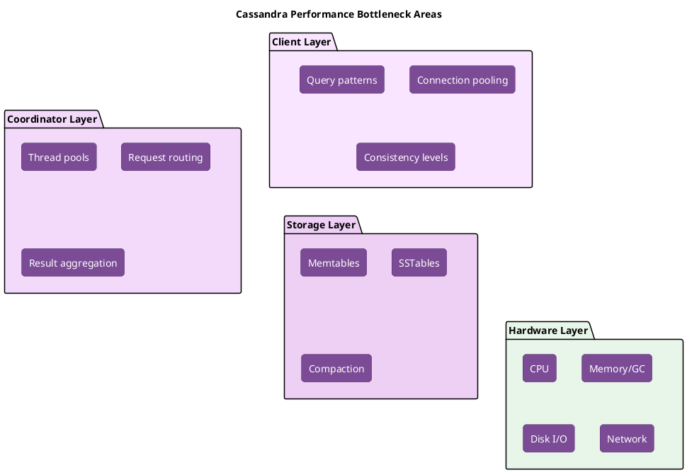

# Performance Tuning

This guide covers operational procedures for optimizing Cassandra performance: identifying bottlenecks, tuning configurations, and resolving common performance issues.

!!! info "Measure Before Tuning"
    Always establish baseline metrics before making changes. Tune one parameter at a time and measure the impact. Changes that improve one workload may degrade another.

---

## Performance Fundamentals

### Performance Bottleneck Categories



### Key Performance Indicators

| Metric | Target | Investigation Trigger |
|--------|--------|----------------------|
| Read latency P99 | <50ms | >100ms |
| Write latency P99 | <20ms | >50ms |
| Throughput | Stable | >20% deviation |
| GC pause P99 | <200ms | >500ms |
| Disk utilization | <70% | >85% |

---

## Read Performance Tuning

### Diagnosing Slow Reads

```bash
# Step 1: Identify affected tables
nodetool tablestats <keyspace> | grep -A 15 "Table:"

# Step 2: Check read latency breakdown
nodetool proxyhistograms

# Step 3: Check for tombstone issues
nodetool tablestats <keyspace>.<table> | grep -i tombstone

# Step 4: Check SSTable count
nodetool cfstats <keyspace>.<table> | grep "SSTable count"

# Step 5: Check bloom filter effectiveness
nodetool tablestats <keyspace>.<table> | grep -i bloom
```

### Common Read Performance Issues

#### High SSTable Count

**Symptoms:** Read latency increases over time, many SSTables per read

**Diagnosis:**
```bash
nodetool tablestats <keyspace>.<table> | grep "SSTable count"
# Healthy: <10 for STCS, <100 total for LCS
```

**Solutions:**

```bash
# Force compaction to reduce SSTable count
nodetool compact <keyspace> <table>

# Adjust compaction strategy if needed
ALTER TABLE <keyspace>.<table>
WITH compaction = {
    'class': 'LeveledCompactionStrategy',
    'sstable_size_in_mb': 160
};
```

#### Excessive Tombstones

**Symptoms:** Read latency spikes, "TombstoneOverwhelmingException" in logs

**Diagnosis:**
```bash
nodetool tablestats <keyspace>.<table> | grep -i tombstone
# Warning if tombstones_per_read > 1000
```

**Solutions:**

```sql
-- Reduce gc_grace_seconds if repair runs frequently
ALTER TABLE <keyspace>.<table>
WITH gc_grace_seconds = 86400;  -- 1 day instead of 10 days
```

```bash
# Force major compaction to purge tombstones
nodetool compact <keyspace> <table>
```

#### Poor Cache Hit Rates

**Symptoms:** High disk reads, low cache hit rates

**Diagnosis:**
```bash
nodetool info | grep -i cache
# Key cache hit rate should be >80%
```

**Solutions:**

```yaml
# cassandra.yaml - increase key cache
key_cache_size_in_mb: 100  # Default: auto (5% heap)

# Enable row cache for frequently accessed tables (use sparingly)
# ALTER TABLE with row_cache_enabled = true
```

### Read Path Optimization

| Optimization | Impact | Configuration |
|--------------|--------|---------------|
| Increase key cache | Fewer index lookups | `key_cache_size_in_mb` |
| Use prepared statements | Reduced parsing | Application code |
| Token-aware routing | Reduced coordinator hops | Driver configuration |
| Appropriate consistency | Fewer replicas read | Application code |
| Compression | Faster disk reads | Table compression settings |

---

## Write Performance Tuning

### Diagnosing Slow Writes

```bash
# Step 1: Check write latency
nodetool proxyhistograms

# Step 2: Check memtable status
nodetool tpstats | grep -i memtable

# Step 3: Check commit log disk
df -h /var/lib/cassandra/commitlog
iostat -x 1 5

# Step 4: Check pending mutations
nodetool tpstats | grep -i mutation

# Step 5: Check if compaction is overwhelming
nodetool compactionstats
```

### Common Write Performance Issues

#### Commit Log Contention

**Symptoms:** Write latency spikes, commit log disk at 100% utilization

**Solutions:**

```yaml
# cassandra.yaml - use separate disk for commitlog
commitlog_directory: /mnt/commitlog  # SSD recommended

# Adjust sync mode
commitlog_sync: periodic
commitlog_sync_period_in_ms: 10000  # Default

# Or for durability-critical workloads
commitlog_sync: batch
commitlog_sync_batch_window_in_ms: 2
```

#### Memtable Flush Bottleneck

**Symptoms:** Memtable flush taking too long, high memory pressure

**Solutions:**

```yaml
# cassandra.yaml
memtable_cleanup_threshold: 0.33  # Flush when 33% of heap in memtables
memtable_flush_writers: 4         # Increase for more flush parallelism
```

#### Compaction Falling Behind

**Symptoms:** Growing pending compactions, disk space increasing

**Solutions:**

```yaml
# cassandra.yaml - increase compaction throughput
compaction_throughput_mb_per_sec: 64  # Default 64, increase if disk allows

# Increase concurrent compactors
concurrent_compactors: 4  # Default: min(num_cpus, disk_count)
```

```bash
# Runtime adjustment
nodetool setcompactionthroughput 128
```

### Write Path Optimization

| Optimization | Impact | Configuration |
|--------------|--------|---------------|
| Separate commit log disk | Reduced write latency | `commitlog_directory` |
| Increase memtable size | Fewer flushes | `memtable_heap_space_in_mb` |
| Tune commit log sync | Latency vs durability | `commitlog_sync` |
| Batch writes | Amortized overhead | Application batching |
| Use UNLOGGED batches | Reduced coordinator work | For same-partition writes |

---

## JVM and GC Tuning

### GC Selection (Cassandra 4.0+)

| GC | Best For | Configuration |
|----|----------|---------------|
| G1GC | General purpose, heaps >8GB | Default in 4.0+ |
| ZGC | Ultra-low latency, heaps >16GB | Experimental |
| Shenandoah | Low latency, heaps >8GB | Alternative to G1 |

### G1GC Tuning

```bash
# jvm-server.options or jvm11-server.options

# Heap sizing
-Xms16G
-Xmx16G

# G1GC settings
-XX:+UseG1GC
-XX:G1RSetUpdatingPauseTimePercent=5
-XX:MaxGCPauseMillis=300
-XX:InitiatingHeapOccupancyPercent=70

# GC logging (for analysis)
-Xlog:gc*:file=/var/log/cassandra/gc.log:time,uptime:filecount=10,filesize=10M
```

### Diagnosing GC Issues

```bash
# Check GC statistics
nodetool gcstats

# Analyze GC logs
grep "pause" /var/log/cassandra/gc.log | tail -20

# Check heap usage
nodetool info | grep Heap
```

### GC Optimization Guidelines

| Symptom | Likely Cause | Solution |
|---------|--------------|----------|
| Frequent minor GCs | Young gen too small | Increase `-XX:G1NewSizePercent` |
| Long GC pauses | Full GCs | Reduce heap usage, tune IHOP |
| High GC CPU | Too many objects | Optimize queries, reduce allocations |
| OOM errors | Heap exhausted | Increase heap or reduce load |

---

## Compaction Tuning

### Strategy Selection Impact

| Strategy | Read Perf | Write Perf | Space Amp | Best For |
|----------|-----------|------------|-----------|----------|
| STCS | Medium | High | High | Write-heavy |
| LCS | High | Medium | Low | Read-heavy |
| TWCS | High | High | Low | Time-series |
| UCS | Configurable | Configurable | Low | Cassandra 5.0+ |

### Tuning STCS

```sql
ALTER TABLE <keyspace>.<table>
WITH compaction = {
    'class': 'SizeTieredCompactionStrategy',
    'min_threshold': 4,           -- Minimum SSTables to compact
    'max_threshold': 32,          -- Maximum SSTables to compact
    'min_sstable_size': 50        -- Skip tiny SSTables (MB)
};
```

### Tuning LCS

```sql
ALTER TABLE <keyspace>.<table>
WITH compaction = {
    'class': 'LeveledCompactionStrategy',
    'sstable_size_in_mb': 160,    -- SSTable size per level
    'fanout_size': 10             -- Size multiplier between levels
};
```

### Tuning TWCS

```sql
ALTER TABLE <keyspace>.<table>
WITH compaction = {
    'class': 'TimeWindowCompactionStrategy',
    'compaction_window_unit': 'DAYS',
    'compaction_window_size': 1
};
```

### Runtime Compaction Adjustments

```bash
# Increase compaction throughput
nodetool setcompactionthroughput 128

# Pause compaction (emergency only)
nodetool disableautocompaction

# Force specific table compaction
nodetool compact <keyspace> <table>
```

---

## Network Tuning

### Inter-Node Communication

```yaml
# cassandra.yaml

# Streaming throughput for repairs/bootstraps
stream_throughput_outbound_megabits_per_sec: 200

# Inter-node compression
internode_compression: dc  # 'all', 'dc', or 'none'

# TCP settings
# /etc/sysctl.conf
net.core.rmem_max = 16777216
net.core.wmem_max = 16777216
net.ipv4.tcp_rmem = 4096 87380 16777216
net.ipv4.tcp_wmem = 4096 65536 16777216
```

### Client Connection Tuning

```yaml
# cassandra.yaml

# Native transport settings
native_transport_max_threads: 128
native_transport_max_concurrent_connections: -1  # Unlimited
native_transport_max_concurrent_connections_per_ip: -1

# Request timeout
request_timeout_in_ms: 10000
read_request_timeout_in_ms: 5000
write_request_timeout_in_ms: 2000
```

---

## Disk I/O Tuning

### Filesystem Configuration

```bash
# Recommended mount options for data directories
# /etc/fstab
/dev/sdb1 /var/lib/cassandra/data ext4 noatime,nodiratime,discard 0 2

# Scheduler for SSDs
echo none > /sys/block/sdb/queue/scheduler

# Read-ahead for HDDs
blockdev --setra 128 /dev/sdb
```

### Separating I/O Paths

```yaml
# cassandra.yaml - separate directories for different I/O patterns

# Commit log on fast SSD
commitlog_directory: /mnt/ssd/commitlog

# Data on larger storage
data_file_directories:
    - /mnt/data1/cassandra/data
    - /mnt/data2/cassandra/data

# Hints on SSD
hints_directory: /mnt/ssd/hints

# Saved caches on SSD
saved_caches_directory: /mnt/ssd/saved_caches
```

### RAID Considerations

| RAID Level | Use Case | Notes |
|------------|----------|-------|
| RAID 0 | Maximum performance | No redundancy, Cassandra provides replication |
| RAID 10 | Balance | Performance + local redundancy |
| JBOD | Recommended | Individual drives, Cassandra handles failures |

---

## Query Optimization

### Identifying Slow Queries

```yaml
# Enable slow query logging
# cassandra.yaml
slow_query_log_timeout_in_ms: 500
```

```bash
# Find slow queries in logs
grep "SLOW" /var/log/cassandra/system.log
```

### Query Anti-patterns

| Anti-pattern | Problem | Solution |
|--------------|---------|----------|
| SELECT * | Fetches all columns | Select only needed columns |
| ALLOW FILTERING | Full table scan | Redesign data model |
| Large IN clauses | Multiple partition reads | Batch queries or redesign |
| Large partitions | Memory pressure, latency | Split partitions |
| Unbounded queries | Memory exhaustion | Use pagination |

### Efficient Query Patterns

```sql
-- Use partition key in WHERE clause
SELECT * FROM users WHERE user_id = ?;

-- Use clustering columns in order
SELECT * FROM events
WHERE sensor_id = ? AND event_time >= ? AND event_time < ?;

-- Limit results
SELECT * FROM logs WHERE app_id = ? LIMIT 100;

-- Use pagination for large results
SELECT * FROM data WHERE partition = ? LIMIT 1000;
-- Then use last clustering key for next page
```

---

## Hardware Sizing

### CPU Sizing

| Workload | Cores | Notes |
|----------|-------|-------|
| Light | 4-8 | Low throughput, small data |
| Medium | 8-16 | Typical production |
| Heavy | 16-32 | High throughput, large data |

### Memory Sizing

```
JVM Heap: 8-32GB
- Minimum: 8GB
- Sweet spot: 16-24GB
- Maximum recommended: 32GB (diminishing returns beyond)

Off-heap:
- Key cache: 5% of heap (auto)
- Row cache: if enabled, additional
- Bloom filters: ~1GB per TB of data
- Compression metadata: ~1-3GB per TB
```

### Storage Sizing

```
Data disk space = (data_size × RF) + 50% headroom for compaction

Example:
- Raw data: 500GB
- RF: 3
- Required per node: 500GB × 3 / num_nodes + 50%
- For 6 nodes: 500GB × 3 / 6 × 1.5 = 375GB per node
```

---

## Benchmarking

### cassandra-stress Tool

```bash
# Write benchmark
cassandra-stress write n=1000000 -rate threads=100

# Read benchmark
cassandra-stress read n=1000000 -rate threads=100

# Mixed workload
cassandra-stress mixed ratio\(write=1,read=3\) n=1000000 -rate threads=100

# Custom schema
cassandra-stress user profile=./stress.yaml n=1000000

# With specific consistency
cassandra-stress write n=1000000 cl=QUORUM -rate threads=100
```

### Benchmark Best Practices

1. **Warm up**: Run for 5+ minutes before measuring
2. **Steady state**: Measure during stable operation
3. **Representative data**: Use realistic data sizes and patterns
4. **Isolated environment**: Avoid other workloads during benchmarks
5. **Multiple runs**: Average across runs for reliability

---

## AxonOps Performance Management

Identifying and resolving performance issues requires correlating metrics, analyzing query patterns, and understanding the impact of configuration changes. [AxonOps](https://axonops.com) provides tools that simplify performance management.

### Performance Analytics

AxonOps provides:

- **Slow query identification**: Automatic detection and ranking of slow queries
- **Query pattern analysis**: Identify inefficient access patterns
- **Hot partition detection**: Find partitions causing load imbalance
- **Historical comparison**: Compare current performance to baselines

### Capacity Planning

- **Growth forecasting**: Predict when capacity will be exhausted
- **Trend analysis**: Identify gradual performance degradation
- **What-if modeling**: Simulate impact of configuration changes
- **Right-sizing recommendations**: Optimize resource allocation

### Configuration Management

- **Configuration drift detection**: Identify nodes with different settings
- **Change tracking**: Audit log of all configuration changes
- **Impact analysis**: Correlate configuration changes with performance
- **Rollback guidance**: Quickly identify when changes caused issues

See the [AxonOps documentation](/monitoring/) for performance management features.

---

## Troubleshooting Performance

### Systematic Investigation

```bash
#!/bin/bash
# performance-investigation.sh

echo "=== System Resources ==="
top -bn1 | head -20
free -h
df -h /var/lib/cassandra

echo -e "\n=== Cassandra Status ==="
nodetool status
nodetool tpstats | grep -v "^$"

echo -e "\n=== Latency Histograms ==="
nodetool proxyhistograms

echo -e "\n=== Compaction Status ==="
nodetool compactionstats

echo -e "\n=== GC Stats ==="
nodetool gcstats

echo -e "\n=== Recent Errors ==="
tail -50 /var/log/cassandra/system.log | grep -i error
```

### Common Issues Quick Reference

| Symptom | First Check | Common Cause |
|---------|-------------|--------------|
| High read latency | `nodetool tablestats` | Tombstones, SSTable count |
| High write latency | `iostat`, commit log disk | Disk saturation |
| Request timeouts | `nodetool tpstats` | Thread pool exhaustion |
| Memory pressure | `nodetool info` | Heap too small, large partitions |
| Cluster imbalance | `nodetool status` | Uneven token distribution |

---

## Best Practices

### Before Production

1. **Benchmark with realistic workload**: Use production-like data and queries
2. **Test failure scenarios**: How does performance degrade under failures?
3. **Document baseline metrics**: Know what "normal" looks like
4. **Plan for growth**: Size for 2x current needs

### Ongoing Operations

1. **Monitor continuously**: Detect issues before users notice
2. **Regular maintenance**: Keep compaction healthy, run repairs
3. **Review query patterns**: Identify new inefficient queries
4. **Capacity planning**: Project needs quarterly

### When Tuning

1. **Change one thing at a time**: Isolate impact of changes
2. **Measure before and after**: Quantify improvement
3. **Document changes**: Record what was changed and why
4. **Have rollback plan**: Know how to undo changes

---

## Related Documentation

- **[Monitoring](../monitoring/index.md)** - Metrics for performance analysis
- **[Compaction Management](../compaction-management/index.md)** - Compaction tuning details
- **[Maintenance](../maintenance/index.md)** - Maintenance for performance
- **[Architecture: Read Path](../../architecture/storage-engine/read-path.md)** - Understanding read performance
- **[Architecture: Write Path](../../architecture/storage-engine/write-path.md)** - Understanding write performance
