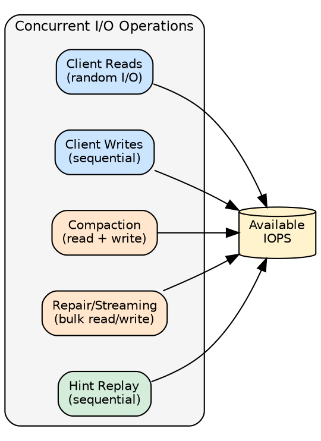

# Hardware Recommendations for Cassandra

Select and configure hardware for optimal Cassandra performance.

## CPU

### Requirements

| Environment | Cores | Notes |
|-------------|-------|-------|
| Development | 2-4 | Minimum viable |
| Production | 8-16 | Standard workloads |
| Heavy workloads | 16-32 | High throughput |

### Guidelines

- More cores = better concurrent request handling
- Higher clock speed benefits single-threaded compaction
- Prefer modern architectures (Intel Xeon, AMD EPYC)
- Enable hyperthreading for mixed workloads

## Memory (RAM)

### Sizing

| Environment | RAM | Notes |
|-------------|-----|-------|
| Development | 8-16GB | Minimum viable |
| Production | 32-64GB | Typical deployments |

RAM is used for JVM heap (up to 31GB), off-heap structures (bloom filters, indexes), and OS page cache. More RAM allows larger page cache, which improves read performance for frequently accessed data.

### Memory Distribution Example (64GB)

```
Total RAM: 64GB
├── JVM Heap: 24GB
├── Off-heap: 4-8GB (varies with data)
└── OS Page Cache: remaining
```

## Storage

Storage is the most critical hardware component for Cassandra performance. Cassandra's LSM-tree architecture generates significant I/O through concurrent reads, writes, compaction, and repair operations. Undersized storage creates bottlenecks that cannot be compensated by faster CPUs or more memory.

### Why SSDs Are Required

Cassandra's workload characteristics make SSDs essential for production:

| Operation | I/O Pattern | Why SSDs Excel |
|-----------|-------------|----------------|
| Reads | Random | SSDs: ~0.1ms seek vs HDD: ~10ms |
| Writes | Sequential | SSDs handle concurrent streams |
| Compaction | Mixed read/write | Runs continuously in background |
| Bloom filters | Random reads | Small random reads at query time |

!!! warning "Spinning Disks"
    HDDs are unsuitable for production Cassandra. A single HDD provides ~150 IOPS with 10ms latency. Under compaction load, query latency becomes unpredictable and repair operations can take days instead of hours.

### SSD Types and Selection

#### Interface Comparison

| Interface | Max Bandwidth | Typical IOPS | Latency | Use Case |
|-----------|---------------|--------------|---------|----------|
| NVMe (PCIe 4.0) | 7,000 MB/s | 500K-1M+ | 10-20μs | High performance |
| NVMe (PCIe 3.0) | 3,500 MB/s | 200K-500K | 20-50μs | Standard production |
| SATA III | 550 MB/s | 50K-100K | 50-100μs | Budget production |
| SAS 12Gbps | 1,200 MB/s | 100K-200K | 30-50μs | Enterprise arrays |

#### Enterprise vs Consumer SSDs

| Feature | Enterprise SSD | Consumer SSD |
|---------|----------------|--------------|
| Endurance (TBW) | 3-10+ DWPD | 0.3-1 DWPD |
| Power loss protection | Full capacitor backup | Partial or none |
| Sustained performance | Consistent | Degrades under load |
| Warranty | 5 years | 3-5 years |
| Cost | 2-3x higher | Lower |

!!! tip "Enterprise SSDs Recommended"
    Cassandra's continuous compaction creates sustained write pressure. Consumer SSDs may exhibit performance degradation after garbage collection fills the drive. Enterprise SSDs maintain consistent performance under sustained load.

**DWPD (Drive Writes Per Day)**: Indicates endurance. A 1TB drive with 1 DWPD can sustain 1TB of writes daily for its warranty period. Cassandra's write amplification from compaction means actual drive writes exceed application writes by 2-10x depending on compaction strategy.

#### Recommended SSD Models

| Category | Example Models | Notes |
|----------|----------------|-------|
| Enterprise NVMe | Intel P5510, Samsung PM9A3, Micron 7450 | Best performance and endurance |
| Enterprise SATA | Samsung PM893, Intel S4610, Micron 5300 | Good balance of cost and performance |
| Cloud | AWS io2, GCP pd-extreme, Azure Ultra | Provisioned IOPS available |

### IOPS Requirements

#### Why More IOPS Is Better

Cassandra performs multiple I/O operations concurrently:



| Operation | IOPS Consumption | Pattern |
|-----------|------------------|---------|
| Client reads | 1-10 per query | Random reads across SSTables |
| Client writes | 1 per write | Sequential to commit log |
| Compaction | 10-50% of capacity | Sustained read/write |
| Repair | 20-80% during validation | Bulk sequential |
| Streaming | Throttled (default ~25 MB/s) | Bulk sequential |

#### IOPS Considerations

Cassandra is I/O efficient by design:

- **Writes**: Sequential to commit log, buffered in memtables - minimal IOPS
- **Reads**: Often served from page cache or key cache - IOPS depends on cache hit rate
- **Compaction**: Mostly sequential I/O, runs in background

Actual IOPS requirements vary significantly based on cache hit rates, read/write ratio, and data model. A well-tuned cluster with good cache hit rates requires far fewer IOPS than raw operation counts suggest.

!!! tip "Size by Monitoring"
    Rather than estimating IOPS requirements upfront, monitor actual disk utilization with `iostat`. If `%util` stays consistently high (>70%) or `await` increases, storage is the bottleneck.

#### Measuring IOPS Requirements

```bash
# Monitor current IOPS usage
iostat -x 1

# Key metrics:
# r/s     - reads per second
# w/s     - writes per second
# await   - average I/O wait time (should be < 1ms for NVMe)
# %util   - utilization (sustained > 80% indicates bottleneck)
```

### Bandwidth (Throughput)

SATA SSDs (~550 MB/s) are sufficient for most production workloads. Bandwidth matters primarily for:

- **Compaction**: Background merging of SSTables
- **Streaming**: Throttled by default (~25 MB/s via `stream_throughput_outbound_megabits_per_sec`)
- **Repair**: Merkle tree validation and data synchronization

NVMe provides higher bandwidth that can speed up compaction and repair, but is not required for most deployments.

### Disk Configuration

With NVMe, a single disk is sufficient for all Cassandra directories (data, commit log, hints). NVMe's high IOPS and low latency eliminate the need for separate devices that was common with SATA or spinning disks.

Separating commit log to a dedicated device may still provide marginal benefit in extremely write-heavy workloads, but is generally unnecessary for modern NVMe deployments.

### Capacity Planning

```
Required capacity = Data size × Replication Factor × Compaction overhead × Safety margin

Components:
- Data size: Raw application data
- Replication Factor: Typically 3
- Compaction overhead: 1.5x for STCS, 1.1x for LCS
- Safety margin: 1.2x (for growth and temporary files)
```

**Example calculation:**

```
Application data: 500GB
Replication factor: 3
Compaction strategy: STCS (1.5x overhead)
Safety margin: 1.2x

Per-node capacity = 500GB × 1.5 × 1.2 = 900GB
Cluster capacity = 900GB × 3 nodes = 2.7TB total
```

!!! note "Disk Space for Compaction"
    Cassandra requires free disk space for compaction. The amount needed depends on table sizes and compaction strategy. STCS on a single large table may temporarily double that table's disk usage during compaction. With many smaller tables or LCS, space requirements are lower. Monitor disk usage and ensure headroom for the largest table's compaction.

### Multiple Disks

With SSDs, RAID is generally unnecessary. Cassandra's replication provides data redundancy at the application level.

**Multiple SSDs**: Use LVM to combine disks into a single logical volume. This simplifies backup operations and Cassandra configuration compared to listing multiple `data_file_directories`.

```bash
# Example: Create LVM volume from multiple disks
pvcreate /dev/nvme1n1 /dev/nvme2n1
vgcreate cassandra_vg /dev/nvme1n1 /dev/nvme2n1
lvcreate -l 100%FREE -n data cassandra_vg
mkfs.xfs /dev/cassandra_vg/data
```

!!! warning "Avoid Multiple data_file_directories"
    While Cassandra supports multiple `data_file_directories`, this complicates backup and restore operations. Use LVM to present multiple disks as a single volume.

**Single SSD**: Common in cloud deployments. No additional configuration needed.

### Cloud Storage Considerations

#### AWS EBS vs Instance Store

| Storage Type | IOPS | Latency | Persistence | Use Case |
|--------------|------|---------|-------------|----------|
| gp3 | Up to 16K | Moderate | Persistent | Most production workloads |
| io2 Block Express | Up to 256K | Low | Persistent | High-performance requirements |
| Instance Store (NVMe) | Very high | Lowest | Lost on stop | Highest performance (ephemeral) |

#### Provisioned IOPS

Cloud storage often requires explicit IOPS provisioning:

```bash
# AWS gp3 example
# Base: 3,000 IOPS, 125 MB/s
# Can provision up to 16,000 IOPS, 1,000 MB/s

# AWS io2 example
# Up to 64,000 IOPS per volume
# Up to 256,000 IOPS with Block Express
```

| Cloud Provider | High-Performance Option | Max IOPS |
|----------------|------------------------|----------|
| AWS | io2 Block Express | 256,000 |
| GCP | pd-extreme | 120,000 |
| Azure | Ultra Disk | 160,000 |

### Storage Performance Monitoring

Key metrics to track:

| Metric | Healthy Range | Action if Exceeded |
|--------|---------------|-------------------|
| Disk utilization | < 50% | Add capacity or nodes |
| I/O await | < 1ms (NVMe), < 5ms (SATA) | Upgrade storage or reduce load |
| IOPS utilization | < 70% | Provision more IOPS |
| Compaction pending | < 100 | Increase compaction throughput |

```bash
# Monitor disk I/O
iostat -xm 5

# Check compaction backlog
nodetool compactionstats

# View pending compactions
nodetool tpstats | grep -i compaction
```

## Network

### Requirements

| Environment | Bandwidth | Notes |
|-------------|-----------|-------|
| Single DC | 1 Gbps | Minimum |
| Production | 10 Gbps | Recommended |
| Heavy replication | 25+ Gbps | Multi-DC, high throughput |

### Latency

- Same rack: < 0.5ms
- Same DC: < 1ms
- Cross-DC: Plan for 20-100ms+

## Reference Configurations

### Development

```
CPU: 4 cores
RAM: 16GB
Storage: 256GB SSD
Network: 1 Gbps
```

### Small Production

```
CPU: 8 cores
RAM: 32GB
Storage: 1TB NVMe
Network: 10 Gbps
```

### Standard Production

```
CPU: 16 cores
RAM: 64GB
Storage: 2TB NVMe × 2 (JBOD)
Network: 10 Gbps
```

### High Performance

```
CPU: 32 cores
RAM: 128GB
Storage: 2TB NVMe × 4 (JBOD)
Network: 25 Gbps
```

## Cloud Instance Types

### AWS

| Workload | Instance | vCPU | RAM | Storage |
|----------|----------|------|-----|---------|
| Dev | m5.xlarge | 4 | 16GB | gp3 |
| Small | i3.2xlarge | 8 | 61GB | NVMe |
| Standard | i3.4xlarge | 16 | 122GB | NVMe |
| Heavy | i3.8xlarge | 32 | 244GB | NVMe |

### GCP

| Workload | Instance | vCPU | RAM |
|----------|----------|------|-----|
| Dev | n2-standard-4 | 4 | 16GB |
| Small | n2-highmem-8 | 8 | 64GB |
| Standard | n2-highmem-16 | 16 | 128GB |

### Azure

| Workload | Instance | vCPU | RAM |
|----------|----------|------|-----|
| Dev | Standard_D4s_v3 | 4 | 16GB |
| Small | Standard_L8s_v2 | 8 | 64GB |
| Standard | Standard_L16s_v2 | 16 | 128GB |

## Sizing Calculator

```
Nodes needed = (Data size × RF) / (Storage per node × 0.5)

Example:
- 2TB raw data
- RF = 3
- 1TB storage per node
- Nodes = (2TB × 3) / (1TB × 0.5) = 12 nodes
```

## Anti-Patterns

| Issue | Problem | Solution |
|-------|---------|----------|
| Spinning disks | Slow compaction, high latency | Use SSDs |
| Small heap | Frequent GC, instability | Proper sizing |
| Overprovisioned heap | Wasted RAM, long GC | Max 31GB |
| Network congestion | Timeouts, inconsistency | 10Gbps+ |
| Heterogeneous cluster | Uneven load | Uniform hardware |

---

## Next Steps

- **[OS Tuning](../os-tuning/index.md)** - Operating system optimization
- **[JVM Tuning](../jvm-tuning/index.md)** - JVM configuration
- **[Cloud Deployment](../../../cloud/index.md)** - Cloud-specific guidance
