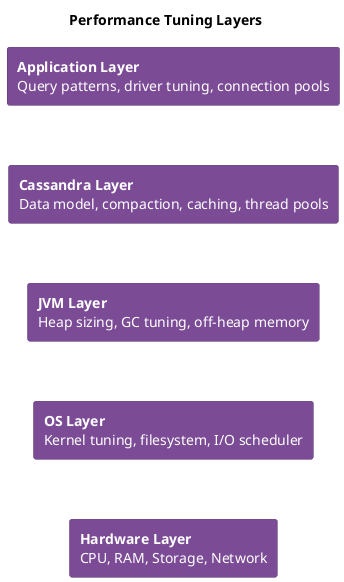

# Cassandra Performance Tuning Guide

Out of the box, Cassandra is configured to not crash—not to perform well. The default heap is small, compaction is throttled, and the OS settings are whatever your distribution ships with. These defaults make sense for trying Cassandra on a laptop, not for production.

Proper tuning happens at multiple layers: JVM (heap size and garbage collector), OS (disable swap, disable transparent huge pages, raise file descriptor limits), and Cassandra configuration (compaction throughput, thread pools, memtable sizing). Getting these right can mean 10x better throughput or 5x lower latency.

This guide covers what to tune, how to tune it, and how to measure whether it worked.

!!! info "Measure Before Tuning"
    Always establish baseline metrics before making changes. Tune one parameter at a time and measure the impact. Changes that improve one workload may degrade another.

## Performance Overview

### Performance Layers



### Key Performance Metrics

| Metric | Good | Warning | Critical |
|--------|------|---------|----------|
| Read Latency p99 | < 10ms | 10-100ms | > 100ms |
| Write Latency p99 | < 5ms | 5-50ms | > 50ms |
| CPU Utilization | < 50% | 50-70% | > 70% |
| Heap Usage | < 60% | 60-80% | > 80% |
| Pending Compactions | < 10 | 10-50 | > 50 |
| GC Pause Time | < 200ms | 200-500ms | > 500ms |

---

---

## Hardware Recommendations

### CPU

| Workload Type | Recommended | Cores | Notes |
|---------------|-------------|-------|-------|
| Development | Any modern | 2-4 | Testing only |
| Light production | Intel Xeon / AMD EPYC | 8-16 | Small clusters |
| Heavy production | High-freq Xeon / EPYC | 16-32 | Write-heavy |
| Enterprise | Latest gen server CPUs | 32+ | Large partitions |

**Key considerations**:
- Clock speed matters more than core count for most workloads
- Compression and compaction benefit from multiple cores
- Avoid CPU throttling (disable power saving)

### Memory

| Use Case | Recommended RAM | Heap Size |
|----------|-----------------|-----------|
| Development | 8GB | 2-4GB |
| Production (light) | 32GB | 8GB |
| Production (standard) | 64GB | 16-24GB |
| Production (heavy) | 128GB+ | 31GB max |

**Memory allocation**:
```
Total RAM = JVM Heap + Off-Heap + OS Cache + Headroom

Example (64GB server):
- JVM Heap: 16GB
- Off-Heap (memtables, bloom filters, etc.): 8GB
- OS Page Cache: 32GB
- Headroom: 8GB
```

### Storage

| Storage Type | IOPS | Latency | Best For |
|--------------|------|---------|----------|
| HDD (7.2K) | 100-150 | 5-15ms | Archive only |
| SSD (SATA) | 30K-100K | 0.1-0.5ms | Development |
| SSD (NVMe) | 100K-500K | 0.02-0.1ms | Production |
| NVMe (Enterprise) | 500K-1M+ | < 0.02ms | High performance |

**Storage guidelines**:
- Minimum 2TB per node recommended
- Separate commit log from data (if possible)
- Plan for 50% headroom for compaction
- RAID: Use RAID 0 or JBOD (Cassandra handles replication)

### Network

| Environment | Bandwidth | Latency |
|-------------|-----------|---------|
| Same rack | 10 Gbps | < 0.5ms |
| Same DC | 10 Gbps | < 1ms |
| Cross-DC | 1+ Gbps | < 100ms |

---

## JVM Tuning Quick Reference

### Heap Sizing Rules

```bash
# jvm11-server.options

# Rule: Heap should be 1/4 of RAM, max 31GB (for compressed oops)
-Xms16G
-Xmx16G

# For servers with 64GB RAM:
# -Xms16G -Xmx16G (recommended)

# For servers with 128GB+ RAM:
# -Xms31G -Xmx31G (max for compressed oops)
```

### G1GC Configuration (Recommended)

```bash
# Use G1GC (default in modern Cassandra)
-XX:+UseG1GC

# Pause time target (balance throughput vs latency)
-XX:MaxGCPauseMillis=500

# Heap occupancy trigger
-XX:InitiatingHeapOccupancyPercent=70

# String deduplication (saves memory)
-XX:+UseStringDeduplication

# GC logging
-Xlog:gc*:file=/var/log/cassandra/gc.log:time,uptime:filecount=10,filesize=10M
```

### ZGC Configuration (JDK 17+, Low Latency)

```bash
# Use ZGC for sub-millisecond pauses
-XX:+UseZGC
-XX:+ZGenerational

# Soft max heap (allows expansion under pressure)
-XX:SoftMaxHeapSize=28G  # With -Xmx31G
```

### Off-Heap Memory

```yaml
# cassandra.yaml
# Memtables can use off-heap memory
memtable_heap_space_in_mb: 2048
memtable_offheap_space_in_mb: 2048

# File system cache is critical - do not starve it!
```

---

## OS Tuning Quick Reference

### Essential sysctl Settings

```bash
# /etc/sysctl.d/99-cassandra.conf

# Disable swap usage
vm.swappiness = 1

# Increase max memory map areas
vm.max_map_count = 1048575

# Network buffers
net.core.rmem_max = 16777216
net.core.wmem_max = 16777216
net.core.rmem_default = 16777216
net.core.wmem_default = 16777216
net.core.optmem_max = 40960
net.ipv4.tcp_rmem = 4096 87380 16777216
net.ipv4.tcp_wmem = 4096 65536 16777216

# Connection handling
net.core.somaxconn = 65535
net.ipv4.tcp_max_syn_backlog = 65535

# Apply changes
sudo sysctl -p /etc/sysctl.d/99-cassandra.conf
```

### File Descriptor Limits

```bash
# /etc/security/limits.d/cassandra.conf
cassandra soft memlock unlimited
cassandra hard memlock unlimited
cassandra soft nofile 1048576
cassandra hard nofile 1048576
cassandra soft nproc 32768
cassandra hard nproc 32768
cassandra soft as unlimited
cassandra hard as unlimited
```

### Disable Swap

```bash
# Temporary
sudo swapoff -a

# Permanent - edit /etc/fstab
# Comment out swap entries
```

### Disable Transparent Huge Pages (THP)

```bash
# Temporary
echo never > /sys/kernel/mm/transparent_hugepage/enabled
echo never > /sys/kernel/mm/transparent_hugepage/defrag

# Permanent - add to /etc/rc.local or systemd service
```

### I/O Scheduler

```bash
# Check current scheduler
cat /sys/block/sda/queue/scheduler

# Set to none/noop for SSDs (temporary)
echo none > /sys/block/sda/queue/scheduler

# For NVMe, default is typically correct
```

---

## Query Optimization

### Efficient Query Patterns

**Do - Partition key queries**:
```sql
-- Fast: Uses partition key
SELECT * FROM users WHERE user_id = ?;

-- Fast: Partition key with clustering range
SELECT * FROM messages
WHERE user_id = ?
  AND sent_at >= '2024-01-01'
  AND sent_at < '2024-02-01';
```

**Avoid - Full table scans**:
```sql
-- Slow: No partition key (requires ALLOW FILTERING)
SELECT * FROM users WHERE age > 30 ALLOW FILTERING;

-- Slow: Large IN clause
SELECT * FROM users WHERE user_id IN (?, ?, ?, ..., ?); -- 100+ values
```

### Prepared Statements

```java
// Good: Prepare once, execute many
PreparedStatement prepared = session.prepare(
    "SELECT * FROM users WHERE user_id = ?");

for (UUID userId : userIds) {
    BoundStatement bound = prepared.bind(userId);
    session.execute(bound);
}

// Bad: Prepare every time
for (UUID userId : userIds) {
    session.execute(
        "SELECT * FROM users WHERE user_id = " + userId);
}
```

**Benefits**:
- Query parsed once
- Reduced network traffic
- Better server-side caching
- Protection against CQL injection

### Pagination for Large Results

```java
// Use automatic paging
Statement statement = SimpleStatement.builder("SELECT * FROM large_table")
    .setPageSize(1000)
    .build();

ResultSet rs = session.execute(statement);
for (Row row : rs) {
    // Process row
    // Driver automatically fetches next page
}

// Or manual paging with state
ByteBuffer pagingState = null;
do {
    Statement stmt = SimpleStatement.builder("SELECT * FROM large_table")
        .setPageSize(1000)
        .setPagingState(pagingState)
        .build();

    ResultSet rs = session.execute(stmt);
    pagingState = rs.getExecutionInfo().getPagingState();

    for (Row row : rs.currentPage()) {
        // Process row
    }
} while (pagingState != null);
```

### When to Use Batches

**Good use of batches** (same partition):
```sql
-- Atomic updates to denormalized tables
BEGIN BATCH
    INSERT INTO users (user_id, email) VALUES (?, ?);
    INSERT INTO users_by_email (email, user_id) VALUES (?, ?);
APPLY BATCH;
```

**Bad use of batches** (different partitions):
```sql
-- DON'T use batches as a performance optimization
BEGIN BATCH
    INSERT INTO logs (log_id, message) VALUES (uuid(), 'msg1');
    INSERT INTO logs (log_id, message) VALUES (uuid(), 'msg2');
    INSERT INTO logs (log_id, message) VALUES (uuid(), 'msg3');
    -- ... 100 more inserts to different partitions
APPLY BATCH;
-- This is SLOWER than individual inserts!
```

---

## Compaction Tuning

### Strategy Selection

| Strategy | Best For | Write Amp | Read Amp | Space Amp |
|----------|----------|-----------|----------|-----------|
| STCS | Write-heavy, general | Low | High | High |
| LCS | Read-heavy, updates | High | Low | Low |
| TWCS | Time-series, TTL | Low | Low | Low |
| UCS | Universal (4.0+) | Configurable | Configurable | Configurable |

### Compaction Throughput

```yaml
# cassandra.yaml

# Increase for faster compaction (uses more I/O)
compaction_throughput_mb_per_sec: 64  # Default: 64

# More compaction threads
concurrent_compactors: 4  # Default: based on disks

# Limit compaction during peak hours
# Use nodetool: nodetool setcompactionthroughput 32
```

### Monitor Compaction

```bash
# Check pending compactions
nodetool compactionstats

# Check compaction history
nodetool compactionhistory

# Metrics to watch
# - PendingTasks
# - TotalCompactionsCompleted
# - BytesCompacted
```

---

## Caching Configuration

### Key Cache

```yaml
# cassandra.yaml

# Partition key locations cache
key_cache_size_in_mb: 100  # Auto-sized by default

# Save interval
key_cache_save_period: 14400  # seconds
```

### Row Cache (Use Carefully)

```yaml
# Generally NOT recommended for production
row_cache_size_in_mb: 0  # Disabled by default

# If used, set per-table
# ALTER TABLE ks.table WITH caching = {'rows_per_partition': '100'};
```

### Chunk Cache (Cassandra 4.0+)

```yaml
# Off-heap cache for compressed data chunks
# Auto-configured based on available memory
```

### Monitoring Cache Effectiveness

```bash
# Check cache hit rates
nodetool info | grep "Cache"

# Per-table cache stats
nodetool tablestats keyspace.table | grep -i cache
```

---

## Benchmarking with cassandra-stress

### Basic Read/Write Test

```bash
# Write 1M rows
cassandra-stress write n=1000000 -rate threads=50

# Read 1M rows
cassandra-stress read n=1000000 -rate threads=50

# Mixed workload (50% read, 50% write)
cassandra-stress mixed ratio\(write=1,read=1\) n=1000000 -rate threads=50
```

### Custom Schema Test

```yaml
# stress_profile.yaml
keyspace: test_ks
table: test_table

columnspec:
  - name: id
    size: uniform(1..10)
    population: uniform(1..1000000)
  - name: data
    size: gaussian(100..500, 200, 50)

insert:
  partitions: fixed(1)
  batchtype: UNLOGGED

queries:
  read:
    cql: SELECT * FROM test_table WHERE id = ?
    fields: samerow
```

```bash
# Run with profile
cassandra-stress user profile=stress_profile.yaml \
    ops\(insert=1,read=3\) n=1000000 -rate threads=100
```

### Results Analysis

```
Results:
  Op rate                   :   15,234 op/s  [READ: 11,425 op/s, WRITE: 3,809 op/s]
  Partition rate            :   15,234 pk/s  [READ: 11,425 pk/s, WRITE: 3,809 pk/s]
  Row rate                  :   15,234 row/s [READ: 11,425 row/s, WRITE: 3,809 row/s]
  Latency mean              :    3.2 ms [READ: 2.8 ms, WRITE: 4.5 ms]
  Latency median            :    2.1 ms [READ: 1.9 ms, WRITE: 3.2 ms]
  Latency 95th percentile   :    8.5 ms [READ: 7.2 ms, WRITE: 12.1 ms]
  Latency 99th percentile   :   15.3 ms [READ: 12.8 ms, WRITE: 21.5 ms]
  Latency 99.9th percentile :   45.2 ms [READ: 38.1 ms, WRITE: 62.3 ms]
  Latency max               :  125.4 ms [READ: 98.2 ms, WRITE: 125.4 ms]
```

---

## Performance Checklist

### Before Production

- [ ] Hardware meets requirements (SSD, adequate RAM)
- [ ] Heap sized appropriately (max 31GB)
- [ ] G1GC or ZGC configured
- [ ] Swap disabled
- [ ] THP disabled
- [ ] File limits increased
- [ ] sysctl tuned
- [ ] Network latency < 1ms within DC

### Data Model

- [ ] Partition sizes < 100MB
- [ ] No unbounded partition growth
- [ ] Queries use partition key
- [ ] No ALLOW FILTERING in production
- [ ] Appropriate compaction strategy per table

### Application

- [ ] Using prepared statements
- [ ] Connection pooling configured
- [ ] Appropriate consistency levels
- [ ] Pagination for large results
- [ ] Token-aware routing enabled

### Monitoring

- [ ] Latency metrics tracked
- [ ] GC pauses monitored
- [ ] Pending compactions alerting
- [ ] Disk usage alerts
- [ ] Dropped messages monitoring

---

## Read Performance Tuning

### Diagnosing Slow Reads

```bash
# Step 1: Identify affected tables
nodetool tablestats <keyspace> | grep -A 15 "Table:"

# Step 2: Check read latency breakdown
nodetool proxyhistograms

# Step 3: Check for tombstone issues
nodetool tablestats <keyspace>.<table> | grep -i tombstone

# Step 4: Check SSTable count
nodetool cfstats <keyspace>.<table> | grep "SSTable count"

# Step 5: Check bloom filter effectiveness
nodetool tablestats <keyspace>.<table> | grep -i bloom
```

### Common Read Performance Issues

#### High SSTable Count

**Symptoms:** Read latency increases over time, many SSTables per read

**Diagnosis:**
```bash
nodetool tablestats <keyspace>.<table> | grep "SSTable count"
# Healthy: <10 for STCS, <100 total for LCS
```

**Solutions:**

```bash
# Force compaction to reduce SSTable count
nodetool compact <keyspace> <table>
```

```sql
-- Adjust compaction strategy if needed
ALTER TABLE <keyspace>.<table>
WITH compaction = {
    'class': 'LeveledCompactionStrategy',
    'sstable_size_in_mb': 160
};
```

#### Excessive Tombstones

**Symptoms:** Read latency spikes, "TombstoneOverwhelmingException" in logs

**Diagnosis:**
```bash
nodetool tablestats <keyspace>.<table> | grep -i tombstone
# Warning if tombstones_per_read > 1000
```

**Solutions:**

```sql
-- Reduce gc_grace_seconds if repair runs frequently
ALTER TABLE <keyspace>.<table>
WITH gc_grace_seconds = 86400;  -- 1 day instead of 10 days
```

```bash
# Force major compaction to purge tombstones
nodetool compact <keyspace> <table>
```

#### Poor Cache Hit Rates

**Symptoms:** High disk reads, low cache hit rates

**Diagnosis:**
```bash
nodetool info | grep -i cache
# Key cache hit rate should be >80%
```

**Solutions:**

```yaml
# cassandra.yaml - increase key cache
key_cache_size_in_mb: 100  # Default: auto (5% heap)

# Enable row cache for frequently accessed tables (use sparingly)
# ALTER TABLE with row_cache_enabled = true
```

### Read Path Optimization Summary

| Optimization | Impact | Configuration |
|--------------|--------|---------------|
| Increase key cache | Fewer index lookups | `key_cache_size_in_mb` |
| Use prepared statements | Reduced parsing | Application code |
| Token-aware routing | Reduced coordinator hops | Driver configuration |
| Appropriate consistency | Fewer replicas read | Application code |
| Compression | Faster disk reads | Table compression settings |

---

## Write Performance Tuning

### Diagnosing Slow Writes

```bash
# Step 1: Check write latency
nodetool proxyhistograms

# Step 2: Check memtable status
nodetool tpstats | grep -i memtable

# Step 3: Check commit log disk
df -h /var/lib/cassandra/commitlog
iostat -x 1 5

# Step 4: Check pending mutations
nodetool tpstats | grep -i mutation

# Step 5: Check if compaction is overwhelming
nodetool compactionstats
```

### Common Write Performance Issues

#### Commit Log Contention

**Symptoms:** Write latency spikes, commit log disk at 100% utilization

**Solutions:**

```yaml
# cassandra.yaml - use separate disk for commitlog
commitlog_directory: /mnt/commitlog  # SSD recommended

# Adjust sync mode
commitlog_sync: periodic
commitlog_sync_period_in_ms: 10000  # Default

# Or for durability-critical workloads
commitlog_sync: batch
commitlog_sync_batch_window_in_ms: 2
```

#### Memtable Flush Bottleneck

**Symptoms:** Memtable flush taking too long, high memory pressure

**Solutions:**

```yaml
# cassandra.yaml
memtable_cleanup_threshold: 0.33  # Flush when 33% of heap in memtables
memtable_flush_writers: 4         # Increase for more flush parallelism
```

#### Compaction Falling Behind

**Symptoms:** Growing pending compactions, disk space increasing

**Solutions:**

```yaml
# cassandra.yaml - increase compaction throughput
compaction_throughput_mb_per_sec: 64  # Default 64, increase if disk allows

# Increase concurrent compactors
concurrent_compactors: 4  # Default: min(num_cpus, disk_count)
```

```bash
# Runtime adjustment
nodetool setcompactionthroughput 128
```

### Write Path Optimization Summary

| Optimization | Impact | Configuration |
|--------------|--------|---------------|
| Separate commit log disk | Reduced write latency | `commitlog_directory` |
| Increase memtable size | Fewer flushes | `memtable_heap_space_in_mb` |
| Tune commit log sync | Latency vs durability | `commitlog_sync` |
| Batch writes | Amortized overhead | Application batching |
| Use UNLOGGED batches | Reduced coordinator work | For same-partition writes |

---

## Troubleshooting Performance

### Systematic Investigation

```bash
#!/bin/bash
# performance-investigation.sh

echo "=== System Resources ==="
top -bn1 | head -20
free -h
df -h /var/lib/cassandra

echo -e "\n=== Cassandra Status ==="
nodetool status
nodetool tpstats | grep -v "^$"

echo -e "\n=== Latency Histograms ==="
nodetool proxyhistograms

echo -e "\n=== Compaction Status ==="
nodetool compactionstats

echo -e "\n=== GC Stats ==="
nodetool gcstats

echo -e "\n=== Recent Errors ==="
tail -50 /var/log/cassandra/system.log | grep -i error
```

### Common Issues Quick Reference

| Symptom | First Check | Common Cause |
|---------|-------------|--------------|
| High read latency | `nodetool tablestats` | Tombstones, SSTable count |
| High write latency | `iostat`, commit log disk | Disk saturation |
| Request timeouts | `nodetool tpstats` | Thread pool exhaustion |
| Memory pressure | `nodetool info` | Heap too small, large partitions |
| Cluster imbalance | `nodetool status` | Uneven token distribution |

---

## AxonOps Performance Management

Identifying and resolving performance issues requires correlating metrics, analyzing query patterns, and understanding the impact of configuration changes. [AxonOps](https://axonops.com) provides tools that simplify performance management.

### Performance Analytics

AxonOps provides:

- **Slow query identification**: Automatic detection and ranking of slow queries
- **Query pattern analysis**: Identify inefficient access patterns
- **Hot partition detection**: Find partitions causing load imbalance
- **Historical comparison**: Compare current performance to baselines

### Capacity Planning

- **Growth forecasting**: Predict when capacity will be exhausted
- **Trend analysis**: Identify gradual performance degradation
- **What-if modeling**: Simulate impact of configuration changes
- **Right-sizing recommendations**: Optimize resource allocation

### Configuration Management

- **Configuration drift detection**: Identify nodes with different settings
- **Change tracking**: Audit log of all configuration changes
- **Impact analysis**: Correlate configuration changes with performance
- **Rollback guidance**: Quickly identify when changes caused issues

See the [AxonOps documentation](/monitoring/) for performance management features.

---

## Next Steps

- **[Monitoring Guide](../monitoring/index.md)** - Monitoring cluster health
- **[Compaction Management](../compaction-management/index.md)** - Compaction tuning details
- **[Maintenance](../maintenance/index.md)** - Maintenance for performance
- **[Architecture: Read Path](../../architecture/storage-engine/read-path.md)** - Understanding read performance
- **[Architecture: Write Path](../../architecture/storage-engine/write-path.md)** - Understanding write performance
