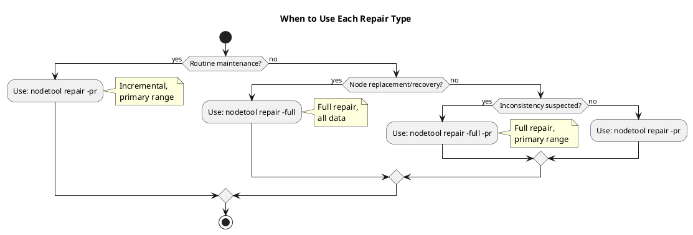

# Repair Operations Guide

This guide covers the operational aspects of running and managing Cassandra repair: command syntax, scheduling strategies, monitoring, and troubleshooting. For the theoretical foundations of how repair works—including Merkle trees, anti-entropy mechanisms, and replica synchronization—refer to the [Replica Synchronization](../../architecture/distributed-data/replica-synchronization.md) documentation in the Architecture section.

## Purpose of This Guide

This operational guide addresses:

- **How to run repair** - Command options and syntax
- **When to run repair** - Scheduling within gc_grace_seconds
- **Which strategy to use** - Sequential, parallel, or segmented approaches
- **How to monitor repair** - Progress tracking and verification
- **How to troubleshoot** - Common issues and resolutions

## Critical Constraint: gc_grace_seconds

**Repair must complete on all nodes within `gc_grace_seconds` to prevent deleted data from resurrecting.**

| Parameter | Default | Significance |
|-----------|---------|--------------|
| gc_grace_seconds | 864000 (10 days) | Maximum time before tombstones are garbage collected |

If a node misses a tombstone and repair does not propagate it before garbage collection, the deleted data reappears—known as "zombie data." For detailed explanation of this mechanism, see [Tombstones](../../architecture/storage-engine/tombstones.md).

---

## Guide Contents

### [Concepts](concepts.md)

Operational concepts for repair execution:

- Full vs incremental repair
- Primary range repair (-pr)
- Repaired vs unrepaired SSTables
- Anti-compaction behavior
- Table iteration during repair

### [Options Reference](options-reference.md)

Complete reference for all repair command options:

- Scope options: `-pr`, `-full`, `-st`/`-et`
- Parallelism options: `--parallel`, `-seq`, `-dcpar`, `-j`
- Scope limiting: `-dc`, `-local`, `-hosts`
- Operational options: `--preview`, `--trace`, `-os`

### [Strategies](strategies.md)

Implementation strategies for different environments:

- Sequential single-node repair (small clusters)
- Parallel multi-node repair (medium clusters)
- Segmented subrange repair (large data volumes)
- Continuous repair (large clusters)

### [Scheduling](scheduling.md)

Planning and maintaining repair schedules:

- Timeline calculations
- Schedule planning worksheets
- Off-peak timing recommendations
- Compliance monitoring
- Handling disruptions

---

## Quick Reference

### Common Commands

```bash
# Standard primary-range incremental repair (recommended for routine maintenance)
nodetool repair -pr my_keyspace

# Full repair after node recovery
nodetool repair -full my_keyspace

# Parallel repair for faster execution
nodetool repair -pr --parallel my_keyspace

# Sequential repair for minimal impact
nodetool repair -pr -seq my_keyspace

# Repair specific table
nodetool repair -pr my_keyspace my_table

# Repair with multiple table threads
nodetool repair -pr -j 4 my_keyspace

# Preview repair without executing
nodetool repair -pr --preview my_keyspace
```

### Monitoring Commands

```bash
# Check active repair sessions
nodetool repair_admin list

# Monitor streaming progress
nodetool netstats | grep -i repair

# Check percent repaired
nodetool tablestats my_keyspace | grep -i "percent repaired"

# Cancel stuck repair
nodetool repair_admin cancel <repair_id>
```

### Repair Type Selection



---

## Strategy Selection

| Cluster Size | Data per Node | Recommended Strategy | Typical Duration |
|--------------|---------------|---------------------|------------------|
| 3-6 nodes | < 500 GB | Sequential | Hours |
| 6-20 nodes | < 500 GB | Parallel | Hours |
| 6-20 nodes | > 500 GB | Segmented | Hours-Days |
| 20-50 nodes | Any | Parallel + Segmented | Days |
| 50+ nodes | Any | Continuous (AxonOps) | Ongoing |

---

## Repair with AxonOps

AxonOps provides automated repair scheduling with:

- Intelligent scheduling across nodes
- Automatic load-based throttling
- Failure detection and retry
- Progress monitoring and alerting
- Repair history and compliance tracking

---

## Best Practices

### Recommended

- Use `-pr` flag for routine maintenance
- Schedule repairs during off-peak hours
- Monitor repair completion and percent repaired metrics
- Use automated tools for large clusters
- Maintain buffer time before gc_grace_seconds deadline
- Test repair procedures in non-production first

### Avoid

- Running repair on all nodes simultaneously
- Skipping repair for extended periods
- Running repair during traffic spikes
- Ignoring repair failures
- Reducing gc_grace_seconds without faster repair cycles

---

## Related Documentation

**Architecture (Theory):**

- [Replica Synchronization](../../architecture/distributed-data/replica-synchronization.md) - Anti-entropy mechanisms
- [Tombstones](../../architecture/storage-engine/tombstones.md) - Deletion markers and gc_grace_seconds
- [Consistency](../../architecture/distributed-data/consistency.md) - Consistency levels and guarantees

**Operations:**

- [nodetool repair](../nodetool/repair.md) - Command reference
- [nodetool repair_admin](../nodetool/repair_admin.md) - Repair session management
- [Backup & Restore](../backup-restore/index.md) - Data protection procedures
- [Troubleshooting](../../troubleshooting/index.md) - Problem resolution guides
