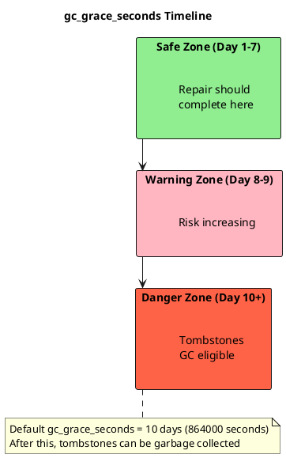
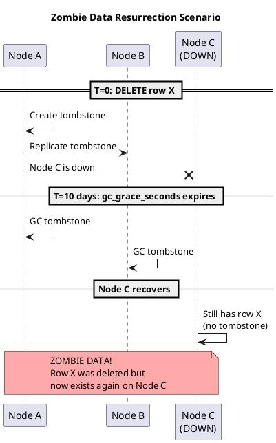
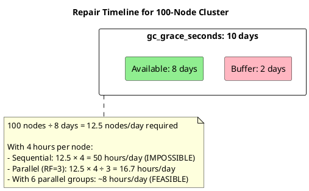
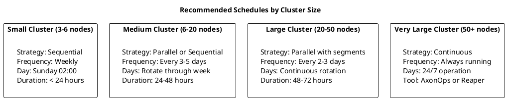
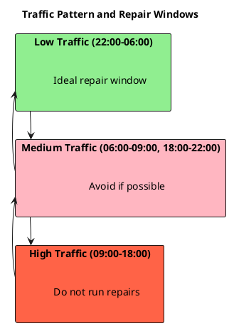
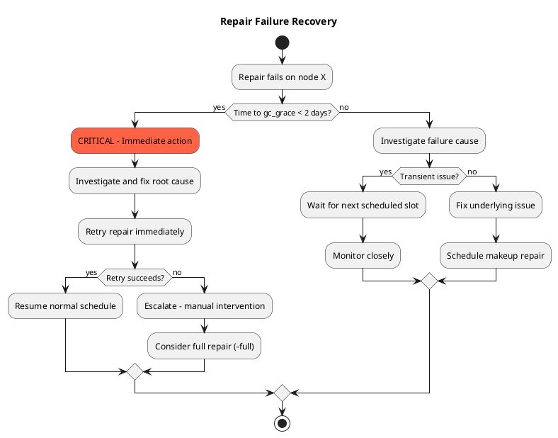

# Repair Scheduling Guide

This page provides guidance on planning repair schedules to ensure completion within `gc_grace_seconds`, avoiding zombie data resurrection while minimizing operational impact.

## The gc_grace_seconds Constraint

### Understanding the Deadline

Every repair schedule must satisfy one fundamental requirement: **all nodes must complete repair within `gc_grace_seconds`**.



### Why This Matters



**Prevention:** Complete repair on all nodes before `gc_grace_seconds` expires. This propagates tombstones to all replicas before they're garbage collected.

---

## Calculating Repair Schedules

### Variables

| Variable | Description | Example |
|----------|-------------|---------|
| N | Number of nodes | 12 |
| T | Time to repair one node | 4 hours |
| RF | Replication factor | 3 |
| G | gc_grace_seconds | 864000 (10 days) |
| B | Desired buffer time | 2 days |

### Sequential Repair Formula

```
Total repair cycle = N × T
Available time = G - B

Constraint: N × T ≤ G - B

Example:
- 12 nodes × 4 hours = 48 hours
- gc_grace = 10 days - 2 day buffer = 8 days available
- 48 hours << 8 days ✓ (plenty of margin)
```

### Parallel Repair Formula

```
Total repair cycle = (N ÷ RF) × T

Example:
- 12 nodes ÷ 3 RF = 4 rounds
- 4 rounds × 4 hours = 16 hours
- 4x faster than sequential
```

### Large Cluster Calculation



---

## Schedule Planning

### Step 1: Measure Repair Duration

Before planning a schedule, measure the actual repair duration on a representative node:

```bash
nodetool repair -pr my_keyspace
```

Record the duration from start to completion. This varies significantly based on data volume, disk speed, and network bandwidth.

### Step 2: Calculate Total Cycle Time

| Strategy | Formula | Example (12 nodes, 4 hrs/node, RF=3) |
|----------|---------|--------------------------------------|
| Sequential | Nodes × Time per node | 12 × 4 = 48 hours |
| Parallel | (Nodes ÷ RF) × Time per node | (12 ÷ 3) × 4 = 16 hours |

Ensure the total cycle time plus a 2-day buffer fits within `gc_grace_seconds`.

### Step 3: Choose Schedule

**Recommended schedules by cluster size:**



---

## Adjusting gc_grace_seconds

### When to Consider Adjusting

| Scenario | Recommended gc_grace_seconds |
|----------|------------------------------|
| Very large cluster, slow repairs | Increase (14-21 days) |
| Fast SSDs, quick repairs | Keep default (10 days) |
| High delete rate, storage concerns | Decrease (7 days) with faster repairs |
| Frequently offline nodes | Increase significantly |

### How to Change gc_grace_seconds

```sql
-- Check current value
SELECT gc_grace_seconds FROM system_schema.tables
WHERE keyspace_name = 'my_keyspace' AND table_name = 'my_table';

-- Modify per table
ALTER TABLE my_keyspace.my_table
WITH gc_grace_seconds = 1209600;  -- 14 days

-- Verify change
DESCRIBE TABLE my_keyspace.my_table;
```

**Warning:** Reducing `gc_grace_seconds` requires faster repair cycles. Ensure repair can complete within the new window before making changes.

---

## Scheduling Best Practices

### Off-Peak Timing



### Staggered Node Schedules

For manual scheduling, stagger repairs across the week so only one node repairs at a time:

| Node | Day | Time (UTC) |
|------|-----|------------|
| Node 1 | Sunday | 02:00 |
| Node 2 | Monday | 02:00 |
| Node 3 | Tuesday | 02:00 |
| Node 4 | Wednesday | 02:00 |
| Node 5 | Thursday | 02:00 |
| Node 6 | Friday | 02:00 |

Use cron or systemd timers to automate execution. For clusters larger than 6 nodes, or where manual scheduling becomes error-prone, consider using AxonOps to automate repair scheduling with adaptive timing and failure handling.

### Avoiding Conflicts

Operations that should NOT run concurrently with repair:

| Operation | Reason |
|-----------|--------|
| Major compaction | Competes for disk I/O |
| Backup | Network and disk contention |
| Schema changes | Can interfere with repair validation |
| Node addition/removal | Topology changes invalidate ranges |
| Bulk loading | High write load |

---

## Monitoring Schedule Compliance

### Tracking Repair History

Monitor repair completion using:

| Method | Command/Source |
|--------|----------------|
| System logs | Search for "Repair completed" in `system.log` |
| Metrics | `percent_repaired` metric per table |
| nodetool | `nodetool tablestats my_keyspace` shows percent repaired |

### Alerting on Missed Repairs

Configure alerts based on time since last successful repair:

| Threshold | Condition | Action |
|-----------|-----------|--------|
| Warning | > 70% of `gc_grace_seconds` | Investigate, schedule makeup repair |
| Critical | > 90% of `gc_grace_seconds` | Immediate action required |

AxonOps provides built-in repair compliance tracking with dashboards showing repair status across all nodes and automatic alerting when repairs fall behind schedule.

---

## Handling Schedule Disruptions

### Repair Failure Recovery



### Maintenance Window Changes

When normal repair windows are unavailable:

1. **Calculate remaining time:** Determine days until `gc_grace_seconds` deadline
2. **Identify alternative windows:** Find off-peak periods even if non-standard
3. **Adjust parallelism:** Use parallel strategy to compress timeline
4. **Communicate:** Notify team of temporary schedule change
5. **Resume normal:** Return to standard schedule once resolved

---

## Automated Repair with AxonOps

Manual repair scheduling becomes increasingly difficult as clusters grow. AxonOps offers two approaches to automated repair:

### Scheduled Repair

Configure repair to run at specific times with:

- Automatic distribution across nodes
- Configurable parallelism and throttling
- Failure detection and retry
- Compliance tracking against `gc_grace_seconds`

### Adaptive Repair

Continuously monitors cluster state and adjusts repair execution based on:

- Current cluster load and latency
- Time remaining until `gc_grace_seconds` deadline
- Node health and availability
- Repair progress across the cluster

Adaptive repair automatically throttles during high-traffic periods and accelerates when the cluster is idle, ensuring repairs complete on time without impacting production workloads.

### Benefits Over Manual Scheduling

| Aspect | Manual | AxonOps |
|--------|--------|---------|
| Schedule calculation | Manual spreadsheets | Automatic |
| Failure handling | Manual intervention | Auto-retry |
| Load awareness | Fixed schedules | Dynamic throttling |
| Compliance tracking | Log parsing | Built-in dashboards |
| Multi-cluster | Per-cluster setup | Centralized management |

---

## Quick Reference

### Minimum Repair Frequency by Cluster Size

| Nodes | RF=3 Sequential | RF=3 Parallel | Recommendation |
|-------|-----------------|---------------|----------------|
| 3 | 1x per week | 1x per week | Weekly |
| 6 | 1x per week | 1x per week | Weekly |
| 12 | 2x per week | 1x per week | Every 3-4 days |
| 24 | 3x per week | 2x per week | Every 2-3 days |
| 50 | Daily | 3x per week | Every 2 days |
| 100+ | Continuous | Daily | Continuous |

### Checklist Before Changing Schedule

- [ ] Current repair duration measured per node
- [ ] Total cycle time calculated
- [ ] Buffer time included (minimum 2 days)
- [ ] Off-peak windows identified
- [ ] Conflict operations scheduled around repair
- [ ] Alerting configured for missed repairs
- [ ] Runbook updated with new schedule

## Next Steps

- **[Repair Concepts](concepts.md)** - Understanding repair fundamentals
- **[Options Reference](options-reference.md)** - Command options explained
- **[Repair Strategies](strategies.md)** - Implementation approaches
