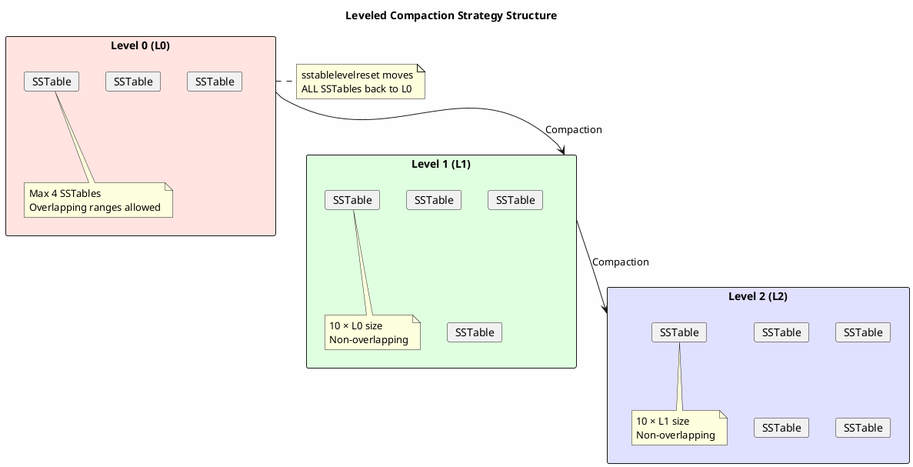
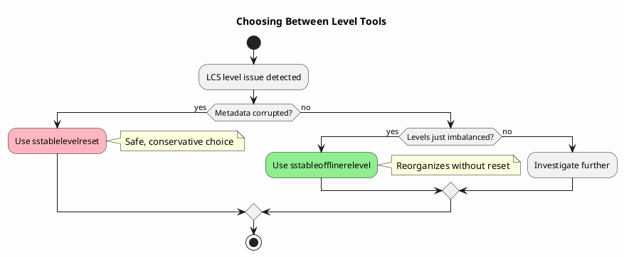

# sstablelevelreset

Resets all SSTables to level 0 for tables using Leveled Compaction Strategy (LCS).

---

## Synopsis

```bash
sstablelevelreset --really-reset <keyspace> <table>
```

---

## Description

`sstablelevelreset` resets the compaction level of all SSTables for a table back to level 0 (L0). This is specifically for tables using **Leveled Compaction Strategy (LCS)** where level corruption or distribution issues have occurred.

This tool is used when:

- **Level metadata is corrupted** - SSTables have incorrect level assignments
- **Compaction is stuck** - Levels are imbalanced and compaction cannot progress
- **After switching to LCS** - Existing SSTables need level assignment
- **Recovery from issues** - Compaction problems require a fresh start

!!! danger "Cassandra Must Be Stopped"
    **Cassandra must be completely stopped** before running `sstablelevelreset`. Running this tool while Cassandra is active will cause data corruption.

---

## How LCS Levels Work



### Level Properties

| Level | Max Size | Non-overlapping | SSTables |
|-------|----------|-----------------|----------|
| L0 | ~160 MB | No | 1-4 |
| L1 | ~10 × L0 | Yes | ~10 |
| L2 | ~10 × L1 | Yes | ~100 |
| L3+ | ~10 × previous | Yes | ~1000+ |

---

## Arguments

| Argument | Description |
|----------|-------------|
| `keyspace` | Name of the keyspace containing the table |
| `table` | Name of the table to reset levels |

---

## Options

| Option | Description |
|--------|-------------|
| `--really-reset` | Required safety flag to confirm reset |

The `--really-reset` flag is mandatory to prevent accidental execution.

---

## Examples

### Basic Usage

```bash
# Stop Cassandra first
sudo systemctl stop cassandra

# Reset all SSTables to level 0
sstablelevelreset --really-reset my_keyspace my_table

# Start Cassandra - LCS will reorganize levels
sudo systemctl start cassandra
```

### Verify Current Levels

```bash
# Before reset - check level distribution
sstablemetadata /var/lib/cassandra/data/my_keyspace/my_table-*/*-Data.db | grep "SSTable Level"
```

### Reset All LCS Tables

```bash
#!/bin/bash
# reset_lcs_tables.sh - Reset levels for all LCS tables

KEYSPACE="$1"

# Find tables using LCS
lcs_tables=$(cqlsh -e "SELECT table_name FROM system_schema.tables
    WHERE keyspace_name = '$KEYSPACE'" | \
    while read table; do
        compaction=$(cqlsh -e "SELECT compaction FROM system_schema.tables
            WHERE keyspace_name = '$KEYSPACE' AND table_name = '$table'" 2>/dev/null | \
            grep -i "leveledcompaction")
        if [ -n "$compaction" ]; then
            echo "$table"
        fi
    done)

for table in $lcs_tables; do
    echo "Resetting levels for ${KEYSPACE}.${table}..."
    sstablelevelreset --really-reset "$KEYSPACE" "$table"
done
```

---

## When to Use sstablelevelreset

### Scenario 1: Corrupted Level Metadata

```bash
# Symptoms:
# - Cassandra logs show "Level X has Y SSTables but should have Z"
# - Unexpected compaction behavior
# - Compaction stats show wrong level distribution

# Check current state
nodetool cfstats my_keyspace.my_table | grep -i level

# Reset levels
sudo systemctl stop cassandra
sstablelevelreset --really-reset my_keyspace my_table
sudo systemctl start cassandra
```

### Scenario 2: After Switching to LCS

```bash
# When migrating from STCS to LCS

# 1. Change compaction strategy
cqlsh -e "ALTER TABLE my_keyspace.my_table WITH compaction = {
    'class': 'LeveledCompactionStrategy'
};"

# 2. Stop Cassandra
sudo systemctl stop cassandra

# 3. Reset levels (existing SSTables may have level 0 already, but reset ensures clean state)
sstablelevelreset --really-reset my_keyspace my_table

# 4. Start Cassandra - LCS will organize SSTables into levels
sudo systemctl start cassandra

# 5. Monitor compaction progress
nodetool compactionstats
```

### Scenario 3: Compaction Stuck

```bash
# Symptoms:
# - Compaction not progressing
# - High number of SSTables
# - Levels are imbalanced

# Check level distribution
for f in /var/lib/cassandra/data/my_keyspace/my_table-*/*-Data.db; do
    level=$(sstablemetadata "$f" | grep "SSTable Level:" | awk '{print $3}')
    echo "L${level}: $(basename $f)"
done | sort | uniq -c

# If distribution is problematic, reset
sudo systemctl stop cassandra
sstablelevelreset --really-reset my_keyspace my_table
sudo systemctl start cassandra
```

### Scenario 4: Recovery from sstableofflinerelevel Issues

```bash
# If sstableofflinerelevel caused problems
# Reset to clean state and let LCS reorganize

sudo systemctl stop cassandra
sstablelevelreset --really-reset my_keyspace my_table
sudo systemctl start cassandra
```

---

## Impact of Level Reset

### Before Reset

```
Level Distribution:
L0: 2 SSTables (320 MB)
L1: 10 SSTables (1.6 GB)
L2: 87 SSTables (14 GB)
L3: 432 SSTables (69 GB)
```

### After Reset

```
Level Distribution:
L0: 531 SSTables (85 GB)  <- All SSTables moved here
L1: 0 SSTables
L2: 0 SSTables
L3: 0 SSTables
```

### After Compaction Reorganization

```
Level Distribution:
L0: 4 SSTables (640 MB)   <- Back to normal
L1: 10 SSTables (1.6 GB)
L2: 100 SSTables (16 GB)
L3: 450 SSTables (72 GB)
```

---

## Post-Reset Actions

### 1. Start Cassandra

```bash
sudo systemctl start cassandra
```

### 2. Monitor Compaction

```bash
# Watch compaction progress
watch -n 5 'nodetool compactionstats'

# Check level distribution
nodetool cfstats my_keyspace.my_table | grep -A10 "SSTables in each level"
```

### 3. Verify Health

```bash
# Ensure reads work correctly
cqlsh -e "SELECT * FROM my_keyspace.my_table LIMIT 10;"

# Check for compaction errors
grep -i "error\|exception" /var/log/cassandra/system.log
```

---

## sstablelevelreset vs sstableofflinerelevel

| Aspect | sstablelevelreset | sstableofflinerelevel |
|--------|-------------------|----------------------|
| Action | Reset all to L0 | Recalculate optimal levels |
| Result | Clean slate | Reorganized levels |
| Compaction after | Heavy (reorganize all) | Minimal (already organized) |
| Use case | Corrupted metadata | Imbalanced levels |
| Safety | Conservative | More aggressive |

### Decision Guide



---

## Troubleshooting

### Permission Denied

```bash
# Run as cassandra user
sudo -u cassandra sstablelevelreset --really-reset my_keyspace my_table

# Or fix permissions
sudo chown -R cassandra:cassandra /var/lib/cassandra/data/
```

### Cassandra Still Running

```bash
# Error: Cannot run while Cassandra is active

# Stop Cassandra properly
nodetool drain
sudo systemctl stop cassandra

# Verify stopped
pgrep -f CassandraDaemon  # Should return nothing

# Now run the tool
sstablelevelreset --really-reset my_keyspace my_table
```

### Forgot --really-reset Flag

```bash
# Error: Must provide --really-reset flag

# The flag is required as a safety measure
sstablelevelreset --really-reset my_keyspace my_table
```

### Heavy Compaction After Reset

```bash
# After reset, LCS will compact aggressively to reorganize

# Option 1: Let it complete (recommended)
# Monitor with:
nodetool compactionstats

# Option 2: Throttle compaction if overwhelming
nodetool setcompactionthroughput 16  # 16 MB/s
```

---

## Best Practices

!!! tip "sstablelevelreset Guidelines"

    1. **Last resort** - Try `sstableofflinerelevel` first for imbalanced levels
    2. **Backup first** - Snapshot before running
    3. **Plan for compaction** - Heavy compaction will follow
    4. **Off-peak timing** - Run during maintenance windows
    5. **Monitor after** - Watch compaction progress
    6. **One table at a time** - Don't reset multiple tables simultaneously
    7. **Verify result** - Check level distribution after compaction settles

!!! warning "Cautions"

    - All SSTables move to L0 (causes heavy compaction)
    - Only use for LCS tables
    - Requires `--really-reset` flag
    - Cannot be undone (must let compaction reorganize)

---

## Related Commands

| Command | Relationship |
|---------|--------------|
| [sstableofflinerelevel](sstableofflinerelevel.md) | Recalculate levels (alternative) |
| [sstablemetadata](sstablemetadata.md) | Check current SSTable levels |
| [nodetool compactionstats](../nodetool/compactionstats.md) | Monitor compaction progress |
| [nodetool tablestats](../nodetool/tablestats.md) | View level distribution |
| [nodetool setcompactionthroughput](../nodetool/setcompactionthroughput.md) | Control compaction speed |
