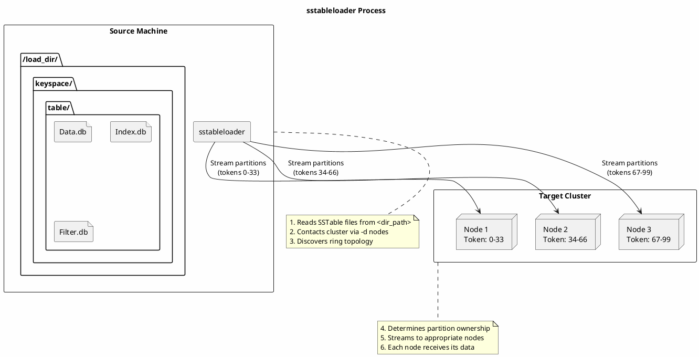

# sstableloader

Bulk loads SSTables from a directory into a live Cassandra cluster.

---

## Synopsis

```bash
sstableloader [options] <dir_path>
```

---

## Description

`sstableloader` streams SSTable files from a local directory into a running Cassandra cluster. It reads SSTables from disk and uses Cassandra's streaming protocol to distribute the data to the appropriate nodes based on the cluster's token ranges.

This tool is essential for:

- **Restoring data from snapshots** to a different cluster
- **Migrating data** between clusters
- **Bulk loading** externally generated SSTables
- **Disaster recovery** when rebuilding a cluster

!!! info "Unique Among SSTable Tools"
    Unlike most SSTable tools, `sstableloader` connects to a **running** Cassandra cluster. The source node (where the tool runs) does not need Cassandra running, but the target cluster must be operational.

---

## How It Works



---

## Directory Structure Requirements

The directory path must follow Cassandra's data directory structure:

```
<base_path>/<keyspace>/<table>/

Examples:
/tmp/restore/my_keyspace/users/           # Correct
/var/backup/cycling/cyclist_name/         # Correct
/restore/my_keyspace/my_table/snapshots/  # Incorrect - extra directory level
```

The tool uses the directory names to determine the target keyspace and table:

```bash
# This path:
/tmp/load/my_keyspace/my_table/nb-1-big-Data.db

# Loads into:
# Keyspace: my_keyspace
# Table: my_table
```

---

## Arguments

| Argument | Description |
|----------|-------------|
| `dir_path` | Path to directory containing SSTable files. Must follow `<keyspace>/<table>/` structure. |

---

## Options

### Required Options

| Option | Description |
|--------|-------------|
| `-d, --nodes <hosts>` | Comma-separated list of initial hosts for ring discovery (required) |

### Authentication Options

| Option | Description |
|--------|-------------|
| `-u, --username <user>` | Username for authentication |
| `-pw, --password <password>` | Password for authentication |
| `-p, --port <port>` | Native transport port (default: 9042) |

### Performance Options

| Option | Description |
|--------|-------------|
| `--throttle-mib <MiB/s>` | Throttle streaming speed in MiB per second |
| `--inter-dc-throttle-mib <MiB/s>` | Throttle for inter-datacenter streaming |
| `-cph, --connections-per-host <n>` | Number of concurrent connections per host |

### SSL/TLS Options

| Option | Description |
|--------|-------------|
| `-f, --conf-path <path>` | Path to cassandra.yaml for SSL configuration |
| `--keystore <path>` | Path to SSL keystore |
| `--keystore-password <pass>` | Keystore password |
| `--truststore <path>` | Path to SSL truststore |
| `--truststore-password <pass>` | Truststore password |
| `--ssl-protocol <protocol>` | SSL protocol (e.g., TLSv1.2) |
| `--ssl-ciphers <ciphers>` | Comma-separated list of SSL ciphers |

### Other Options

| Option | Description |
|--------|-------------|
| `-i, --ignore <hosts>` | Comma-separated list of hosts to ignore during streaming |
| `--no-progress` | Suppress progress output |
| `-v, --verbose` | Enable verbose output |

---

## Examples

### Basic Usage

```bash
# Load SSTables into cluster
sstableloader -d 192.168.1.10,192.168.1.11 /tmp/restore/my_keyspace/my_table/
```

### With Authentication

```bash
# Load with username/password
sstableloader -d node1,node2,node3 \
    -u cassandra \
    -pw cassandra \
    /backup/my_keyspace/users/
```

### With Throttling

```bash
# Limit streaming to 100 MiB/s to prevent overwhelming the cluster
sstableloader -d node1,node2 \
    --throttle-mib 100 \
    /restore/my_keyspace/my_table/
```

### With SSL

```bash
# Method 1: Using cassandra.yaml for SSL settings
sstableloader -d node1,node2 \
    -f /etc/cassandra/cassandra.yaml \
    /restore/my_keyspace/my_table/

# Method 2: Explicit SSL parameters
sstableloader -d node1,node2 \
    --keystore /path/to/keystore.jks \
    --keystore-password secret \
    --truststore /path/to/truststore.jks \
    --truststore-password secret \
    --ssl-protocol TLSv1.2 \
    /restore/my_keyspace/my_table/
```

### Multiple Connections for Speed

```bash
# Increase parallelism with more connections per host
sstableloader -d node1,node2,node3 \
    --connections-per-host 8 \
    /restore/my_keyspace/large_table/
```

### Ignore Specific Nodes

```bash
# Skip streaming to a problematic node
sstableloader -d node1,node2,node3 \
    -i node3 \
    /restore/my_keyspace/my_table/
```

---

## Common Use Cases

### Restoring from Snapshot

```bash
#!/bin/bash
# restore_from_snapshot.sh

SNAPSHOT_NAME="daily_backup"
KEYSPACE="my_keyspace"
TABLE="my_table"
NODES="node1,node2,node3"
RESTORE_DIR="/tmp/restore"

# 1. Create directory structure
mkdir -p ${RESTORE_DIR}/${KEYSPACE}/${TABLE}

# 2. Copy snapshot files (from backup location)
cp /backup/${SNAPSHOT_NAME}/${KEYSPACE}/${TABLE}/*.db \
   ${RESTORE_DIR}/${KEYSPACE}/${TABLE}/

# 3. Verify schema exists in target cluster
cqlsh node1 -e "DESCRIBE TABLE ${KEYSPACE}.${TABLE};"

# 4. Load data
sstableloader -d ${NODES} ${RESTORE_DIR}/${KEYSPACE}/${TABLE}/

# 5. Cleanup
rm -rf ${RESTORE_DIR}
```

### Cross-Cluster Migration

```bash
#!/bin/bash
# migrate_table.sh

SOURCE_DATA="/var/lib/cassandra/data/old_keyspace/old_table-uuid"
TARGET_KEYSPACE="new_keyspace"
TARGET_TABLE="new_table"
TARGET_NODES="newcluster1,newcluster2,newcluster3"
STAGING="/tmp/migration"

# 1. Create staging directory with target keyspace/table names
mkdir -p ${STAGING}/${TARGET_KEYSPACE}/${TARGET_TABLE}

# 2. Copy SSTables (ensure table is not being compacted)
nodetool flush old_keyspace old_table
cp ${SOURCE_DATA}/*Data.db ${STAGING}/${TARGET_KEYSPACE}/${TARGET_TABLE}/
cp ${SOURCE_DATA}/*Index.db ${STAGING}/${TARGET_KEYSPACE}/${TARGET_TABLE}/
cp ${SOURCE_DATA}/*Filter.db ${STAGING}/${TARGET_KEYSPACE}/${TARGET_TABLE}/
cp ${SOURCE_DATA}/*Statistics.db ${STAGING}/${TARGET_KEYSPACE}/${TARGET_TABLE}/
cp ${SOURCE_DATA}/*Summary.db ${STAGING}/${TARGET_KEYSPACE}/${TARGET_TABLE}/
cp ${SOURCE_DATA}/*TOC.txt ${STAGING}/${TARGET_KEYSPACE}/${TARGET_TABLE}/
cp ${SOURCE_DATA}/*CompressionInfo.db ${STAGING}/${TARGET_KEYSPACE}/${TARGET_TABLE}/ 2>/dev/null
cp ${SOURCE_DATA}/*Digest.crc32 ${STAGING}/${TARGET_KEYSPACE}/${TARGET_TABLE}/ 2>/dev/null

# 3. Load into target cluster
sstableloader -d ${TARGET_NODES} \
    --throttle-mib 200 \
    ${STAGING}/${TARGET_KEYSPACE}/${TARGET_TABLE}/

# 4. Verify row count
echo "Source count:"
cqlsh source_node -e "SELECT COUNT(*) FROM old_keyspace.old_table;"
echo "Target count:"
cqlsh newcluster1 -e "SELECT COUNT(*) FROM ${TARGET_KEYSPACE}.${TARGET_TABLE};"
```

### Loading Generated SSTables

When loading SSTables created by external tools (like Spark):

```bash
# SSTables must be in correct format and have matching schema
sstableloader -d node1,node2,node3 \
    --verbose \
    /generated_data/my_keyspace/my_table/
```

---

## Schema Requirements

!!! danger "Schema Must Exist First"
    The target keyspace and table **must exist** in the cluster before running sstableloader. The tool does not create schemas.

```bash
# Verify schema exists
cqlsh node1 -e "DESCRIBE KEYSPACE my_keyspace;"
cqlsh node1 -e "DESCRIBE TABLE my_keyspace.my_table;"

# If restoring, recreate schema first
cqlsh node1 -f /backup/schema.cql
```

### Schema Compatibility

The SSTable schema must be compatible with the target table schema:

| Scenario | Result |
|----------|--------|
| Exact schema match | Success |
| Target has additional columns | Success (new columns will be null) |
| Target missing columns | **Failure** |
| Different column types | **Failure** |
| Different primary key | **Failure** |

---

## Performance Tuning

### Factors Affecting Speed

| Factor | Impact | Tuning |
|--------|--------|--------|
| Network bandwidth | High | Use `--throttle-mib` to prevent saturation |
| Connections per host | Medium | Increase `--connections-per-host` |
| Cluster size | Medium | More nodes = parallel streaming |
| SSTable size | Low | Tool handles any size |
| Disk I/O on source | Medium | Use SSD for staging directory |

### Recommended Settings by Scenario

**Small dataset (< 10 GB):**
```bash
sstableloader -d nodes /path/to/data/
# Default settings usually sufficient
```

**Medium dataset (10-100 GB):**
```bash
sstableloader -d nodes \
    --connections-per-host 4 \
    --throttle-mib 200 \
    /path/to/data/
```

**Large dataset (> 100 GB):**
```bash
sstableloader -d nodes \
    --connections-per-host 8 \
    --throttle-mib 500 \
    /path/to/data/

# Consider loading during off-peak hours
# Monitor cluster health during load
```

---

## Monitoring Progress

### Verbose Output

```bash
sstableloader -d nodes -v /path/to/data/

# Sample output:
# Established connection to initial hosts
# Opening sstables and calculating sections to stream
# Streaming relevant part of /path/to/data/nb-1-big-Data.db to [/192.168.1.10, /192.168.1.11]
# progress: [node1]0:0/1 0% [node2]0:0/1 0% total: 0% 0.0 MB/s
# progress: [node1]0:1/1 100% [node2]0:1/1 100% total: 100% 45.2 MB/s
# Summary statistics:
#    Connections per host: 1
#    Total files transferred: 2
#    Total bytes transferred: 156.3 MB
#    Total duration: 3.5 s
#    Average throughput: 44.7 MB/s
```

### Monitoring Cluster During Load

```bash
# On target nodes, watch streaming activity
nodetool netstats

# Watch for compaction backlog
nodetool compactionstats

# Monitor load on target nodes
nodetool tpstats | grep -i stream
```

---

## Troubleshooting

### Connection Refused

```bash
# Error: Failed to connect to node1:9042

# Check 1: Is Cassandra running on target nodes?
nodetool -h node1 status

# Check 2: Is native transport enabled?
nodetool -h node1 statusbinary

# Check 3: Firewall allows port 9042?
nc -zv node1 9042

# Check 4: Correct port specified?
sstableloader -d node1 -p 9142 /path/  # If using non-default port
```

### Authentication Failed

```bash
# Error: Authentication error

# Verify credentials work
cqlsh node1 -u username -p password

# Use correct authentication options
sstableloader -d node1 -u username -pw password /path/
```

### Schema Mismatch

```bash
# Error: Unknown keyspace/table

# Verify schema exists
cqlsh node1 -e "DESCRIBE KEYSPACE my_keyspace;"

# Check directory structure matches keyspace/table names
ls /path/to/load/
# Should show: my_keyspace/
ls /path/to/load/my_keyspace/
# Should show: my_table/
```

### SSL Errors

```bash
# Error: SSL handshake failed

# Method 1: Use cassandra.yaml with SSL config
sstableloader -d node1 -f /etc/cassandra/cassandra.yaml /path/

# Method 2: Verify keystore/truststore
keytool -list -keystore /path/to/keystore.jks

# Method 3: Check SSL protocol compatibility
sstableloader -d node1 \
    --ssl-protocol TLSv1.2 \
    --keystore /path/to/keystore.jks \
    --keystore-password pass \
    --truststore /path/to/truststore.jks \
    --truststore-password pass \
    /path/
```

### Streaming Timeout

```bash
# Error: Streaming timed out

# Reduce throughput to prevent overwhelming nodes
sstableloader -d nodes --throttle-mib 50 /path/

# Check cluster health
nodetool -h node1 status
nodetool -h node1 tpstats
```

### Incomplete Files

```bash
# Error: Missing component files

# Verify all SSTable components present
ls /path/to/keyspace/table/
# Need at minimum: Data.db, Index.db, Filter.db, Statistics.db, Summary.db, TOC.txt

# Copy all components for each SSTable
cp /source/*-1-big-* /dest/
```

---

## Best Practices

!!! tip "sstableloader Guidelines"

    1. **Verify schema first** - Table must exist before loading
    2. **Use throttling** - Prevent overwhelming target cluster
    3. **Monitor during load** - Watch cluster health metrics
    4. **Load during off-peak** - Reduce impact on production traffic
    5. **Verify after loading** - Check row counts and sample data
    6. **Clean staging directory** - Remove copied SSTables after successful load
    7. **Consider repair** - Run repair after large data loads for consistency

!!! warning "Cautions"

    - Does not create keyspace or table schemas
    - Source files are not deleted after loading
    - Large loads can impact cluster performance
    - Authentication credentials in command line may be visible in process lists

---

## Related Commands

| Command | Relationship |
|---------|--------------|
| [nodetool snapshot](../nodetool/snapshot.md) | Create snapshots for loading |
| [nodetool refresh](../nodetool/refresh.md) | Alternative for loading local SSTables |
| [nodetool import](../nodetool/import.md) | Import SSTables from directory |
| [nodetool netstats](../nodetool/netstats.md) | Monitor streaming progress |
| [sstableutil](sstableutil.md) | List SSTable files |
