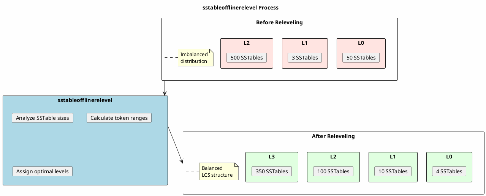
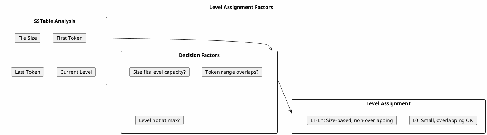
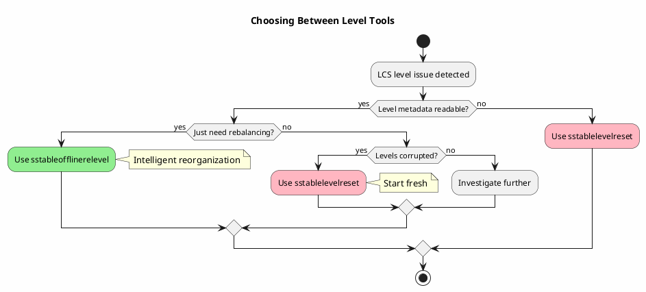

# sstableofflinerelevel

Recalculates and reassigns optimal levels to SSTables for Leveled Compaction Strategy (LCS).

---

## Synopsis

```bash
sstableofflinerelevel [options] <keyspace> <table>
```

---

## Description

`sstableofflinerelevel` analyzes existing SSTables and assigns them to appropriate LCS levels based on their size and token ranges. Unlike `sstablelevelreset` which moves everything to L0, this tool intelligently organizes SSTables into their optimal levels.

This tool is useful when:

- **Level distribution is imbalanced** - Too many SSTables in certain levels
- **After bulk load** - Imported SSTables need proper level assignment
- **Migration to LCS** - Existing SSTables need level organization
- **Compaction optimization** - Rebalancing to improve compaction efficiency

!!! danger "Cassandra Must Be Stopped"
    **Cassandra must be completely stopped** before running `sstableofflinerelevel`. Running this tool while Cassandra is active will cause data corruption.

---

## How It Works



### Level Assignment Logic

The tool assigns levels based on:

1. **SSTable size** - Larger SSTables go to higher levels
2. **Token range coverage** - Non-overlapping requirement per level
3. **Level size limits** - Each level is ~10x the size of previous
4. **L0 target** - Small number of overlapping SSTables

---

## Arguments

| Argument | Description |
|----------|-------------|
| `keyspace` | Name of the keyspace containing the table |
| `table` | Name of the table to relevel |

---

## Options

| Option | Description |
|--------|-------------|
| `-o, --output` | Output operations without actually modifying files (dry run) |
| `--debug` | Enable debug output |

---

## Examples

### Basic Releveling

```bash
# Stop Cassandra first
sudo systemctl stop cassandra

# Relevel SSTables
sstableofflinerelevel my_keyspace my_table

# Start Cassandra
sudo systemctl start cassandra
```

### Dry Run (Preview Changes)

```bash
# See what changes would be made without applying them
sstableofflinerelevel -o my_keyspace my_table
```

### With Debug Output

```bash
# Verbose output for troubleshooting
sstableofflinerelevel --debug my_keyspace my_table
```

### Check Before and After

```bash
#!/bin/bash
# relevel_with_verification.sh

KEYSPACE="$1"
TABLE="$2"

echo "=== Before Releveling ==="
sstablemetadata /var/lib/cassandra/data/${KEYSPACE}/${TABLE}-*/*-Data.db | \
    grep "SSTable Level:" | sort | uniq -c

echo ""
echo "=== Dry Run ==="
sstableofflinerelevel -o "$KEYSPACE" "$TABLE"

echo ""
read -p "Proceed with releveling? (y/n) " confirm
if [ "$confirm" = "y" ]; then
    sstableofflinerelevel "$KEYSPACE" "$TABLE"

    echo ""
    echo "=== After Releveling ==="
    sstablemetadata /var/lib/cassandra/data/${KEYSPACE}/${TABLE}-*/*-Data.db | \
        grep "SSTable Level:" | sort | uniq -c
fi
```

---

## When to Use sstableofflinerelevel

### Scenario 1: After Bulk Loading

```bash
# After using sstableloader, SSTables may all be at L0
# Relevel to distribute properly

sudo systemctl stop cassandra
sstableofflinerelevel my_keyspace my_table
sudo systemctl start cassandra
```

### Scenario 2: Level Imbalance

```bash
# When certain levels have too many or too few SSTables
# Check current distribution:

nodetool cfstats my_keyspace.my_table | grep -A10 "SSTables in each level"

# Sample problematic output:
#   L0: 2
#   L1: 3
#   L2: 500 <- Too many for L2!
#   L3: 10

# Fix with releveling:
sudo systemctl stop cassandra
sstableofflinerelevel my_keyspace my_table
sudo systemctl start cassandra
```

### Scenario 3: Migration from STCS to LCS

```bash
# When changing compaction strategy to LCS

# 1. Change strategy (while running)
cqlsh -e "ALTER TABLE my_keyspace.my_table
WITH compaction = {'class': 'LeveledCompactionStrategy'};"

# 2. Stop Cassandra
sudo systemctl stop cassandra

# 3. Relevel to organize into proper LCS structure
sstableofflinerelevel my_keyspace my_table

# 4. Start Cassandra
sudo systemctl start cassandra
```

### Scenario 4: After Major Compaction

```bash
# Major compaction may create large SSTables all at L0
# Relevel to restore proper structure

sudo systemctl stop cassandra
sstableofflinerelevel my_keyspace my_table
sudo systemctl start cassandra
```

---

## Output Examples

### Dry Run Output

```
Checking 150 SSTables for my_keyspace.my_table
Would move nb-1-big to L0 (was L2)
Would move nb-2-big to L1 (was L0)
Would move nb-3-big to L2 (was L0)
Would move nb-4-big to L2 (was L0)
...
Would move 45 SSTables from L0
Would move 15 SSTables to L1
Would move 80 SSTables to L2
Would move 10 SSTables to L3
```

### Actual Run Output

```
Checking 150 SSTables for my_keyspace.my_table
Assigned level 0 to 4 SSTables
Assigned level 1 to 10 SSTables
Assigned level 2 to 100 SSTables
Assigned level 3 to 36 SSTables
Releveling complete. Run compaction after starting Cassandra.
```

---

## Level Assignment Details

### How Levels Are Determined

| Level | Target Size | SSTables | Non-overlapping |
|-------|-------------|----------|-----------------|
| L0 | ~160 MB total | 1-4 | No |
| L1 | ~10 × L0 | ~10 | Yes |
| L2 | ~10 × L1 | ~100 | Yes |
| L3 | ~10 × L2 | ~1000 | Yes |
| L4+ | ~10 × previous | Varies | Yes |

### What the Tool Considers



---

## Comparison: sstableofflinerelevel vs sstablelevelreset

| Aspect | sstableofflinerelevel | sstablelevelreset |
|--------|----------------------|-------------------|
| Result | Optimal level distribution | All SSTables at L0 |
| Compaction after | Minimal | Heavy (full reorganization) |
| Intelligence | Analyzes and assigns | Simple reset |
| Best for | Imbalanced levels | Corrupted metadata |
| Risk | Lower | Higher (more compaction) |

### Decision Flow



---

## Troubleshooting

### Permission Denied

```bash
# Run as cassandra user
sudo -u cassandra sstableofflinerelevel my_keyspace my_table

# Or fix ownership after
sudo chown -R cassandra:cassandra /var/lib/cassandra/data/
```

### Cassandra Still Running

```bash
# Must stop Cassandra first
nodetool drain
sudo systemctl stop cassandra

# Verify stopped
pgrep -f CassandraDaemon  # Should return nothing

sstableofflinerelevel my_keyspace my_table
sudo systemctl start cassandra
```

### No Change After Releveling

```bash
# If SSTables are already optimally distributed, no changes made
# Verify current state is actually problematic before releveling

# Check distribution
sstablemetadata /var/lib/cassandra/data/my_keyspace/my_table-*/*-Data.db | \
    grep "SSTable Level:" | sort | uniq -c
```

### Out of Memory

```bash
# For tables with many SSTables
export JVM_OPTS="-Xmx4G"
sstableofflinerelevel my_keyspace my_table
```

---

## Post-Releveling Actions

### 1. Start Cassandra

```bash
sudo systemctl start cassandra
```

### 2. Verify Level Distribution

```bash
# Check new distribution
nodetool cfstats my_keyspace.my_table | grep -A10 "SSTables in each level"

# Or via sstablemetadata
sstablemetadata /var/lib/cassandra/data/my_keyspace/my_table-*/*-Data.db | \
    grep "SSTable Level:"
```

### 3. Monitor Compaction

```bash
# Some compaction may still occur to optimize further
watch -n 5 'nodetool compactionstats'
```

### 4. Verify Functionality

```bash
# Ensure reads work correctly
cqlsh -e "SELECT * FROM my_keyspace.my_table LIMIT 10;"
```

---

## Best Practices

!!! tip "sstableofflinerelevel Guidelines"

    1. **Use dry run first** - Preview changes with `-o` flag
    2. **Backup before** - Snapshot critical tables
    3. **Off-peak timing** - Run during maintenance windows
    4. **Verify distribution** - Check levels before and after
    5. **Prefer over reset** - Less disruptive than sstablelevelreset
    6. **LCS only** - Only meaningful for Leveled Compaction Strategy
    7. **Monitor after** - Watch for any compaction issues

!!! warning "Cautions"

    - Only useful for LCS tables
    - Requires Cassandra to be stopped
    - May not help if underlying issue is SSTable size
    - Some compaction may still be needed after

---

## Related Commands

| Command | Relationship |
|---------|--------------|
| [sstablelevelreset](sstablelevelreset.md) | Alternative: reset all to L0 |
| [sstablemetadata](sstablemetadata.md) | Check current SSTable levels |
| [nodetool tablestats](../nodetool/tablestats.md) | View level distribution |
| [nodetool compactionstats](../nodetool/compactionstats.md) | Monitor compaction |
| [sstablesplit](sstablesplit.md) | Split oversized SSTables |
