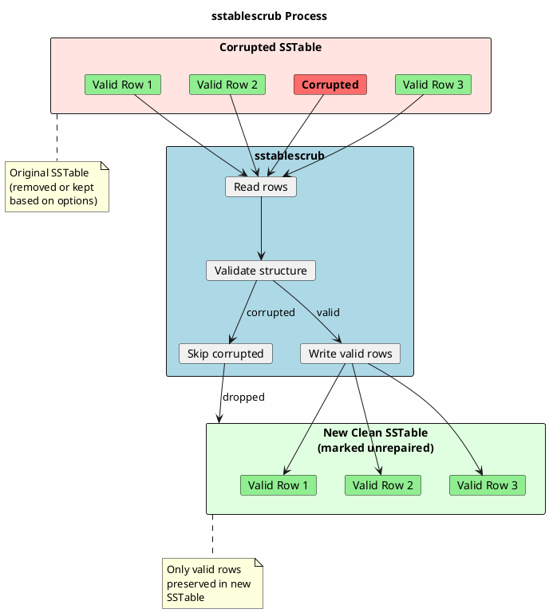

# sstablescrub

Offline utility to repair corrupted SSTables by removing damaged data while preserving valid rows.

---

## Synopsis

```bash
sstablescrub [options] <keyspace> <table>
```

---

## Description

`sstablescrub` is the offline equivalent of `nodetool scrub`. It scans SSTable files, identifies corrupted or malformed data, and rewrites the SSTables with only valid data. This tool can fix corruption that `nodetool scrub` cannot handle because it operates without Cassandra's runtime constraints.

!!! danger "Cassandra Must Be Stopped"
    **Cassandra must be completely stopped** before running `sstablescrub`. Running this tool while Cassandra is active will cause data corruption and unpredictable behavior.

---

## How It Works



### What Scrubbing Does

1. **Reads each row** from the SSTable sequentially
2. **Validates row structure** - checks for malformed data
3. **Validates data types** - ensures values match schema (unless `--no-validate`)
4. **Skips corrupted rows** - drops rows that cannot be read
5. **Writes valid rows** to new SSTable
6. **Handles counters** - special processing for counter tables
7. **Updates metadata** - new SSTables are marked as unrepaired

---

## Arguments

| Argument | Description |
|----------|-------------|
| `keyspace` | Name of the keyspace containing the table |
| `table` | Name of the table to scrub |

---

## Options

| Option | Description |
|--------|-------------|
| `-m, --manifest-check` | Only check and repair the leveled manifest (LCS tables) |
| `-n, --no-validate` | Skip validation of data values; only check structure |
| `-r, --reinsert-overflowed-ttl` | Rewrite rows with TTL overflow (TTL > max allowed) |
| `-s, --skip-corrupted` | Skip scrubbing counter tables if corruption prevents completion |
| `-e, --header-fix <mode>` | Handle serialization header issues: `validate`, `fix`, `fix-only`, `off` |
| `--debug` | Enable debug output |

### Header Fix Modes (`-e`)

| Mode | Behavior |
|------|----------|
| `validate` | (Default) Validate header, error if mismatch found |
| `fix` | Validate header, fix issues if possible, then scrub |
| `fix-only` | Only fix header issues, don't scrub data |
| `off` | Disable header validation entirely |

---

## Examples

### Basic Scrub

```bash
# Stop Cassandra first
sudo systemctl stop cassandra

# Scrub a table
sstablescrub my_keyspace my_table

# Start Cassandra
sudo systemctl start cassandra
```

### Scrub Without Data Validation

```bash
# Skip value validation - useful when schema has changed
# but data is structurally sound
sstablescrub --no-validate my_keyspace my_table
```

### Handle Counter Table Corruption

```bash
# If counter corruption prevents normal scrub
sstablescrub --skip-corrupted my_keyspace counter_table
```

### Fix TTL Overflow Issues

```bash
# Rewrite rows where TTL exceeded maximum value
sstablescrub --reinsert-overflowed-ttl my_keyspace my_table
```

### Fix Serialization Header Issues

```bash
# Fix UDT (User Defined Type) serialization header problems
sstablescrub -e fix my_keyspace my_table

# Only fix header, don't scrub data
sstablescrub -e fix-only my_keyspace my_table
```

### LCS Manifest Check Only

```bash
# Only check and repair the LCS leveled manifest
sstablescrub --manifest-check my_keyspace my_table
```

### Debug Mode

```bash
# Enable verbose debug output
sstablescrub --debug my_keyspace my_table
```

---

## When to Use sstablescrub

### Scenario 1: Cassandra Won't Start Due to Corruption

```bash
# Symptom: Cassandra fails to start with SSTable errors in logs
# Error: "Corrupt sstable" or "Cannot read sstable"

# 1. Identify the corrupted table from logs
grep -i "corrupt" /var/log/cassandra/system.log

# 2. Ensure Cassandra is stopped
sudo systemctl stop cassandra
pgrep -f CassandraDaemon  # Should return nothing

# 3. Scrub the affected table
sstablescrub my_keyspace corrupted_table

# 4. Start Cassandra
sudo systemctl start cassandra

# 5. Repair to restore consistency (data was dropped)
nodetool repair my_keyspace corrupted_table
```

### Scenario 2: nodetool scrub Fails

```bash
# When nodetool scrub cannot complete due to severe corruption
# Error: "Scrub failed" or out of memory errors

# 1. Stop Cassandra
sudo systemctl stop cassandra

# 2. Try offline scrub with skip-corrupted
sstablescrub --skip-corrupted my_keyspace my_table

# 3. If that fails, try without validation
sstablescrub --no-validate --skip-corrupted my_keyspace my_table

# 4. Start Cassandra and repair
sudo systemctl start cassandra
nodetool repair my_keyspace my_table
```

### Scenario 3: Schema Change Caused Data Issues

```bash
# After schema changes, data may not validate against new schema

# Scrub without validation to preserve data
sstablescrub --no-validate my_keyspace my_table
```

### Scenario 4: Counter Table Issues

```bash
# Counter tables require special handling
sstablescrub --skip-corrupted my_keyspace counter_table
```

### Scenario 5: UDT (User Defined Type) Header Mismatch

```bash
# When frozen/non-frozen UDT serialization doesn't match schema
sstablescrub -e fix my_keyspace my_table
```

---

## Impact and Side Effects

### What Changes After Scrubbing

| Aspect | Before | After |
|--------|--------|-------|
| Corrupted rows | Present but unreadable | **Removed permanently** |
| SSTable count | Original count | May change (rewritten) |
| Repair status | Original state | **Marked unrepaired** |
| Disk space | Original | Temporary increase during operation |
| Data consistency | Inconsistent | Consistent locally, needs repair cluster-wide |

!!! warning "Data Loss"
    Scrubbing **permanently removes corrupted rows**. This data is lost unless:

    - It exists on other replicas (run repair to recover)
    - A backup exists with the data
    - The original SSTable is preserved

### Repair Status Change

Scrubbed SSTables are marked as **unrepaired**. This affects incremental repair:

```bash
# After scrub, check repair status
sstablemetadata /var/lib/cassandra/data/my_keyspace/my_table-*/nb-*-big-Data.db | grep -i repair

# Run repair to mark as repaired and restore consistency
nodetool repair my_keyspace my_table
```

---

## Pre-Scrub Checklist

```bash
#!/bin/bash
# pre_scrub_check.sh

KEYSPACE="$1"
TABLE="$2"

echo "=== Pre-Scrub Safety Check ==="

# 1. Verify Cassandra is stopped
echo ""
echo "1. Checking Cassandra status..."
if pgrep -f CassandraDaemon > /dev/null; then
    echo "ERROR: Cassandra is running! Stop it first."
    echo "Run: sudo systemctl stop cassandra"
    exit 1
else
    echo "OK: Cassandra is stopped"
fi

# 2. Check disk space
echo ""
echo "2. Checking disk space..."
DATA_DIR="/var/lib/cassandra/data"
USED=$(df ${DATA_DIR} | tail -1 | awk '{print $5}' | tr -d '%')
if [ ${USED} -gt 80 ]; then
    echo "WARNING: Disk ${USED}% full. Scrub needs temporary space."
else
    echo "OK: Disk usage at ${USED}%"
fi

# 3. Count SSTables
echo ""
echo "3. SSTable count:"
SSTABLE_COUNT=$(find ${DATA_DIR}/${KEYSPACE}/${TABLE}-*/ -name "*Data.db" 2>/dev/null | wc -l)
echo "   Found ${SSTABLE_COUNT} SSTables"

# 4. Calculate data size
echo ""
echo "4. Data size:"
du -sh ${DATA_DIR}/${KEYSPACE}/${TABLE}-*/ 2>/dev/null

# 5. Recommend snapshot
echo ""
echo "5. RECOMMENDATION:"
echo "   Before scrubbing, create a backup:"
echo "   cp -r ${DATA_DIR}/${KEYSPACE}/${TABLE}-*/ /backup/before_scrub/"

echo ""
echo "=== Ready to scrub ==="
echo "Command: sstablescrub ${KEYSPACE} ${TABLE}"
```

---

## Post-Scrub Actions

### 1. Check Results

```bash
# Check for dropped rows in output
# sstablescrub outputs statistics about what was processed

# Verify SSTable count
find /var/lib/cassandra/data/my_keyspace/my_table-*/ -name "*Data.db" | wc -l
```

### 2. Start Cassandra

```bash
sudo systemctl start cassandra

# Wait for node to be fully up
sleep 30
nodetool status
```

### 3. Run Repair

```bash
# Critical: restore consistency from other replicas
nodetool repair my_keyspace my_table

# For incremental repair
nodetool repair -pr my_keyspace my_table
```

### 4. Verify Data

```bash
# Sample query to verify table is accessible
cqlsh -e "SELECT * FROM my_keyspace.my_table LIMIT 10;"

# Check for expected row count (compare to before)
cqlsh -e "SELECT COUNT(*) FROM my_keyspace.my_table;"
```

---

## Troubleshooting

### Scrub Hangs or Takes Too Long

```bash
# Check progress (run in another terminal)
ls -la /var/lib/cassandra/data/my_keyspace/my_table-*/

# Increase JVM heap if out of memory
export JVM_OPTS="-Xmx8G"
sstablescrub my_keyspace my_table
```

### "Unable to read sstable" Error

```bash
# Try with skip-corrupted
sstablescrub --skip-corrupted my_keyspace my_table

# If still fails, SSTable may be too damaged
# Consider removing the specific SSTable and repairing
```

### Counter Shard Errors

```bash
# Counter tables need special handling
sstablescrub --skip-corrupted my_keyspace counter_table

# After scrub, repair is critical for counter consistency
nodetool repair my_keyspace counter_table
```

### Permission Denied

```bash
# Run as cassandra user
sudo -u cassandra sstablescrub my_keyspace my_table

# Or fix ownership
sudo chown -R cassandra:cassandra /var/lib/cassandra/data/
```

### Out of Disk Space

```bash
# Scrub creates new SSTables before removing old ones
# Need approximately 2x the table size temporarily

# Check space
df -h /var/lib/cassandra

# Options:
# 1. Free up space first
# 2. Scrub tables one at a time
# 3. Move data directory temporarily
```

---

## sstablescrub vs nodetool scrub

| Aspect | sstablescrub | nodetool scrub |
|--------|--------------|----------------|
| Cassandra state | Must be stopped | Must be running |
| Corruption level | Can handle severe | Limited by runtime |
| Performance impact | None (offline) | Consumes resources |
| Concurrency | Sequential | Can be concurrent |
| When to use | Cassandra won't start | Routine maintenance |
| Counter handling | `--skip-corrupted` | Limited |
| Header fixes | `-e fix` option | Not available |

---

## Best Practices

!!! tip "sstablescrub Guidelines"

    1. **Always backup first** - Snapshot or copy SSTables before scrubbing
    2. **Stop Cassandra** - Never run while Cassandra is active
    3. **Check disk space** - Need ~2x table size temporarily
    4. **Run repair after** - Restore consistency from other replicas
    5. **Use --no-validate carefully** - May preserve problematic data
    6. **Monitor output** - Check how many rows were dropped
    7. **Test in staging** - Validate procedure before production

!!! warning "Cautions"

    - Corrupted rows are **permanently removed**
    - SSTables become **unrepaired** after scrubbing
    - Counter tables need special handling
    - Large tables take significant time to scrub

---

## Related Commands

| Command | Relationship |
|---------|--------------|
| [nodetool scrub](../nodetool/scrub.md) | Online version (less powerful) |
| [sstableverify](sstableverify.md) | Check integrity without modifying |
| [nodetool repair](../nodetool/repair.md) | Restore consistency after scrub |
| [sstablerepairedset](sstablerepairedset.md) | Manage repair status |
| [sstablemetadata](sstablemetadata.md) | Check SSTable properties |
