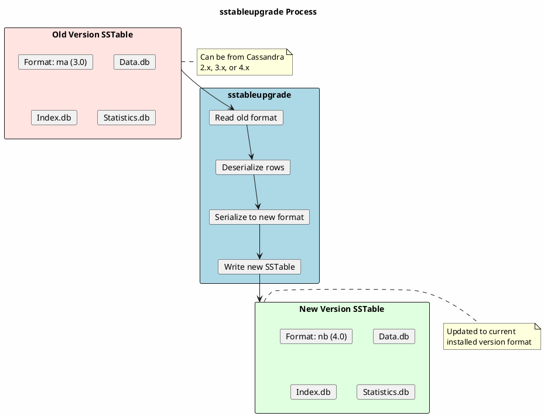
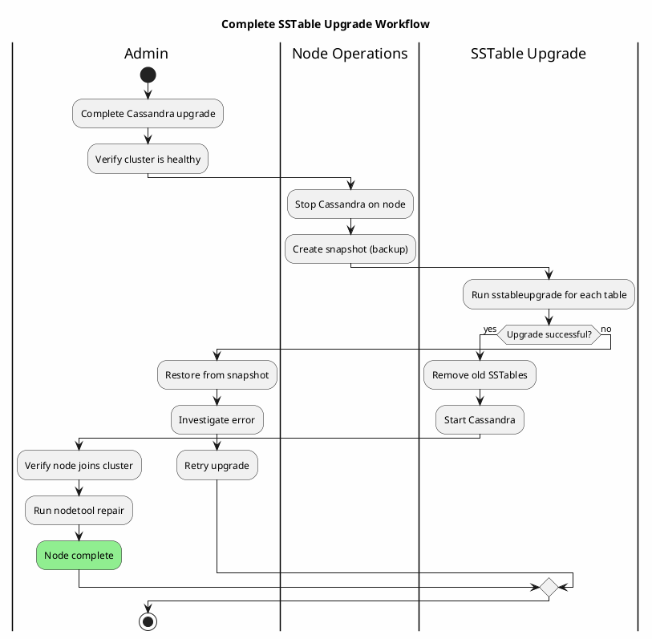

# sstableupgrade

Rewrites SSTables to the current Cassandra version format for compatibility after major version upgrades.

---

## Synopsis

```bash
sstableupgrade [options] <keyspace> <table>
```

---

## Description

`sstableupgrade` rewrites SSTable files from older Cassandra versions to the format used by the currently installed version. This is necessary after upgrading Cassandra to a new major version, as SSTable formats may change between versions.

While Cassandra can read SSTables from previous versions during normal operation, upgrading SSTables provides:

- **Performance improvements** - New formats may have better compression or indexing
- **Feature compatibility** - Some features require the latest SSTable format
- **Reduced complexity** - Eliminates need for backward-compatibility code paths
- **Preparation for next upgrade** - Each major version only supports reading from the previous version

!!! danger "Cassandra Must Be Stopped"
    **Cassandra must be completely stopped** before running `sstableupgrade`. Running this tool while Cassandra is active will cause data corruption.

---

## How It Works



### SSTable Version History

| Cassandra Version | SSTable Format | Format ID |
|-------------------|----------------|-----------|
| 2.0.x | Legacy | jb |
| 2.1.x | Legacy | ka |
| 2.2.x | Legacy | la |
| 3.0.x | Big format | ma |
| 3.11.x | Big format | mb |
| 4.0.x | Big format | nb |
| 4.1.x | Big format | nc |
| 5.0.x | BTI format | oa |

---

## Arguments

| Argument | Description |
|----------|-------------|
| `keyspace` | Name of the keyspace containing the table |
| `table` | Name of the table to upgrade |

---

## Options

| Option | Description |
|--------|-------------|
| `-k, --keep-source` | Keep original SSTables after upgrade (do not delete) |
| `--debug` | Enable debug output |

---

## Examples

### Basic Upgrade

```bash
# Stop Cassandra first
sudo systemctl stop cassandra

# Upgrade SSTables for a specific table
sstableupgrade my_keyspace my_table

# Start Cassandra
sudo systemctl start cassandra
```

### Keep Original Files

```bash
# Upgrade but keep old SSTables (useful for rollback)
sstableupgrade -k my_keyspace my_table

# Verify new SSTables work, then manually remove old ones
```

### Upgrade All Tables in Keyspace

```bash
#!/bin/bash
# upgrade_keyspace.sh

KEYSPACE="$1"
DATA_DIR="/var/lib/cassandra/data"

if [ -z "$KEYSPACE" ]; then
    echo "Usage: $0 <keyspace>"
    exit 1
fi

# Find all tables in keyspace
for table_dir in ${DATA_DIR}/${KEYSPACE}/*/; do
    table_name=$(basename "$table_dir" | cut -d'-' -f1)
    echo "Upgrading ${KEYSPACE}.${table_name}..."
    sstableupgrade "$KEYSPACE" "$table_name"
    if [ $? -ne 0 ]; then
        echo "ERROR: Failed to upgrade ${KEYSPACE}.${table_name}"
        exit 1
    fi
done

echo "All tables in ${KEYSPACE} upgraded successfully"
```

### Upgrade Entire Cluster

```bash
#!/bin/bash
# upgrade_all_sstables.sh

DATA_DIR="/var/lib/cassandra/data"

# Skip system keyspaces (they're upgraded automatically)
SKIP_KEYSPACES="system system_schema system_auth system_distributed system_traces"

for ks_dir in ${DATA_DIR}/*/; do
    ks_name=$(basename "$ks_dir")

    # Skip system keyspaces
    if echo "$SKIP_KEYSPACES" | grep -q "$ks_name"; then
        echo "Skipping system keyspace: $ks_name"
        continue
    fi

    for table_dir in ${ks_dir}*/; do
        table_name=$(basename "$table_dir" | cut -d'-' -f1)
        echo "Upgrading ${ks_name}.${table_name}..."
        sstableupgrade "$ks_name" "$table_name"
    done
done
```

---

## When to Use sstableupgrade

### Scenario 1: Post-Major-Upgrade

After upgrading Cassandra from one major version to another:

```bash
# Example: After upgrading from 3.11 to 4.0

# 1. Complete rolling upgrade of all nodes
# 2. On each node, upgrade SSTables (can be done with Cassandra running for 4.0+)
# Or stop Cassandra and run offline:

sudo systemctl stop cassandra

# 3. Upgrade user keyspaces
for ks in my_keyspace other_keyspace; do
    for table_dir in /var/lib/cassandra/data/$ks/*/; do
        table=$(basename "$table_dir" | cut -d'-' -f1)
        sstableupgrade "$ks" "$table"
    done
done

sudo systemctl start cassandra
```

### Scenario 2: Preparing for Next Upgrade

Upgrade SSTables before the next major version upgrade:

```bash
# Cassandra 4.x can read 3.x SSTables
# But Cassandra 5.x may not read 3.x SSTables
# Upgrade now to ensure compatibility

sstableupgrade my_keyspace my_table
```

### Scenario 3: Enabling New Features

Some features require the latest SSTable format:

```bash
# Example: New compression algorithm only available in latest format
sstableupgrade my_keyspace my_table

# Then modify table to use new compression
cqlsh -e "ALTER TABLE my_keyspace.my_table
    WITH compression = {'class': 'ZstdCompressor'};"
```

---

## Upgrade Process Flow



---

## Verification

### Before Upgrade

```bash
# Check current SSTable versions
sstablemetadata /var/lib/cassandra/data/my_keyspace/my_table-*/nb-*-big-Data.db | grep "SSTable Version"

# Sample output:
# SSTable Version: mb

# List all SSTables and their versions
for f in /var/lib/cassandra/data/my_keyspace/my_table-*/*-Data.db; do
    version=$(echo "$f" | grep -oP '\w{2}(?=-\d+-big-Data\.db)')
    echo "$version: $f"
done
```

### After Upgrade

```bash
# Verify all SSTables are now current version
sstablemetadata /var/lib/cassandra/data/my_keyspace/my_table-*/*-Data.db | grep "SSTable Version"

# Verify Cassandra can read upgraded SSTables
sudo systemctl start cassandra
cqlsh -e "SELECT COUNT(*) FROM my_keyspace.my_table;"
```

---

## Resource Requirements

### Disk Space

Upgrading requires space for both old and new SSTables temporarily:

```bash
# Check current table size
du -sh /var/lib/cassandra/data/my_keyspace/my_table-*/

# Ensure at least 2x the size is available
df -h /var/lib/cassandra/data/
```

### Time Estimates

| Data Size | Approximate Time |
|-----------|------------------|
| 1 GB | 1-2 minutes |
| 10 GB | 10-20 minutes |
| 100 GB | 1-3 hours |
| 1 TB | 10-30 hours |

Times vary based on disk speed and SSTable compression.

---

## Troubleshooting

### Out of Disk Space

```bash
# Error: No space left on device

# Check available space
df -h /var/lib/cassandra/data/

# Options:
# 1. Free up space by removing old snapshots
nodetool clearsnapshot

# 2. Upgrade tables one at a time
sstableupgrade my_keyspace small_table_first

# 3. Use --keep-source and manually manage old files
sstableupgrade -k my_keyspace my_table
# Verify new files work, then remove old ones
rm /var/lib/cassandra/data/my_keyspace/my_table-*/ma-*
```

### Permission Denied

```bash
# Run as cassandra user
sudo -u cassandra sstableupgrade my_keyspace my_table

# Or fix ownership after
sudo chown -R cassandra:cassandra /var/lib/cassandra/data/
```

### Upgrade Fails Mid-Process

```bash
# If upgrade fails partway through:

# 1. Check for incomplete files
ls -la /var/lib/cassandra/data/my_keyspace/my_table-*/*.tmp

# 2. Remove incomplete files
rm /var/lib/cassandra/data/my_keyspace/my_table-*/*.tmp

# 3. The old SSTables should still be intact
# 4. Retry the upgrade
sstableupgrade my_keyspace my_table
```

### Schema Mismatch Errors

```bash
# Error: Unknown column or schema mismatch

# This can happen if schema changed after SSTables were written
# Option 1: Scrub first
sstablescrub --no-validate my_keyspace my_table
sstableupgrade my_keyspace my_table

# Option 2: Check schema history
cqlsh -e "DESCRIBE TABLE my_keyspace.my_table;"
```

---

## Alternative: Online Upgrade

In Cassandra 4.0+, `nodetool upgradesstables` performs online upgrades:

```bash
# Online upgrade (Cassandra must be running)
nodetool upgradesstables my_keyspace my_table

# Upgrade all tables in keyspace
nodetool upgradesstables my_keyspace

# Upgrade with parallel jobs
nodetool upgradesstables -j 4 my_keyspace
```

### sstableupgrade vs nodetool upgradesstables

| Aspect | sstableupgrade | nodetool upgradesstables |
|--------|----------------|--------------------------|
| Cassandra state | Must be stopped | Must be running |
| Resource usage | Dedicated resources | Shares with operations |
| Speed | Generally faster | Throttled for stability |
| When to use | During maintenance window | Rolling/live upgrade |
| Compaction strategy | Ignores | Follows configured strategy |

---

## Best Practices

!!! tip "sstableupgrade Guidelines"

    1. **Always backup first** - Snapshot before upgrading SSTables
    2. **Upgrade during maintenance** - Plan for downtime
    3. **Check disk space** - Need 2x table size temporarily
    4. **Upgrade one keyspace at a time** - Easier to track progress
    5. **Verify after upgrade** - Run verification queries
    6. **Plan for time** - Large tables take hours
    7. **Consider online upgrade** - Use `nodetool upgradesstables` for 4.0+

!!! warning "Cautions"

    - Cannot downgrade SSTables to older format
    - Original SSTables are deleted by default
    - Use `-k` flag if rollback might be needed
    - Disk space is critical - monitor during operation

---

## Related Commands

| Command | Relationship |
|---------|--------------|
| [nodetool upgradesstables](../nodetool/upgradesstables.md) | Online upgrade alternative |
| [sstableverify](sstableverify.md) | Verify SSTables before/after |
| [sstablemetadata](sstablemetadata.md) | Check SSTable version |
| [sstablescrub](sstablescrub.md) | Fix corruption before upgrade |
| [nodetool snapshot](../nodetool/snapshot.md) | Backup before upgrade |
