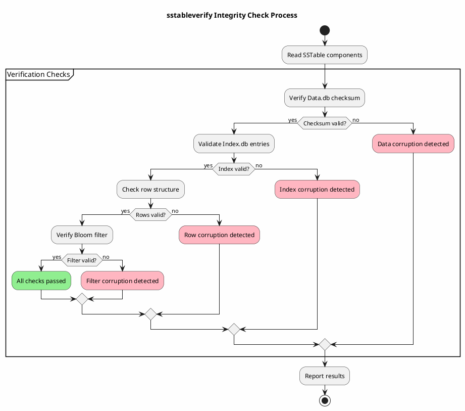
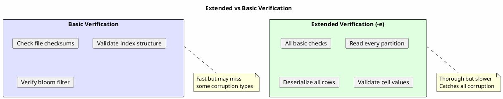
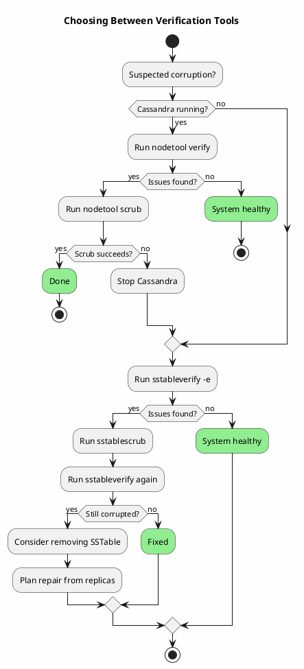

# sstableverify

Validates SSTable integrity by checking data structure and checksums without modifying files.

---

## Synopsis

```bash
sstableverify [options] <keyspace> <table>
```

---

## Description

`sstableverify` performs comprehensive integrity checks on SSTable files to detect corruption before it causes operational problems. Unlike `sstablescrub`, this tool is read-only and does not modify any data, making it safe for diagnostic purposes.

The tool validates:

- **Data file checksums** - Verifies CRC32 checksums match stored values
- **Index consistency** - Ensures index entries point to valid data locations
- **Row structure** - Validates row format and column data
- **Bloom filter integrity** - Checks filter file consistency

!!! danger "Cassandra Must Be Stopped"
    **Cassandra must be completely stopped** before running `sstableverify`. Running this tool while Cassandra is active may produce inconsistent results or cause issues with active SSTables.

---

## How It Works



### Verification Levels

| Level | Components Checked | Use Case |
|-------|-------------------|----------|
| Basic | Checksums only | Quick health check |
| Extended (`-e`) | Checksums + row reads | Deep validation |
| Token Check (`-t`) | Token range validation | Ring consistency |

---

## Arguments

| Argument | Description |
|----------|-------------|
| `keyspace` | Name of the keyspace containing the table |
| `table` | Name of the table to verify |

---

## Options

| Option | Description |
|--------|-------------|
| `-e, --extended` | Extended verification - read and validate every row |
| `-t, --token <range>` | Only verify SSTables that contain tokens in the specified range |
| `-v, --verbose` | Verbose output showing progress |
| `--debug` | Enable debug logging |

### Extended Verification (`-e`)

Extended mode performs a complete read of every row in the SSTable:



---

## Examples

### Basic Verification

```bash
# Stop Cassandra first
sudo systemctl stop cassandra

# Verify a specific table
sstableverify my_keyspace my_table

# Start Cassandra
sudo systemctl start cassandra
```

### Extended Verification

```bash
# Full row-by-row verification
sstableverify -e my_keyspace my_table
```

### Verbose Output

```bash
# See progress during verification
sstableverify -v my_keyspace my_table
```

### Verify Token Range

```bash
# Only verify SSTables containing specific tokens
sstableverify -t 0:1000000000000000000 my_keyspace my_table
```

### Verify All Tables in Keyspace

```bash
#!/bin/bash
# verify_keyspace.sh

KEYSPACE="$1"
DATA_DIR="/var/lib/cassandra/data"

# Get all tables in keyspace
for table_dir in ${DATA_DIR}/${KEYSPACE}/*/; do
    table_name=$(basename "$table_dir" | cut -d'-' -f1)
    echo "Verifying ${KEYSPACE}.${table_name}..."
    sstableverify "$KEYSPACE" "$table_name"
    if [ $? -ne 0 ]; then
        echo "ERROR: Corruption found in ${KEYSPACE}.${table_name}"
    fi
done
```

---

## Understanding Output

### Successful Verification

```
Verifying BigTableReader(path='/var/lib/cassandra/data/my_keyspace/my_table-abc123/nb-1-big-Data.db')
Deserializing sstable metadata for /var/lib/cassandra/data/my_keyspace/my_table-abc123/nb-1-big-Data.db
Checking computed hash of BigTableReader...
Verifying BigTableReader(path='/var/lib/cassandra/data/my_keyspace/my_table-abc123/nb-2-big-Data.db')
...
```

No errors printed indicates all SSTables passed verification.

### Failed Verification

```
Verifying BigTableReader(path='/var/lib/cassandra/data/my_keyspace/my_table-abc123/nb-1-big-Data.db')
Error verifying /var/lib/cassandra/data/my_keyspace/my_table-abc123/nb-1-big-Data.db:
Corrupted: Cannot read sstable at position 12345
```

### Exit Codes

| Code | Meaning |
|------|---------|
| 0 | All SSTables verified successfully |
| 1 | Corruption detected in one or more SSTables |
| 2 | Tool error (permissions, missing files, etc.) |

---

## When to Use sstableverify

### Scenario 1: Routine Health Checks

```bash
#!/bin/bash
# weekly_verify.sh - Run weekly via cron

KEYSPACES="system system_auth my_keyspace"
LOG_FILE="/var/log/cassandra/verify_$(date +%Y%m%d).log"

echo "Starting SSTable verification: $(date)" >> $LOG_FILE

for ks in $KEYSPACES; do
    for table_dir in /var/lib/cassandra/data/$ks/*/; do
        table=$(basename "$table_dir" | cut -d'-' -f1)
        echo "Verifying $ks.$table" >> $LOG_FILE
        sstableverify "$ks" "$table" >> $LOG_FILE 2>&1
    done
done

echo "Verification complete: $(date)" >> $LOG_FILE
```

### Scenario 2: After Hardware Issues

```bash
# After disk errors, power loss, or memory issues
# Verify all tables before starting Cassandra

sudo systemctl stop cassandra

# Verify critical tables first
sstableverify -e system_auth roles
sstableverify -e my_keyspace critical_table

# If issues found, scrub before starting
# sstablescrub my_keyspace corrupted_table

sudo systemctl start cassandra
```

### Scenario 3: Before Major Operations

```bash
# Verify before upgrades or migrations
sstableverify my_keyspace my_table

# If clean, proceed with operation
if [ $? -eq 0 ]; then
    echo "SSTables healthy, proceeding..."
else
    echo "Corruption detected, run sstablescrub first"
fi
```

### Scenario 4: Investigating Read Errors

```bash
# When seeing read errors in logs
# Error: "CorruptSSTableException" or "Cannot read SSTable"

# 1. Stop Cassandra
sudo systemctl stop cassandra

# 2. Verify the suspect table
sstableverify -e -v my_keyspace problematic_table 2>&1 | tee verify.log

# 3. Identify corrupted SSTables from output
grep -i "error\|corrupt" verify.log

# 4. Scrub to fix
sstablescrub my_keyspace problematic_table
```

---

## sstableverify vs Related Tools

| Tool | Purpose | Modifies Data | When to Use |
|------|---------|---------------|-------------|
| `sstableverify` | Check integrity | No | Diagnostics, health checks |
| `sstablescrub` | Fix corruption | Yes | After verify finds issues |
| `nodetool verify` | Online verification | No | While Cassandra running |
| `nodetool scrub` | Online scrub | Yes | Minor corruption, online |

### Decision Flow



---

## Performance Considerations

### Verification Time Estimates

| Data Size | Basic Mode | Extended Mode |
|-----------|------------|---------------|
| 1 GB | ~10 seconds | ~1 minute |
| 10 GB | ~1 minute | ~10 minutes |
| 100 GB | ~10 minutes | ~1-2 hours |
| 1 TB | ~1-2 hours | ~10-20 hours |

### Resource Usage

- **CPU**: Moderate (checksum calculations)
- **Memory**: Low (streams data)
- **Disk I/O**: High (reads all SSTable data)

### Optimizing Large Verifications

```bash
# Verify tables in parallel (if I/O allows)
sstableverify keyspace table1 &
sstableverify keyspace table2 &
sstableverify keyspace table3 &
wait

# Or limit to specific token ranges
sstableverify -t -9223372036854775808:0 keyspace table &
sstableverify -t 0:9223372036854775807 keyspace table &
wait
```

---

## Troubleshooting

### Permission Denied

```bash
# Run as cassandra user
sudo -u cassandra sstableverify my_keyspace my_table

# Or fix ownership
sudo chown -R cassandra:cassandra /var/lib/cassandra/data/
```

### Out of Memory

```bash
# Increase heap for verification
export JVM_OPTS="-Xmx4G"
sstableverify my_keyspace my_table
```

### Tool Cannot Find SSTables

```bash
# List SSTables first
sstableutil my_keyspace my_table

# Verify directory structure
ls -la /var/lib/cassandra/data/my_keyspace/my_table-*/

# Check for in-progress compactions
ls /var/lib/cassandra/data/my_keyspace/my_table-*/*.log
```

### False Positives

Verification may report issues that are not actual corruption:

- **In-progress compaction logs** - Temporary files during compaction
- **Transaction logs** - Pending operations

```bash
# Clean up transaction logs before verification
# (Only if Cassandra is stopped and was cleanly drained)
find /var/lib/cassandra/data/ -name "*.log" -type f
```

---

## Best Practices

!!! tip "sstableverify Guidelines"

    1. **Run regularly** - Schedule weekly or monthly verification
    2. **Use extended mode** - For thorough checks after incidents
    3. **Verify before upgrades** - Ensure clean state before major changes
    4. **Keep Cassandra stopped** - Required for accurate results
    5. **Check all critical tables** - System tables and important application tables
    6. **Review logs first** - Check for corruption indicators before verification
    7. **Plan for time** - Extended verification can take hours on large datasets

!!! warning "Limitations"

    - Does not fix corruption (use `sstablescrub` for that)
    - Requires Cassandra to be stopped
    - Extended mode is slow on large datasets
    - Cannot verify SSTables being actively written

---

## Related Commands

| Command | Relationship |
|---------|--------------|
| [sstablescrub](sstablescrub.md) | Fix corruption found by verify |
| [nodetool verify](../nodetool/verify.md) | Online verification (less thorough) |
| [nodetool scrub](../nodetool/scrub.md) | Online scrub |
| [sstablemetadata](sstablemetadata.md) | View SSTable properties |
| [sstableutil](sstableutil.md) | List SSTable files |
