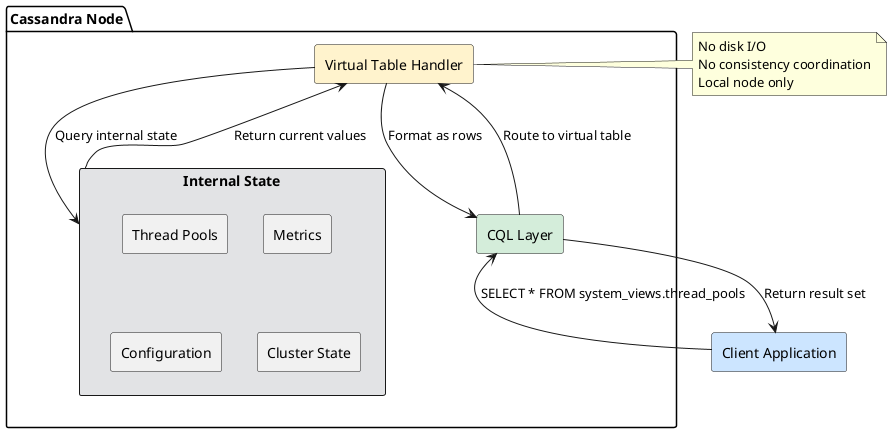

# Virtual Tables

Virtual tables expose Cassandra's internal state through standard CQL queries. They provide real-time access to metrics, configuration, cluster status, and operational information without requiring JMX or external tools.

---

## Overview

### What Are Virtual Tables?

Virtual tables are read-only tables that do not store data on disk. Instead, they generate results dynamically by querying Cassandra's internal state. Each query executes against the local node only—virtual tables do not coordinate across the cluster.

| Characteristic | Regular Tables | Virtual Tables |
|----------------|----------------|----------------|
| Data storage | SSTables on disk | None (generated on query) |
| Scope | Distributed across cluster | Local to queried node |
| Mutability | Read/write | Read-only |
| Consistency | Configurable CL | Always local |
| ALLOW FILTERING | Required for non-key filters | Not required |
| Schema | User-defined | System-defined |

### Historical Context

| Version | Virtual Tables Feature |
|---------|------------------------|
| 4.0 | Virtual tables introduced (CASSANDRA-7622). Initial tables for settings, thread pools, and clients. |
| 4.1 | Additional metrics tables, improved repair tracking |
| 5.0 | SAI index introspection tables, expanded repair state, streaming visibility (CEP-14) |

Before virtual tables, accessing internal Cassandra state required JMX connections, which presented challenges:

- JMX requires separate tooling and authentication
- Firewall rules often block JMX ports
- No standard query language for JMX
- Difficult to integrate with existing CQL-based monitoring

Virtual tables solve these problems by exposing the same information through CQL.

### Architecture



**Key characteristics:**

- Queries execute entirely on the coordinator node
- Results reflect the state of that specific node only
- No replication, no consistency levels, no tombstones
- Each query generates fresh data from internal state

---

## Behavioral Guarantees

### What Virtual Tables Guarantee

- Results reflect the current state of the local node at query time
- Queries never require ALLOW FILTERING warnings (safe to use without partition key)
- Schema is stable within a major version
- Virtual tables are always available when the node is running
- Read operations have minimal overhead

### What Virtual Tables Do NOT Guarantee

!!! warning "Undefined Behavior"
    The following behaviors are undefined and must not be relied upon:

    - **Cross-node consistency**: Querying the same virtual table on different nodes returns different results (each node's local state)
    - **Point-in-time snapshots**: Virtual table contents may change between rows being returned if internal state changes during query
    - **Schema stability across versions**: Virtual table schemas may change between Cassandra versions
    - **Complete metric accuracy**: Some metrics are approximations or samples
    - **Historical data**: Virtual tables show current state only; historical data requires external collection

### Query Behavior

| Behavior | Description |
|----------|-------------|
| Consistency Level | Ignored—always reads local node |
| Tracing | Supported but shows only local execution |
| Paging | Supported for large result sets |
| Prepared Statements | Supported and recommended |
| ALLOW FILTERING | Not required—virtual tables are local-only |

---

## Virtual Keyspaces

Cassandra 5.0 provides two virtual keyspaces:

| Keyspace | Purpose | Documentation |
|----------|---------|---------------|
| `system_virtual_schema` | Metadata about virtual tables | [Schema Reference](system-virtual-schema.md) |
| `system_views` | Operational tables | See categories below |

### system_views Categories

| Category | Description | Documentation |
|----------|-------------|---------------|
| **Metrics** | Latency, read statistics, batch/CQL metrics | [Metrics Tables](metrics.md) |
| **Thread Pools** | Thread pool utilization and status | [Thread Pools](thread-pools.md) |
| **Caches** | Cache hit rates and sizes | [Caches](caches.md) |
| **Clients** | Connected clients and active queries | [Clients](clients.md) |
| **Cluster State** | Gossip, hints, internode communication | [Cluster State](cluster-state.md) |
| **Storage** | Disk usage, partitions, snapshots, tasks | [Storage](storage.md) |
| **Repair** | Repair operation tracking | [Repair](repair.md) |
| **SAI Indexes** | Storage-Attached Index introspection | [SAI](sai.md) |
| **Streaming** | Data streaming operations | [Streaming](streaming.md) |
| **Configuration** | Runtime settings and properties | [Configuration](configuration.md) |

---

## Quick Reference

### Common Monitoring Queries

```sql
-- Thread pool health
SELECT name, active_tasks, pending_tasks, blocked_tasks
FROM system_views.thread_pools
WHERE pending_tasks > 0 OR blocked_tasks > 0;

-- Cache efficiency
SELECT name, hit_ratio, size_bytes, capacity_bytes
FROM system_views.caches;

-- Connected clients
SELECT address, username, driver_name, request_count
FROM system_views.clients;

-- Table latencies
SELECT keyspace_name, table_name, p99th_ms
FROM system_views.coordinator_read_latency;

-- Tombstone problems
SELECT keyspace_name, table_name, p99th, max
FROM system_views.tombstones_per_read
WHERE p99th > 100;
```

### Alerting Queries

```sql
-- Alert: Blocked thread pools
SELECT name, blocked_tasks
FROM system_views.thread_pools
WHERE blocked_tasks > 0;

-- Alert: Low cache hit ratio
SELECT name, hit_ratio
FROM system_views.caches
WHERE name = 'KeyCache' AND hit_ratio < 0.80;

-- Alert: Large pending hints
SELECT host_id, address, files
FROM system_views.pending_hints
WHERE files > 100;

-- Alert: Active repairs taking too long
SELECT id, keyspace_name, duration_millis
FROM system_views.repairs
WHERE completed = false AND duration_millis > 3600000;
```

---

## Best Practices

### Monitoring Integration

Use virtual tables in monitoring systems instead of JMX where possible:

| nodetool Command | Virtual Table Equivalent |
|------------------|--------------------------|
| `nodetool tpstats` | `system_views.thread_pools` |
| `nodetool gossipinfo` | `system_views.gossip_info` |
| `nodetool compactionstats` | `system_views.sstable_tasks` |
| `nodetool clientstats` | `system_views.clients` |
| `nodetool listsnapshots` | `system_views.snapshots` |
| `nodetool listpendinghints` | `system_views.pending_hints` |

### Polling Intervals

Virtual tables are designed for monitoring queries, not high-frequency polling:

| Use Case | Recommended Interval |
|----------|---------------------|
| Dashboard refresh | 30-60 seconds |
| Alerting checks | 60 seconds |
| Capacity planning | 5-15 minutes |
| Ad-hoc debugging | On-demand |

### Multi-Node Queries

Virtual tables return local data only. To aggregate across the cluster, query each node:

```python
# Example: Query all nodes
from cassandra.cluster import Cluster

cluster = Cluster(contact_points=['node1', 'node2', 'node3'])

for host in cluster.metadata.all_hosts():
    session = cluster.connect()
    # Execute on specific node
    result = session.execute(
        "SELECT * FROM system_views.thread_pools",
        host=host
    )
    print(f"Node {host.address}: {list(result)}")
```

---

## Restrictions

!!! danger "Virtual Table Restrictions"
    **Cannot modify**: Virtual tables are read-only. INSERT, UPDATE, DELETE operations fail.

    **Local scope only**: Results reflect only the queried node. Cluster-wide views require querying each node.

    **No indexes**: Cannot create secondary indexes on virtual tables.

    **No materialized views**: Cannot create materialized views based on virtual tables.

    **Schema changes**: Cannot ALTER virtual tables. Schema is fixed by Cassandra version.

    **No TTL/Timestamps**: WRITETIME() and TTL() functions return null.

---

## Related Documentation

- **[nodetool Reference](../nodetool/index.md)** - Command-line equivalents
- **[JMX Reference](../jmx-reference/index.md)** - JMX metrics access
- **[Monitoring](../monitoring/index.md)** - Monitoring strategies
