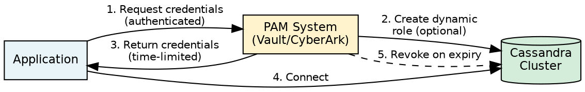
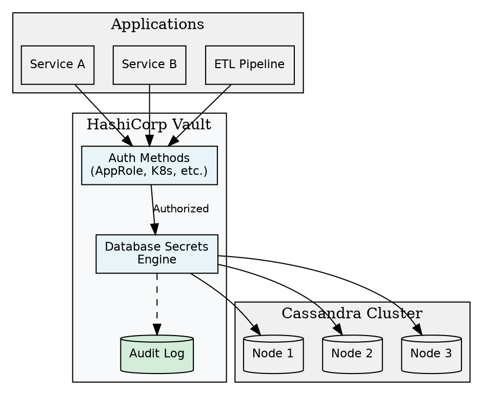
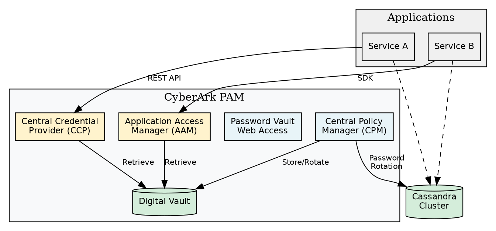
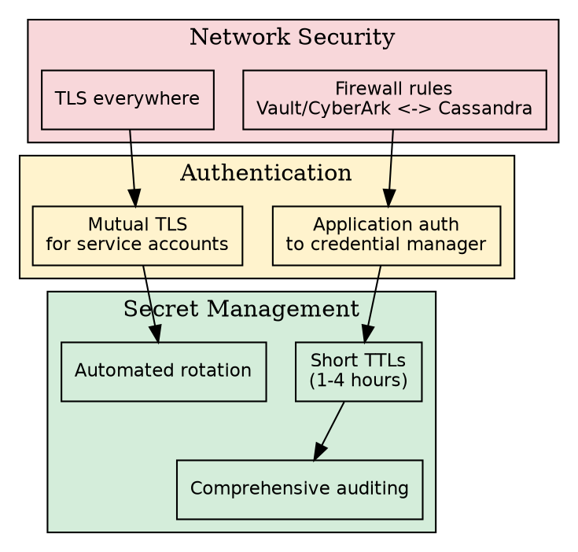

# Privileged Access Management

Privileged Access Management (PAM) systems provide centralized control over database credentials, enabling automatic rotation, audit logging, and integration with enterprise security policies. This guide covers integration patterns for HashiCorp Vault and CyberArk with Cassandra.

---

## Overview

Traditional static credentials present several challenges:

| Challenge | Description |
|-----------|-------------|
| Credential sprawl | Passwords stored in config files, environment variables, and code |
| Manual rotation | Time-consuming process prone to errors and service disruptions |
| Limited auditing | Difficult to track who accessed which credentials |
| Long-lived secrets | Compromised credentials remain valid until manually changed |

PAM solutions address these issues:



### PAM Approaches

| Approach | Description | Use Case |
|----------|-------------|----------|
| Dynamic secrets | Vault/CyberArk creates temporary Cassandra roles | High-security environments, automated pipelines |
| Static secret retrieval | Application retrieves pre-configured credentials | Legacy applications, simpler deployments |
| Password rotation | Periodic automated credential changes | Compliance requirements, service accounts |

---

## HashiCorp Vault Integration

HashiCorp Vault provides dynamic secret management for Cassandra through its database secrets engine. Key capabilities include:

- Automatic credential rotation
- Short-lived credentials for applications
- Centralized secret management
- Comprehensive audit logging

### Architecture



### Prerequisites

Before configuring Vault integration:

1. **Vault server** running and accessible from applications
2. **Cassandra cluster** with authentication enabled (`PasswordAuthenticator`)
3. **Vault admin role** in Cassandra with role management permissions
4. **Network connectivity** between Vault and Cassandra nodes

### Vault Database Secrets Engine Setup

Enable and configure the database secrets engine:

```bash
# Enable the database secrets engine
vault secrets enable database

# Configure Cassandra connection
vault write database/config/cassandra \
    plugin_name=cassandra-database-plugin \
    hosts=cassandra1.example.com,cassandra2.example.com \
    port=9042 \
    username=vault_admin \
    password='VaultAdminP@ss!2024' \
    tls=true \
    insecure_tls=false \
    protocol_version=4 \
    allowed_roles="app-readonly,app-readwrite,etl-pipeline"
```

**Configuration parameters:**

| Parameter | Description |
|-----------|-------------|
| `plugin_name` | Must be `cassandra-database-plugin` |
| `hosts` | Comma-separated list of Cassandra nodes |
| `port` | CQL native transport port (default: 9042) |
| `username` | Vault admin role in Cassandra |
| `password` | Vault admin role password |
| `tls` | Enable TLS for Cassandra connection |
| `protocol_version` | CQL protocol version (3 or 4) |
| `allowed_roles` | Vault roles permitted to use this connection |

### Vault Admin Role in Cassandra

Create a dedicated role for Vault to manage credentials:

```sql
-- Vault admin role - can only manage roles, not access data
CREATE ROLE vault_admin WITH PASSWORD = 'VaultAdminP@ss!2024'
    AND LOGIN = true
    AND SUPERUSER = false;

-- Vault needs to create/drop roles
GRANT CREATE ON ALL ROLES TO vault_admin;
GRANT DROP ON ALL ROLES TO vault_admin;

-- Vault needs to grant permissions to created roles
GRANT AUTHORIZE ON KEYSPACE production TO vault_admin;
GRANT AUTHORIZE ON KEYSPACE analytics TO vault_admin;

-- Vault should NOT have data access
-- No SELECT, MODIFY, or schema permissions
```

!!! warning "Principle of Least Privilege"
    The Vault admin role should only have permissions necessary for role management. It should never have direct data access (SELECT, MODIFY) or schema modification capabilities (ALTER, CREATE KEYSPACE).

### Create Vault Roles

Define Vault roles that map to Cassandra access patterns:

**Read-Only Role:**

```bash
vault write database/roles/app-readonly \
    db_name=cassandra \
    creation_statements="CREATE ROLE '{{username}}' WITH PASSWORD = '{{password}}' AND LOGIN = true; \
                         GRANT SELECT ON KEYSPACE production TO '{{username}}';" \
    revocation_statements="DROP ROLE '{{username}}';" \
    default_ttl="1h" \
    max_ttl="24h"
```

**Read-Write Role:**

```bash
vault write database/roles/app-readwrite \
    db_name=cassandra \
    creation_statements="CREATE ROLE '{{username}}' WITH PASSWORD = '{{password}}' AND LOGIN = true; \
                         GRANT SELECT ON KEYSPACE production TO '{{username}}'; \
                         GRANT MODIFY ON KEYSPACE production TO '{{username}}';" \
    revocation_statements="DROP ROLE '{{username}}';" \
    default_ttl="1h" \
    max_ttl="24h"
```

**ETL Pipeline Role:**

```bash
vault write database/roles/etl-pipeline \
    db_name=cassandra \
    creation_statements="CREATE ROLE '{{username}}' WITH PASSWORD = '{{password}}' AND LOGIN = true; \
                         GRANT SELECT ON KEYSPACE raw_data TO '{{username}}'; \
                         GRANT SELECT ON KEYSPACE processed_data TO '{{username}}'; \
                         GRANT MODIFY ON KEYSPACE processed_data TO '{{username}}';" \
    revocation_statements="DROP ROLE '{{username}}';" \
    default_ttl="4h" \
    max_ttl="12h"
```

**Role parameters:**

| Parameter | Description |
|-----------|-------------|
| `creation_statements` | CQL to create role and grant permissions |
| `revocation_statements` | CQL to remove role on lease expiry |
| `default_ttl` | Default credential lifetime |
| `max_ttl` | Maximum credential lifetime (cannot be exceeded) |

### Application Credential Retrieval

Applications request credentials from Vault:

```bash
# Request credentials
vault read database/creds/app-readonly

# Response:
# Key                Value
# ---                -----
# lease_id           database/creds/app-readonly/abc123xyz
# lease_duration     1h
# lease_renewable    true
# username           v-approle-app-readonly-xyz789abc
# password           A1b2C3d4E5f6G7h8I9j0
```

**Application integration example (Python):**

```python
import hvac
from cassandra.cluster import Cluster
from cassandra.auth import PlainTextAuthProvider

# Connect to Vault
vault_client = hvac.Client(url='https://vault.example.com:8200')
vault_client.auth.approle.login(
    role_id='app-role-id',
    secret_id='app-secret-id'
)

# Retrieve Cassandra credentials
creds = vault_client.secrets.database.generate_credentials(
    name='app-readonly'
)

# Connect to Cassandra with dynamic credentials
auth_provider = PlainTextAuthProvider(
    username=creds['data']['username'],
    password=creds['data']['password']
)

cluster = Cluster(
    contact_points=['cassandra1.example.com'],
    auth_provider=auth_provider
)
session = cluster.connect()
```

### Credential Rotation

Vault supports automatic rotation of the root credentials:

```bash
# Rotate Vault admin password in Cassandra
vault write -force database/rotate-root/cassandra
```

!!! note "Root Rotation"
    After rotation, the old password is invalidated. Ensure Vault is the only system using the `vault_admin` credentials before rotating.

### Lease Management

```bash
# View active leases
vault list sys/leases/lookup/database/creds/app-readonly

# Revoke specific lease (immediate credential revocation)
vault lease revoke database/creds/app-readonly/abc123xyz

# Revoke all leases for a role
vault lease revoke -prefix database/creds/app-readonly
```

---

## CyberArk Integration

CyberArk Privileged Access Manager (PAM) provides enterprise credential management with features including:

- Credential vaulting and retrieval
- Automated password rotation
- Session recording and monitoring
- Integration with enterprise identity systems

### Architecture



### CyberArk Components

| Component | Function |
|-----------|----------|
| Digital Vault | Secure storage for credentials |
| Central Policy Manager (CPM) | Automates password rotation |
| Central Credential Provider (CCP) | REST API for credential retrieval |
| Application Access Manager (AAM) | SDK-based credential retrieval |
| Privileged Session Manager (PSM) | Session recording (optional) |

### Cassandra Account Configuration

Configure Cassandra accounts in CyberArk:

1. **Create Safe** for Cassandra credentials

2. **Add Account** with platform type "Cassandra Database"
   - Address: Cassandra contact point hostname
   - Username: Cassandra role name
   - Password: Current role password
   - Port: 9042

3. **Configure CPM** for automatic rotation:
   - Set rotation schedule (e.g., every 30 days)
   - Define password policy
   - Configure verification settings

### CPM Password Rotation Setup

CyberArk CPM requires a privileged account to perform password changes:

```sql
-- CyberArk CPM admin role
CREATE ROLE cyberark_cpm WITH PASSWORD = 'InitialCPMP@ss!2024'
    AND LOGIN = true
    AND SUPERUSER = false;

-- CPM needs to alter roles for password changes
GRANT ALTER ON ALL ROLES TO cyberark_cpm;

-- Optional: If CPM creates new accounts
GRANT CREATE ON ALL ROLES TO cyberark_cpm;
```

**CPM connection configuration:**

| Parameter | Value |
|-----------|-------|
| Protocol | CQL |
| Port | 9042 |
| Connection Command | Custom CQL connector |
| Change Password Command | `ALTER ROLE {username} WITH PASSWORD = '{newpassword}'` |
| Verify Command | `SELECT * FROM system.local` |

### Application Credential Retrieval

**Using CyberArk CCP (REST API):**

```python
import requests
from cassandra.cluster import Cluster
from cassandra.auth import PlainTextAuthProvider

# CyberArk CCP endpoint
ccp_url = "https://cyberark.example.com/AIMWebService/api/Accounts"

# Request credentials
params = {
    "AppID": "cassandra-app",
    "Safe": "CassandraCredentials",
    "Object": "cassandra-app-readonly"
}

response = requests.get(
    ccp_url,
    params=params,
    cert=('/path/to/client.crt', '/path/to/client.key'),
    verify='/path/to/ca-bundle.crt'
)

creds = response.json()

# Connect to Cassandra
auth_provider = PlainTextAuthProvider(
    username=creds['UserName'],
    password=creds['Content']
)

cluster = Cluster(
    contact_points=['cassandra1.example.com'],
    auth_provider=auth_provider
)
session = cluster.connect()
```

**Using CyberArk AAM (Credential Provider SDK):**

```java
import com.cyberark.aim.PasswordSDK;

// Java application using CyberArk Credential Provider
PSDKPassword password = PasswordSDK.getPassword(
    "cassandra.example.com",  // Address
    "cassandra-app",          // AppID
    "CassandraCredentials",   // Safe
    "app_production_rw"       // Object name
);

String username = password.getUserName();
String passwd = password.getContent();

// Use with Cassandra driver
PlainTextAuthProvider authProvider =
    new PlainTextAuthProvider(username, passwd);

Cluster cluster = Cluster.builder()
    .addContactPoint("cassandra1.example.com")
    .withAuthProvider(authProvider)
    .build();
```

### Credential Caching

CyberArk Credential Providers support local caching to reduce vault queries:

```xml
<!-- credentialfile.xml -->
<CredFile>
    <Entry Name="cassandra-app-readonly">
        <Username>app_readonly</Username>
        <Address>cassandra.example.com</Address>
        <Safe>CassandraCredentials</Safe>
        <CacheLifetime>300</CacheLifetime>
    </Entry>
</CredFile>
```

!!! warning "Cache Security"
    Cached credentials are stored locally. Ensure appropriate file system permissions and consider the security trade-offs of caching versus vault latency.

---

## Comparison: Vault vs CyberArk

| Feature | HashiCorp Vault | CyberArk PAM |
|---------|-----------------|--------------|
| Dynamic secrets | Native support | Limited (primarily rotation) |
| Open source option | Yes (Vault OSS) | No |
| Cloud-native | Strong (containers, K8s) | Improving (Secrets Hub) |
| Enterprise features | Vault Enterprise | Core product |
| Audit logging | Built-in | Built-in |
| Session recording | Via plugins | Native (PSM) |
| Learning curve | Moderate | Steeper |
| Pricing model | Open core | Enterprise licensing |

### Selection Criteria

**Choose HashiCorp Vault when:**

- Cloud-native or Kubernetes environments
- Need for dynamic, short-lived credentials
- DevOps-centric workflows
- Budget constraints (OSS option)

**Choose CyberArk when:**

- Enterprise PAM already deployed
- Regulatory requirements for session recording
- Integration with existing identity governance
- Complex compliance requirements

---

## Best Practices

### Credential Lifecycle

1. **Minimize TTL**: Use the shortest practical credential lifetime
2. **Automate rotation**: Never rely on manual password changes
3. **Monitor usage**: Alert on unusual credential access patterns
4. **Audit regularly**: Review which applications access which credentials

### Security Hardening



### Operational Recommendations

| Area | Recommendation |
|------|----------------|
| Monitoring | Alert on failed credential retrievals |
| High availability | Deploy credential managers in HA configuration |
| Disaster recovery | Include credential manager in DR plans |
| Testing | Verify credential rotation in non-production first |
| Documentation | Document credential dependencies for each application |

---

## Troubleshooting

### Common Issues

**Vault: "permission denied" when creating roles**

```bash
# Verify vault_admin has required permissions
cqlsh -u vault_admin -p 'password' -e "LIST ALL PERMISSIONS OF vault_admin"

# Check for missing AUTHORIZE permission
GRANT AUTHORIZE ON KEYSPACE target_keyspace TO vault_admin;
```

**CyberArk: CPM fails to rotate password**

```sql
-- Verify CPM account permissions
LIST ALL PERMISSIONS OF cyberark_cpm;

-- CPM needs ALTER on the target role
GRANT ALTER ON ROLE target_role TO cyberark_cpm;
```

**Credential retrieval latency**

- Enable caching in CyberArk Credential Provider
- Use Vault agent for credential caching and renewal
- Consider connection pooling in applications

**Stale credentials after rotation**

- Reduce Cassandra credential cache validity:
  ```yaml
  # cassandra.yaml
  credentials_validity_in_ms: 2000
  ```
- Ensure applications handle authentication failures gracefully

---

## Related Documentation

- **[Authentication](../authentication/index.md)** - Cassandra authentication configuration
- **[Authorization](../authorization/index.md)** - Role-based access control
- **[Security Overview](../index.md)** - Complete security guide
- **[Encryption](../encryption/index.md)** - TLS configuration for secure connections
