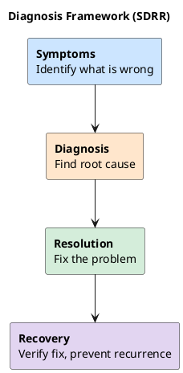

# Cassandra Diagnosis Guide

Systematic approach to diagnosing Cassandra issues.

## Diagnosis Framework (SDRR)



## Quick Diagnostic Commands

### Cluster Health

```bash
# Overall status
nodetool status

# Cluster information
nodetool describecluster

# Node information
nodetool info
```

### Performance

```bash
# Thread pools
nodetool tpstats

# Request latencies
nodetool proxyhistograms

# Table statistics
nodetool tablestats <keyspace>

# Compaction status
nodetool compactionstats
```

### Resource Usage

```bash
# Disk usage
df -h /var/lib/cassandra
nodetool status  # Shows Load per node

# Memory
nodetool info | grep "Heap Memory"
free -h

# CPU
top -b -n 1 | head -20
```

## Common Diagnostic Scenarios

### High Latency

```bash
# 1. Check coordinator latency
nodetool proxyhistograms

# 2. Check table-level latency
nodetool tablehistograms <keyspace> <table>

# 3. Check for pending tasks
nodetool tpstats

# 4. Check GC activity
grep "GC pause" /var/log/cassandra/gc.log | tail -20

# 5. Check compaction
nodetool compactionstats
```

### Node Down

```bash
# 1. Check service status
systemctl status cassandra

# 2. Check logs
tail -200 /var/log/cassandra/system.log

# 3. Check disk space
df -h /var/lib/cassandra

# 4. Check OOM killer
dmesg | grep -i killed

# 5. Check gossip (from another node)
nodetool gossipinfo
```

### High CPU

```bash
# 1. Identify process
top -H -p $(pgrep -f CassandraDaemon)

# 2. Check compaction
nodetool compactionstats

# 3. Check thread pools
nodetool tpstats

# 4. Take thread dump
jstack $(pgrep -f CassandraDaemon) > /tmp/threads.txt
```

### Memory Issues

```bash
# 1. Check heap usage
nodetool info | grep "Heap Memory"

# 2. Check GC logs
tail -100 /var/log/cassandra/gc.log

# 3. Check off-heap
nodetool info | grep "Off Heap"

# 4. Check system memory
free -h
```

## Diagnostic Tools

| Tool | Purpose |
|------|---------|
| `nodetool` | Cluster management and metrics |
| `cqlsh` | Query testing and tracing |
| `jstack` | Thread dumps |
| `jmap` | Memory analysis |
| `jstat` | GC statistics |
| `iostat` | Disk I/O |
| `sar` | System activity |

## Query Tracing

```sql
-- Enable tracing
TRACING ON;

-- Run query
SELECT * FROM my_table WHERE id = ?;

-- Review trace output for:
-- - Coordinator activity
-- - Replica responses
-- - Read repair
-- - Tombstone scanning
```

---

## Next Steps

- **[Common Errors](../common-errors/index.md)** - Error reference
- **[Playbooks](../playbooks/index.md)** - Resolution guides
- **[Log Analysis](../log-analysis/index.md)** - Log investigation
