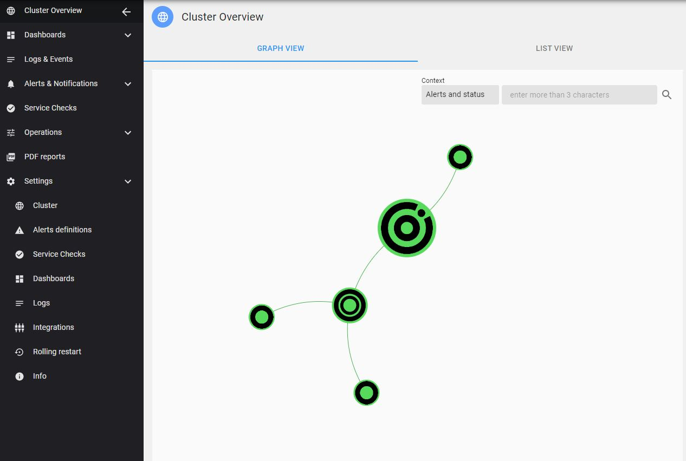
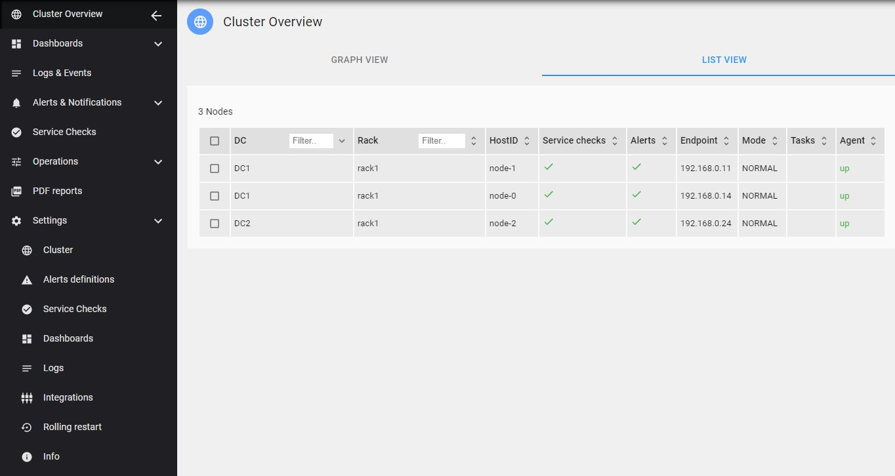
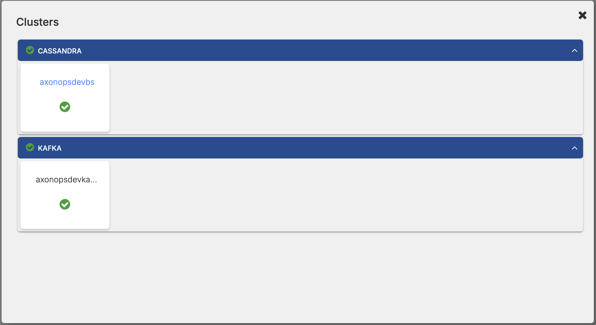
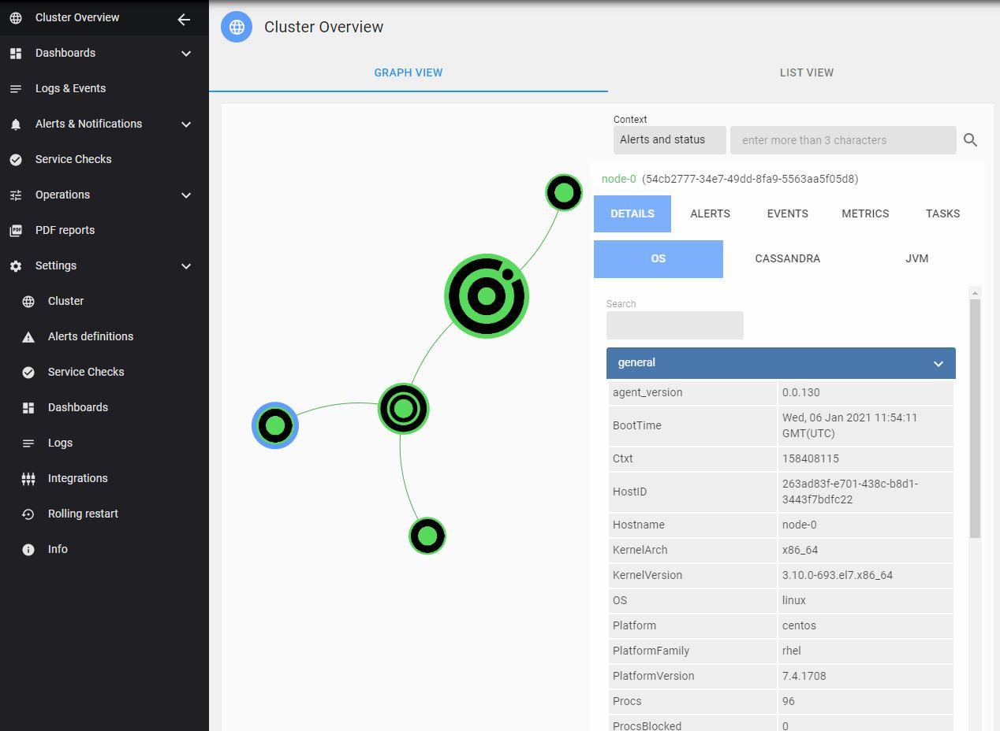
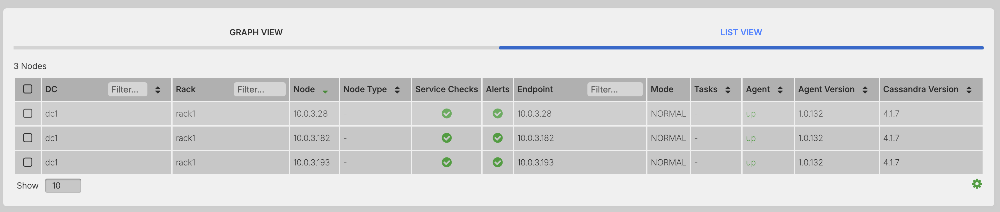
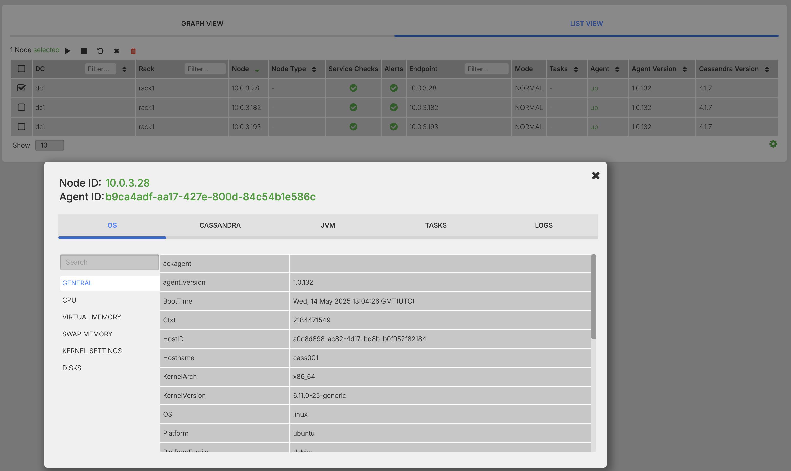
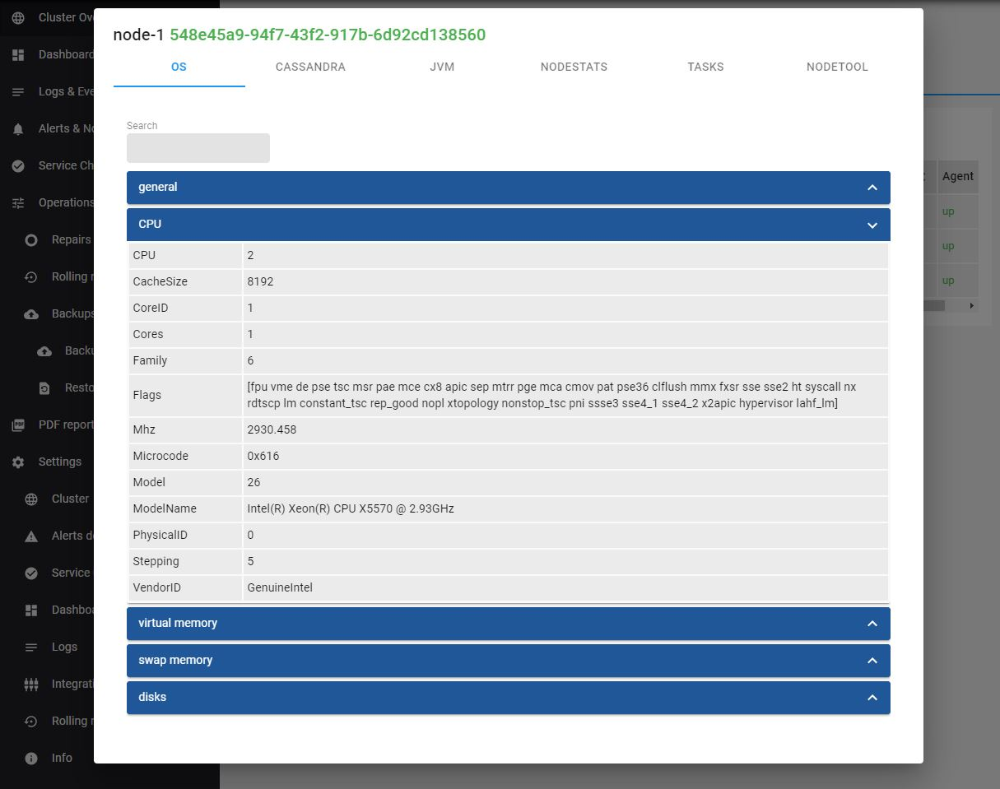
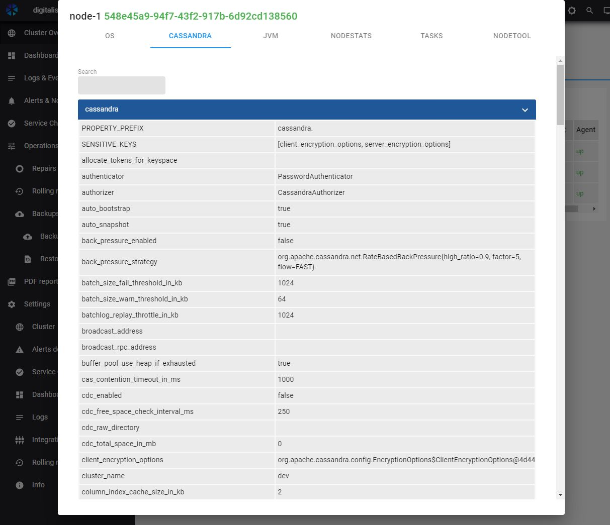
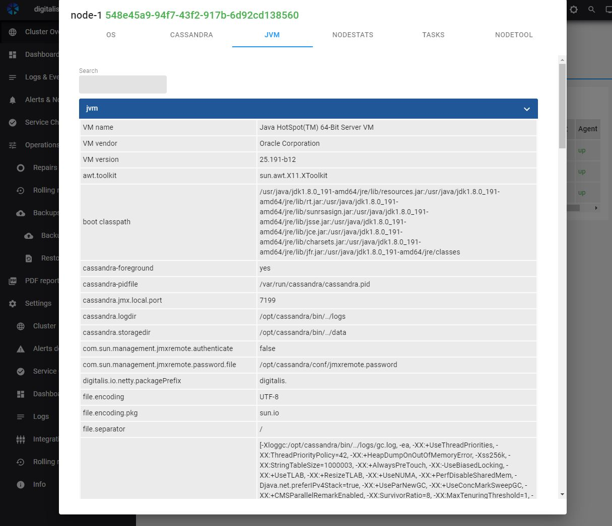

## Cluster Overview

**Cluster Overview** is the home page and provides a visual overview of your clusters health.

The information is automatically extracted by the AxonOps agent and pushed to AxonOps server. There is no need to configure anything on the agent or the server side for this information to be populated in the Cluster Overview dashboard.

 

## Supported Clusters

- Apache Cassandra

- Apache Kafka

### Switching between Clusters

- On the page breadcrumb click on Show List of Clusters

- Select the Apache Cassandra or Apache Kafka Cluster

### Overview - Graph and List Views

On the Axonops application menu, select `Cluster Overview`.

Select a node to view configuration details.

#### Graph View

#### List View

### Configuration detail sections:

Configuration detail sections show service specific information and differ based on cluster and node type.

- *Operating System(OS) Configuration*
- *Cassandra Configuration*
- *Kafka Configuration*
- *Zookeeper Configuration*
- *KRaft Broker Configuration*
- *KRaft Controller Configuration*
- *Kafka Connect Configuration*
- *Java(JVM) Configuration*

#### OS Details

Operating System Details section shows general information including:

- *General Information*
- *CPU*
- *Memory*
- *Swap*
- *Disk volumes*

!!! infomy

#### Node Details

Node Details view shows the details from the specific node configuration files and differ based on cluster and node type. 

There is a search field available near the top to filter the configuration parameters.

Node configuration files:

- Casssandra
    - cassandra.yml
- Kafka 
    - server.properties
    - zookeeper.properties
- KRaft
    - broker.properties
    - controller.properties
    - server.properties
- Kafka Connect
    - connect-standalone.properties
    - connect-distributed.properties

!!! infomy

#### JVM Details

JVM Details section shows the general information about the Java Virtual Machine(JVM), including the version and some configuration options such as the heap and Garbage Collection settings.

!!! infomy

