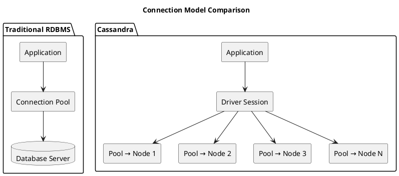
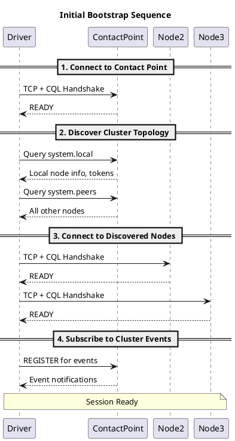
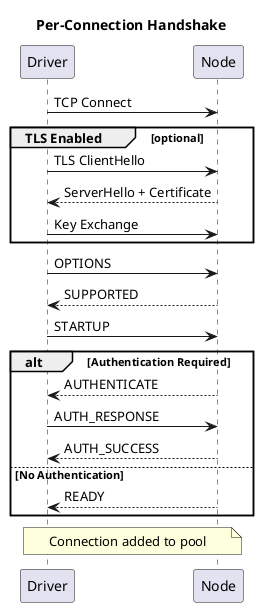
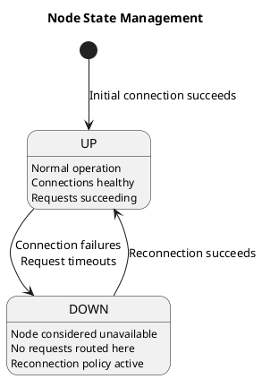

# Connection Management

The driver manages connections to Cassandra nodes automatically, but understanding connection lifecycle and configuration is essential for production deployments.

---

## Connection Model: RDBMS vs Cassandra

Developers familiar with traditional relational databases encounter a fundamentally different connection model when working with Cassandra.

| Aspect | Traditional RDBMS | Cassandra |
|--------|-------------------|-----------|
| **Topology** | Single server or primary/replica pair | Multiple peer nodes (no primary) |
| **Connection target** | One connection string, one endpoint | Driver connects to many nodes simultaneously |
| **Connection pooling** | Pool to single database server | Separate pool per node in cluster |
| **Failover** | Application or proxy handles failover | Driver automatically routes around failed nodes |
| **Request routing** | Database decides execution node | Driver chooses target node via load balancing policy |
| **Connection count** | Pool size × 1 server | Pool size × N nodes |



### Key Differences for RDBMS Developers

**No single point of connection**: In RDBMS, the application connects to one database endpoint. In Cassandra, the driver maintains connections to multiple nodes and decides where to send each request based on the load balancing policy and token awareness.

**Multiplexed connections**: RDBMS connections typically handle one request at a time (or use explicit pipelining). Cassandra connections multiplex thousands of concurrent requests over a single TCP connection using stream IDs, dramatically reducing the number of connections needed.

**Driver-managed topology**: The Cassandra driver discovers cluster topology automatically and maintains an internal map of all nodes. When nodes join, leave, or fail, the driver updates its view and adjusts routing accordingly—no application code changes required.

**Per-node resource management**: Connection pool settings apply per node. A pool configured for 2 connections in a 10-node cluster results in 20 total connections, not 2.

---

## Connection Types

### Control Connection

A single dedicated connection used for cluster metadata operations:

| Function | Description |
|----------|-------------|
| Topology discovery | Queries `system.local` and `system.peers` |
| Schema metadata | Queries `system_schema.*` tables |
| Event subscription | Receives TOPOLOGY_CHANGE, STATUS_CHANGE, SCHEMA_CHANGE events |

The control connection is established to one node and automatically fails over to another if that node becomes unavailable. This connection is not used for application queries.

### Data Connections

Data connections handle application queries. The driver maintains a separate connection pool for each node in the cluster.

#### Default Pool Configuration

| Parameter | Java Driver Default | Python Driver Default | Description |
|-----------|--------------------|-----------------------|-------------|
| Connections per local node | 1 | 2 | TCP sockets maintained to each node in local DC |
| Connections per remote node | 1 | 1 | TCP sockets maintained to each node in remote DC |
| Max requests per connection | 2048 | 65536 | Concurrent requests multiplexed on single socket |
| Protocol max streams | 32768 | 32768 | CQL Native Protocol v4+ limit per connection |

#### Connection Multiplexing

Each TCP connection supports thousands of concurrent requests through stream multiplexing:

| Aspect | Detail |
|--------|--------|
| **Stream ID** | 16-bit identifier (0-32767) assigned to each request |
| **Request flow** | Request sent with stream ID; response returns same ID |
| **Concurrency** | Multiple requests in-flight simultaneously on one socket |
| **Practical limit** | Drivers often cap below protocol max (e.g., 2048) for memory/latency reasons |

**Example capacity calculation:**

```
Single connection capacity:
  Max concurrent requests = 2048 (typical driver default)
  Average request latency = 5ms
  Theoretical throughput  = 2048 / 0.005 = 409,600 requests/sec

With 1 connection per node, 6-node cluster:
  Total connections = 6
  Total capacity    = 6 × 409,600 = 2.4M requests/sec theoretical max
```

In practice, most applications require only 1-2 connections per node. The multiplexed protocol makes Cassandra connection pooling fundamentally different from RDBMS pools where each connection handles one request at a time.

#### When to Increase Connections

Additional connections per node are needed when:

| Scenario | Indicator | Action |
|----------|-----------|--------|
| Stream exhaustion | Available streams consistently near zero | Increase max connections |
| High latency variance | P99 >> P50 causes stream buildup | Increase max connections or investigate latency |
| Very high throughput | >100K requests/sec per node | May need 2-4 connections |
| Large payloads | Requests/responses >1MB | Separate connections prevent head-of-line blocking |

---

## Pool Sizing

### Configuration Parameters

| Parameter | Description | Considerations |
|-----------|-------------|----------------|
| Core connections | Connections maintained even when idle | Higher value = faster response to load spikes |
| Max connections | Upper limit per node | Limit based on node capacity and file descriptors |
| Max requests per connection | Streams before opening additional connection | Protocol limit: 32768; practical limit lower |
| New connection threshold | In-flight request count triggering new connection | Balance between latency and resource usage |

### Sizing Guidelines

The required pool size depends on workload characteristics:

```
Estimating Connection Requirements:

Given:
  - Target throughput: 10,000 requests/second to single node
  - Average latency: 5ms
  - Max requests per connection: 2048

Concurrent requests = throughput × latency
                   = 10,000 × 0.005
                   = 50 concurrent requests

Connections needed = concurrent_requests / max_requests_per_connection
                  = 50 / 2048
                  = 1 connection (with significant headroom)

For latency spikes (e.g., 50ms P99):
  Peak concurrent = 10,000 × 0.050 = 500
  Connections = 500 / 2048 = 1 connection (still sufficient)
```

In practice, most deployments need only 1-2 connections per node due to the multiplexed protocol. Increase pool size only when:

- Measured stream exhaustion occurs
- Throughput per node exceeds tens of thousands of requests per second
- Workload has high latency variance

---

## Connection Lifecycle

### Establishment

#### Initial Bootstrap

When the driver session starts, it connects to a contact point and discovers the cluster topology:



The control connection remains on one node (typically the first successful contact point) and receives push notifications when nodes join, leave, or change status.

#### Per-Connection Handshake

Each individual connection follows this sequence:



### Health Monitoring

Drivers detect unhealthy connections through:

| Mechanism | Description | Action |
|-----------|-------------|--------|
| Heartbeat | Periodic OPTIONS request on idle connections | Close and replace if no response |
| Request timeout | Individual request exceeds timeout | Mark connection suspect; may close |
| Read errors | Socket read fails | Close immediately, trigger reconnection |
| Write errors | Socket write fails | Close immediately, trigger reconnection |

### Connection Closure

Connections close due to:

- **Idle timeout** — Connection unused beyond threshold (returns to core size)
- **Error** — Unrecoverable error on connection
- **Node marked down** — Driver determines node is unavailable
- **Graceful shutdown** — Application closes session

---

## Node State Management

The driver tracks node availability independently of Cassandra's gossip:



### Down Detection

A node is marked down when:

- All connections fail or timeout
- Connection establishment fails
- Cassandra reports node down via event (STATUS_CHANGE)

The driver does not rely solely on Cassandra events—it independently verifies node health through connection state.

### Implications for Applications

When a node is marked down:

1. **Load balancing skips node** — No new requests routed to it
2. **Reconnection begins** — Per reconnection policy schedule
3. **In-flight requests** — May timeout or fail; retry policy consulted
4. **Coordinator failover** — Requests move to other nodes automatically

---

## Local vs Remote Datacenter

Drivers distinguish between local and remote datacenters for connection management:

| Aspect | Local DC | Remote DC |
|--------|----------|-----------|
| Connection pools | Full pools maintained | Minimal or no pools (depends on policy) |
| Request routing | Preferred for all requests | Used only for failover (if configured) |
| Pool sizing | Use standard configuration | Often reduced or zero |

Configure local datacenter explicitly:

```java
// Java driver example
CqlSession session = CqlSession.builder()
    .withLocalDatacenter("dc1")
    .build();
```

```python
# Python driver example
cluster = Cluster(contact_points=['10.0.1.1'])
cluster.load_balancing_policy = DCAwareRoundRobinPolicy(local_dc='dc1')
```

Failure to configure local datacenter correctly may result in:

- Requests routing to remote datacenter unnecessarily
- Higher latency for all operations
- Increased cross-datacenter bandwidth costs

---

## Monitoring Connections

### Key Metrics

| Metric | Description | Warning Signs |
|--------|-------------|---------------|
| Open connections | Total connections across all nodes | Unexpectedly high or fluctuating |
| Available streams | Unused stream IDs per connection | Consistently near zero |
| In-flight requests | Currently executing requests | Growing unboundedly |
| Connection errors | Failed connection attempts | Sustained errors to specific nodes |
| Pool exhaustion | Requests rejected due to full pool | Any occurrence in production |

### Diagnostic Queries

Most drivers expose connection state programmatically:

```java
// Java driver - get connection pool metrics
Session session = ...;
for (Node node : session.getMetadata().getNodes().values()) {
    NodeMetrics metrics = session.getMetrics()
        .orElseThrow()
        .getNodeMetrics(node)
        .orElseThrow();

    System.out.println(node.getEndPoint() + ": " +
        "open=" + metrics.getOpenConnections().getValue() +
        ", in-flight=" + metrics.getInFlightRequests().getValue());
}
```

---

## Related Documentation

- **[Reconnection Policy](policies/reconnection.md)** — Configuring reconnection behavior after node failures
- **[Load Balancing Policy](policies/load-balancing.md)** — How requests are distributed across connections

