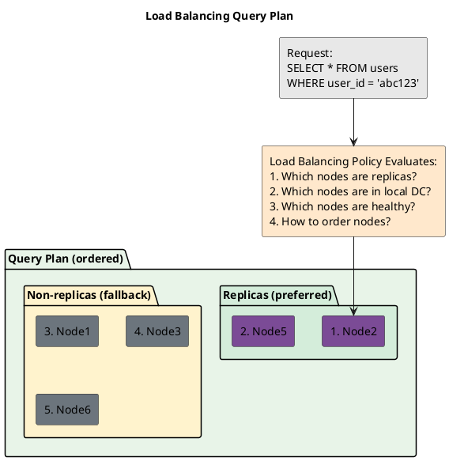
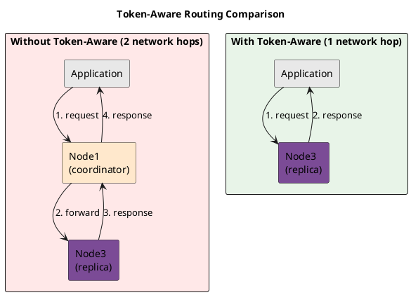
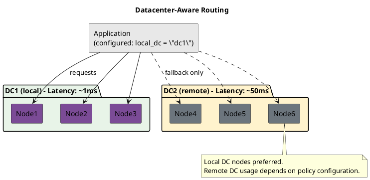
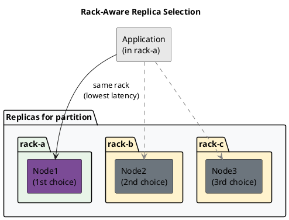
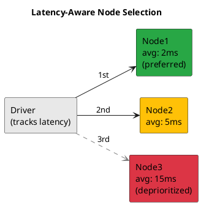

# Load Balancing Policy

The load balancing policy determines which nodes receive requests. This policy directly affects latency, throughput, and cluster load distribution.

---

## How Load Balancing Works

For each request, the load balancing policy returns an ordered list of nodes to try:



The driver sends the request to the first node. If that fails and the retry policy allows retry, the next node in the list is tried.

---

## Token-Aware Routing

Token-aware load balancing sends requests directly to replica nodes, avoiding an extra network hop:



### Requirements for Token-Aware Routing

Token-aware routing requires:

1. **Routing key available** — The driver must be able to determine the partition key value
2. **Metadata available** — Driver must have current token map

The routing key can be provided via:

- **Prepared statements with bound values** (most common)
- **Simple statements with explicit routing key set**
- **Simple statements with bound values** (driver may infer routing key)

```java
// Token-aware: prepared statement with bound partition key
PreparedStatement prepared = session.prepare(
    "SELECT * FROM users WHERE user_id = ?");
BoundStatement bound = prepared.bind(userId);  // Driver knows partition key
session.execute(bound);  // Routes to replica

// Token-aware: simple statement with explicit routing key
SimpleStatement simple = SimpleStatement.builder(
    "SELECT * FROM users WHERE user_id = 'abc123'")
    .setRoutingKey(TypeCodecs.UUID.encode(userId, ProtocolVersion.V4))
    .build();
session.execute(simple);  // Routes to replica

// NOT token-aware: literal values without routing key metadata
SimpleStatement unrouted = SimpleStatement.newInstance(
    "SELECT * FROM users WHERE user_id = 'abc123'");
session.execute(unrouted);  // Driver cannot extract partition key, uses round-robin
```

---

## Datacenter Awareness

In multi-datacenter deployments, the load balancing policy must be configured with the local datacenter:



### Configuration

```java
// Java driver
CqlSession session = CqlSession.builder()
    .withLocalDatacenter("dc1")
    .build();
```

```python
# Python driver
from cassandra.policies import DCAwareRoundRobinPolicy
cluster = Cluster(
    contact_points=['10.0.1.1'],
    load_balancing_policy=DCAwareRoundRobinPolicy(local_dc='dc1')
)
```

**Failure to configure local datacenter correctly results in requests potentially routing to remote datacenters with significantly higher latency.**

---

## Common Load Balancing Policies

### Round-Robin (Basic)

Distributes requests evenly across all nodes without considering replicas:

| Advantage | Disadvantage |
|-----------|--------------|
| Simple, predictable | Extra network hop for every request |
| Even distribution | No datacenter awareness |

Use case: Development environments, specific analytics workloads.

### Datacenter-Aware Round-Robin

Round-robin within local datacenter only:

| Advantage | Disadvantage |
|-----------|--------------|
| Respects datacenter locality | Still not token-aware |
| Predictable distribution within DC | Extra hop for most requests |

Use case: When token-aware routing is not possible (e.g., many simple statements).

### Token-Aware with DC Awareness (Recommended)

Combines token-aware routing with datacenter preference:

```
Algorithm:
1. Calculate replica set for partition key
2. Filter to local datacenter replicas
3. Order by health/load (implementation varies)
4. Append non-replica local nodes as fallback
5. Optionally append remote DC nodes as last resort
```

| Advantage | Disadvantage |
|-----------|--------------|
| Minimum latency (direct to replica) | Requires prepared statements for full benefit |
| Respects datacenter locality | Slightly more complex configuration |
| Built-in fallback ordering | |

This combination is commonly used for production deployments. Verify the default behavior for the specific driver version in use.

---

## Rack Awareness

Some load balancing policies consider rack placement to improve fault tolerance:



Rack awareness provides marginal latency improvement when:

- Application servers are rack-aligned with Cassandra nodes
- Network topology has rack-level latency differences

---

## Filtering Unhealthy Nodes

Load balancing policies typically exclude nodes that are:

| Condition | Behavior |
|-----------|----------|
| Marked DOWN | Excluded from query plan |
| Recently failed | May be deprioritized (implementation varies) |
| High latency | Some policies track latency and avoid slow nodes |
| Overloaded | Some policies consider in-flight request count |

### Latency-Aware Routing

Some drivers offer latency-aware policies that track response times and prefer faster nodes:



Considerations:

- Latency tracking adds overhead
- May cause herding (all clients avoid same node simultaneously)
- Typically combined with, not replacing, token-aware routing

---

## Configuration Recommendations

| Deployment | Recommended Policy |
|------------|-------------------|
| Single datacenter | Token-aware with round-robin fallback |
| Multi-datacenter | Token-aware with DC awareness |
| Analytics/batch | Round-robin or DC-aware round-robin |
| Latency-sensitive | Token-aware with latency tracking |

### Anti-Patterns

| Anti-Pattern | Problem |
|--------------|---------|
| No local DC configured in multi-DC | Requests may route cross-DC |
| Round-robin for OLTP workloads | Unnecessary latency for every request |
| Token-aware without prepared statements | Falls back to round-robin anyway |

---

## Related Documentation

- **[Retry Policy](retry.md)** — What happens when the selected node fails
- **[Speculative Execution](speculative-execution.md)** — Sending to multiple nodes concurrently
