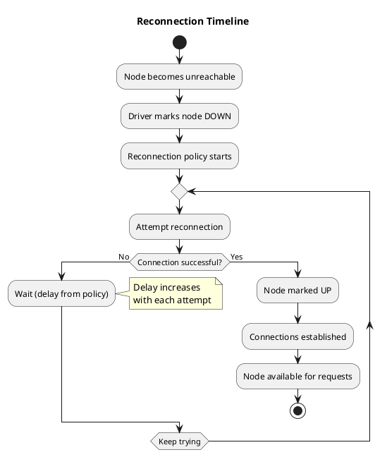

# Reconnection Policy

The reconnection policy controls how the driver attempts to reconnect to nodes after connection failures. This policy affects recovery time after node failures and network partitions.

---

## When Reconnection Occurs

The driver initiates reconnection when:

| Trigger | Description |
|---------|-------------|
| Node marked DOWN | All connections to node failed |
| Connection pool depleted | All connections closed due to errors |
| Node state change detected | Driver detects node availability change (via failed requests or gossip hints) |

Initial contact point discovery at startup uses bootstrap logic separate from the reconnection policy.



---

## Reconnection Strategies

### Constant Delay

Attempts reconnection at fixed intervals:

```
Constant Reconnection (delay = 5s):

Time:    0s     5s     10s    15s    20s
         │      │      │      │      │
         ▼      ▼      ▼      ▼      ▼
      Attempt Attempt Attempt Attempt Attempt
         1      2      3      4      5
```

| Advantage | Disadvantage |
|-----------|--------------|
| Predictable timing | May be too slow for short outages |
| Simple to understand | May be too aggressive for long outages |

Configuration:

```java
// Java driver
ConstantReconnectionPolicy policy =
    ConstantReconnectionPolicy.builder()
        .withDelay(Duration.ofSeconds(5))
        .build();
```

### Exponential Backoff (Recommended)

Starts with short delay, increases exponentially up to a maximum:

```
Exponential Reconnection (base = 1s, max = 60s):

Attempt:  1     2     3     4      5      6      7+
Delay:    1s    2s    4s    8s    16s    32s    60s
          │     │     │     │      │      │      │
Timeline: 0s    1s    3s    7s    15s    31s    63s   123s
```

| Advantage | Disadvantage |
|-----------|--------------|
| Fast recovery for transient issues | Slower recovery for sustained outages |
| Reduces load during prolonged outages | More complex to reason about |
| Adapts to outage duration | |

Configuration:

```java
// Java driver
ExponentialReconnectionPolicy policy =
    ExponentialReconnectionPolicy.builder()
        .withBaseDelay(Duration.ofSeconds(1))
        .withMaxDelay(Duration.ofMinutes(5))
        .build();
```

```python
# Python driver
from cassandra.policies import ExponentialReconnectionPolicy
policy = ExponentialReconnectionPolicy(base_delay=1.0, max_delay=300.0)
```

---

## Reconnection During Scenarios

### Node Restart

```
Single Node Restart:

Time    Node State          Driver State           Reconnection
────────────────────────────────────────────────────────────────
0s      Running             UP, connected          -
5s      Stopping            Connection fails       Marks DOWN
6s      Stopped             -                      Attempt 1 (fail)
7s      Stopped             -                      Wait (1s)
8s      Stopped             -                      Attempt 2 (fail)
10s     Starting            -                      Wait (2s)
12s     Starting            -                      Attempt 3 (fail)
15s     Ready               -                      Wait (4s)
19s     Ready               Attempt 4 succeeds     Marks UP
20s     Ready               Connections pooled     Available
```

### Rolling Restart

During rolling restarts, multiple nodes cycle through DOWN/UP states. The following timeline is illustrative; actual timings depend on configuration and node startup time:

```
Rolling Restart (3 nodes, exponential backoff):

Time    Node1       Node2       Node3       Notes
─────────────────────────────────────────────────────────
0s      UP          UP          UP          Normal operation
5s      restarting  UP          UP          Node1 DOWN, reconnecting
25s     UP          UP          UP          Node1 recovered
30s     UP          restarting  UP          Node2 DOWN, reconnecting
50s     UP          UP          UP          Node2 recovered
55s     UP          UP          restarting  Node3 DOWN, reconnecting
75s     UP          UP          UP          All nodes recovered
```

Exponential backoff resets when a node comes back up, so each node recovers independently.

### Network Partition

```
Network Partition (application isolated from DC):

Time    Network State       Driver State           Impact
────────────────────────────────────────────────────────────
0s      Connected           All nodes UP           Normal
5s      Partition starts    Connections fail       All nodes → DOWN
6s      Partitioned         Reconnect attempts     All fail
...     Partitioned         Backoff increasing     No requests possible
60s     Partition heals     Attempts succeed       Nodes → UP
61s     Connected           Connections pool       Normal operation

Recovery time depends on:
  - Backoff schedule at partition heal time
  - Number of nodes (parallel reconnection)
```

---

## Connection vs Node Reconnection

Drivers distinguish between:

| Level | Trigger | Policy Used |
|-------|---------|-------------|
| Connection reconnection | Single connection fails | Usually immediate retry, then pool management |
| Node reconnection | All connections to node fail | Reconnection policy |

```
Connection Failure Handling:

Single connection fails:
  │
  ├─► Other connections in pool still work
  │   └─► Node stays UP
  │   └─► Driver opens new connection (pool management)
  │
  └─► All connections fail
      └─► Node marked DOWN
      └─► Reconnection policy activated
```

---

## Reconnection and Load Balancing Interaction

While a node is DOWN and reconnecting:

1. **Load balancing excludes node** — No requests routed there
2. **Requests go to other nodes** — May increase their load
3. **Successful reconnect** — Node immediately available to load balancer

```
Load Distribution During Reconnection:

Normal (3 nodes):
  Node1: 33% requests
  Node2: 33% requests
  Node3: 33% requests

Node2 DOWN:
  Node1: 50% requests  (+17%)
  Node2: 0% requests   (reconnecting)
  Node3: 50% requests  (+17%)

Node2 recovers:
  Node1: 33% requests  (back to normal)
  Node2: 33% requests
  Node3: 33% requests
```

---

## Configuration Recommendations

| Scenario | Base Delay | Max Delay | Rationale |
|----------|------------|-----------|-----------|
| Low-latency requirement | 500ms | 30s | Fast recovery for transient issues |
| Standard production | 1s | 5min | Balance between recovery and load |
| Unstable network | 2s | 10min | Reduce reconnection load |
| Maintenance windows | 5s | 15min | Accommodate planned restarts |

### Anti-Patterns

| Anti-Pattern | Problem |
|--------------|---------|
| No max delay | Delay grows unboundedly; very slow recovery |
| Very short max delay | Excessive reconnection attempts during outages |
| Same delay for all environments | Dev settings may not suit production |

---

## Monitoring Reconnection

| Metric | Description | Warning Sign |
|--------|-------------|--------------|
| Reconnection attempts | Count per node | Sustained attempts to single node |
| Reconnection successes | Successful reconnections | Low success rate indicates persistent issue |
| Time in DOWN state | Duration nodes spend unreachable | Prolonged DOWN states |
| Nodes in reconnecting state | Count of nodes currently reconnecting | Many nodes simultaneously |

---

## Related Documentation

- **[Connection Management](../connection-management.md)** — Connection lifecycle and pooling
- **[Load Balancing Policy](load-balancing.md)** — How requests are routed during node recovery

