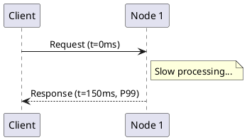
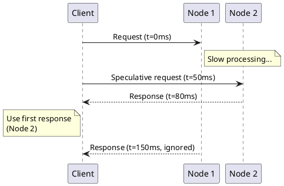
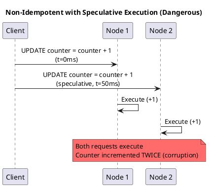
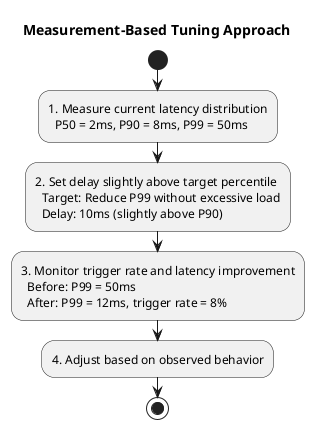
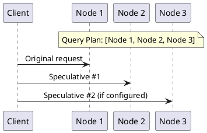
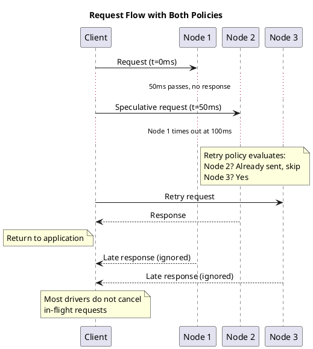

# Speculative Execution Policy

Speculative execution reduces tail latency by sending redundant requests to multiple nodes. When one node is slow, another may respond faster, improving perceived latency without waiting for timeouts.

---

## How Speculative Execution Works

Instead of waiting for a single request to complete or timeout, speculative execution sends the same request to additional nodes after a delay:

**Without speculative execution:**



**With speculative execution (delay = 50ms):**



The application receives the response in 80ms instead of 150ms.

---

## When Speculative Execution Helps

Speculative execution is effective when:

| Condition | Benefit |
|-----------|---------|
| High P99 latency due to outliers | Reduces tail latency significantly |
| Individual node slowdowns | Other replicas compensate |
| GC pauses on specific nodes | Request completes on non-GC node |
| Network congestion to specific nodes | Alternate path may be faster |

Speculative execution is less effective when:

| Condition | Limitation |
|-----------|------------|
| All nodes uniformly slow | Both requests are slow |
| Coordinator overhead dominates | Problem is client-side, not server |
| Query requires cross-partition coordination | Complexity is inherent |

---

## Latency Distribution Impact

Speculative execution particularly helps with tail latencies. P50 and P90 remain largely unchanged, but P99 improves significantly as the slower replica is bypassed:

| Percentile | Without Speculative Execution | With Speculative Execution |
|------------|-------------------------------|----------------------------|
| P50        | ~2ms                          | ~2ms                       |
| P90        | ~8ms                          | ~8ms                       |
| P99        | ~100ms                        | ~10ms                      |

---

## Configuration Options

### Constant Delay

Send speculative request after fixed delay:

```java
// Java driver
ConstantSpeculativeExecutionPolicy policy =
    ConstantSpeculativeExecutionPolicy.builder()
        .withMaxExecutions(2)      // Original + 1 speculative
        .withDelay(Duration.ofMillis(100))
        .build();
```

| Parameter | Description | Typical Value |
|-----------|-------------|---------------|
| Max executions | Total requests (including original) | 2-3 |
| Delay | Time before sending speculative request | P50-P90 latency |

### Percentile-Based Delay

Send speculative request when original exceeds observed percentile:

```java
// Send speculative if original takes longer than P95
PercentileSpeculativeExecutionPolicy policy =
    PercentileSpeculativeExecutionPolicy.builder()
        .withMaxExecutions(2)
        .withPercentile(95.0)
        .build();
```

This adapts to actual latency distribution, avoiding unnecessary speculative requests when the cluster is fast.

---

## Cost of Speculative Execution

Speculative execution trades increased cluster load for reduced latency:

| Configuration | Application Rate | Cluster Load | Overhead |
|---------------|-----------------|--------------|----------|
| No speculative execution | 1000 req/sec | 1000 req/sec | 0% |
| Speculative, 10% trigger rate | 1000 req/sec | 1100 req/sec | +10% |
| Speculative, 50% trigger rate | 1000 req/sec | 1500 req/sec | +50% |

### When Costs Outweigh Benefits

| Scenario | Problem |
|----------|---------|
| High trigger rate (>50%) | Significant load increase with diminishing returns |
| Already saturated cluster | Extra load makes all requests slower |
| Non-idempotent operations | Duplicate execution may corrupt data |

---

## Idempotency Requirement

**Speculative execution must only be used with idempotent operations.**

Both the original and speculative requests may execute:



### Safe Usage

```java
// Only enable for idempotent queries
Statement statement = SimpleStatement.builder("SELECT * FROM users WHERE id = ?")
    .addPositionalValue(userId)
    .setIdempotent(true)  // Mark as safe
    .setSpeculativeExecutionPolicy(speculativePolicy)
    .build();

// Disable for non-idempotent queries
Statement counterUpdate = SimpleStatement.builder(
        "UPDATE stats SET views = views + 1 WHERE page_id = ?")
    .addPositionalValue(pageId)
    .setIdempotent(false)  // Explicitly mark unsafe
    .build();
```

---

## Choosing Delay Threshold

The delay threshold determines when speculative requests trigger:

| Threshold | Trigger Rate | Trade-off |
|-----------|--------------|-----------|
| P50 latency | ~50% of requests | High load, maximum latency reduction |
| P90 latency | ~10% of requests | Moderate load, good tail reduction |
| P99 latency | ~1% of requests | Low load, only extreme outliers |

### Measurement-Based Tuning



---

## Interaction with Other Policies

### With Load Balancing

Speculative requests use the same query plan from load balancing:



### With Retry Policy

Speculative execution and retry serve different purposes:

| Aspect | Retry | Speculative Execution |
|--------|-------|----------------------|
| Trigger | After failure/timeout | After delay (no failure) |
| Goal | Handle errors | Reduce latency |
| Sequential | Yes (one at a time) | No (concurrent) |

Both can be enabled simultaneously:



---

## Monitoring Speculative Execution

| Metric | Description | Warning Sign |
|--------|-------------|--------------|
| Speculative trigger rate | % of requests triggering speculative | >30% indicates latency issues |
| Speculative wins | % of responses from speculative request | Low rate means delay too high |
| Total request rate | Including speculative requests | Unexpected increase in cluster load |

**Example metrics** (workload-dependent; use as starting point, not targets):

| Metric | Expected Range |
|--------|---------------|
| Trigger rate | 5-15% |
| Win rate | 40-60% of triggered |
| Latency improvement | 50%+ reduction in P99 |

**Warning signs** (investigate if observed):

| Observation | Possible Cause |
|-------------|----------------|
| Trigger rate >50% | Delay too low or cluster too slow |
| Win rate <20% | Delay too high, speculative rarely faster |
| Win rate >80% | Delay too low, original always slow |

Optimal thresholds vary significantly by workload, cluster topology, and latency distribution.

---

## Configuration Recommendations

| Use Case | Max Executions | Delay | Notes |
|----------|----------------|-------|-------|
| Latency-sensitive reads | 2 | P90 latency | Conservative, low overhead |
| Aggressive tail reduction | 3 | P75 latency | Higher load, better tail |
| Read-heavy analytics | Disabled | - | Throughput more important than latency |
| Non-idempotent writes | Disabled | - | Never use with non-idempotent ops |

---

## Related Documentation

- **[Retry Policy](retry.md)** — Error handling (complementary to speculative execution)
- **[Load Balancing Policy](load-balancing.md)** — Node selection for speculative requests
