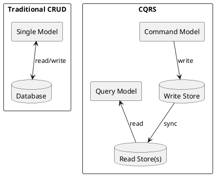
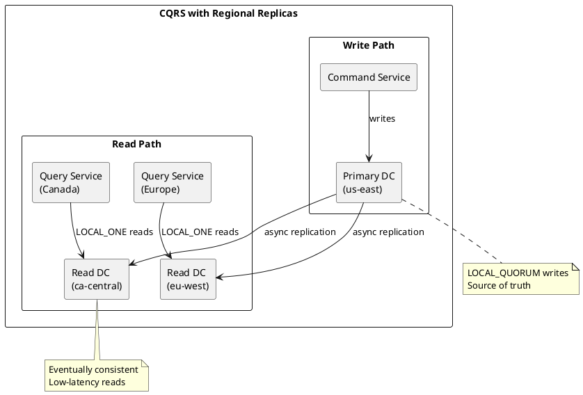
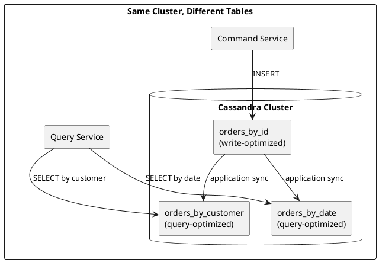
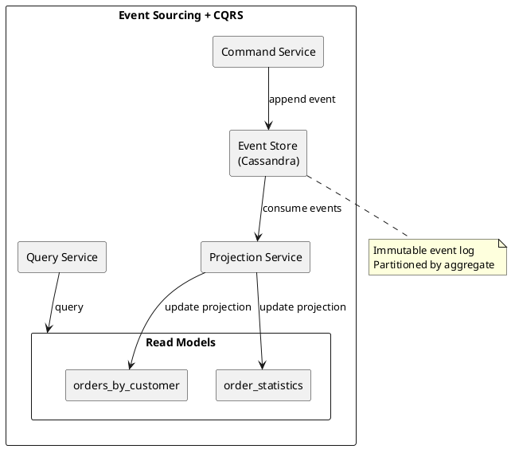

# CQRS Pattern with Cassandra

Command Query Responsibility Segregation (CQRS) separates read and write models, allowing each to be optimized independently. Cassandra's multi-datacenter capabilities and query-first data modeling align naturally with CQRS architectures.

---

## Overview

### What is CQRS?

CQRS separates an application into two distinct paths:

- **Command side**: Handles writes (create, update, delete)
- **Query side**: Handles reads (optimized for specific query patterns)



### Why CQRS with Cassandra?

| Cassandra Capability | CQRS Benefit |
|---------------------|--------------|
| **Query-first modeling** | Natural fit for separate read models per query pattern |
| **Multi-datacenter replication** | Read replicas in different regions |
| **Tunable consistency** | Strong writes, eventual reads where acceptable |
| **Linear write scalability** | Command side scales independently |
| **Denormalization** | Query models optimized without write constraints |

---

## Architecture Patterns

### Pattern 1: Regional Read Replicas

Writes go to a primary datacenter; reads are served from local regional replicas.



**Characteristics:**

- Single write region (simplifies consistency)
- Multiple read regions (low-latency queries)
- Asynchronous replication (lag varies by network and load; often sub-second in well-provisioned clusters)
- Read services deployed per region

### Pattern 2: Separate Read/Write Tables

Different table structures optimized for commands vs queries within the same cluster.



**Implementation:**

```sql
-- Write-optimized: partition by order_id for direct lookups
CREATE TABLE orders_by_id (
    order_id UUID PRIMARY KEY,
    customer_id UUID,
    items LIST<FROZEN<order_item>>,
    total DECIMAL,
    status TEXT,
    created_at TIMESTAMP
);

-- Query-optimized: partition by customer for customer order history
CREATE TABLE orders_by_customer (
    customer_id UUID,
    created_at TIMESTAMP,
    order_id UUID,
    total DECIMAL,
    status TEXT,
    PRIMARY KEY ((customer_id), created_at, order_id)
) WITH CLUSTERING ORDER BY (created_at DESC);

-- Query-optimized: partition by date for daily reports
CREATE TABLE orders_by_date (
    order_date DATE,
    created_at TIMESTAMP,
    order_id UUID,
    customer_id UUID,
    total DECIMAL,
    PRIMARY KEY ((order_date), created_at, order_id)
) WITH CLUSTERING ORDER BY (created_at DESC);
```

### Pattern 3: Event Sourcing + CQRS

Events stored as the source of truth; read models projected from events.



**Event store schema:**

```sql
CREATE TABLE events (
    aggregate_id UUID,
    event_id TIMEUUID,
    event_type TEXT,
    event_data BLOB,
    metadata MAP<TEXT, TEXT>,
    PRIMARY KEY ((aggregate_id), event_id)
) WITH CLUSTERING ORDER BY (event_id ASC);
```

---

## Implementation Guide

### Command Service (Writes)

The command service handles all mutations, typically deployed in a primary region.

```java
@Service
public class OrderCommandService {

    private final CqlSession session;  // Connected to primary DC

    public OrderCommandService(CqlSession session) {
        this.session = session;
    }

    public UUID createOrder(CreateOrderCommand command) {
        UUID orderId = UUID.randomUUID();
        Instant now = Instant.now();

        // Write to primary table
        PreparedStatement insertOrder = session.prepare(
            "INSERT INTO orders_by_id (order_id, customer_id, items, total, status, created_at) " +
            "VALUES (?, ?, ?, ?, ?, ?)"
        );

        session.execute(insertOrder.bind(
            orderId,
            command.getCustomerId(),
            command.getItems(),
            command.getTotal(),
            "PENDING",
            now
        ).setConsistencyLevel(ConsistencyLevel.LOCAL_QUORUM));

        // Sync to read models (can be async via messaging)
        syncToReadModels(orderId, command, now);

        return orderId;
    }

    private void syncToReadModels(UUID orderId, CreateOrderCommand cmd, Instant created) {
        // Update orders_by_customer
        PreparedStatement insertByCustomer = session.prepare(
            "INSERT INTO orders_by_customer (customer_id, created_at, order_id, total, status) " +
            "VALUES (?, ?, ?, ?, ?)"
        );

        session.execute(insertByCustomer.bind(
            cmd.getCustomerId(),
            created,
            orderId,
            cmd.getTotal(),
            "PENDING"
        ).setConsistencyLevel(ConsistencyLevel.LOCAL_QUORUM));

        // Update orders_by_date
        PreparedStatement insertByDate = session.prepare(
            "INSERT INTO orders_by_date (order_date, created_at, order_id, customer_id, total) " +
            "VALUES (?, ?, ?, ?, ?)"
        );

        session.execute(insertByDate.bind(
            LocalDate.ofInstant(created, ZoneOffset.UTC),
            created,
            orderId,
            cmd.getCustomerId(),
            cmd.getTotal()
        ).setConsistencyLevel(ConsistencyLevel.LOCAL_QUORUM));
    }
}
```

### Query Service (Reads)

The query service handles reads, deployed in each region with local DC configuration.

```java
@Service
public class OrderQueryService {

    private final CqlSession session;  // Connected to LOCAL DC

    public OrderQueryService(CqlSession session) {
        this.session = session;
    }

    public Order getOrderById(UUID orderId) {
        PreparedStatement stmt = session.prepare(
            "SELECT * FROM orders_by_id WHERE order_id = ?"
        );

        Row row = session.execute(stmt.bind(orderId)
            .setConsistencyLevel(ConsistencyLevel.LOCAL_ONE))
            .one();

        return row != null ? mapToOrder(row) : null;
    }

    public List<OrderSummary> getOrdersByCustomer(UUID customerId, int limit) {
        PreparedStatement stmt = session.prepare(
            "SELECT order_id, created_at, total, status " +
            "FROM orders_by_customer WHERE customer_id = ? LIMIT ?"
        );

        return session.execute(stmt.bind(customerId, limit)
            .setConsistencyLevel(ConsistencyLevel.LOCAL_ONE))
            .all()
            .stream()
            .map(this::mapToOrderSummary)
            .collect(Collectors.toList());
    }

    public List<OrderSummary> getOrdersByDate(LocalDate date) {
        PreparedStatement stmt = session.prepare(
            "SELECT * FROM orders_by_date WHERE order_date = ?"
        );

        return session.execute(stmt.bind(date)
            .setConsistencyLevel(ConsistencyLevel.LOCAL_ONE))
            .all()
            .stream()
            .map(this::mapToOrderSummary)
            .collect(Collectors.toList());
    }
}
```

### Regional Deployment Configuration

Deploy query services per region with appropriate driver configuration:

```yaml
# Kubernetes ConfigMap per region
apiVersion: v1
kind: ConfigMap
metadata:
  name: cassandra-config
  namespace: order-service
data:
  CASSANDRA_LOCAL_DC: "ca-central"  # Change per region
  CASSANDRA_CONTACT_POINTS: "cassandra-ca.example.com"
  CASSANDRA_CONSISTENCY_LEVEL: "LOCAL_ONE"
```

```java
// Driver configuration
CqlSession session = CqlSession.builder()
    .addContactPoint(new InetSocketAddress(
        System.getenv("CASSANDRA_CONTACT_POINTS"), 9042))
    .withLocalDatacenter(System.getenv("CASSANDRA_LOCAL_DC"))
    .withKeyspace("ecommerce")
    .build();
```

---

## Consistency Considerations

### Eventual Consistency in CQRS

With async replication, reads may not immediately reflect writes:

| Scenario | Latency (illustrative) | Mitigation |
|----------|------------------------|------------|
| Same-region read after write | <10ms | Usually consistent with LOCAL_QUORUM write |
| Cross-region read after write | 50-500ms | Accept eventual consistency, or route reads to write region |
| Read model sync delay | Application-dependent | Async messaging with retries |

!!! note "Cross-DC Read-Your-Writes"
    `QUORUM` does not guarantee cross-DC read-your-writes with NetworkTopologyStrategy. For strict cross-DC guarantees, use `EACH_QUORUM` writes or route reads to the write region.

### Read-Your-Writes Patterns

When users must see their own writes immediately:

**Option 1: Route to write region**

```java
// For critical read-after-write within same DC, use LOCAL_QUORUM
Row row = session.execute(stmt.bind(orderId)
    .setConsistencyLevel(ConsistencyLevel.LOCAL_QUORUM))
    .one();
```

**Option 2: Sticky sessions**

Route user to same region for duration of session.

**Option 3: Client-side optimistic update**

Update UI immediately, sync in background.

```javascript
// Frontend: optimistic update
async function createOrder(orderData) {
    // Update UI immediately
    addOrderToList(orderData);

    // Send to backend
    const result = await api.createOrder(orderData);

    // Reconcile if needed
    updateOrderInList(result);
}
```

### Consistency Level Selection

| Operation | Recommended CL | Rationale |
|-----------|---------------|-----------|
| Command (write) | LOCAL_QUORUM | Durable in write region |
| Query (read) | LOCAL_ONE | Low latency, eventual consistency acceptable |
| Read-your-writes (same DC) | LOCAL_QUORUM | Consistency within write region |
| Cross-DC critical read | EACH_QUORUM (write) + LOCAL_QUORUM (read) | Requires EACH_QUORUM on write path for cross-DC guarantees |

---

## Synchronization Strategies

### Synchronous (In-Request)

Write to all tables in the same request. Simple but increases latency.

```java
public void createOrder(Order order) {
    // All writes in same request
    batch.add(insertOrderById.bind(...));
    batch.add(insertOrderByCustomer.bind(...));
    batch.add(insertOrderByDate.bind(...));
    session.execute(batch);
}
```

!!! warning "Batch Limitations"
    Cassandra batches are not for performance; they ensure atomicity. Use only when tables share the same partition key, or accept the coordinator overhead.

### Asynchronous (Event-Driven)

Publish events; consumers update read models independently.

```java
// Command service publishes event
public UUID createOrder(CreateOrderCommand command) {
    UUID orderId = UUID.randomUUID();

    // Write to primary table only
    session.execute(insertOrder.bind(...));

    // Publish event for read model updates
    eventPublisher.publish(new OrderCreatedEvent(orderId, command));

    return orderId;
}

// Separate consumer updates read models
@KafkaListener(topics = "order-events")
public void handleOrderCreated(OrderCreatedEvent event) {
    session.execute(insertOrderByCustomer.bind(...));
    session.execute(insertOrderByDate.bind(...));
}
```

### Change Data Capture (CDC)

Use Cassandra CDC to capture changes and propagate to read models.

```yaml
# cassandra.yaml
cdc_enabled: true
cdc_raw_directory: /var/lib/cassandra/cdc_raw
```

---

## Anti-Patterns

### Don't

| Anti-Pattern | Problem |
|--------------|---------|
| QUORUM for all reads | Negates regional latency benefits |
| Single table for all queries | Violates query-first modeling |
| Synchronous cross-region writes | High latency, reduced availability |
| Ignoring read model sync failures | Data inconsistency |
| Over-denormalization | Storage costs, sync complexity |

### Do

| Practice | Benefit |
|----------|---------|
| One table per query pattern | Optimal read performance |
| LOCAL_ONE for query reads | Lowest latency |
| Idempotent sync operations | Safe retries |
| Monitor replication lag | Detect consistency issues |
| Version read models | Enable rebuilds |

---

## Monitoring CQRS Systems

### Key Metrics

| Metric | Purpose | Alert Threshold |
|--------|---------|-----------------|
| Replication lag | Cross-DC sync delay | >1 second |
| Read model sync lag | Event processing delay | >5 seconds |
| Query latency (p99) | Read performance | >50ms |
| Command latency (p99) | Write performance | >100ms |
| Sync failure rate | Read model consistency | >0.1% |

### Health Checks

```java
@Component
public class CQRSHealthIndicator implements HealthIndicator {

    @Override
    public Health health() {
        // Check write path
        boolean writeHealthy = checkWriteHealth();

        // Check read model sync lag
        Duration syncLag = measureSyncLag();

        if (!writeHealthy) {
            return Health.down().withDetail("write", "unavailable").build();
        }

        if (syncLag.compareTo(Duration.ofSeconds(5)) > 0) {
            return Health.down()
                .withDetail("syncLag", syncLag.toString())
                .build();
        }

        return Health.up()
            .withDetail("syncLag", syncLag.toString())
            .build();
    }
}
```

---

## Related Documentation

- [Multi-Datacenter](../../architecture/distributed-data/multi-datacenter.md) - Regional deployment architecture
- [Data Modeling](../../data-modeling/index.md) - Query-first design principles
- [Consistency Levels](../../architecture/distributed-data/consistency.md) - Consistency level reference
- [Drivers](../drivers/index.md) - Driver configuration
