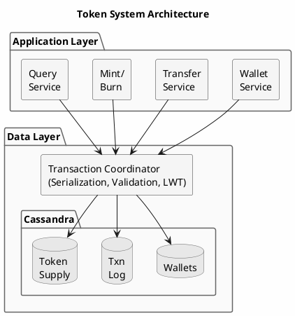
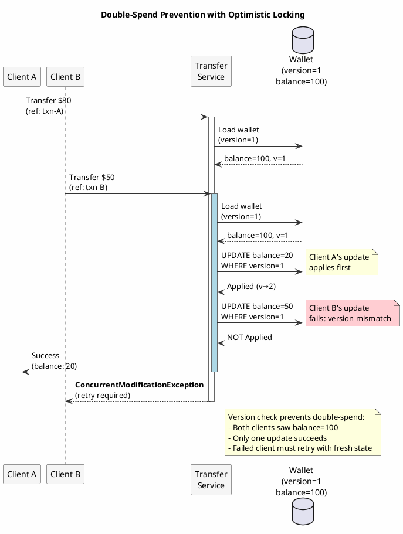
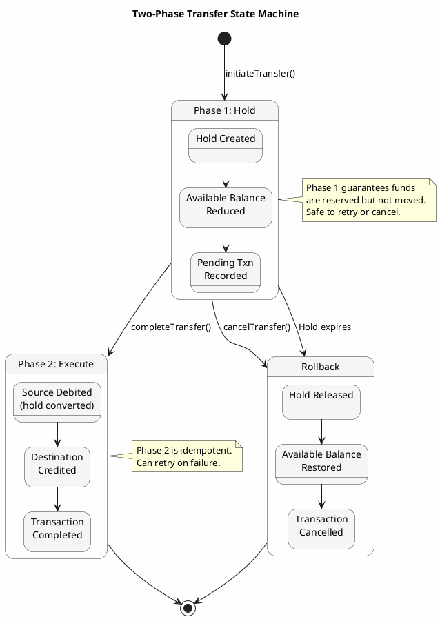
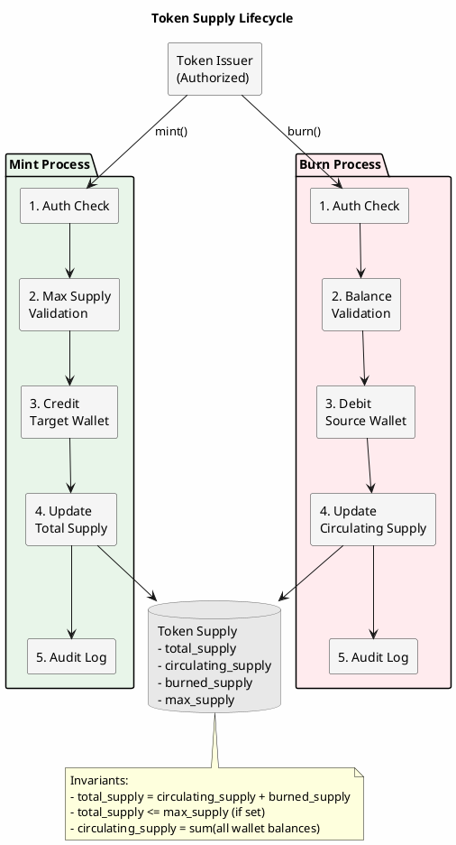
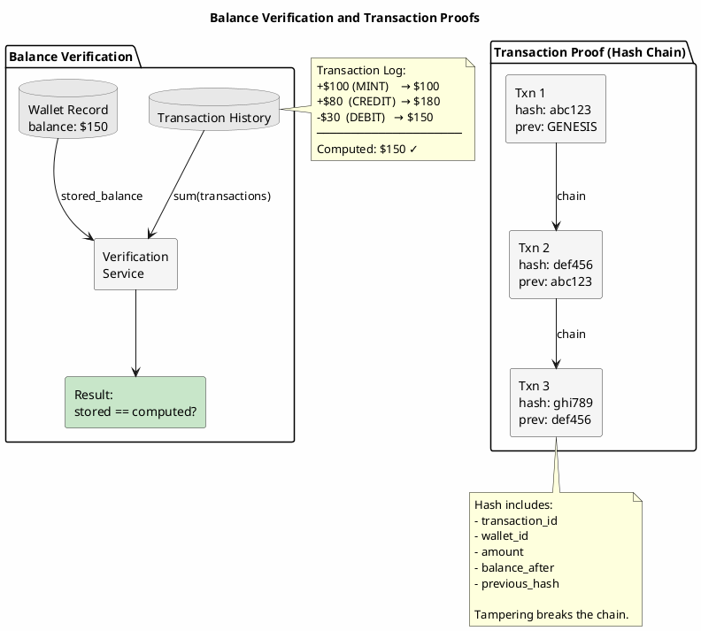
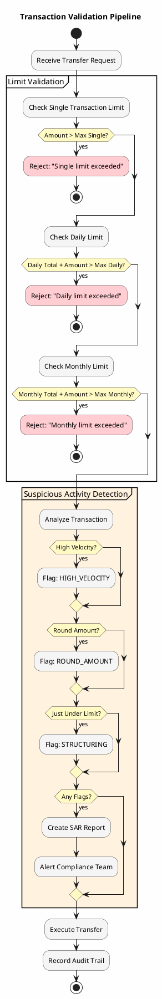

# Digital Currency & Token Systems

Digital currencies, whether cryptocurrency, loyalty points, in-game currencies, or corporate tokens, share fundamental requirements: accurate balance tracking, transaction integrity, and prevention of double-spending. While Cassandra is not a blockchain, it provides the building blocks for high-performance token systems that require enterprise-grade reliability without blockchain's limitations.

---

## When Cassandra, When Blockchain

Understanding the trade-offs helps choose the right technology:

| Requirement | Cassandra | Blockchain |
|-------------|-----------|------------|
| **Trust model** | Trusted operator | Trustless/decentralized |
| **Transaction throughput** | 100K+ TPS | 10-10K TPS (varies by chain) |
| **Finality latency** | Milliseconds | Seconds to minutes |
| **Storage efficiency** | Optimized | Every node stores everything |
| **Privacy** | Controlled access | Public (or complex privacy layers) |
| **Regulatory compliance** | Standard enterprise | Complex, jurisdiction-dependent |
| **Operational complexity** | Standard database ops | Specialized blockchain ops |

**Use Cassandra for**:
- Loyalty programs (airline miles, retail points)
- In-game virtual currencies
- Corporate internal tokens
- Gift card systems
- Private/permissioned digital assets
- High-throughput payment systems

**Use blockchain for**:
- Trustless systems requiring decentralization
- Cross-organizational settlement without trusted intermediary
- Public cryptocurrencies
- NFTs requiring provenance proof

---

## Core Architecture

A token system built on Cassandra consists of several interacting components:



---

## Schema Design

### Wallet Schema

```sql
-- Primary wallet record
CREATE TABLE wallets (
    wallet_id UUID,
    owner_id UUID,
    wallet_type TEXT,              -- USER, MERCHANT, SYSTEM, ESCROW
    currency_code TEXT,
    balance DECIMAL,
    available_balance DECIMAL,     -- Balance minus holds
    pending_balance DECIMAL,       -- Incoming pending transactions
    status TEXT,                   -- ACTIVE, FROZEN, CLOSED
    created_at TIMESTAMP,
    updated_at TIMESTAMP,
    version BIGINT,                -- Optimistic locking
    PRIMARY KEY (wallet_id)
);

-- Wallet lookup by owner
CREATE TABLE wallets_by_owner (
    owner_id UUID,
    currency_code TEXT,
    wallet_id UUID,
    balance DECIMAL,
    status TEXT,
    PRIMARY KEY ((owner_id), currency_code)
);

-- Balance holds (for pending transactions)
CREATE TABLE balance_holds (
    wallet_id UUID,
    hold_id UUID,
    amount DECIMAL,
    reason TEXT,
    expires_at TIMESTAMP,
    created_at TIMESTAMP,
    released_at TIMESTAMP,
    PRIMARY KEY ((wallet_id), hold_id)
);
```

### Transaction Schema

```sql
-- Immutable transaction log
CREATE TABLE transactions (
    wallet_id UUID,
    transaction_id TIMEUUID,
    transaction_type TEXT,         -- CREDIT, DEBIT, TRANSFER, MINT, BURN
    amount DECIMAL,
    currency_code TEXT,
    balance_before DECIMAL,
    balance_after DECIMAL,
    counterparty_wallet_id UUID,
    reference_id UUID,             -- External reference
    description TEXT,
    metadata MAP<TEXT, TEXT>,
    status TEXT,                   -- PENDING, COMPLETED, FAILED, REVERSED
    created_at TIMESTAMP,
    PRIMARY KEY ((wallet_id), transaction_id)
) WITH CLUSTERING ORDER BY (transaction_id DESC);

-- Transaction by reference (for idempotency)
CREATE TABLE transactions_by_reference (
    reference_id UUID,
    wallet_id UUID,
    transaction_id TIMEUUID,
    status TEXT,
    PRIMARY KEY (reference_id)
);

-- Global transaction index (for audit)
CREATE TABLE transactions_global (
    date_bucket DATE,
    transaction_id TIMEUUID,
    from_wallet_id UUID,
    to_wallet_id UUID,
    amount DECIMAL,
    currency_code TEXT,
    transaction_type TEXT,
    PRIMARY KEY ((date_bucket), transaction_id)
) WITH CLUSTERING ORDER BY (transaction_id DESC);
```

### Token Supply Schema

```sql
-- Token supply tracking
CREATE TABLE token_supply (
    currency_code TEXT,
    total_supply DECIMAL,
    circulating_supply DECIMAL,
    burned_supply DECIMAL,
    max_supply DECIMAL,            -- NULL for unlimited
    last_mint_at TIMESTAMP,
    last_burn_at TIMESTAMP,
    PRIMARY KEY (currency_code)
);

-- Supply change log
CREATE TABLE supply_changes (
    currency_code TEXT,
    change_id TIMEUUID,
    change_type TEXT,              -- MINT, BURN
    amount DECIMAL,
    supply_before DECIMAL,
    supply_after DECIMAL,
    authorized_by UUID,
    reason TEXT,
    PRIMARY KEY ((currency_code), change_id)
) WITH CLUSTERING ORDER BY (change_id DESC);
```

---

## Double-Spend Prevention

The fundamental challenge in any currency system is preventing double-spending: ensuring the same funds cannot be spent twice.



### Optimistic Locking with Version

```java
public class WalletService {

    public TransferResult transfer(UUID fromWalletId, UUID toWalletId,
                                   BigDecimal amount, UUID referenceId) {
        // Idempotency check
        Transaction existing = findByReference(referenceId);
        if (existing != null) {
            return TransferResult.duplicate(existing);
        }

        // Load wallets with versions
        Wallet fromWallet = loadWallet(fromWalletId);
        Wallet toWallet = loadWallet(toWalletId);

        // Validate
        if (fromWallet.getAvailableBalance().compareTo(amount) < 0) {
            throw new InsufficientBalanceException(fromWalletId, amount);
        }

        // Calculate new balances
        BigDecimal newFromBalance = fromWallet.getBalance().subtract(amount);
        BigDecimal newToBalance = toWallet.getBalance().add(amount);
        long newFromVersion = fromWallet.getVersion() + 1;
        long newToVersion = toWallet.getVersion() + 1;

        // Conditional update with version check
        ResultSet fromResult = session.execute(
            updateWalletBalance.bind(
                newFromBalance, newFromBalance, newFromVersion,
                fromWalletId, fromWallet.getVersion()
            ).setSerialConsistencyLevel(ConsistencyLevel.LOCAL_SERIAL)
        );

        if (!fromResult.wasApplied()) {
            throw new ConcurrentModificationException(
                "Wallet " + fromWalletId + " was modified concurrently");
        }

        ResultSet toResult = session.execute(
            updateWalletBalance.bind(
                newToBalance, newToBalance, newToVersion,
                toWalletId, toWallet.getVersion()
            ).setSerialConsistencyLevel(ConsistencyLevel.LOCAL_SERIAL)
        );

        if (!toResult.wasApplied()) {
            // Rollback from wallet
            compensateFromWallet(fromWallet, amount);
            throw new ConcurrentModificationException(
                "Wallet " + toWalletId + " was modified concurrently");
        }

        // Record transactions
        recordTransactions(fromWallet, toWallet, amount, referenceId,
                          newFromBalance, newToBalance);

        return TransferResult.success(referenceId, amount);
    }
}
```

### Two-Phase Transfer with Holds

For safer transfers, use a two-phase approach:



```java
public class TwoPhaseTransfer {

    public UUID initiateTransfer(UUID fromWalletId, UUID toWalletId,
                                 BigDecimal amount, UUID referenceId) {
        // Phase 1: Place hold on source wallet
        UUID holdId = createHold(fromWalletId, amount, referenceId);

        try {
            // Reduce available balance
            reduceAvailableBalance(fromWalletId, amount);

            // Record pending transaction
            Transaction pending = recordPendingTransaction(
                fromWalletId, toWalletId, amount, referenceId, holdId);

            return pending.getTransactionId();

        } catch (Exception e) {
            // Release hold on failure
            releaseHold(fromWalletId, holdId);
            throw e;
        }
    }

    public void completeTransfer(UUID transactionId) {
        Transaction pending = loadPendingTransaction(transactionId);

        // Phase 2: Execute the transfer
        try {
            // Debit source (convert hold to actual debit)
            debitWallet(pending.getFromWalletId(), pending.getAmount(),
                       pending.getHoldId());

            // Credit destination
            creditWallet(pending.getToWalletId(), pending.getAmount());

            // Mark transaction complete
            markTransactionComplete(transactionId);

        } catch (Exception e) {
            // Compensation: release hold, restore available balance
            compensateFailedTransfer(pending);
            markTransactionFailed(transactionId, e.getMessage());
            throw e;
        }
    }

    public void cancelTransfer(UUID transactionId) {
        Transaction pending = loadPendingTransaction(transactionId);

        // Release hold
        releaseHold(pending.getFromWalletId(), pending.getHoldId());

        // Restore available balance
        restoreAvailableBalance(pending.getFromWalletId(), pending.getAmount());

        // Mark cancelled
        markTransactionCancelled(transactionId);
    }
}
```

---

## Minting and Burning

Token supply management requires careful control:



### Minting (Creating Tokens)

```java
public class TokenMintService {

    public MintResult mint(String currencyCode, BigDecimal amount,
                          UUID targetWalletId, UUID authorizedBy, String reason) {
        // Authorization check
        if (!isAuthorizedMinter(authorizedBy, currencyCode)) {
            throw new UnauthorizedMintException(authorizedBy, currencyCode);
        }

        // Check max supply constraint
        TokenSupply supply = getSupply(currencyCode);
        if (supply.getMaxSupply() != null &&
            supply.getTotalSupply().add(amount).compareTo(supply.getMaxSupply()) > 0) {
            throw new MaxSupplyExceededException(currencyCode);
        }

        UUID mintId = UUID.randomUUID();

        // Update supply
        updateSupply(currencyCode, supply.getTotalSupply().add(amount),
                    supply.getCirculatingSupply().add(amount));

        // Credit target wallet
        creditWallet(targetWalletId, amount, "MINT", mintId);

        // Record supply change
        recordSupplyChange(currencyCode, "MINT", amount,
                          supply.getTotalSupply(),
                          supply.getTotalSupply().add(amount),
                          authorizedBy, reason);

        // Audit
        auditService.logEvent(AuditEvent.builder()
            .eventType("TOKEN_MINTED")
            .resourceType("TOKEN_SUPPLY")
            .resourceId(currencyCode)
            .action("MINT")
            .metadata(Map.of(
                "amount", amount.toString(),
                "target_wallet", targetWalletId.toString(),
                "authorized_by", authorizedBy.toString(),
                "reason", reason
            ))
            .build());

        return MintResult.success(mintId, amount);
    }
}
```

### Burning (Destroying Tokens)

```java
public class TokenBurnService {

    public BurnResult burn(String currencyCode, UUID sourceWalletId,
                          BigDecimal amount, UUID authorizedBy, String reason) {
        // Authorization check
        if (!isAuthorizedBurner(authorizedBy, currencyCode)) {
            throw new UnauthorizedBurnException(authorizedBy, currencyCode);
        }

        // Check wallet balance
        Wallet wallet = loadWallet(sourceWalletId);
        if (wallet.getAvailableBalance().compareTo(amount) < 0) {
            throw new InsufficientBalanceException(sourceWalletId, amount);
        }

        UUID burnId = UUID.randomUUID();

        // Debit wallet
        debitWallet(sourceWalletId, amount, "BURN", burnId);

        // Update supply
        TokenSupply supply = getSupply(currencyCode);
        updateSupply(currencyCode, supply.getTotalSupply(),
                    supply.getCirculatingSupply().subtract(amount),
                    supply.getBurnedSupply().add(amount));

        // Record supply change
        recordSupplyChange(currencyCode, "BURN", amount,
                          supply.getCirculatingSupply(),
                          supply.getCirculatingSupply().subtract(amount),
                          authorizedBy, reason);

        return BurnResult.success(burnId, amount);
    }
}
```

---

## Transaction History and Proofs



### Balance Verification

Prove a balance is correct by summing transactions:

```java
public class BalanceVerification {

    public VerificationResult verifyBalance(UUID walletId) {
        // Get current balance
        Wallet wallet = loadWallet(walletId);
        BigDecimal storedBalance = wallet.getBalance();

        // Compute balance from transaction history
        BigDecimal computedBalance = session.execute(
            selectAllTransactions.bind(walletId)
        ).all().stream()
            .map(row -> {
                BigDecimal amount = row.getDecimal("amount");
                String type = row.getString("transaction_type");
                return type.equals("CREDIT") || type.equals("MINT")
                    ? amount : amount.negate();
            })
            .reduce(BigDecimal.ZERO, BigDecimal::add);

        boolean matches = storedBalance.compareTo(computedBalance) == 0;

        return new VerificationResult(
            walletId, storedBalance, computedBalance, matches,
            matches ? null : "Balance mismatch detected"
        );
    }
}
```

### Transaction Proof Generation

```java
public class TransactionProof {

    public Proof generateProof(UUID walletId, UUID transactionId) {
        // Get transaction
        Transaction txn = loadTransaction(walletId, transactionId);

        // Get surrounding transactions for context
        List<Transaction> context = getTransactionContext(
            walletId, transactionId, 5);

        // Calculate hash chain
        String previousHash = context.isEmpty() ?
            "GENESIS" : context.get(context.size() - 1).getHash();

        String transactionHash = calculateHash(txn, previousHash);

        // Verify chain integrity
        boolean chainValid = verifyChain(walletId, transactionId);

        return Proof.builder()
            .walletId(walletId)
            .transactionId(transactionId)
            .transactionHash(transactionHash)
            .previousHash(previousHash)
            .chainValid(chainValid)
            .timestamp(txn.getCreatedAt())
            .balanceAfter(txn.getBalanceAfter())
            .build();
    }

    private String calculateHash(Transaction txn, String previousHash) {
        String content = String.join("|",
            txn.getTransactionId().toString(),
            txn.getWalletId().toString(),
            txn.getAmount().toString(),
            txn.getTransactionType(),
            txn.getBalanceAfter().toString(),
            previousHash
        );
        return DigestUtils.sha256Hex(content);
    }
}
```

---

## Multi-Currency Support

Support multiple token types in a single system:

### Currency Registry

```sql
CREATE TABLE currencies (
    currency_code TEXT,
    currency_name TEXT,
    currency_type TEXT,            -- POINTS, TOKEN, STABLECOIN
    decimals INT,
    is_mintable BOOLEAN,
    is_burnable BOOLEAN,
    is_transferable BOOLEAN,
    issuer_id UUID,
    created_at TIMESTAMP,
    metadata MAP<TEXT, TEXT>,
    PRIMARY KEY (currency_code)
);
```

### Currency-Aware Operations

```java
public class MultiCurrencyWalletService {

    public void transfer(UUID fromWalletId, UUID toWalletId,
                        BigDecimal amount, String currencyCode,
                        UUID referenceId) {
        // Validate currency
        Currency currency = currencyRegistry.get(currencyCode);
        if (!currency.isTransferable()) {
            throw new NonTransferableCurrencyException(currencyCode);
        }

        // Validate wallets are same currency
        Wallet fromWallet = loadWallet(fromWalletId);
        Wallet toWallet = loadWallet(toWalletId);

        if (!fromWallet.getCurrencyCode().equals(currencyCode) ||
            !toWallet.getCurrencyCode().equals(currencyCode)) {
            throw new CurrencyMismatchException(
                fromWallet.getCurrencyCode(),
                toWallet.getCurrencyCode(),
                currencyCode
            );
        }

        // Validate decimal places
        if (amount.scale() > currency.getDecimals()) {
            throw new InvalidAmountPrecisionException(
                amount, currency.getDecimals());
        }

        // Execute transfer
        doTransfer(fromWallet, toWallet, amount, referenceId);
    }
}
```

---

## Regulatory Considerations

Digital currency systems face regulatory requirements:



### Transaction Limits

```java
public class TransactionLimitService {

    public void validateLimits(UUID walletId, BigDecimal amount,
                              String transactionType) {
        Wallet wallet = loadWallet(walletId);
        WalletLimits limits = getLimits(wallet.getWalletType(),
                                        wallet.getCurrencyCode());

        // Single transaction limit
        if (amount.compareTo(limits.getMaxSingleTransaction()) > 0) {
            throw new TransactionLimitExceededException(
                "Single transaction limit exceeded");
        }

        // Daily limit
        BigDecimal dailyTotal = getDailyTransactionTotal(walletId);
        if (dailyTotal.add(amount).compareTo(limits.getMaxDailyTotal()) > 0) {
            throw new TransactionLimitExceededException(
                "Daily transaction limit exceeded");
        }

        // Monthly limit
        BigDecimal monthlyTotal = getMonthlyTransactionTotal(walletId);
        if (monthlyTotal.add(amount).compareTo(limits.getMaxMonthlyTotal()) > 0) {
            throw new TransactionLimitExceededException(
                "Monthly transaction limit exceeded");
        }
    }
}
```

### Suspicious Activity Detection

```java
@Component
public class TransactionMonitor {

    @Async
    public void analyzeTransaction(Transaction txn) {
        List<SuspiciousPattern> patterns = new ArrayList<>();

        // High velocity
        if (isHighVelocity(txn.getWalletId())) {
            patterns.add(SuspiciousPattern.HIGH_VELOCITY);
        }

        // Round amounts
        if (isRoundAmount(txn.getAmount())) {
            patterns.add(SuspiciousPattern.ROUND_AMOUNT);
        }

        // Structuring (just under limits)
        if (isStructuring(txn.getWalletId(), txn.getAmount())) {
            patterns.add(SuspiciousPattern.STRUCTURING);
        }

        // Unusual hours
        if (isUnusualHours(txn.getCreatedAt())) {
            patterns.add(SuspiciousPattern.UNUSUAL_HOURS);
        }

        if (!patterns.isEmpty()) {
            createSuspiciousActivityReport(txn, patterns);
        }
    }
}
```

---

## Performance at Scale

### Throughput Optimization

```java
public class HighThroughputTransferService {

    private final ExecutorService executor;
    private final Semaphore concurrencyLimit;

    public CompletableFuture<TransferResult> transferAsync(
            TransferRequest request) {
        return CompletableFuture.supplyAsync(() -> {
            concurrencyLimit.acquire();
            try {
                return executeTransfer(request);
            } finally {
                concurrencyLimit.release();
            }
        }, executor);
    }

    // Batch transfers for high volume
    public List<TransferResult> batchTransfer(List<TransferRequest> requests) {
        // Group by source wallet to serialize per-wallet
        Map<UUID, List<TransferRequest>> bySource = requests.stream()
            .collect(Collectors.groupingBy(TransferRequest::getFromWalletId));

        // Process each wallet's transfers sequentially
        // but different wallets in parallel
        return bySource.entrySet().parallelStream()
            .flatMap(entry -> processWalletTransfers(entry.getValue()).stream())
            .collect(Collectors.toList());
    }
}
```

---

## Summary

Digital currency systems on Cassandra require:

1. **Immutable transaction logs** with running balances for verification
2. **Double-spend prevention** through optimistic locking or two-phase transfers
3. **Supply management** with authorized minting and burning
4. **Multi-currency support** with currency-specific validation
5. **Regulatory compliance** through limits and monitoring
6. **Audit capabilities** with balance verification and transaction proofs

Cassandra provides the scale and reliability needed for production token systems while avoiding blockchain's throughput limitations. The patterns here enable enterprise-grade digital currency without the complexity of decentralized consensus.

---

## Related Documentation

- [Ledger Pattern](ledger.md) - Double-entry bookkeeping foundation
- [Saga Pattern](saga.md) - Complex multi-wallet transactions
- [Idempotency Patterns](idempotency.md) - Safe retry for transfers
- [Audit & Compliance](audit-compliance.md) - Regulatory requirements
