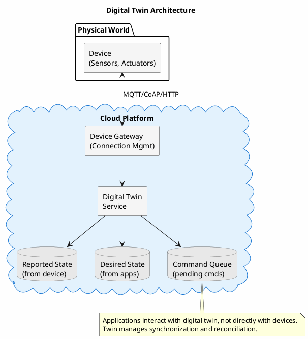
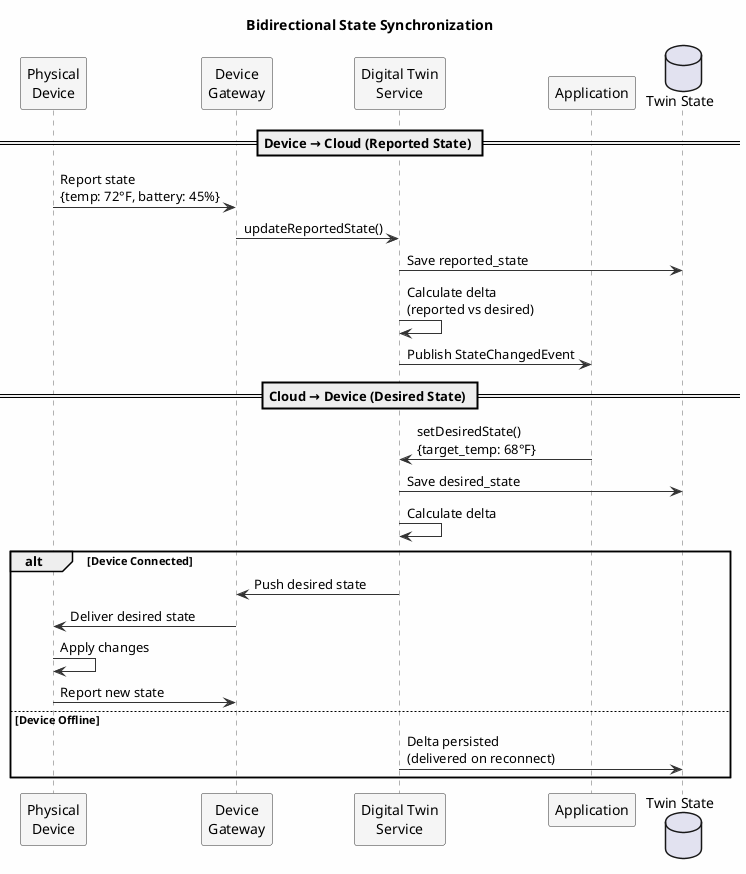
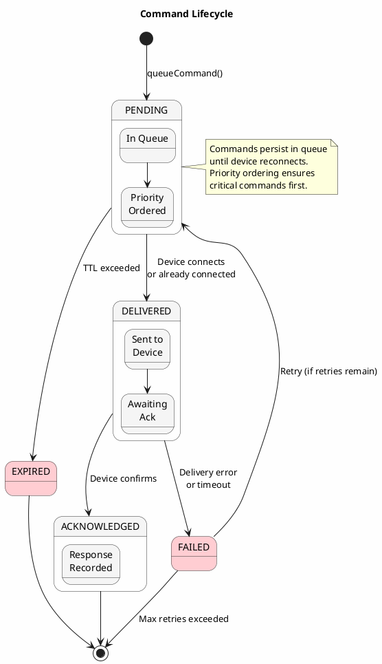
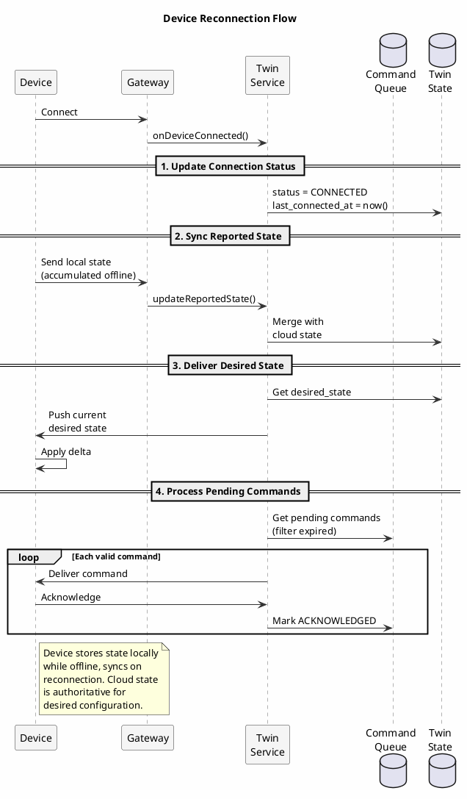

# Digital Twin Pattern

A digital twin is a virtual representation of a physical device or system that mirrors its state, configuration, and behavior. In IoT architectures, digital twins serve as the authoritative cloud-side record of device state, enabling applications to interact with devices even when they are offline, and providing a foundation for analytics, simulation, and command orchestration.

---

## The Device State Challenge

IoT devices present unique data management challenges:

**Intermittent connectivity**: Devices connect and disconnect unpredictably. A sensor in a remote location may have cellular coverage for minutes per hour. A vehicle's telematics unit loses connection in tunnels. A smart home device reboots during firmware updates.

**Bidirectional state**: State flows both ways. Devices report their observed state (temperature: 72°F, battery: 45%). Applications set desired state (target temperature: 68°F, firmware version: 2.3.1). These must eventually converge.

**Massive scale**: A fleet may contain millions of devices, each reporting state changes multiple times per minute. The system must handle both the volume of updates and the cardinality of unique devices.

**Temporal context**: "What is the device's state?" depends on when you ask. The last reported state may be seconds or hours old. Applications need both current state and state history.

**Command delivery**: Commands sent to offline devices must be queued, deduplicated, and delivered when the device reconnects, possibly with ordering constraints.

The digital twin pattern addresses these challenges by maintaining a cloud-side representation that serves as the coordination point between devices and applications.

---

## Digital Twin Architecture



### Core Concepts

**Reported State**: The state the device reports it is in. Updated when the device sends telemetry or state updates. Read-only from the application's perspective.

**Desired State**: The state applications want the device to be in. Updated by applications. Read-only from the device's perspective.

**Delta**: The difference between reported and desired state. When delta is non-empty, the device needs to take action to converge.

**Metadata**: Information about the twin itself, including when it was last updated, connection status, device capabilities, and firmware version.

---

## Schema Design

### Device Twin Table

```sql
CREATE TABLE device_twins (
    device_id UUID,
    tenant_id UUID,
    device_type TEXT,

    -- Reported state (from device)
    reported_state BLOB,              -- JSON/Avro serialized state
    reported_state_version BIGINT,
    reported_state_updated_at TIMESTAMP,

    -- Desired state (from applications)
    desired_state BLOB,
    desired_state_version BIGINT,
    desired_state_updated_at TIMESTAMP,

    -- Metadata
    connection_status TEXT,           -- CONNECTED, DISCONNECTED
    last_connected_at TIMESTAMP,
    last_activity_at TIMESTAMP,
    firmware_version TEXT,
    capabilities SET<TEXT>,
    tags MAP<TEXT, TEXT>,

    PRIMARY KEY ((tenant_id, device_id))
);
```

**Design rationale**:

- **Composite partition key**: Includes tenant for multi-tenant deployments, prevents hot partitions from large tenants.
- **Separate state versions**: Enable conflict detection when updating reported vs desired state independently.
- **State as BLOB**: Flexible schema for different device types; serialized JSON or Avro.
- **Connection status**: Tracks whether the device is currently connected to the gateway.

### State History Table

For temporal queries and debugging, maintain state history:

```sql
CREATE TABLE device_state_history (
    device_id UUID,
    state_type TEXT,                  -- 'REPORTED' or 'DESIRED'
    recorded_at TIMESTAMP,
    state_version BIGINT,
    state_data BLOB,
    changed_by TEXT,                  -- Device ID or user/service ID
    change_reason TEXT,
    PRIMARY KEY ((device_id, state_type), recorded_at)
) WITH CLUSTERING ORDER BY (recorded_at DESC)
  AND default_time_to_live = 2592000;  -- 30-day retention
```

### Command Queue Table

Commands waiting for device delivery:

```sql
CREATE TABLE device_commands (
    device_id UUID,
    command_id TIMEUUID,
    command_type TEXT,
    payload BLOB,
    priority INT,
    created_at TIMESTAMP,
    expires_at TIMESTAMP,
    status TEXT,                      -- PENDING, DELIVERED, ACKNOWLEDGED, EXPIRED
    delivered_at TIMESTAMP,
    acknowledged_at TIMESTAMP,
    response BLOB,
    PRIMARY KEY ((device_id), priority, command_id)
) WITH CLUSTERING ORDER BY (priority DESC, command_id ASC);
```

Clustering by priority ensures high-priority commands are delivered first.

---

## State Synchronization



### Device to Cloud (Reported State)

When a device reports state, the twin service updates reported state and records history:

```java
public class TwinStateService {

    public void updateReportedState(UUID deviceId, UUID tenantId,
                                    DeviceState newState, long deviceVersion) {
        // Get current twin
        DeviceTwin twin = getTwin(tenantId, deviceId);

        // Version check for optimistic concurrency
        if (twin.getReportedStateVersion() >= deviceVersion) {
            log.debug("Ignoring stale state update from device {}", deviceId);
            return;
        }

        // Update twin
        twin.setReportedState(serialize(newState));
        twin.setReportedStateVersion(deviceVersion);
        twin.setReportedStateUpdatedAt(Instant.now());
        twin.setLastActivityAt(Instant.now());

        saveTwin(twin);

        // Record history
        recordStateHistory(deviceId, "REPORTED", newState, deviceVersion);

        // Check for convergence
        evaluateStateDelta(twin);

        // Publish state change event
        eventPublisher.publish(new DeviceStateChangedEvent(
            deviceId, tenantId, "REPORTED", newState));
    }
}
```

### Cloud to Device (Desired State)

When an application sets desired state:

```java
public void updateDesiredState(UUID deviceId, UUID tenantId,
                               DeviceState desiredState, String changedBy) {
    DeviceTwin twin = getTwin(tenantId, deviceId);

    // Increment version
    long newVersion = twin.getDesiredStateVersion() + 1;

    twin.setDesiredState(serialize(desiredState));
    twin.setDesiredStateVersion(newVersion);
    twin.setDesiredStateUpdatedAt(Instant.now());

    saveTwin(twin);

    // Record history
    recordStateHistory(deviceId, "DESIRED", desiredState, newVersion, changedBy);

    // Notify device if connected
    if (twin.getConnectionStatus().equals("CONNECTED")) {
        notifyDeviceOfDesiredState(deviceId, desiredState, newVersion);
    }

    // Publish event
    eventPublisher.publish(new DesiredStateChangedEvent(
        deviceId, tenantId, desiredState, changedBy));
}
```

### Delta Calculation

The delta represents what the device needs to do:

```java
public StateDelta calculateDelta(DeviceTwin twin) {
    DeviceState reported = deserialize(twin.getReportedState());
    DeviceState desired = deserialize(twin.getDesiredState());

    StateDelta delta = new StateDelta();

    // Compare each property
    for (String property : desired.getProperties()) {
        Object reportedValue = reported.get(property);
        Object desiredValue = desired.get(property);

        if (!Objects.equals(reportedValue, desiredValue)) {
            delta.addDifference(property, reportedValue, desiredValue);
        }
    }

    return delta;
}
```

---

## Command Delivery

Commands are operations that don't fit the state model: reboot, run diagnostic, take photo. They require explicit acknowledgment.



### Queuing Commands

```java
public UUID queueCommand(UUID deviceId, Command command, Duration ttl) {
    UUID commandId = Uuids.timeBased();

    DeviceCommand cmd = new DeviceCommand();
    cmd.setDeviceId(deviceId);
    cmd.setCommandId(commandId);
    cmd.setCommandType(command.getType());
    cmd.setPayload(serialize(command.getPayload()));
    cmd.setPriority(command.getPriority());
    cmd.setCreatedAt(Instant.now());
    cmd.setExpiresAt(Instant.now().plus(ttl));
    cmd.setStatus("PENDING");

    commandRepository.save(cmd);

    // Attempt immediate delivery if device is connected
    DeviceTwin twin = getTwin(deviceId);
    if (twin.getConnectionStatus().equals("CONNECTED")) {
        deliverCommand(deviceId, cmd);
    }

    return commandId;
}
```

### Delivery on Reconnection

When a device connects, deliver pending commands:

```java
public void onDeviceConnected(UUID deviceId) {
    // Update twin connection status
    updateConnectionStatus(deviceId, "CONNECTED");

    // Get pending commands
    List<DeviceCommand> pending = commandRepository
        .findPendingByDeviceId(deviceId);

    // Filter expired
    Instant now = Instant.now();
    List<DeviceCommand> valid = pending.stream()
        .filter(cmd -> cmd.getExpiresAt().isAfter(now))
        .collect(Collectors.toList());

    // Mark expired commands
    pending.stream()
        .filter(cmd -> !cmd.getExpiresAt().isAfter(now))
        .forEach(cmd -> markCommandExpired(cmd));

    // Deliver valid commands in priority order
    for (DeviceCommand cmd : valid) {
        deliverCommand(deviceId, cmd);
    }

    // Send current desired state
    DeviceTwin twin = getTwin(deviceId);
    sendDesiredStateToDevice(deviceId, twin.getDesiredState());
}
```

### Acknowledgment Handling

```java
public void handleCommandAcknowledgment(UUID deviceId, UUID commandId,
                                        CommandResponse response) {
    DeviceCommand cmd = commandRepository.find(deviceId, commandId);

    if (cmd == null) {
        log.warn("Acknowledgment for unknown command {}", commandId);
        return;
    }

    cmd.setStatus("ACKNOWLEDGED");
    cmd.setAcknowledgedAt(Instant.now());
    cmd.setResponse(serialize(response));

    commandRepository.save(cmd);

    // Publish event
    eventPublisher.publish(new CommandAcknowledgedEvent(
        deviceId, commandId, response));
}
```

---

## Offline Handling



### Device Perspective

Devices must handle being offline gracefully:

```java
// Device-side pseudocode
public class DeviceTwinClient {

    private LocalStateStore localStore;
    private CloudConnection connection;

    public void updateState(DeviceState newState) {
        // Always update local store
        localStore.saveReportedState(newState);
        localStore.incrementVersion();

        // Attempt to sync if connected
        if (connection.isConnected()) {
            syncReportedState();
        } else {
            // Will sync on reconnection
            log.debug("Offline - state queued for sync");
        }
    }

    public void onConnected() {
        // Sync accumulated state changes
        syncReportedState();

        // Get latest desired state
        DeviceState desired = connection.getDesiredState();
        localStore.saveDesiredState(desired);

        // Apply delta
        applyDesiredState(desired);

        // Fetch and execute pending commands
        processPendingCommands();
    }

    private void syncReportedState() {
        DeviceState local = localStore.getReportedState();
        long version = localStore.getVersion();

        connection.sendReportedState(local, version);
    }
}
```

### Conflict Resolution

When both device and cloud have changes during a disconnect:

```java
public DeviceState resolveConflict(DeviceState deviceState,
                                   DeviceState cloudDesired,
                                   ConflictPolicy policy) {
    switch (policy) {
        case CLOUD_WINS:
            return cloudDesired;

        case DEVICE_WINS:
            return deviceState;

        case MERGE:
            return mergeStates(deviceState, cloudDesired);

        case TIMESTAMP_WINS:
            // Compare update timestamps, use most recent
            return deviceState.getTimestamp().isAfter(cloudDesired.getTimestamp())
                ? deviceState
                : cloudDesired;

        default:
            throw new IllegalArgumentException("Unknown policy: " + policy);
    }
}

private DeviceState mergeStates(DeviceState device, DeviceState cloud) {
    DeviceState merged = new DeviceState();

    // For each property, apply merge rules
    for (String property : getAllProperties(device, cloud)) {
        Object deviceValue = device.get(property);
        Object cloudValue = cloud.get(property);

        if (isReadOnlyFromCloud(property)) {
            // Sensor readings - device always wins
            merged.set(property, deviceValue);
        } else if (isConfigurable(property)) {
            // Configuration - cloud wins
            merged.set(property, cloudValue);
        } else {
            // Default: most recent wins
            merged.set(property,
                getMoreRecent(property, device, cloud));
        }
    }

    return merged;
}
```

---

## Querying Digital Twins

### Find Devices by State

```sql
-- Secondary index on connection status
CREATE INDEX ON device_twins (connection_status);

-- Find all connected devices
SELECT * FROM device_twins
WHERE tenant_id = ?
  AND connection_status = 'CONNECTED';
```

For complex queries, maintain materialized views or search indexes:

```sql
CREATE TABLE devices_by_status (
    tenant_id UUID,
    connection_status TEXT,
    device_id UUID,
    device_type TEXT,
    last_activity_at TIMESTAMP,
    PRIMARY KEY ((tenant_id, connection_status), last_activity_at, device_id)
) WITH CLUSTERING ORDER BY (last_activity_at DESC);
```

### Device Groups and Tags

```java
public List<DeviceTwin> findByTag(UUID tenantId, String tagKey, String tagValue) {
    // Use SAI if available (Cassandra 5.0+)
    return session.execute(
        "SELECT * FROM device_twins " +
        "WHERE tenant_id = ? AND tags[?] = ?",
        tenantId, tagKey, tagValue
    ).all().stream()
        .map(this::mapToTwin)
        .collect(Collectors.toList());
}
```

---

## Monitoring Twin Health

### Key Metrics

| Metric | Description | Alert Threshold |
|--------|-------------|-----------------|
| `twin.state_updates_per_second` | Rate of state updates | Baseline deviation |
| `twin.sync_latency_p99` | Time to propagate state | > 5 seconds |
| `twin.devices_offline` | Count of offline devices | > baseline |
| `twin.commands_pending` | Commands awaiting delivery | Growing unbounded |
| `twin.commands_expired` | Commands that expired | > 1% |
| `twin.delta_non_empty` | Devices with state divergence | Context-dependent |

### Stale Device Detection

```java
@Scheduled(fixedDelay = 300000)  // Every 5 minutes
public void detectStaleDevices() {
    Instant staleThreshold = Instant.now().minus(Duration.ofHours(24));

    List<DeviceTwin> staleDevices = twinRepository
        .findByLastActivityBefore(staleThreshold);

    for (DeviceTwin twin : staleDevices) {
        if (twin.getConnectionStatus().equals("CONNECTED")) {
            // Device claims connected but hasn't sent data
            log.warn("Device {} shows CONNECTED but no activity for 24h",
                twin.getDeviceId());
            twin.setConnectionStatus("UNKNOWN");
            twinRepository.save(twin);
        }

        alertIfExceedsThreshold(twin);
    }
}
```

---

## When to Use Digital Twins

### Appropriate Use Cases

- **IoT device management**: Industrial sensors, smart home devices, vehicles
- **Asset tracking**: Equipment with state that changes over time
- **Simulation and testing**: Testing application logic against virtual devices
- **Offline-first applications**: Mobile apps that sync with server state
- **Configuration management**: Distributing configuration to edge devices

### Consider Alternatives When

- **Simple telemetry only**: If devices just report data without bidirectional state, time-series storage may suffice
- **Real-time control required**: If millisecond-level control latency is needed, direct device communication may be necessary
- **No offline requirement**: If devices are always connected and don't need state caching, simpler approaches may work
- **Very high cardinality**: Billions of devices may require specialized infrastructure beyond Cassandra

---

## Summary

The digital twin pattern provides a cloud-side representation of physical devices that:

1. **Maintains reported state** from device telemetry
2. **Tracks desired state** from application commands
3. **Calculates deltas** to determine required device actions
4. **Queues commands** for delivery when devices connect
5. **Handles offline scenarios** with conflict resolution
6. **Enables queries** across device fleet state

Cassandra's characteristics (high write throughput, tunable consistency, linear scalability) make it well-suited for digital twin storage at IoT scale, though operational constraints apply. Partition sizes should remain bounded (typically under 100MB) by using time-bucketing for historical data, and high-frequency updates to the same partition may require careful capacity planning. The pattern decouples applications from device connectivity, enabling robust systems that function correctly regardless of network conditions.

---

## Related Documentation

- [Telemetry at Scale](telemetry-at-scale.md) - High-volume device data ingestion
- [Time-Series Data](time-series.md) - Temporal data patterns
- [CQRS Pattern](cqrs.md) - Separating command and query models