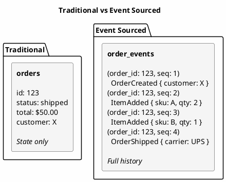
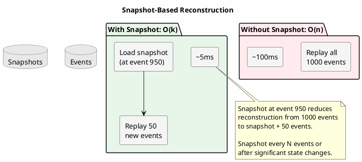
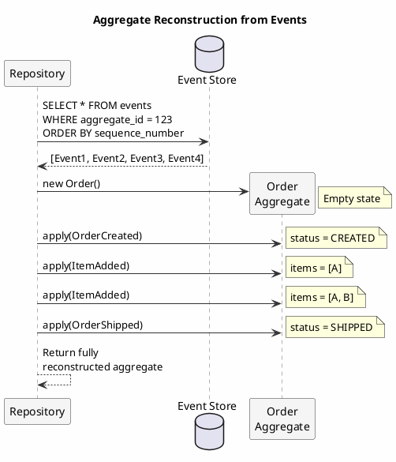
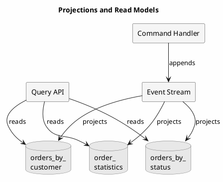

# Event Sourcing

Event sourcing inverts the traditional relationship between state and history. Rather than storing current state and discarding the operations that produced it, event sourcing stores the operations themselves (the events) and derives state by replaying them. This inversion has profound implications for auditability, debugging, and system evolution.

---

## The Problem with State-Based Persistence

Traditional persistence stores the current state of entities. When an order changes from "pending" to "shipped," the database overwrites "pending" with "shipped." The fact that the order was ever pending becomes invisible, unless explicit audit logging captures it.

This approach has served most applications adequately. But certain domains reveal its limitations:

**Lost business context**: A bank account balance of $1,000 tells you nothing about the deposits, withdrawals, fees, and interest payments that produced it. The balance is a lossy compression of a rich history.

**Debugging opacity**: When state is wrong, reconstructing how it became wrong requires correlating logs, timestamps, and often intuition. The system that produced the state has no memory of doing so.

**Audit requirements**: Regulated industries require complete audit trails. Bolting audit logging onto state-based persistence creates two sources of truth that can diverge: the state and the log describing how the state changed.

**Temporal queries**: "What was the account balance on January 15th?" requires either point-in-time snapshots (expensive) or reconstruction from audit logs (fragile).

**Schema evolution**: Migrating state requires transforming existing data. If historical context is lost, certain migrations become impossible; you cannot reconstruct what you never stored.

Event sourcing addresses these limitations by making history the primary artifact and state a derived view.

---

## The Event Sourcing Model

In an event-sourced system, each state change is captured as an immutable event. The current state of an entity (called an aggregate in domain-driven design terminology) is reconstructed by replaying its events in order.



The event stream is the source of truth. The "current state" shown in the traditional model is merely a projection, a materialized view computed from events.

### Events as Facts

Events represent facts about what happened. They are:

**Immutable**: An event, once recorded, cannot change. `OrderShipped` at 14:32:07 is a historical fact. If the shipment is cancelled, a new event `ShipmentCancelled` is appended; the original event remains.

**Past tense**: Events describe what has already occurred: `OrderCreated`, `PaymentReceived`, `ItemShipped`. Commands describe intent (`CreateOrder`); events describe outcomes.

**Complete**: An event should contain all information needed to understand what happened, without requiring access to other events or external state at replay time.

**Ordered**: Within an aggregate, events have a strict sequence. Event 4 happened after event 3. This ordering is essential for correct reconstruction.

---

## Event Store Design in Cassandra

Cassandra's characteristics align well with event store requirements: append-only writes, efficient range queries within partitions, and linear write scalability. However, the design requires careful attention to partition boundaries and ordering guarantees.

### Core Schema

```sql
CREATE TABLE events (
    aggregate_type TEXT,
    aggregate_id UUID,
    sequence_number BIGINT,
    event_type TEXT,
    event_data BLOB,
    event_metadata MAP<TEXT, TEXT>,
    event_time TIMESTAMP,
    PRIMARY KEY ((aggregate_type, aggregate_id), sequence_number)
) WITH CLUSTERING ORDER BY (sequence_number ASC);
```

**Design rationale**:

- **Composite partition key**: `(aggregate_type, aggregate_id)` groups all events for a single aggregate. This enables efficient reconstruction via a single partition query.
- **Clustering by sequence**: Events within an aggregate are ordered by sequence number, ensuring deterministic replay.
- **Event data as BLOB**: Serialized event payload (JSON, Avro, Protobuf). The event store is agnostic to event content.
- **Metadata map**: Correlation IDs, causation IDs, user context, timestamps (information about the event rather than the domain fact itself).

### Sequence Number Management

The sequence number serves dual purposes: ordering events for replay and detecting concurrent modifications. Two approaches exist:

**Application-managed sequences**: The application tracks the current sequence number and includes it in writes. Cassandra's lightweight transactions (LWT) enforce uniqueness.

```java
public void appendEvent(AggregateId id, Event event, long expectedSequence) {
    long newSequence = expectedSequence + 1;

    ResultSet result = session.execute(
        insertEvent.bind(id.getType(), id.getValue(), newSequence,
                         event.getType(), serialize(event), event.getMetadata(), Instant.now())
            .setSerialConsistencyLevel(ConsistencyLevel.LOCAL_SERIAL)
    );

    if (!result.wasApplied()) {
        throw new ConcurrentModificationException(
            "Aggregate " + id + " was modified concurrently");
    }
}
```

The LWT ensures that if two processes attempt to write sequence number N simultaneously, exactly one succeeds. The other receives a conflict and must retry with fresh state.

**TimeUUID sequences**: Using `TIMEUUID` as the clustering column provides automatic ordering without explicit sequence management.

```sql
PRIMARY KEY ((aggregate_type, aggregate_id), event_id)
-- where event_id is TIMEUUID
```

This approach simplifies writes but complicates optimistic concurrency control. Detecting conflicts requires additional mechanisms (version columns, conditional writes on metadata).

### Partition Growth Considerations

Long-lived aggregates accumulate many events. An order with thousands of modifications, or an account spanning years, may exceed recommended partition sizes.

**Snapshotting** addresses this by periodically storing computed state:



```sql
CREATE TABLE aggregate_snapshots (
    aggregate_type TEXT,
    aggregate_id UUID,
    sequence_number BIGINT,
    snapshot_data BLOB,
    created_at TIMESTAMP,
    PRIMARY KEY ((aggregate_type, aggregate_id))
);
```

Reconstruction then loads the latest snapshot and replays only subsequent events:

```java
public Order loadOrder(UUID orderId) {
    // Load snapshot if exists
    Snapshot snapshot = snapshotRepository.findLatest("Order", orderId);

    // Load events after snapshot
    long startSequence = snapshot != null ? snapshot.getSequenceNumber() + 1 : 0;
    List<Event> events = eventStore.loadEvents("Order", orderId, startSequence);

    // Reconstruct
    Order order = snapshot != null ? deserialize(snapshot.getData()) : new Order();
    events.forEach(order::apply);

    return order;
}
```

**Snapshot frequency** depends on event volume and reconstruction latency requirements. Common strategies include snapshotting every N events or after significant state changes.

---

## Aggregate Reconstruction

Reconstruction (building current state from events) is the fundamental operation in event sourcing. Its implementation determines system behavior and performance characteristics.



### The Apply Method Pattern

Each aggregate defines how to apply each event type:

```java
public class Order {
    private UUID id;
    private OrderStatus status;
    private List<LineItem> items;
    private Money total;

    // Apply methods for each event type
    public void apply(OrderCreated event) {
        this.id = event.getOrderId();
        this.status = OrderStatus.CREATED;
        this.items = new ArrayList<>();
        this.total = Money.ZERO;
    }

    public void apply(ItemAdded event) {
        this.items.add(new LineItem(event.getSku(), event.getQuantity(), event.getPrice()));
        this.total = this.total.add(event.getPrice().multiply(event.getQuantity()));
    }

    public void apply(OrderShipped event) {
        this.status = OrderStatus.SHIPPED;
    }

    // Generic dispatcher
    public void apply(Event event) {
        if (event instanceof OrderCreated) apply((OrderCreated) event);
        else if (event instanceof ItemAdded) apply((ItemAdded) event);
        else if (event instanceof OrderShipped) apply((OrderShipped) event);
        // ... other event types
    }
}
```

**Apply methods must be pure functions**: given the same event, they produce the same state change. No I/O, no external dependencies, no randomness. This purity ensures that reconstruction is deterministic: replaying the same events always produces the same state.

### Reconstruction Performance

Reconstruction cost grows with event count. For aggregates with thousands of events, naive reconstruction becomes a bottleneck.

| Events per Aggregate | Typical Reconstruction Time | Strategy |
|---------------------|----------------------------|----------|
| < 100 | < 10ms | Full replay acceptable |
| 100-1,000 | 10-100ms | Consider snapshots |
| > 1,000 | > 100ms | Snapshots required |

The threshold depends on latency requirements. A user-facing API with 50ms latency budget cannot afford 100ms reconstructions. Background processing with second-level latency tolerance may accept larger replay costs.

---

## Projections and Read Models

Event sourcing separates the write model (events) from read models (projections). Projections are views optimized for specific queries, built by processing events.

### Projection Types

**Synchronous projections** update within the same transaction as event persistence. Simple but couples read and write paths.

**Asynchronous projections** process events from a stream or queue, eventually updating read models. Decoupled but introduces eventual consistency.



### Projection Schema Design

Projections are denormalized views optimized for specific access patterns:

```sql
-- Projection: Orders by customer (for customer dashboard)
CREATE TABLE orders_by_customer (
    customer_id UUID,
    order_date DATE,
    order_id UUID,
    status TEXT,
    total DECIMAL,
    item_count INT,
    PRIMARY KEY ((customer_id), order_date, order_id)
) WITH CLUSTERING ORDER BY (order_date DESC);

-- Projection: Order statistics (for analytics)
CREATE TABLE order_statistics_daily (
    stat_date DATE,
    hour TINYINT,
    orders_created COUNTER,
    orders_shipped COUNTER,
    orders_cancelled COUNTER,
    PRIMARY KEY ((stat_date), hour)
);
```

### Projection Rebuilding

A key advantage of event sourcing: projections can be rebuilt from scratch by replaying all events. This enables:

- **Schema evolution**: Change projection schema, rebuild from events
- **Bug fixes**: Correct projection logic errors by replaying
- **New projections**: Add views for new requirements without data migration

```java
public class ProjectionRebuilder {

    public void rebuildProjection(String projectionName, EventProcessor processor) {
        // Truncate existing projection
        truncateProjection(projectionName);

        // Replay all events
        eventStore.streamAllEvents()
            .forEach(event -> {
                processor.process(event);
                trackProgress(projectionName, event.getSequenceNumber());
            });

        log.info("Rebuilt projection {} from {} events", projectionName, eventCount);
    }
}
```

**Rebuild time** depends on event volume. Millions of events may require hours to replay. Production systems often maintain both old and new projections during rebuild, switching traffic only after completion.

---

## Consistency and Concurrency

Event sourcing introduces specific consistency considerations that differ from traditional CRUD systems.

### Optimistic Concurrency

The sequence number enables optimistic concurrency control. When loading an aggregate, the application notes the current sequence. When appending events, it specifies the expected sequence:

```java
public void processCommand(OrderId orderId, Command command) {
    // Load current state and sequence
    Order order = loadOrder(orderId);
    long currentSequence = order.getVersion();

    // Validate and generate events
    List<Event> events = order.handle(command);

    // Attempt to append (may fail if concurrent modification)
    try {
        eventStore.appendEvents(orderId, events, currentSequence);
    } catch (ConcurrentModificationException e) {
        // Reload and retry
        throw new RetryableException("Concurrent modification, please retry");
    }
}
```

This approach ensures that conflicting updates don't silently overwrite each other. One wins; others receive explicit conflicts.

### Event Ordering Guarantees

Within a single aggregate, Cassandra's clustering order guarantees event sequence. Across aggregates, no global ordering exists.

**Causality preservation** requires explicit tracking when events in one aggregate cause events in another:

```java
public class EventMetadata {
    private UUID correlationId;  // Groups related events across aggregates
    private UUID causationId;    // The event that caused this event
    private Instant timestamp;
}
```

Projection processors can use these IDs to handle events in causal order even when processing in parallel.

### Strong Consistency When Required

Some scenarios require reading immediately after writing. Options include:

**LOCAL_QUORUM reads**: Accept cross-DC latency for strong reads.

**Read-your-writes at application level**: Cache recently written events, merge with reads.

**Synchronous projection updates**: Update critical projections in the same request.

---

## Schema Evolution

Events, once written, are immutable. But event schemas must evolve as systems change. This tension requires careful handling.

### Event Versioning

Include version in event type or structure:

```java
// Version in type name
public class OrderCreatedV1 { ... }
public class OrderCreatedV2 { ... }

// Version in event envelope
public class EventEnvelope {
    private String eventType;
    private int version;
    private byte[] payload;
}
```

### Upcasting

Transform old event versions to current version during deserialization:

```java
public Event deserialize(EventEnvelope envelope) {
    if (envelope.getEventType().equals("OrderCreated")) {
        return switch (envelope.getVersion()) {
            case 1 -> upcastV1ToV2(deserializeV1(envelope.getPayload()));
            case 2 -> deserializeV2(envelope.getPayload());
            default -> throw new UnknownVersionException(envelope);
        };
    }
    // ... other event types
}

private OrderCreatedV2 upcastV1ToV2(OrderCreatedV1 v1) {
    return new OrderCreatedV2(
        v1.getOrderId(),
        v1.getCustomerId(),
        Currency.USD  // Default for old events without currency
    );
}
```

### Evolution Guidelines

| Change Type | Approach | Risk |
|------------|----------|------|
| Add optional field | Add with default value | Low |
| Add required field | Upcast old events | Medium |
| Remove field | Keep in schema, ignore in processing | Low |
| Rename field | Upcast old events | Medium |
| Change field type | New event version with upcasting | High |
| Change event semantics | New event type entirely | High |

**Never delete or modify historical events**. The event stream is an append-only log. Evolution happens through upcasting (reading) and new event types (writing).

---

## When to Use Event Sourcing

Event sourcing is not universally appropriate. It introduces complexity that must be justified by specific requirements.

### Event Sourcing Is Well-Suited For

**Audit-critical domains**: Financial systems, healthcare, legal, and anywhere complete audit trails are mandatory.

**Complex domain logic**: When the sequence of operations matters for understanding state.

**Temporal queries**: "What was the state at time T?" becomes trivial with event replay.

**Event-driven architectures**: Systems already organized around domain events gain natural persistence.

**Debugging production issues**: Complete history enables precise reconstruction of how state became corrupted.

### Event Sourcing May Be Inappropriate For

**Simple CRUD applications**: If entities have few state transitions and no audit requirements, event sourcing adds overhead without benefit.

**High-frequency updates**: Aggregates modified thousands of times per second accumulate events rapidly, requiring aggressive snapshotting or alternative approaches.

**Large state with small changes**: If state is 10MB but each event represents a 100-byte change, full reconstruction becomes expensive. Consider hybrid approaches.

**Queries spanning aggregates**: Event sourcing optimizes for single-aggregate operations. Cross-aggregate queries require projections, which is acceptable if read patterns are known but problematic if queries are ad-hoc.

### Hybrid Approaches

Event sourcing need not be all-or-nothing:

- **Event sourcing for core domain, CRUD for supporting contexts**
- **Event sourcing for writes, traditional tables for reads** (CQRS)
- **Event sourcing for audit trail, state-based for operational queries**

The pattern should be applied where it provides value, not uniformly across all entities.

---

## Summary

Event sourcing represents a fundamental shift in how applications relate to their data: from storing conclusions to storing the evidence that produced those conclusions. This shift enables:

1. **Complete audit trails** without separate logging infrastructure
2. **Temporal queries** by replaying events to any point in time
3. **Debugging capabilities** through full reconstruction of how state evolved
4. **Schema evolution** through event versioning and upcasting
5. **Projection flexibility** through rebuild-from-events capability

The trade-offs include increased storage, reconstruction latency, eventual consistency in projections, and the conceptual shift required of development teams.

Cassandra provides a solid foundation for event stores: append-only write patterns align with its strengths, partition-per-aggregate enables efficient reconstruction, and linear scalability supports high event volumes. The patterns described here (snapshotting, optimistic concurrency, projection management) address the practical challenges of production event-sourced systems.

---

## Related Documentation

- [CQRS Pattern](cqrs.md) - Command Query Responsibility Segregation
- [Time-Series Data](time-series.md) - Temporal data patterns
- [Data Modeling](../../data-modeling/index.md) - Query-first design principles
