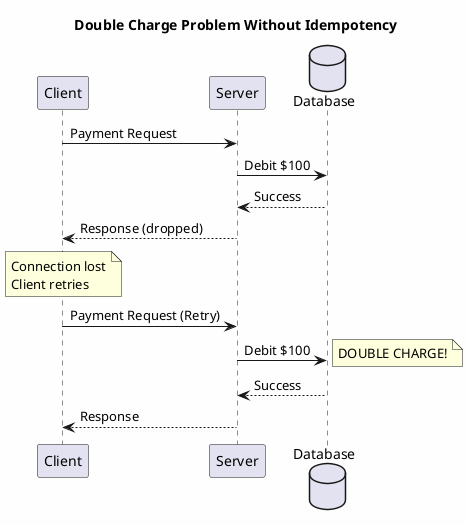
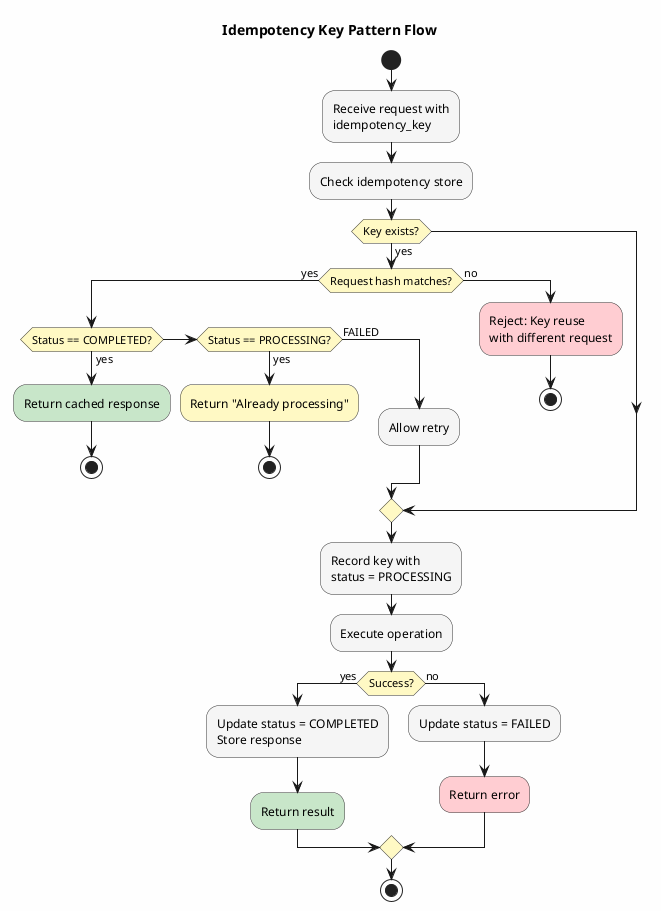
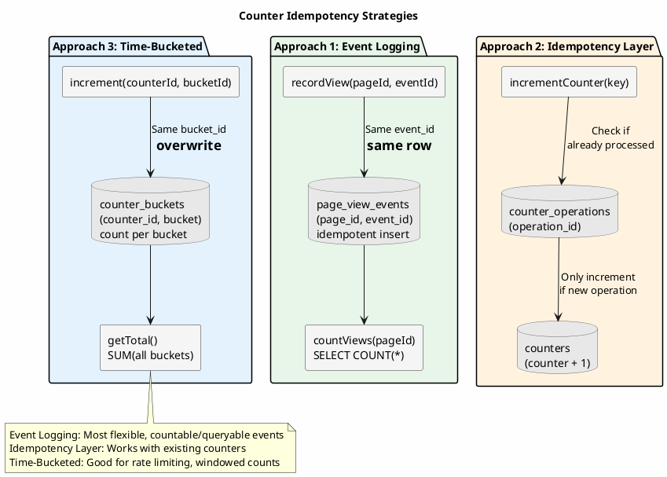

# Idempotency Patterns

Idempotency (the property that an operation can be applied multiple times without changing the result beyond the initial application) is foundational to reliable distributed systems. Networks fail, services restart, and messages duplicate. Without idempotent operations, every retry risks corrupting state.

---

## Idempotency in Distributed Systems

Consider a payment processing system where a client submits a payment request. The server processes the payment and begins sending the response, but the connection drops. The client, receiving no response, retries. Without idempotency, the customer is charged twice.



This failure mode is not hypothetical. In distributed systems, it is guaranteed to occur given sufficient time and traffic. The question is not whether clients will retry, but how the system responds when they do.

### The Retry Imperative

Modern distributed systems are built on the assumption that operations may fail and retries are necessary. This assumption manifests throughout the stack:

- **HTTP clients** implement automatic retries with exponential backoff
- **Message brokers** provide at-least-once delivery, meaning messages may arrive multiple times
- **Service meshes** retry failed requests transparently
- **Database drivers** retry operations on transient failures

Each retry mechanism exists because experience has demonstrated that retry is often the correct response to failure. But retry is only safe if operations are idempotent.

---

## Categories of Operations

Operations fall into three categories regarding idempotency:

### Naturally Idempotent Operations

Some operations are inherently safe to repeat:

```sql
-- Idempotent: Setting absolute state
UPDATE users SET email = 'new@example.com' WHERE user_id = ?;

-- Idempotent: Deleting a resource
DELETE FROM orders WHERE order_id = ?;

-- Idempotent: Inserting with same primary key (upsert semantics)
INSERT INTO inventory (product_id, quantity) VALUES (?, ?)
    USING TIMESTAMP ?;  -- With explicit timestamp for determinism
```

These operations converge to the same state regardless of how many times they execute. The second execution changes nothing because the state is already at the target.

### Non-Idempotent Operations

Other operations change state with each execution:

```sql
-- Non-idempotent: Incrementing a value
UPDATE accounts SET balance = balance + 100 WHERE account_id = ?;

-- Non-idempotent: Appending to a collection
UPDATE logs SET entries = entries + [?] WHERE log_id = ?;

-- Non-idempotent: Auto-generated identifiers
INSERT INTO events (event_id, ...) VALUES (uuid(), ...);
```

Each execution produces different results. Retrying these operations without protection corrupts state.

### Conditionally Idempotent Operations

Some operations become idempotent when combined with conditional logic:

```sql
-- Conditionally idempotent: Insert if not exists
INSERT INTO users (user_id, email, created_at)
VALUES (?, ?, ?)
IF NOT EXISTS;
```

The first execution inserts the row; subsequent executions find the row exists and do nothing. The operation is idempotent due to the condition.

---

## Idempotency Key Pattern

The idempotency key pattern makes any operation idempotent by tracking which operations have been performed. A client-provided identifier marks each logical operation; the server checks this identifier before processing.



### Schema Design

```sql
CREATE TABLE idempotency_keys (
    key_namespace TEXT,
    idempotency_key TEXT,
    created_at TIMESTAMP,
    request_hash BLOB,
    response_data BLOB,
    status TEXT,
    PRIMARY KEY ((key_namespace, idempotency_key))
) WITH default_time_to_live = 86400;  -- 24-hour retention
```

**Design rationale**:

- **Namespace**: Separates keys by operation type (payments, orders, etc.)
- **Idempotency key**: Client-provided unique identifier for the operation
- **Request hash**: Detects conflicting requests with same key but different content
- **Response data**: Cached response for replay on duplicates
- **TTL**: Prevents unbounded table growth

### Implementation Flow

```java
public class IdempotentPaymentService {

    public PaymentResult processPayment(String idempotencyKey, PaymentRequest request) {
        // 1. Check for existing operation
        IdempotencyRecord existing = idempotencyStore.find("payments", idempotencyKey);

        if (existing != null) {
            // Verify request matches (detect key reuse with different request)
            if (!existing.matchesRequest(request)) {
                throw new ConflictException(
                    "Idempotency key already used with different request parameters");
            }

            // Return cached response
            if (existing.getStatus().equals("COMPLETED")) {
                return deserialize(existing.getResponseData());
            }

            // Previous attempt still in progress or failed
            if (existing.getStatus().equals("PROCESSING")) {
                throw new ConflictException("Previous request still processing");
            }
        }

        // 2. Record operation start
        idempotencyStore.create("payments", idempotencyKey, request, "PROCESSING");

        try {
            // 3. Execute operation
            PaymentResult result = executePayment(request);

            // 4. Record completion with response
            idempotencyStore.complete("payments", idempotencyKey, result);

            return result;

        } catch (Exception e) {
            // 5. Record failure
            idempotencyStore.fail("payments", idempotencyKey, e);
            throw e;
        }
    }
}
```

### Key Generation Strategies

The idempotency key can be generated various ways:

| Strategy | Example | Use Case |
|----------|---------|----------|
| Client-generated UUID | `550e8400-e29b-41d4-a716-446655440000` | API clients with unique request tracking |
| Business identifier | `order-12345-payment` | Operations tied to domain entities |
| Request hash | `sha256(canonical_request)` | When all requests should be unique |
| Composite key | `user-123:2024-01-15:payment` | Rate-limited operations per user per day |

**Client-generated** keys give clients full control but require trust that clients generate unique keys.

**Business identifier** keys naturally deduplicate operations on the same entity but may conflict if the same entity can have multiple valid operations.

**Request hash** keys automatically deduplicate identical requests but treat any parameter change as a new operation.

---

## Deduplication with Cassandra LWT

Cassandra's lightweight transactions (LWT) provide atomic check-and-set operations suitable for deduplication:

```java
public boolean executeOnce(String operationId, Runnable operation) {
    // Atomic: insert only if not exists
    ResultSet result = session.execute(
        insertOperation.bind(operationId, Instant.now(), "STARTED")
            .setSerialConsistencyLevel(ConsistencyLevel.LOCAL_SERIAL)
    );

    if (!result.wasApplied()) {
        // Already executed (or in progress)
        return false;
    }

    try {
        operation.run();

        // Mark completed
        session.execute(updateStatus.bind("COMPLETED", operationId));
        return true;

    } catch (Exception e) {
        // Mark failed (allowing retry with same key)
        session.execute(updateStatus.bind("FAILED", operationId));
        throw e;
    }
}
```

The `IF NOT EXISTS` clause ensures exactly one execution proceeds. Concurrent attempts receive `wasApplied() == false` and can handle accordingly.

### LWT Performance Considerations

Lightweight transactions incur overhead compared to regular operations:

| Operation Type | Typical Latency |
|---------------|-----------------|
| Regular write | 1-5ms |
| LWT write | 10-30ms |

This overhead is acceptable for critical operations (payments, order creation) but may be prohibitive for high-frequency operations. Alternatives include:

- **Timestamp-based deduplication** using Cassandra's built-in timestamp resolution
- **Optimistic deduplication** with post-hoc reconciliation
- **Bloom filter pre-checks** to avoid LWT for clearly-new operations

---

## Counter Operations and Idempotency

Cassandra counters present a specific idempotency challenge. Counter increments are inherently non-idempotent:

```sql
-- Non-idempotent: each execution increments
UPDATE page_views SET count = count + 1 WHERE page_id = ?;
```



### Approach 1: Event Logging Instead of Counters

Replace counters with event logs, counting via aggregation:

```sql
CREATE TABLE page_view_events (
    page_id UUID,
    view_id TIMEUUID,
    viewer_id UUID,
    viewed_at TIMESTAMP,
    PRIMARY KEY ((page_id), view_id)
);
```

```java
public void recordPageView(UUID pageId, UUID viewerId, UUID eventId) {
    // Idempotent: same eventId produces same row
    session.execute(insertPageView.bind(
        pageId, eventId, viewerId, Instant.now()
    ));
}

public long getPageViewCount(UUID pageId) {
    return session.execute(countPageViews.bind(pageId))
        .one()
        .getLong("count");
}
```

The event ID makes the operation idempotent: inserting the same event twice produces one row. Counting aggregates events without double-counting.

### Approach 2: Idempotency Layer for Counters

Track counter updates with idempotency keys:

```java
public void incrementCounter(String counterId, String idempotencyKey) {
    // Check if already applied
    ResultSet check = session.execute(
        checkCounterUpdate.bind(counterId, idempotencyKey)
    );

    if (check.one() != null) {
        return;  // Already applied
    }

    // Apply increment
    session.execute(incrementCounter.bind(counterId));

    // Record application (with TTL matching counter relevance window)
    session.execute(recordCounterUpdate.bind(counterId, idempotencyKey));
}
```

The tracking table creates a two-operation window where failures can cause inconsistency. This approach suits cases where occasional duplicate increments are tolerable.

---

## Message Processing Idempotency

Message consumers face idempotency challenges because message brokers guarantee at-least-once delivery:

```java
@KafkaListener(topics = "orders")
public void processOrder(OrderMessage message) {
    // This method MAY be called multiple times for the same message
}
```

### Consumer-Side Deduplication

Track processed message IDs:

```sql
CREATE TABLE processed_messages (
    consumer_group TEXT,
    topic TEXT,
    message_id UUID,
    processed_at TIMESTAMP,
    PRIMARY KEY ((consumer_group, topic), message_id)
) WITH default_time_to_live = 604800;  -- 7-day retention
```

```java
@KafkaListener(topics = "orders")
public void processOrder(OrderMessage message) {
    String consumerGroup = "order-processor";
    String topic = "orders";
    UUID messageId = message.getMessageId();

    // Check if already processed
    if (processedTracker.isProcessed(consumerGroup, topic, messageId)) {
        log.debug("Duplicate message {}, skipping", messageId);
        return;
    }

    // Process message
    orderService.createOrder(message.toOrder());

    // Mark as processed
    processedTracker.markProcessed(consumerGroup, topic, messageId);
}
```

### Processing Window and Retention

The deduplication window (TTL) must exceed:

- Maximum message redelivery delay
- Consumer restart/rebalance time
- Any manual replay scenarios

A 7-day window handles most operational scenarios. Longer windows increase storage but reduce duplicate processing risk.

### Transactional Processing

For stronger guarantees, process and mark in a single operation:

```java
public void processOrderTransactionally(OrderMessage message) {
    // Use LWT to atomically check and record
    ResultSet result = session.execute(
        insertProcessedMessage.bind(
            consumerGroup, topic, message.getMessageId(),
            Instant.now(), message.toOrder()
        ).setSerialConsistencyLevel(ConsistencyLevel.LOCAL_SERIAL)
    );

    if (!result.wasApplied()) {
        log.debug("Already processed {}", message.getMessageId());
        return;
    }

    // Message recorded; proceed with processing
    // (If processing fails, the record exists but processing didn't complete:
    //  handle via status field or separate completion tracking)
    orderService.createOrder(message.toOrder());
}
```

---

## Request Deduplication at API Level

APIs should support idempotency keys as a first-class concept:

### HTTP Idempotency Header

```http
POST /v1/payments HTTP/1.1
Host: api.example.com
Idempotency-Key: 550e8400-e29b-41d4-a716-446655440000
Content-Type: application/json

{"amount": 100, "currency": "USD", "recipient": "user-456"}
```

### Response Handling

| Scenario | HTTP Status | Behavior |
|----------|-------------|----------|
| First request, success | 200/201 | Normal response, cached |
| First request, failure | 4xx/5xx | Error response, may retry with same key |
| Duplicate request, same payload | 200/201 | Return cached response |
| Duplicate key, different payload | 409 Conflict | Reject with error |

```java
@PostMapping("/payments")
public ResponseEntity<PaymentResult> createPayment(
        @RequestHeader("Idempotency-Key") String idempotencyKey,
        @RequestBody PaymentRequest request) {

    try {
        PaymentResult result = idempotentPaymentService.processPayment(
            idempotencyKey, request);

        return ResponseEntity.ok(result);

    } catch (DuplicateRequestException e) {
        // Return cached response
        return ResponseEntity.ok(e.getCachedResult());

    } catch (ConflictingRequestException e) {
        // Same key, different payload
        return ResponseEntity.status(HttpStatus.CONFLICT)
            .body(new ErrorResponse("Idempotency key already used"));
    }
}
```

---

## Designing for Idempotency

When designing operations, prefer naturally idempotent forms:

### Prefer Absolute Over Relative State

```java
// Non-idempotent: relative change
public void incrementBalance(UUID accountId, BigDecimal amount) {
    // Each call adds to balance
    accountRepository.incrementBalance(accountId, amount);
}

// Idempotent: absolute state
public void setBalance(UUID accountId, BigDecimal newBalance, long version) {
    // Convergent: repeated calls set same value
    accountRepository.setBalanceIfVersion(accountId, newBalance, version);
}
```

### Use Deterministic Identifiers

```java
// Non-idempotent: new ID each time
public UUID createOrder(OrderRequest request) {
    UUID orderId = UUID.randomUUID();  // Different each call
    orderRepository.save(new Order(orderId, request));
    return orderId;
}

// Idempotent: deterministic ID
public UUID createOrder(OrderRequest request, UUID clientOrderId) {
    // Same clientOrderId produces same order
    if (orderRepository.exists(clientOrderId)) {
        return clientOrderId;
    }
    orderRepository.save(new Order(clientOrderId, request));
    return clientOrderId;
}
```

### Make Side Effects Conditional

```java
// Non-idempotent: always sends email
public void processOrder(Order order) {
    save(order);
    emailService.sendConfirmation(order);  // Sends on every call
}

// Idempotent: conditional side effects
public void processOrder(Order order) {
    Order existing = findById(order.getId());

    if (existing == null) {
        save(order);
        emailService.sendConfirmation(order);
    } else if (!existing.equals(order)) {
        update(order);
        // No email: already sent on creation
    }
    // If identical, do nothing
}
```

---

## Testing Idempotent Operations

Idempotency must be tested explicitly:

```java
@Test
void paymentShouldBeIdempotent() {
    String idempotencyKey = UUID.randomUUID().toString();
    PaymentRequest request = new PaymentRequest(100, "USD", "recipient");

    // First request
    PaymentResult first = paymentService.processPayment(idempotencyKey, request);

    // Second request with same key
    PaymentResult second = paymentService.processPayment(idempotencyKey, request);

    // Results should be identical
    assertEquals(first.getPaymentId(), second.getPaymentId());
    assertEquals(first.getAmount(), second.getAmount());

    // Only one payment should exist
    assertEquals(1, paymentRepository.countByIdempotencyKey(idempotencyKey));
}

@Test
void conflictingRequestsShouldBeRejected() {
    String idempotencyKey = UUID.randomUUID().toString();

    // First request
    paymentService.processPayment(idempotencyKey,
        new PaymentRequest(100, "USD", "recipient-a"));

    // Same key, different payload
    assertThrows(ConflictingRequestException.class, () ->
        paymentService.processPayment(idempotencyKey,
            new PaymentRequest(200, "USD", "recipient-b"))
    );
}
```

---

## Summary

Idempotency transforms unreliable distributed operations into reliable ones by ensuring that retries are safe. The key patterns:

1. **Idempotency keys** track operation completion, enabling cached response replay
2. **Lightweight transactions** provide atomic check-and-set for deduplication
3. **Natural idempotency** through absolute state rather than relative changes
4. **Deterministic identifiers** ensure repeated requests create the same resources
5. **Message deduplication** handles at-least-once delivery in event-driven systems
6. **API-level support** through idempotency headers and conflict detection

Cassandra provides the primitives (conditional writes, TTL for cleanup, efficient key lookups) to implement these patterns. The choice between approaches depends on operation criticality, latency requirements, and acceptable complexity.

Every operation that modifies state should be analyzed for idempotency. If it is not naturally idempotent, one of these patterns must be applied. The alternative (data corruption on retry) is not acceptable in production systems.

---

## Related Documentation

- [Transactional Outbox](outbox.md) - Reliable message publishing
- [Event Sourcing](event-sourcing.md) - Events as source of truth
- [Lightweight Transactions](../../cql/dml/lightweight-transactions.md) - Conditional writes
