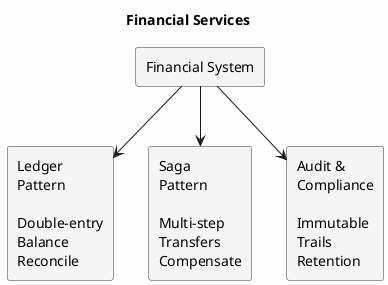
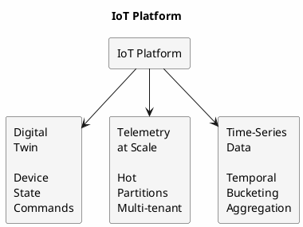
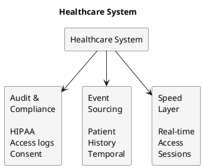
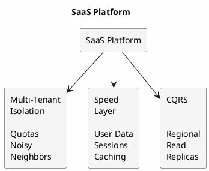
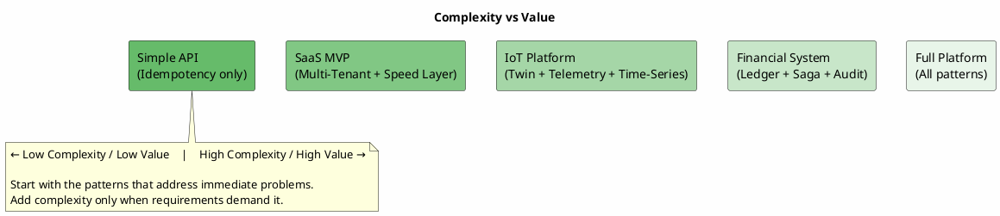

# Enterprise Application Patterns

This section documents architectural patterns for building enterprise applications with Apache Cassandra. These patterns address common challenges in distributed systems (reliability, consistency, scalability, and operational complexity) through proven approaches that leverage Cassandra's strengths while acknowledging its constraints.

---

## Pattern Catalog by Category

### Foundational Patterns

Core patterns applicable across domains:

| Pattern | Description | Key Use Cases |
|---------|-------------|---------------|
| [CQRS](cqrs.md) | Separates read and write models for independent optimization | Regional read replicas, read-heavy workloads |
| [Event Sourcing](event-sourcing.md) | Stores state changes as immutable events | Audit trails, temporal queries, debugging |
| [Transactional Outbox](outbox.md) | Reliable database + message broker updates | Event-driven architectures, sagas |
| [Idempotency](idempotency.md) | Safe operation retry without side effects | Payment processing, message consumption |
| [Saga](saga.md) | Distributed transactions with compensation | Multi-service operations, long-running processes |

---

### Finance & Regulated Industries

Patterns for financial services, compliance, and audit requirements:

| Pattern | Description | Key Use Cases |
|---------|-------------|---------------|
| [Ledger](ledger.md) | Double-entry bookkeeping with balance proofs | Banking, payments, accounting |
| [Digital Currency](digital-currency.md) | Token systems with double-spend prevention | Loyalty points, in-game currency, digital assets |
| [Audit & Compliance](audit-compliance.md) | Immutable audit trails, consent management | GDPR, HIPAA, SOX compliance |

---

### IoT & Industrial

Patterns for device management and high-volume telemetry:

| Pattern | Description | Key Use Cases |
|---------|-------------|---------------|
| [Digital Twin](digital-twin.md) | Device state management and synchronization | IoT platforms, asset tracking |
| [Telemetry at Scale](telemetry-at-scale.md) | High-volume ingestion and hot partition mitigation | Sensor networks, fleet management |
| [Time-Series Data](time-series.md) | Temporal bucketing and aggregation pyramids | Metrics, logs, monitoring |

---

### SaaS & Platform

Patterns for multi-tenant and high-performance applications:

| Pattern | Description | Key Use Cases |
|---------|-------------|---------------|
| [Multi-Tenant Isolation](multi-tenant.md) | Tenant data separation and noisy neighbor prevention | SaaS platforms, shared infrastructure |
| [Speed Layer](speed-layer.md) | Low-latency access to hot data | User accounts, sessions, real-time state |

---

## Industry Reference Guide

### Financial Services

**Recommended patterns**: Ledger + Saga + Audit & Compliance + Idempotency

---

### IoT Platform

**Recommended patterns**: Digital Twin + Telemetry at Scale + Time-Series + Multi-Tenant

---

### Healthcare

**Recommended patterns**: Audit & Compliance + Event Sourcing + Speed Layer + Idempotency

---

### SaaS Platform

**Recommended patterns**: Multi-Tenant + Speed Layer + CQRS + Transactional Outbox

---

## Pattern Selection Guide

| If the problem is... | Consider... |
|---------------------|-------------|
| Read and write scaling differ significantly | [CQRS](cqrs.md) |
| Complete audit trail required | [Event Sourcing](event-sourcing.md), [Audit & Compliance](audit-compliance.md) |
| Database + message broker must stay in sync | [Transactional Outbox](outbox.md) |
| Retries causing data corruption | [Idempotency](idempotency.md) |
| Time-indexed data growing unbounded | [Time-Series Data](time-series.md) |
| Multi-step operations across services | [Saga](saga.md) |
| Financial transactions with balance tracking | [Ledger](ledger.md) |
| Loyalty points or token management | [Digital Currency](digital-currency.md) |
| IoT device state and commands | [Digital Twin](digital-twin.md) |
| High-volume sensor data | [Telemetry at Scale](telemetry-at-scale.md) |
| Multiple customers on shared infrastructure | [Multi-Tenant Isolation](multi-tenant.md) |
| Low-latency user data access | [Speed Layer](speed-layer.md) |
| Regulatory compliance (GDPR, HIPAA, SOX) | [Audit & Compliance](audit-compliance.md) |

---

## Pattern Relationships

These patterns often combine in production systems:

| Pattern Combination | Use Case |
|--------------------|----------|
| Event Sourcing + CQRS | Events as write model, projections as read models |
| Event Sourcing + Outbox | Publishing domain events to external systems |
| Ledger + Saga | Multi-account financial transactions |
| Ledger + Audit & Compliance | Regulated financial systems |
| Digital Twin + Telemetry | IoT platform with device management |
| Multi-Tenant + Speed Layer | SaaS with per-tenant performance |
| Outbox + Idempotency | Reliable messaging with safe consumer retries |
| CQRS + Multi-Tenant | Per-tenant read replicas |

---

## Complexity vs Value

Not every application needs every pattern. Apply patterns where they solve actual problems:

Start with the patterns that address immediate problems. Add complexity only when requirements demand it.

---

## Related Documentation

- [Data Modeling](../../data-modeling/index.md) - Query-first schema design
- [Multi-Datacenter](../../architecture/distributed-data/multi-datacenter.md) - Regional deployment patterns
- [Drivers](../drivers/index.md) - Client configuration for distributed patterns