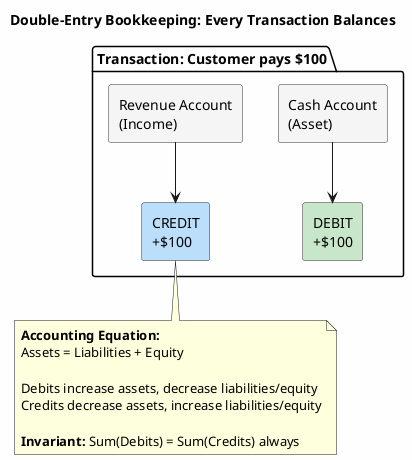
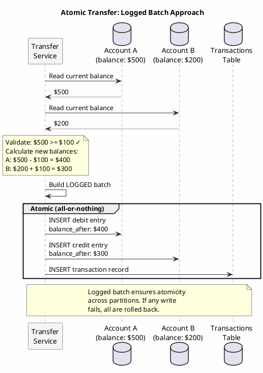
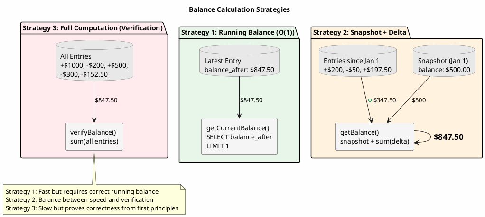
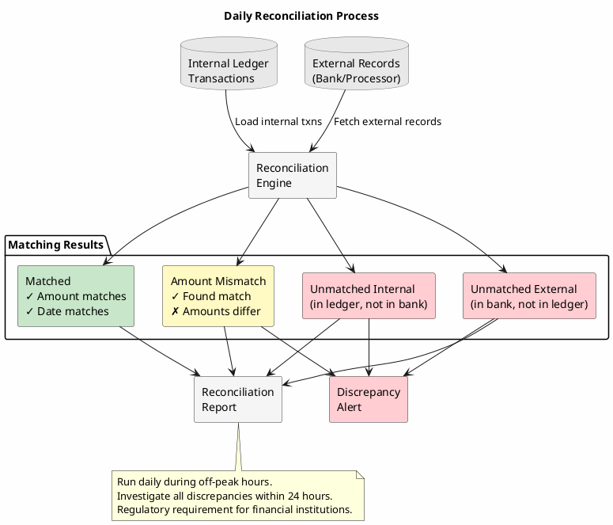

# Ledger Pattern

Financial systems require a fundamentally different approach to data management than typical applications. Every monetary movement must be traceable, balances must be provably correct, and the historical record must be immutable. The ledger pattern provides these guarantees through careful schema design and operational discipline.

---

## The Nature of Financial Data

Financial data differs from general application data in ways that influence every design decision:

**Immutability as requirement, not preference**: In most applications, immutability is an architectural choice offering operational benefits. In financial systems, it is a regulatory and legal requirement. A transaction record, once written, cannot be modified; it can only be corrected through additional entries.

**Provable correctness**: A user's account balance is not merely a number stored in a database; it is a claim that must be verifiable by summing all transactions affecting that account. The balance and the transaction history must agree, always.

**Audit trail as first-class citizen**: Regulators, auditors, and fraud investigators require the ability to reconstruct the complete history of any account or transaction. This is not a nice-to-have feature bolted on afterward; it is the core function of the system.

**Temporal significance**: When a transaction occurred matters as much as what occurred. A payment received at 11:59 PM on December 31st has different implications than one received at 12:01 AM on January 1st.

---

## Double-Entry Bookkeeping

Double-entry bookkeeping, developed in 15th century Italy, remains the foundation of financial record-keeping. Every transaction affects at least two accounts: one debited, one credited. The sum of all debits must equal the sum of all credits, always.



```
Transaction: Customer pays $100 for product

Account          | Debit  | Credit
-----------------|--------|--------
Cash             | $100   |
Revenue          |        | $100
-----------------|--------|--------
Total            | $100   | $100    ← Must balance
```

This constraint provides a built-in error detection mechanism. If debits and credits don't balance, something is wrong. The error is detectable even without knowing what the correct values should be.

### Why Double-Entry Matters for Databases

Double-entry bookkeeping translates to database design as follows:

1. **Every transaction creates multiple entries**: A single business event (payment, transfer, fee) produces multiple ledger entries that must be written atomically.

2. **Balance is derived, not stored independently**: An account balance is the sum of all entries for that account. Storing balance separately creates the risk of divergence.

3. **Integrity constraints are mathematical**: The system can verify its own correctness by checking that debits equal credits across any subset of entries.

---

## Ledger Schema Design

### Core Ledger Table

```sql
CREATE TABLE ledger_entries (
    account_id UUID,
    entry_id TIMEUUID,
    transaction_id UUID,
    entry_type TEXT,           -- 'DEBIT' or 'CREDIT'
    amount DECIMAL,
    currency TEXT,
    balance_after DECIMAL,     -- Running balance (denormalized)
    counterparty_account UUID,
    description TEXT,
    metadata MAP<TEXT, TEXT>,
    created_at TIMESTAMP,
    created_by TEXT,
    PRIMARY KEY ((account_id), entry_id)
) WITH CLUSTERING ORDER BY (entry_id DESC);
```

**Design rationale**:

- **Partition by account**: All entries for an account are co-located, enabling efficient balance calculation and statement generation.
- **Clustering by entry_id (TIMEUUID)**: Entries are ordered chronologically, most recent first for typical query patterns.
- **balance_after denormalization**: Storing running balance enables O(1) balance lookups without summing all entries. This introduces complexity but is essential for performance.
- **transaction_id**: Links entries that belong to the same business transaction (for double-entry pairing).

### Transaction Table

```sql
CREATE TABLE transactions (
    transaction_id UUID,
    transaction_type TEXT,
    status TEXT,
    total_amount DECIMAL,
    currency TEXT,
    entries LIST<FROZEN<ledger_entry_ref>>,
    created_at TIMESTAMP,
    completed_at TIMESTAMP,
    metadata MAP<TEXT, TEXT>,
    PRIMARY KEY (transaction_id)
);

CREATE TYPE ledger_entry_ref (
    account_id UUID,
    entry_id TIMEUUID,
    entry_type TEXT,
    amount DECIMAL
);
```

This table provides a transaction-centric view, answering "what entries comprise this transaction?" while the ledger_entries table answers "what transactions affected this account?"

### Balance Snapshots

For accounts with high transaction volumes, calculating balance from all entries becomes expensive. Periodic snapshots provide checkpoints:

```sql
CREATE TABLE balance_snapshots (
    account_id UUID,
    snapshot_date DATE,
    balance DECIMAL,
    currency TEXT,
    last_entry_id TIMEUUID,
    entry_count BIGINT,
    created_at TIMESTAMP,
    PRIMARY KEY ((account_id), snapshot_date)
) WITH CLUSTERING ORDER BY (snapshot_date DESC);
```

Balance calculation then becomes: snapshot balance + sum of entries after snapshot.

---

## Transaction Processing

### Atomic Multi-Entry Writes

A financial transaction must write all its entries atomically. In Cassandra, this requires careful handling since entries span multiple partitions (accounts).



**Approach 1: Logged Batch (Small Transactions)**

For transactions with few entries (2-4 accounts), logged batches provide atomicity:

```java
public void executeTransfer(UUID fromAccount, UUID toAccount,
                           BigDecimal amount, String currency) {
    UUID transactionId = UUID.randomUUID();
    UUID debitEntryId = Uuids.timeBased();
    UUID creditEntryId = Uuids.timeBased();
    Instant now = Instant.now();

    // Calculate new balances (requires current balance lookup)
    BigDecimal fromBalance = getCurrentBalance(fromAccount);
    BigDecimal toBalance = getCurrentBalance(toAccount);

    if (fromBalance.compareTo(amount) < 0) {
        throw new InsufficientFundsException(fromAccount, amount, fromBalance);
    }

    BigDecimal newFromBalance = fromBalance.subtract(amount);
    BigDecimal newToBalance = toBalance.add(amount);

    BatchStatement batch = BatchStatement.builder(BatchType.LOGGED)
        // Debit entry (from account)
        .addStatement(insertLedgerEntry.bind(
            fromAccount, debitEntryId, transactionId,
            "DEBIT", amount.negate(), currency, newFromBalance,
            toAccount, "Transfer out", null, now, "system"
        ))
        // Credit entry (to account)
        .addStatement(insertLedgerEntry.bind(
            toAccount, creditEntryId, transactionId,
            "CREDIT", amount, currency, newToBalance,
            fromAccount, "Transfer in", null, now, "system"
        ))
        // Transaction record
        .addStatement(insertTransaction.bind(
            transactionId, "TRANSFER", "COMPLETED", amount, currency,
            List.of(
                new LedgerEntryRef(fromAccount, debitEntryId, "DEBIT", amount.negate()),
                new LedgerEntryRef(toAccount, creditEntryId, "CREDIT", amount)
            ),
            now, now, null
        ))
        .build();

    session.execute(batch);
}
```

**Approach 2: Saga Pattern (Complex Transactions)**

For transactions involving many accounts or external systems, use the saga pattern with compensation:

```java
public class TransferSaga {

    public void execute(TransferRequest request) {
        UUID sagaId = UUID.randomUUID();

        try {
            // Step 1: Reserve funds (debit with PENDING status)
            LedgerEntry debit = reserveFunds(request.getFromAccount(),
                                             request.getAmount(), sagaId);

            // Step 2: Credit destination
            LedgerEntry credit = creditFunds(request.getToAccount(),
                                             request.getAmount(), sagaId);

            // Step 3: Confirm reservation
            confirmReservation(debit);

            // Step 4: Mark saga complete
            completeSaga(sagaId);

        } catch (Exception e) {
            // Compensate: reverse any completed steps
            compensate(sagaId);
            throw new TransferFailedException(request, e);
        }
    }

    private void compensate(UUID sagaId) {
        List<LedgerEntry> entries = findEntriesBySaga(sagaId);
        for (LedgerEntry entry : entries) {
            if (entry.getStatus().equals("PENDING")) {
                cancelEntry(entry);
            } else if (entry.getStatus().equals("COMPLETED")) {
                createReversalEntry(entry);
            }
        }
    }
}
```

See [Saga Pattern](saga.md) for comprehensive coverage.

---

## Balance Calculation



### Real-Time Balance

For real-time balance queries, use the denormalized `balance_after` field:

```java
public BigDecimal getCurrentBalance(UUID accountId) {
    // Most recent entry contains current balance
    Row row = session.execute(
        "SELECT balance_after FROM ledger_entries " +
        "WHERE account_id = ? LIMIT 1",
        accountId
    ).one();

    return row != null ? row.getDecimal("balance_after") : BigDecimal.ZERO;
}
```

### Balance at Point in Time

Historical balance queries require finding the entry at or before the requested time:

```java
public BigDecimal getBalanceAtTime(UUID accountId, Instant asOf) {
    // Find the most recent entry at or before the specified time
    Row row = session.execute(
        "SELECT balance_after FROM ledger_entries " +
        "WHERE account_id = ? AND entry_id <= maxTimeuuid(?) " +
        "LIMIT 1",
        accountId, asOf
    ).one();

    return row != null ? row.getDecimal("balance_after") : BigDecimal.ZERO;
}
```

### Balance Verification

Periodically verify that running balances match computed balances:

```java
public BalanceVerificationResult verifyBalance(UUID accountId) {
    // Get stored balance
    BigDecimal storedBalance = getCurrentBalance(accountId);

    // Compute balance from entries
    BigDecimal computedBalance = session.execute(
        "SELECT amount FROM ledger_entries WHERE account_id = ?",
        accountId
    ).all().stream()
        .map(row -> row.getDecimal("amount"))
        .reduce(BigDecimal.ZERO, BigDecimal::add);

    boolean matches = storedBalance.compareTo(computedBalance) == 0;

    return new BalanceVerificationResult(
        accountId, storedBalance, computedBalance, matches
    );
}
```

Run verification during off-peak hours and alert on discrepancies.

---

## Corrections and Adjustments

Financial records cannot be modified, but errors occur. Corrections are made through additional entries, not modifications.

### Reversal Pattern

To reverse an erroneous transaction, create a new transaction with opposite entries:

```java
public void reverseTransaction(UUID originalTransactionId, String reason) {
    Transaction original = getTransaction(originalTransactionId);

    if (original.getStatus().equals("REVERSED")) {
        throw new AlreadyReversedException(originalTransactionId);
    }

    UUID reversalId = UUID.randomUUID();
    List<BoundStatement> statements = new ArrayList<>();

    // Create reversal entries (opposite amounts)
    for (LedgerEntryRef ref : original.getEntries()) {
        BigDecimal currentBalance = getCurrentBalance(ref.getAccountId());
        BigDecimal reversalAmount = ref.getAmount().negate();
        BigDecimal newBalance = currentBalance.add(reversalAmount);

        statements.add(insertLedgerEntry.bind(
            ref.getAccountId(), Uuids.timeBased(), reversalId,
            reverseEntryType(ref.getEntryType()), reversalAmount,
            original.getCurrency(), newBalance,
            null, "Reversal: " + reason,
            Map.of("original_transaction", originalTransactionId.toString()),
            Instant.now(), "system"
        ));
    }

    // Mark original as reversed
    statements.add(updateTransactionStatus.bind("REVERSED", originalTransactionId));

    // Create reversal transaction record
    statements.add(insertTransaction.bind(
        reversalId, "REVERSAL", "COMPLETED", original.getTotalAmount(),
        original.getCurrency(), /* reversal entries */, Instant.now(), Instant.now(),
        Map.of("original_transaction", originalTransactionId.toString(), "reason", reason)
    ));

    BatchStatement batch = BatchStatement.builder(BatchType.LOGGED)
        .addStatements(statements)
        .build();

    session.execute(batch);
}
```

### Adjustment Pattern

For corrections that don't fully reverse a transaction (e.g., partial refund):

```java
public void createAdjustment(UUID accountId, BigDecimal amount,
                             String adjustmentType, String reason,
                             UUID relatedTransactionId) {
    UUID adjustmentId = UUID.randomUUID();
    BigDecimal currentBalance = getCurrentBalance(accountId);
    BigDecimal newBalance = currentBalance.add(amount);

    session.execute(insertLedgerEntry.bind(
        accountId, Uuids.timeBased(), adjustmentId,
        amount.compareTo(BigDecimal.ZERO) > 0 ? "CREDIT" : "DEBIT",
        amount, "USD", newBalance,
        null, reason,
        Map.of(
            "adjustment_type", adjustmentType,
            "related_transaction", relatedTransactionId.toString(),
            "authorized_by", getCurrentUser()
        ),
        Instant.now(), getCurrentUser()
    ));
}
```

All adjustments must include audit metadata: who authorized it, why, and what it relates to.

---

## Reconciliation

Reconciliation verifies that the ledger agrees with external sources of truth: bank statements, payment processor reports, counterparty records.



### Daily Reconciliation Process

```java
public class DailyReconciliation {

    public ReconciliationReport reconcile(LocalDate date) {
        ReconciliationReport report = new ReconciliationReport(date);

        // Get internal transactions for the date
        List<Transaction> internalTransactions = getTransactionsForDate(date);

        // Get external records (bank feed, processor report)
        List<ExternalRecord> externalRecords = fetchExternalRecords(date);

        // Match transactions
        for (Transaction internal : internalTransactions) {
            Optional<ExternalRecord> match = findMatch(internal, externalRecords);

            if (match.isPresent()) {
                if (amountsMatch(internal, match.get())) {
                    report.addMatched(internal, match.get());
                } else {
                    report.addAmountMismatch(internal, match.get());
                }
                externalRecords.remove(match.get());
            } else {
                report.addUnmatchedInternal(internal);
            }
        }

        // Remaining external records have no internal match
        for (ExternalRecord external : externalRecords) {
            report.addUnmatchedExternal(external);
        }

        // Persist reconciliation results
        saveReconciliationReport(report);

        // Alert on discrepancies
        if (report.hasDiscrepancies()) {
            alertReconciliationTeam(report);
        }

        return report;
    }
}
```

### Reconciliation Table

```sql
CREATE TABLE reconciliation_results (
    reconciliation_date DATE,
    reconciliation_id UUID,
    status TEXT,
    matched_count INT,
    unmatched_internal_count INT,
    unmatched_external_count INT,
    amount_mismatch_count INT,
    total_discrepancy DECIMAL,
    details BLOB,
    created_at TIMESTAMP,
    PRIMARY KEY ((reconciliation_date), reconciliation_id)
);
```

---

## Regulatory Compliance

### Retention Requirements

Financial records have mandatory retention periods. Configure TTL carefully, or not at all:

```sql
-- DO NOT set TTL on ledger entries in production
-- Retention is typically 7+ years for financial records

CREATE TABLE ledger_entries (
    ...
) WITH default_time_to_live = 0;  -- No automatic expiration
```

Implement retention through explicit archival processes that verify regulatory compliance before deletion.

### Audit Access

Provide read-only access for auditors without exposing operational systems:

```java
public class AuditQueryService {

    private final CqlSession readOnlySession;  // Separate connection pool

    public List<LedgerEntry> getEntriesForAudit(UUID accountId,
                                                 LocalDate startDate,
                                                 LocalDate endDate) {
        // Log audit access
        auditLog.log("AUDIT_QUERY", getCurrentAuditor(), accountId, startDate, endDate);

        return readOnlySession.execute(
            "SELECT * FROM ledger_entries " +
            "WHERE account_id = ? " +
            "AND entry_id >= minTimeuuid(?) " +
            "AND entry_id <= maxTimeuuid(?)",
            accountId,
            startDate.atStartOfDay().toInstant(ZoneOffset.UTC),
            endDate.plusDays(1).atStartOfDay().toInstant(ZoneOffset.UTC)
        ).all().stream()
            .map(this::mapToLedgerEntry)
            .collect(Collectors.toList());
    }
}
```

### Regulatory Reporting

Many jurisdictions require periodic reports. Pre-compute aggregates to avoid scanning the entire ledger:

```sql
CREATE TABLE daily_account_summary (
    account_id UUID,
    summary_date DATE,
    opening_balance DECIMAL,
    closing_balance DECIMAL,
    total_debits DECIMAL,
    total_credits DECIMAL,
    transaction_count INT,
    currency TEXT,
    PRIMARY KEY ((account_id), summary_date)
) WITH CLUSTERING ORDER BY (summary_date DESC);
```

---

## Performance Considerations

### Hot Accounts

Some accounts (company operating accounts, escrow accounts) see vastly more activity than others. Strategies include:

**Sharded accounts**: Split a single logical account into multiple physical partitions:

```sql
CREATE TABLE ledger_entries_sharded (
    account_id UUID,
    shard INT,           -- 0-15 for 16 shards
    entry_id TIMEUUID,
    ...
    PRIMARY KEY ((account_id, shard), entry_id)
);
```

Write to random shards; aggregate across shards for balance.

**Separate hot path**: Route high-volume accounts to dedicated tables or clusters.

### Balance Calculation Caching

For frequently-queried accounts, cache balances in memory:

```java
@Cacheable(value = "balances", key = "#accountId")
public BigDecimal getCurrentBalance(UUID accountId) {
    return queryBalance(accountId);
}

@CacheEvict(value = "balances", key = "#entry.accountId")
public void recordEntry(LedgerEntry entry) {
    writeEntry(entry);
}
```

---

## When to Use the Ledger Pattern

### Appropriate Use Cases

- **Financial services**: Banks, payment processors, investment platforms
- **E-commerce**: Order accounting, refunds, store credits
- **Marketplaces**: Seller payouts, buyer credits, platform fees
- **Gaming**: Virtual currency, in-app purchases
- **Loyalty programs**: Points accrual and redemption

### Consider Alternatives When

- **No audit requirements**: If you don't need provable correctness, simpler balance-tracking may suffice
- **Single-entry sufficient**: Some use cases don't require double-entry (simple counters, non-financial tracking)
- **Extreme write volume**: If writes exceed what Cassandra can handle with the required consistency, consider specialized ledger databases

---

## Summary

The ledger pattern brings centuries-old accounting principles to distributed database design:

1. **Immutable entries** form the source of truth (never modified, only appended)
2. **Double-entry bookkeeping** ensures mathematical consistency
3. **Running balances** enable efficient queries while maintaining verifiability
4. **Corrections through reversals** preserve the complete historical record
5. **Reconciliation** verifies internal records against external sources
6. **Regulatory compliance** requires careful retention and audit access design

Cassandra's append-only write model aligns naturally with ledger requirements. The challenge is maintaining balance consistency across partitions, addressed through logged batches for simple cases and sagas for complex multi-account transactions.

---

## Related Documentation

- [Event Sourcing](event-sourcing.md) - Events as source of truth
- [Saga Pattern](saga.md) - Coordinating distributed transactions
- [Idempotency Patterns](idempotency.md) - Safe retry for financial operations
- [Audit & Compliance](audit-compliance.md) - Regulatory patterns
