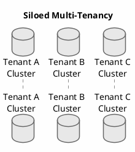
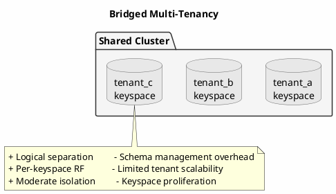
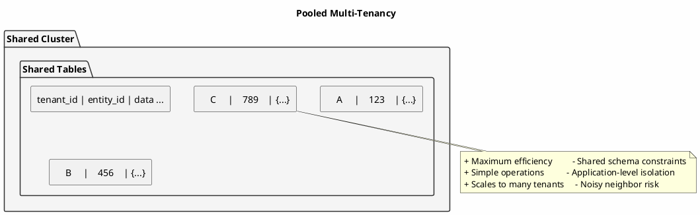
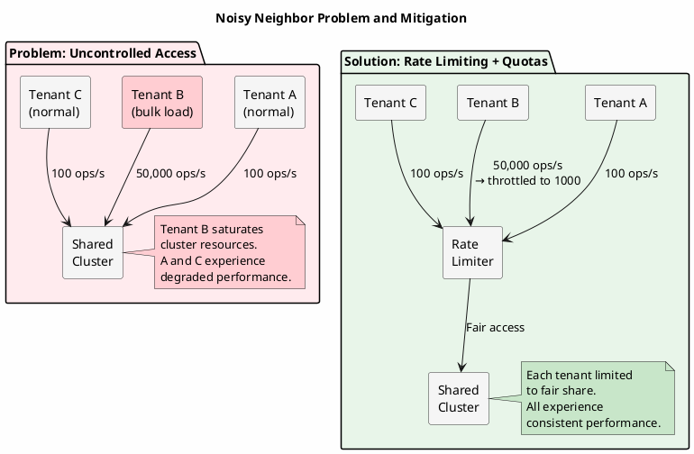

# Multi-Tenant Data Isolation

Multi-tenant architectures serve multiple customers (tenants) from shared infrastructure. This efficiency comes with challenges: ensuring data isolation, preventing one tenant from impacting others, and maintaining performance guarantees. Cassandra provides the primitives for multi-tenant systems, but correct architecture requires careful design.

---

## Multi-Tenancy Models

Three fundamental approaches exist for multi-tenant data storage:

### Siloed (Database per Tenant)

Each tenant has a dedicated Cassandra cluster.



**When appropriate**: Regulated industries requiring strict isolation, enterprise customers with custom SLAs, tenants with vastly different workloads.

### Bridged (Keyspace per Tenant)

Tenants share a cluster but have dedicated keyspaces.



**When appropriate**: Moderate tenant count (hundreds), per-tenant configuration needs, regulatory requirements met by logical separation.

### Pooled (Shared Tables)

All tenants share tables, isolated by partition key.



**When appropriate**: Large tenant count (thousands+), uniform workloads, cost optimization priority.

---

## Pooled Multi-Tenancy Implementation

The pooled model is most common for SaaS applications and requires the most architectural attention.

### Schema Design

Include tenant_id in every table's partition key:

```sql
-- Orders table with tenant isolation
CREATE TABLE orders (
    tenant_id UUID,
    order_id UUID,
    customer_id UUID,
    status TEXT,
    total DECIMAL,
    created_at TIMESTAMP,
    items LIST<FROZEN<order_item>>,
    PRIMARY KEY ((tenant_id, order_id))
);

-- Orders by customer (within tenant)
CREATE TABLE orders_by_customer (
    tenant_id UUID,
    customer_id UUID,
    order_id UUID,
    status TEXT,
    total DECIMAL,
    created_at TIMESTAMP,
    PRIMARY KEY ((tenant_id, customer_id), created_at, order_id)
) WITH CLUSTERING ORDER BY (created_at DESC);

-- Tenant-wide aggregates
CREATE TABLE tenant_statistics (
    tenant_id UUID,
    stat_date DATE,
    stat_name TEXT,
    stat_value COUNTER,
    PRIMARY KEY ((tenant_id, stat_date), stat_name)
);
```

### Tenant Context Management

Ensure tenant_id is always included in queries:

```java
public class TenantContext {

    private static final ThreadLocal<UUID> currentTenant = new ThreadLocal<>();

    public static void setTenant(UUID tenantId) {
        currentTenant.set(tenantId);
    }

    public static UUID getTenant() {
        UUID tenant = currentTenant.get();
        if (tenant == null) {
            throw new NoTenantContextException("Tenant context not set");
        }
        return tenant;
    }

    public static void clear() {
        currentTenant.remove();
    }
}

// Middleware to set tenant context
@Component
public class TenantContextFilter implements Filter {

    @Override
    public void doFilter(ServletRequest request, ServletResponse response,
                         FilterChain chain) throws IOException, ServletException {
        HttpServletRequest httpRequest = (HttpServletRequest) request;

        // Extract tenant from header, JWT, or subdomain
        UUID tenantId = extractTenantId(httpRequest);

        try {
            TenantContext.setTenant(tenantId);
            chain.doFilter(request, response);
        } finally {
            TenantContext.clear();
        }
    }
}
```

### Tenant-Aware Repository

```java
public class TenantAwareOrderRepository {

    private final CqlSession session;
    private final PreparedStatement findById;
    private final PreparedStatement findByCustomer;

    public Order findById(UUID orderId) {
        UUID tenantId = TenantContext.getTenant();

        Row row = session.execute(findById.bind(tenantId, orderId)).one();
        return row != null ? mapToOrder(row) : null;
    }

    public List<Order> findByCustomer(UUID customerId, int limit) {
        UUID tenantId = TenantContext.getTenant();

        return session.execute(findByCustomer.bind(tenantId, customerId, limit))
            .all()
            .stream()
            .map(this::mapToOrder)
            .collect(Collectors.toList());
    }

    // NEVER expose methods without tenant isolation
    // public List<Order> findAll() { ... }  // DANGEROUS - cross-tenant access
}
```

---

## Noisy Neighbor Mitigation

A "noisy neighbor" is a tenant whose workload impacts other tenants. In shared infrastructure, this is the primary risk.



### Problem Manifestation

| Symptom | Cause |
|---------|-------|
| Increased latency for all tenants | One tenant's large queries consuming resources |
| Compaction backlog | One tenant's write volume creating SSTable pressure |
| Memory pressure | One tenant's large partitions consuming heap |
| Disk I/O saturation | One tenant's bulk operations |

### Detection

Monitor per-tenant metrics:

```java
@Component
public class TenantMetricsCollector {

    private final MeterRegistry registry;

    public void recordOperation(String operation, UUID tenantId,
                               long durationMs, boolean success) {
        registry.timer("cassandra.operations",
            "operation", operation,
            "tenant", tenantId.toString(),
            "outcome", success ? "success" : "failure"
        ).record(durationMs, TimeUnit.MILLISECONDS);
    }

    public void recordDataSize(UUID tenantId, long bytes) {
        registry.gauge("tenant.data.size",
            Tags.of("tenant", tenantId.toString()),
            bytes);
    }
}
```

Alert on tenants exceeding thresholds:

```java
@Scheduled(fixedDelay = 60000)
public void detectNoisyNeighbors() {
    Map<UUID, TenantMetrics> metrics = metricsCollector.getTenantMetrics();

    double avgOpsPerSecond = metrics.values().stream()
        .mapToDouble(TenantMetrics::getOpsPerSecond)
        .average()
        .orElse(0);

    for (Map.Entry<UUID, TenantMetrics> entry : metrics.entrySet()) {
        TenantMetrics m = entry.getValue();

        // Tenant using > 10x average resources
        if (m.getOpsPerSecond() > avgOpsPerSecond * 10) {
            alertNoisyNeighbor(entry.getKey(), "operations", m.getOpsPerSecond());
        }

        // Tenant with very large partitions
        if (m.getMaxPartitionSize() > PARTITION_SIZE_THRESHOLD) {
            alertNoisyNeighbor(entry.getKey(), "partition_size",
                              m.getMaxPartitionSize());
        }
    }
}
```

### Mitigation Strategies

**Rate Limiting per Tenant**:

```java
public class TenantRateLimiter {

    private final LoadingCache<UUID, RateLimiter> limiters;

    public TenantRateLimiter(TenantQuotaService quotaService) {
        this.limiters = CacheBuilder.newBuilder()
            .expireAfterAccess(Duration.ofMinutes(10))
            .build(new CacheLoader<>() {
                @Override
                public RateLimiter load(UUID tenantId) {
                    TenantQuota quota = quotaService.getQuota(tenantId);
                    return RateLimiter.create(quota.getMaxOpsPerSecond());
                }
            });
    }

    public void acquire(UUID tenantId) throws RateLimitExceededException {
        if (!limiters.get(tenantId).tryAcquire()) {
            throw new RateLimitExceededException(tenantId);
        }
    }
}
```

**Query Timeout Enforcement**:

```java
public class TenantQueryExecutor {

    public ResultSet execute(UUID tenantId, Statement<?> statement) {
        TenantQuota quota = quotaService.getQuota(tenantId);

        // Apply tenant-specific timeout
        Statement<?> boundStatement = statement
            .setTimeout(Duration.ofMillis(quota.getMaxQueryTimeoutMs()));

        return session.execute(boundStatement);
    }
}
```

**Partition Size Guards**:

```java
@Aspect
public class PartitionSizeGuard {

    @Before("execution(* *.save(..)) && args(entity)")
    public void checkPartitionSize(Object entity) {
        PartitionKey key = extractPartitionKey(entity);
        long currentSize = estimatePartitionSize(key);

        if (currentSize > MAX_PARTITION_SIZE) {
            UUID tenantId = TenantContext.getTenant();
            throw new PartitionSizeLimitException(tenantId, key, currentSize);
        }
    }
}
```

---

## Resource Quotas

Define and enforce per-tenant resource limits:

### Quota Schema

```sql
CREATE TABLE tenant_quotas (
    tenant_id UUID,
    quota_type TEXT,
    limit_value BIGINT,
    current_usage BIGINT,
    reset_at TIMESTAMP,
    updated_at TIMESTAMP,
    PRIMARY KEY (tenant_id, quota_type)
);

CREATE TABLE tenant_tiers (
    tier_name TEXT,
    max_storage_gb BIGINT,
    max_ops_per_second INT,
    max_query_timeout_ms INT,
    max_partition_size_mb INT,
    max_concurrent_queries INT,
    features SET<TEXT>,
    PRIMARY KEY (tier_name)
);
```

### Quota Enforcement

```java
public class QuotaEnforcementService {

    public void enforceQuotas(UUID tenantId, OperationType operation) {
        TenantQuota quota = quotaRepository.getQuota(tenantId);

        // Check storage quota
        if (operation.isWrite()) {
            long currentStorage = getStorageUsage(tenantId);
            if (currentStorage >= quota.getMaxStorageBytes()) {
                throw new StorageQuotaExceededException(tenantId);
            }
        }

        // Check operation rate
        if (!rateLimiter.tryAcquire(tenantId)) {
            throw new RateLimitExceededException(tenantId);
        }

        // Check concurrent query limit
        if (!concurrencyLimiter.tryAcquire(tenantId)) {
            throw new ConcurrencyLimitExceededException(tenantId);
        }
    }

    public void updateUsage(UUID tenantId, long bytesWritten) {
        // Update usage counters (consider eventual consistency)
        quotaRepository.incrementUsage(tenantId, "storage", bytesWritten);
    }
}
```

### Tiered Service Levels

```java
public class TenantTierService {

    public TenantCapabilities getCapabilities(UUID tenantId) {
        Tenant tenant = tenantRepository.findById(tenantId);
        TenantTier tier = tierRepository.findByName(tenant.getTierName());

        return TenantCapabilities.builder()
            .maxStorageBytes(tier.getMaxStorageGb() * 1024 * 1024 * 1024L)
            .maxOpsPerSecond(tier.getMaxOpsPerSecond())
            .maxQueryTimeoutMs(tier.getMaxQueryTimeoutMs())
            .maxPartitionSizeMb(tier.getMaxPartitionSizeMb())
            .maxConcurrentQueries(tier.getMaxConcurrentQueries())
            .features(tier.getFeatures())
            .build();
    }
}
```

---

## Cross-Tenant Operations

Some operations legitimately span tenants (platform analytics, billing):

### Privileged Access Pattern

```java
public class PlatformAdminService {

    private static final UUID PLATFORM_TENANT = UUID.fromString("00000000-...");

    public List<TenantSummary> getAllTenantSummaries() {
        // Verify caller has platform admin role
        if (!securityContext.hasRole("PLATFORM_ADMIN")) {
            throw new AccessDeniedException("Platform admin required");
        }

        // Execute with platform context (no tenant filter)
        return executeAsPlatform(() -> {
            // This query intentionally spans all tenants
            return session.execute("SELECT tenant_id, ... FROM tenant_statistics")
                .all()
                .stream()
                .map(this::mapToSummary)
                .collect(Collectors.toList());
        });
    }

    private <T> T executeAsPlatform(Supplier<T> operation) {
        UUID originalTenant = TenantContext.getTenant();
        try {
            TenantContext.setTenant(PLATFORM_TENANT);
            auditService.logPlatformAccess(originalTenant, "cross_tenant_query");
            return operation.get();
        } finally {
            TenantContext.setTenant(originalTenant);
        }
    }
}
```

### Tenant Data Export

```java
public class TenantDataExporter {

    public DataExport exportTenantData(UUID tenantId) {
        // Verify authorization
        if (!canExportTenantData(tenantId)) {
            throw new AccessDeniedException("Cannot export tenant data");
        }

        DataExport export = new DataExport(tenantId);

        // Export each table
        for (String table : EXPORTABLE_TABLES) {
            ResultSet results = session.execute(
                SimpleStatement.builder("SELECT * FROM " + table +
                                        " WHERE tenant_id = ?")
                    .addPositionalValue(tenantId)
                    .build()
            );

            export.addTableData(table, results.all());
        }

        // Audit the export
        auditService.logEvent(AuditEvent.builder()
            .eventType("TENANT_DATA_EXPORT")
            .resourceType("TENANT")
            .resourceId(tenantId.toString())
            .action("EXPORT")
            .build());

        return export;
    }
}
```

---

## Tenant Onboarding and Offboarding

### Onboarding

```java
public class TenantOnboardingService {

    @Transactional
    public Tenant onboardTenant(TenantRequest request) {
        // Create tenant record
        Tenant tenant = new Tenant();
        tenant.setId(UUID.randomUUID());
        tenant.setName(request.getName());
        tenant.setTier(request.getTier());
        tenant.setCreatedAt(Instant.now());
        tenant.setStatus(TenantStatus.ACTIVE);

        tenantRepository.save(tenant);

        // Initialize quotas based on tier
        initializeQuotas(tenant);

        // Create tenant-specific resources if needed
        if (useBridgedModel(tenant)) {
            createTenantKeyspace(tenant);
        }

        // Audit
        auditService.logEvent(AuditEvent.builder()
            .eventType("TENANT_ONBOARDED")
            .resourceType("TENANT")
            .resourceId(tenant.getId().toString())
            .build());

        return tenant;
    }
}
```

### Offboarding

```java
public class TenantOffboardingService {

    public void offboardTenant(UUID tenantId, OffboardingRequest request) {
        Tenant tenant = tenantRepository.findById(tenantId);

        // Export data if requested
        if (request.isExportData()) {
            DataExport export = exportService.exportTenantData(tenantId);
            storageService.storeExport(export, request.getExportDestination());
        }

        // Mark tenant as inactive (soft delete)
        tenant.setStatus(TenantStatus.INACTIVE);
        tenant.setDeactivatedAt(Instant.now());
        tenantRepository.save(tenant);

        // Schedule data deletion after retention period
        deletionScheduler.scheduleDeleted(tenantId,
            Instant.now().plus(Duration.ofDays(request.getRetentionDays())));

        // Audit
        auditService.logEvent(AuditEvent.builder()
            .eventType("TENANT_OFFBOARDED")
            .resourceType("TENANT")
            .resourceId(tenantId.toString())
            .metadata(Map.of(
                "retention_days", String.valueOf(request.getRetentionDays()),
                "data_exported", String.valueOf(request.isExportData())
            ))
            .build());
    }

    @Scheduled(cron = "0 0 3 * * *")  // Daily at 3 AM
    public void executeScheduledDeletions() {
        List<TenantDeletion> due = deletionScheduler.getDueDeletions();

        for (TenantDeletion deletion : due) {
            try {
                hardDeleteTenantData(deletion.getTenantId());
                deletionScheduler.markComplete(deletion);
            } catch (Exception e) {
                log.error("Failed to delete tenant {}", deletion.getTenantId(), e);
                alertOperations(deletion, e);
            }
        }
    }
}
```

---

## Monitoring Multi-Tenant Systems

### Key Metrics

| Metric | Description | Segmentation |
|--------|-------------|--------------|
| `tenant.operations` | Operations per second | Per tenant |
| `tenant.latency_p99` | 99th percentile latency | Per tenant |
| `tenant.storage_bytes` | Storage used | Per tenant |
| `tenant.quota_usage` | Quota utilization % | Per tenant, per quota type |
| `tenant.rate_limit_hits` | Rate limit triggers | Per tenant |
| `platform.tenants_active` | Active tenant count | Global |

### Per-Tenant Dashboard

```java
public class TenantDashboardService {

    public TenantDashboard getDashboard(UUID tenantId) {
        return TenantDashboard.builder()
            .tenantId(tenantId)
            .storageUsed(getStorageUsed(tenantId))
            .storageLimit(getStorageLimit(tenantId))
            .opsPerSecond(getOpsPerSecond(tenantId))
            .opsLimit(getOpsLimit(tenantId))
            .p99Latency(getP99Latency(tenantId))
            .errorRate(getErrorRate(tenantId))
            .topQueries(getTopQueries(tenantId))
            .quotaWarnings(getQuotaWarnings(tenantId))
            .build();
    }
}
```

---

## Summary

Multi-tenant architecture with Cassandra requires:

1. **Tenant ID in partition keys** for data isolation
2. **Tenant context propagation** through request lifecycle
3. **Noisy neighbor detection** via per-tenant metrics
4. **Rate limiting and quotas** to bound resource usage
5. **Tiered service levels** for differentiated offerings
6. **Secure cross-tenant operations** with proper authorization
7. **Clean onboarding/offboarding** with data lifecycle management

The pooled model offers efficiency but demands architectural discipline. Every query, every metric, every operation must be tenant-aware. The investment pays off in operational simplicity and cost efficiency at scale.

---

## Related Documentation

- [Telemetry at Scale](telemetry-at-scale.md) - Multi-tenant IoT patterns
- [Audit & Compliance](audit-compliance.md) - Tenant data access logging
- [CQRS Pattern](cqrs.md) - Per-tenant read models