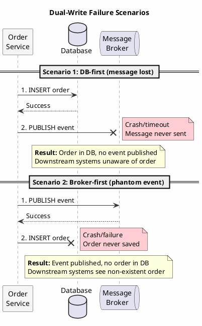
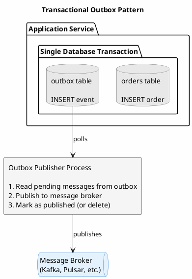
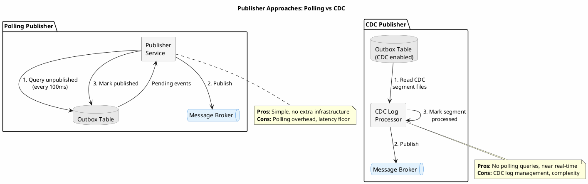

# Transactional Outbox Pattern

The transactional outbox pattern solves a fundamental problem in distributed systems: how to reliably update a database and publish a message without distributed transactions. This problem appears deceptively simple but has subtle failure modes that can corrupt data or lose messages in production systems.

---

## The Dual-Write Problem

Consider an order service that must persist an order to the database and publish an `OrderCreated` event to a message broker:



```java
// The dual-write anti-pattern
public void createOrder(Order order) {
    database.save(order);           // Step 1: Write to database
    messageBroker.publish(event);   // Step 2: Publish message
}
```

This code contains a critical flaw. If the application crashes between steps 1 and 2:

- The order exists in the database
- No event was published
- Downstream systems never learn about the order
- The system is now inconsistent

The naive solution (swapping the order of operations) simply moves the failure window:

```java
public void createOrder(Order order) {
    messageBroker.publish(event);   // Step 1: Publish message
    database.save(order);           // Step 2: Write to database
}
```

Now a crash between steps leaves:

- Event published to downstream systems
- No order in database
- Downstream systems believe an order exists that does not

Neither ordering is safe. The fundamental issue is that two independent systems (database and message broker) cannot be updated atomically without distributed transactions. And distributed transactions (two-phase commit) introduce their own problems: reduced availability, increased latency, and operational complexity.

### The Scope of Failure

The failure window may seem small, but consider:

- Application deployments involve restarts
- Cloud instances can terminate without notice
- Network partitions disconnect services from message brokers
- Message broker unavailability blocks the entire operation

A system processing thousands of operations daily will encounter these failures. Even a 0.01% failure rate means data corruption or message loss occurs regularly.

---

## The Outbox Solution

The transactional outbox pattern eliminates the dual-write by writing both the entity and the message to the database in a single operation. A separate process then reliably transfers messages from the database to the message broker.



The key insight: by making the outbox table part of the same database as the entity, atomicity comes from the database's own transaction guarantees, with no distributed coordination required.

---

## Outbox Implementation in Cassandra

Cassandra lacks multi-table ACID transactions, but provides atomic operations within a single partition. The outbox pattern adapts to this constraint through careful schema design.

### Approach 1: Embedded Outbox (Same Partition)

When the entity and its events share the same partition key, a logged batch provides atomicity:

```sql
-- Orders and their outbox events share partition key
CREATE TABLE orders (
    order_id UUID,
    status TEXT,
    customer_id UUID,
    total DECIMAL,
    created_at TIMESTAMP,
    PRIMARY KEY (order_id)
);

CREATE TABLE order_outbox (
    order_id UUID,
    event_id TIMEUUID,
    event_type TEXT,
    event_payload BLOB,
    created_at TIMESTAMP,
    published BOOLEAN,
    PRIMARY KEY (order_id, event_id)
);
```

```java
public void createOrder(Order order, OrderCreatedEvent event) {
    BatchStatement batch = BatchStatement.builder(BatchType.LOGGED)
        .addStatement(insertOrder.bind(
            order.getId(), order.getStatus(),
            order.getCustomerId(), order.getTotal(), Instant.now()))
        .addStatement(insertOutboxEvent.bind(
            order.getId(), Uuids.timeBased(),
            "OrderCreated", serialize(event), Instant.now(), false))
        .build();

    session.execute(batch);
}
```

The logged batch ensures both writes succeed or neither does. However, this approach limits the outbox to events related to a single order; cross-order events cannot be batched atomically.

### Approach 2: Time-Bucketed Global Outbox

For systems needing a global event stream, a time-bucketed outbox provides efficient polling:

```sql
CREATE TABLE outbox (
    bucket TEXT,                    -- e.g., "2024-01-15-14" (hour)
    event_id TIMEUUID,
    aggregate_type TEXT,
    aggregate_id UUID,
    event_type TEXT,
    event_payload BLOB,
    created_at TIMESTAMP,
    published BOOLEAN,
    PRIMARY KEY ((bucket), event_id)
) WITH default_time_to_live = 86400;  -- 24-hour retention
```

The bucket (typically hourly or by minute depending on volume) bounds partition size and enables efficient range queries for pending messages.

```java
public void publishOrderCreated(Order order, OrderCreatedEvent event) {
    String bucket = formatBucket(Instant.now());

    // Write to order table (separate operation)
    session.execute(insertOrder.bind(order));

    // Write to outbox
    session.execute(insertOutboxEvent.bind(
        bucket, Uuids.timeBased(),
        "Order", order.getId(),
        "OrderCreated", serialize(event), Instant.now(), false
    ));
}
```

!!! warning "Non-Atomic Writes"
    This approach does not provide atomicity between the order table and outbox. If the outbox write fails after the order write succeeds, the event is lost. This may be acceptable when:

    - Events are supplementary (notifications) rather than critical
    - Compensating mechanisms exist (periodic reconciliation)
    - The system tolerates occasional missed events

### Approach 3: Lightweight Transaction Coordination

For critical atomicity without same-partition constraints, lightweight transactions (LWT) coordinate the writes:

```java
public void createOrderWithGuaranteedEvent(Order order, OrderCreatedEvent event) {
    UUID operationId = UUID.randomUUID();

    // Phase 1: Conditional insert to orders with operation marker
    ResultSet orderResult = session.execute(
        insertOrderIfNotExists.bind(order.getId(), order.getStatus(),
            order.getCustomerId(), order.getTotal(), operationId)
            .setSerialConsistencyLevel(ConsistencyLevel.LOCAL_SERIAL)
    );

    if (!orderResult.wasApplied()) {
        throw new ConcurrentModificationException("Order already exists");
    }

    // Phase 2: Write outbox event
    session.execute(insertOutboxEvent.bind(
        formatBucket(Instant.now()), Uuids.timeBased(),
        "Order", order.getId(),
        "OrderCreated", serialize(event), operationId, Instant.now()
    ));
}
```

The operation ID links the order and event. A background reconciliation process can detect orders without corresponding outbox events and create them.

---

## Outbox Publisher Implementation

The publisher process reads pending messages from the outbox and delivers them to the message broker.



### Polling Publisher

The simplest approach polls the outbox periodically:

```java
@Scheduled(fixedDelay = 100)  // Poll every 100ms
public void publishPendingEvents() {
    // Query current and recent buckets
    List<String> buckets = recentBuckets(Duration.ofMinutes(5));

    for (String bucket : buckets) {
        List<OutboxEvent> pending = outboxRepository.findUnpublished(bucket, BATCH_SIZE);

        for (OutboxEvent event : pending) {
            try {
                messageBroker.publish(event.toMessage());
                outboxRepository.markPublished(event);
            } catch (Exception e) {
                log.warn("Failed to publish event {}, will retry", event.getId(), e);
                // Leave unpublished for next poll
            }
        }
    }
}
```

**Polling considerations**:

| Parameter | Trade-off |
|-----------|-----------|
| Poll interval | Shorter = lower latency, higher database load |
| Batch size | Larger = higher throughput, more memory, longer processing |
| Bucket lookback | Longer = catches delayed events, more queries |

### Change Data Capture (CDC) Publisher

Cassandra CDC provides an alternative to polling. The publisher reads from CDC logs rather than querying the outbox table:

```yaml
# cassandra.yaml
cdc_enabled: true
cdc_raw_directory: /var/lib/cassandra/cdc_raw
```

```java
public class CDCOutboxPublisher {

    public void processChanges() {
        // Read CDC segment files
        for (CDCSegment segment : cdcReader.pendingSegments()) {
            for (Mutation mutation : segment.getMutations()) {
                if (isOutboxTable(mutation)) {
                    OutboxEvent event = parseEvent(mutation);
                    messageBroker.publish(event.toMessage());
                }
            }
            segment.markProcessed();
        }
    }
}
```

CDC reduces database load (no polling queries) but adds operational complexity (CDC log management, segment processing).

---

## Exactly-Once Delivery Considerations

The outbox pattern ensures at-least-once delivery: messages are published at least once, possibly more if the publisher crashes after publishing but before marking as published.

### Idempotent Consumers

The standard solution is idempotent consumers that safely handle duplicate messages:

```java
@KafkaListener(topics = "order-events")
public void handleOrderCreated(OrderCreatedEvent event) {
    // Check if already processed
    if (processedEvents.contains(event.getEventId())) {
        log.debug("Duplicate event {}, skipping", event.getEventId());
        return;
    }

    // Process event
    processOrderCreated(event);

    // Record as processed
    processedEvents.add(event.getEventId());
}
```

See [Idempotency Patterns](idempotency.md) for comprehensive coverage.

### Publisher Deduplication

The publisher can also deduplicate by tracking published event IDs:

```java
public void publishWithDeduplication(OutboxEvent event) {
    String publishKey = event.getAggregateType() + ":" + event.getAggregateId()
                        + ":" + event.getEventId();

    // Check if already published (idempotent write to message broker)
    if (!publishedTracker.isPublished(publishKey)) {
        messageBroker.publish(event.toMessage());
        publishedTracker.markPublished(publishKey);
    }

    // Always mark as published in outbox (idempotent)
    outboxRepository.markPublished(event);
}
```

The combination of publisher-side and consumer-side deduplication provides defense in depth.

---

## Ordering Guarantees

Message ordering requirements vary by use case. The outbox pattern offers several ordering models:

### Per-Aggregate Ordering

Events for the same aggregate should typically be ordered. Ensure the publisher processes events in sequence:

```java
public void publishAggregateEvents(String aggregateType, UUID aggregateId) {
    List<OutboxEvent> events = outboxRepository.findByAggregate(
        aggregateType, aggregateId,
        Order.by("event_id").ascending()  // Maintain order
    );

    for (OutboxEvent event : events) {
        // Publish sequentially to preserve order
        messageBroker.publish(event.toMessage());
        outboxRepository.markPublished(event);
    }
}
```

### Global Ordering

Total ordering across all events requires a single publisher thread or coordination. This limits throughput but may be necessary for some use cases.

### Partition-Based Ordering

Message brokers like Kafka provide ordering within partitions. Route events to partitions by aggregate ID:

```java
ProducerRecord<String, byte[]> record = new ProducerRecord<>(
    "order-events",
    event.getAggregateId().toString(),  // Key determines partition
    event.getPayload()
);
producer.send(record);
```

Events for the same aggregate go to the same partition, preserving order within aggregates while allowing parallel processing across aggregates.

---

## Outbox Cleanup

The outbox accumulates messages that must eventually be removed. Strategies include:

### TTL-Based Expiration

Set a TTL sufficient for reliable publishing plus a safety margin:

```sql
CREATE TABLE outbox (
    ...
) WITH default_time_to_live = 86400;  -- 24-hour retention
```

Published messages expire automatically. This requires that the publisher can process the backlog within the TTL window.

### Explicit Deletion

Delete published messages explicitly:

```java
@Scheduled(fixedRate = 3600000)  // Hourly
public void cleanupPublishedEvents() {
    String oldBucket = formatBucket(Instant.now().minus(Duration.ofHours(2)));

    // Delete entire old bucket partition
    session.execute(deleteOldBucket.bind(oldBucket));
}
```

### Mark and Sweep

Mark published, later sweep marked records:

```java
// Publisher marks as published
outboxRepository.markPublished(event);

// Cleanup job deletes old published records
@Scheduled(fixedRate = 3600000)
public void sweepPublished() {
    outboxRepository.deletePublishedOlderThan(Duration.ofHours(1));
}
```

This approach allows querying published events for debugging before deletion.

---

## Monitoring and Operations

### Key Metrics

| Metric | Description | Alert Threshold |
|--------|-------------|-----------------|
| Outbox lag | Time since oldest unpublished event | > 1 minute |
| Publish rate | Events published per second | Below baseline |
| Publish errors | Failed publish attempts | > 0.1% |
| Outbox size | Count of unpublished events | Growing unbounded |

### Health Checks

```java
@Component
public class OutboxHealthIndicator implements HealthIndicator {

    @Override
    public Health health() {
        long unpublishedCount = outboxRepository.countUnpublished();
        Instant oldestUnpublished = outboxRepository.oldestUnpublishedTime();

        Duration lag = oldestUnpublished != null
            ? Duration.between(oldestUnpublished, Instant.now())
            : Duration.ZERO;

        if (lag.compareTo(Duration.ofMinutes(5)) > 0) {
            return Health.down()
                .withDetail("lag", lag)
                .withDetail("unpublished", unpublishedCount)
                .build();
        }

        return Health.up()
            .withDetail("lag", lag)
            .withDetail("unpublished", unpublishedCount)
            .build();
    }
}
```

### Failure Recovery

When the publisher fails or falls behind:

1. **Monitor lag metrics** to detect the issue
2. **Scale publisher instances** if throughput is the bottleneck
3. **Investigate broker issues** if publishing is failing
4. **Extend TTL temporarily** if approaching expiration
5. **Consider catchup mode** that skips marking individual events and processes in bulk

---

## When to Use the Outbox Pattern

### Appropriate Use Cases

**Reliable event publishing**: When downstream systems must eventually receive every event.

**Distributed sagas**: Coordinating multi-step operations across services via events.

**Event-driven integrations**: Publishing domain events to message brokers for integration.

**Audit trails**: Ensuring audit events are never lost even during failures.

### Consider Alternatives When

**Synchronous messaging acceptable**: If blocking on message broker availability is acceptable, direct publishing may suffice with retry logic.

**Change Data Capture available**: CDC can capture database changes directly without an outbox table. See [Sidecar CDC Outbox](sidecar-cdc-outbox.md) for the official Apache solution with built-in deduplication.

**Event sourcing in use**: The event store itself serves as the outbox, so no separate table is needed.

**Messages are optional**: If missing occasional messages is acceptable, simpler approaches may suffice.

---

## Summary

The transactional outbox pattern transforms the dual-write problem from a distributed systems challenge into a single-database operation followed by reliable asynchronous publishing. The key principles:

1. **Write messages to the database** alongside the entity, using database atomicity
2. **Publish asynchronously** via a separate process that reads from the outbox
3. **Handle duplicates** through idempotent consumers and publisher deduplication
4. **Preserve ordering** where required through careful publisher design
5. **Clean up reliably** via TTL, explicit deletion, or mark-and-sweep

Cassandra's constraints (lack of cross-partition transactions) require adapting the pattern through same-partition batching, time-bucketed global outboxes, or LWT coordination. The chosen approach depends on consistency requirements, event volume, and operational complexity tolerance.

---

## Related Documentation

- [Sidecar CDC Outbox](sidecar-cdc-outbox.md) - Official Apache CDC-to-Kafka with built-in deduplication
- [Idempotency Patterns](idempotency.md) - Ensuring operations are safe to retry
- [Event Sourcing](event-sourcing.md) - Events as the source of truth
- [CQRS Pattern](cqrs.md) - Separating read and write models
