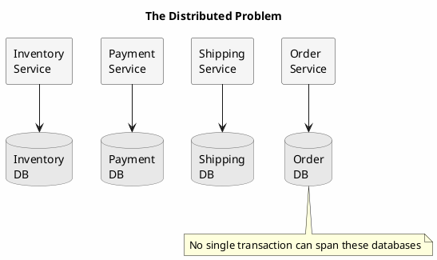
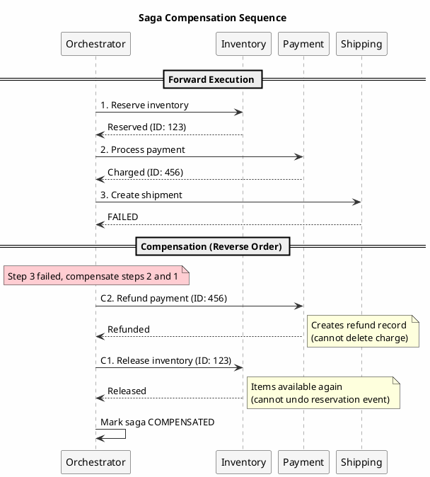
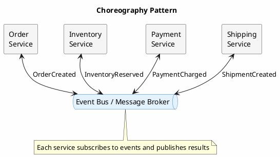
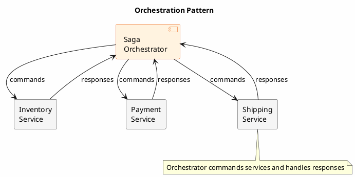
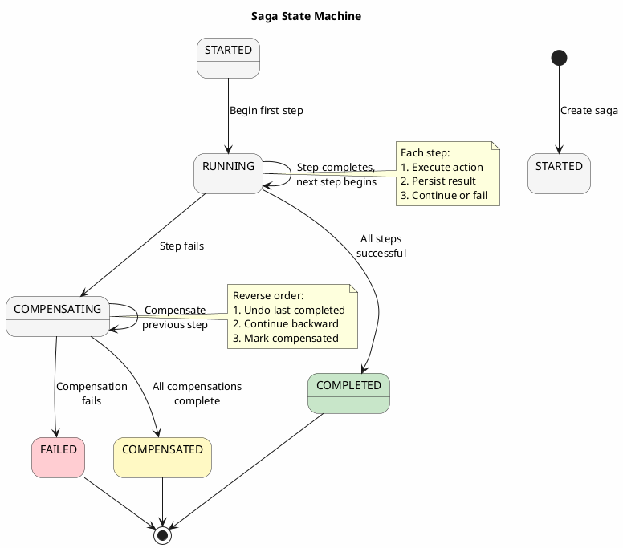

# Saga Pattern

Distributed systems face a fundamental challenge: operations that span multiple services or data stores cannot use traditional ACID transactions. The saga pattern addresses this by decomposing a distributed operation into a sequence of local transactions, each with a compensating action that can undo its effects if a subsequent step fails.

---

## The Distributed Transaction Problem

Consider an e-commerce order that must:

1. Reserve inventory in the warehouse service
2. Charge the customer's payment method
3. Create a shipping request
4. Update the order status

In a monolithic system with a single database, this would be a single transaction: all steps succeed or all are rolled back. In a distributed system, each service owns its data, and no single transaction can span them all.



The naive approach (hoping all steps succeed) leads to inconsistent state when failures occur:

- Inventory reserved but payment fails → phantom reservation
- Payment charged but shipping fails → customer charged, no delivery
- Partial failures leave the system in states that violate business invariants

---

## Saga Fundamentals

A saga is a sequence of local transactions where:

1. Each transaction updates data within a single service
2. Each transaction publishes an event or triggers the next step
3. Each transaction has a **compensating transaction** that semantically undoes its effects
4. If a transaction fails, compensating transactions are executed in reverse order

```
Forward Flow (Success):
T1 → T2 → T3 → T4 → Complete

Compensation Flow (T3 fails):
T1 → T2 → T3(fail) → C2 → C1 → Aborted
```

### Compensation vs Rollback

Compensation is not rollback. A compensating transaction cannot undo time; it can only create new transactions that semantically reverse the effect.



| Original Transaction | Compensation | Note |
|---------------------|--------------|------|
| Reserve 5 items | Release 5 items | Inventory returns to available |
| Charge $100 | Refund $100 | Creates refund record, not deletion |
| Create shipment | Cancel shipment | May fail if already shipped |
| Send email | Send cancellation email | Cannot unsend original |

Some compensations may be impossible (email sent, physical item shipped). Saga design must account for non-compensatable actions by ordering them last.

---

## Saga Coordination Patterns

### Choreography

In choreography, each service listens for events and decides locally what to do next. No central coordinator exists.



**Implementation**:

```java
// Order Service - initiates saga
public class OrderService {

    public Order createOrder(OrderRequest request) {
        Order order = new Order(request);
        order.setStatus(OrderStatus.PENDING);
        orderRepository.save(order);

        // Publish event to start saga
        eventPublisher.publish(new OrderCreatedEvent(order));

        return order;
    }

    @EventListener
    public void onPaymentCharged(PaymentChargedEvent event) {
        Order order = orderRepository.findById(event.getOrderId());
        order.setStatus(OrderStatus.PAYMENT_CONFIRMED);
        orderRepository.save(order);
    }

    @EventListener
    public void onPaymentFailed(PaymentFailedEvent event) {
        Order order = orderRepository.findById(event.getOrderId());
        order.setStatus(OrderStatus.CANCELLED);
        orderRepository.save(order);
        // Inventory service will also receive this and release reservation
    }
}

// Inventory Service - reacts to OrderCreated
public class InventoryService {

    @EventListener
    public void onOrderCreated(OrderCreatedEvent event) {
        try {
            reserveInventory(event.getOrderId(), event.getItems());
            eventPublisher.publish(new InventoryReservedEvent(event.getOrderId()));
        } catch (InsufficientInventoryException e) {
            eventPublisher.publish(new InventoryReservationFailedEvent(
                event.getOrderId(), e.getMessage()));
        }
    }

    @EventListener
    public void onPaymentFailed(PaymentFailedEvent event) {
        // Compensate: release the reservation
        releaseReservation(event.getOrderId());
        eventPublisher.publish(new InventoryReleasedEvent(event.getOrderId()));
    }
}
```

**Advantages**:
- Simple to implement initially
- Loose coupling between services
- No single point of failure

**Disadvantages**:
- Difficult to understand the complete flow
- Cyclic dependencies can emerge
- Testing requires understanding event sequences
- Hard to add new steps or change order

### Orchestration

In orchestration, a central coordinator (orchestrator) directs the saga, telling each participant what to do and when.



**Implementation**:

```java
public class OrderSagaOrchestrator {

    public void execute(OrderRequest request) {
        UUID sagaId = UUID.randomUUID();
        SagaState state = createSagaState(sagaId, request);

        try {
            // Step 1: Reserve inventory
            state.setCurrentStep("RESERVE_INVENTORY");
            saveSagaState(state);

            InventoryReservation reservation = inventoryService.reserve(
                request.getItems(), sagaId);
            state.setInventoryReservationId(reservation.getId());

            // Step 2: Process payment
            state.setCurrentStep("PROCESS_PAYMENT");
            saveSagaState(state);

            PaymentResult payment = paymentService.charge(
                request.getCustomerId(), request.getTotal(), sagaId);
            state.setPaymentId(payment.getId());

            // Step 3: Create shipment
            state.setCurrentStep("CREATE_SHIPMENT");
            saveSagaState(state);

            Shipment shipment = shippingService.createShipment(
                request.getShippingAddress(), request.getItems(), sagaId);
            state.setShipmentId(shipment.getId());

            // Step 4: Confirm order
            state.setCurrentStep("CONFIRM_ORDER");
            state.setStatus(SagaStatus.COMPLETED);
            saveSagaState(state);

            orderService.confirmOrder(request.getOrderId());

        } catch (Exception e) {
            compensate(state, e);
        }
    }

    private void compensate(SagaState state, Exception cause) {
        state.setStatus(SagaStatus.COMPENSATING);
        state.setFailureReason(cause.getMessage());
        saveSagaState(state);

        // Compensate in reverse order
        String failedStep = state.getCurrentStep();

        if (shouldCompensate(failedStep, "CREATE_SHIPMENT") &&
            state.getShipmentId() != null) {
            shippingService.cancelShipment(state.getShipmentId());
        }

        if (shouldCompensate(failedStep, "PROCESS_PAYMENT") &&
            state.getPaymentId() != null) {
            paymentService.refund(state.getPaymentId());
        }

        if (shouldCompensate(failedStep, "RESERVE_INVENTORY") &&
            state.getInventoryReservationId() != null) {
            inventoryService.releaseReservation(state.getInventoryReservationId());
        }

        state.setStatus(SagaStatus.COMPENSATED);
        saveSagaState(state);

        orderService.cancelOrder(state.getOrderId(), cause.getMessage());
    }
}
```

**Advantages**:
- Easy to understand the complete flow
- Centralized control and monitoring
- Simpler to add/modify steps
- Better for complex sagas with many steps

**Disadvantages**:
- Orchestrator can be a single point of failure without HA/leadership failover
- Tighter coupling to orchestrator
- Can become a bottleneck

---

## Saga State Management with Cassandra

The saga's state must be persisted to survive crashes. Cassandra provides durable storage for saga coordination.

### Saga State Schema

```sql
CREATE TABLE saga_instances (
    saga_id UUID,
    saga_type TEXT,
    status TEXT,                    -- STARTED, RUNNING, COMPENSATING, COMPLETED, FAILED
    current_step TEXT,
    started_at TIMESTAMP,
    updated_at TIMESTAMP,
    completed_at TIMESTAMP,
    payload BLOB,                   -- Serialized saga data
    step_results MAP<TEXT, BLOB>,   -- Results from each step
    failure_reason TEXT,
    PRIMARY KEY (saga_id)
);

CREATE TABLE saga_steps (
    saga_id UUID,
    step_name TEXT,
    step_order INT,
    status TEXT,                    -- PENDING, RUNNING, COMPLETED, FAILED, COMPENSATED
    started_at TIMESTAMP,
    completed_at TIMESTAMP,
    request_data BLOB,
    response_data BLOB,
    error_message TEXT,
    retry_count INT,
    PRIMARY KEY ((saga_id), step_order)
) WITH CLUSTERING ORDER BY (step_order ASC);
```

### State Machine Implementation

Model the saga as a state machine:



```java
public class SagaStateMachine {

    private final SagaDefinition definition;
    private SagaInstance instance;

    public void advance() {
        while (true) {
            SagaStep currentStep = definition.getStep(instance.getCurrentStep());

            if (currentStep == null) {
                // No more steps - saga complete
                instance.setStatus(SagaStatus.COMPLETED);
                instance.setCompletedAt(Instant.now());
                saveInstance();
                return;
            }

            try {
                // Execute current step
                StepResult result = executeStep(currentStep);
                recordStepResult(currentStep, result);

                // Move to next step
                instance.setCurrentStep(currentStep.getNextStep());
                instance.setUpdatedAt(Instant.now());
                saveInstance();

            } catch (Exception e) {
                handleStepFailure(currentStep, e);
                return;
            }
        }
    }

    private void handleStepFailure(SagaStep failedStep, Exception e) {
        if (failedStep.isRetryable() &&
            getRetryCount(failedStep) < failedStep.getMaxRetries()) {

            incrementRetryCount(failedStep);
            scheduleRetry(failedStep);
            return;
        }

        // Start compensation
        instance.setStatus(SagaStatus.COMPENSATING);
        instance.setFailureReason(e.getMessage());
        saveInstance();

        compensate();
    }

    private void compensate() {
        List<SagaStep> completedSteps = getCompletedStepsInReverseOrder();

        for (SagaStep step : completedSteps) {
            if (step.hasCompensation()) {
                try {
                    executeCompensation(step);
                    markStepCompensated(step);
                } catch (Exception e) {
                    // Compensation failed - requires manual intervention
                    instance.setStatus(SagaStatus.COMPENSATION_FAILED);
                    alertOperations(instance, step, e);
                    saveInstance();
                    return;
                }
            }
        }

        instance.setStatus(SagaStatus.COMPENSATED);
        instance.setCompletedAt(Instant.now());
        saveInstance();
    }
}
```

---

## Handling Failure Scenarios

### Step Failure with Successful Compensation

The normal compensation path:

```
T1(success) → T2(success) → T3(fail)
                              ↓
              C2(success) ← compensation starts
                   ↓
              C1(success)
                   ↓
              Saga Compensated
```

### Compensation Failure

When compensation fails, human intervention may be required:

```java
public class CompensationFailureHandler {

    public void handleCompensationFailure(SagaInstance saga,
                                          SagaStep step,
                                          Exception e) {
        // Log detailed information for operations team
        log.error("Compensation failed for saga {} step {}: {}",
            saga.getId(), step.getName(), e.getMessage(), e);

        // Create incident ticket
        incidentService.createIncident(
            IncidentSeverity.HIGH,
            "Saga Compensation Failure",
            String.format("Saga %s failed to compensate step %s. " +
                "Manual intervention required.", saga.getId(), step.getName()),
            Map.of(
                "saga_id", saga.getId().toString(),
                "saga_type", saga.getType(),
                "failed_step", step.getName(),
                "error", e.getMessage()
            )
        );

        // Persist failure state for manual resolution
        saga.setStatus(SagaStatus.COMPENSATION_FAILED);
        saga.setRequiresManualIntervention(true);
        sagaRepository.save(saga);
    }
}
```

### Timeout Handling

Steps may hang indefinitely. Implement timeouts and treat them as failures:

```java
public StepResult executeStepWithTimeout(SagaStep step, Duration timeout) {
    CompletableFuture<StepResult> future = CompletableFuture.supplyAsync(
        () -> step.execute(instance.getPayload())
    );

    try {
        return future.get(timeout.toMillis(), TimeUnit.MILLISECONDS);
    } catch (TimeoutException e) {
        future.cancel(true);
        throw new StepTimeoutException(step, timeout);
    }
}
```

### Idempotent Steps

Steps may be retried after partial execution. Ensure idempotency:

```java
public class IdempotentInventoryReservation {

    public InventoryReservation reserve(UUID sagaId, List<Item> items) {
        // Check if already reserved
        InventoryReservation existing = reservationRepository
            .findBySagaId(sagaId);

        if (existing != null) {
            log.info("Reservation already exists for saga {}", sagaId);
            return existing;
        }

        // Create new reservation
        InventoryReservation reservation = new InventoryReservation(sagaId, items);
        // ... reserve logic ...

        return reservationRepository.save(reservation);
    }
}
```

---

## Saga Recovery

After a system crash, incomplete sagas must be recovered.

### Recovery Process

```java
@Scheduled(fixedDelay = 60000)  // Every minute
public void recoverIncompleteSagas() {
    Instant staleThreshold = Instant.now().minus(Duration.ofMinutes(5));

    List<SagaInstance> staleSagas = sagaRepository
        .findByStatusInAndUpdatedAtBefore(
            List.of(SagaStatus.RUNNING, SagaStatus.COMPENSATING),
            staleThreshold
        );

    for (SagaInstance saga : staleSagas) {
        log.info("Recovering stale saga {}", saga.getId());

        try {
            if (saga.getStatus() == SagaStatus.RUNNING) {
                // Determine if last step completed
                if (lastStepCompleted(saga)) {
                    advanceSaga(saga);
                } else {
                    // Retry or compensate based on step configuration
                    handleIncompleteStep(saga);
                }
            } else if (saga.getStatus() == SagaStatus.COMPENSATING) {
                continueCompensation(saga);
            }
        } catch (Exception e) {
            log.error("Recovery failed for saga {}", saga.getId(), e);
        }
    }
}
```

### Saga Timeout

Sagas that run too long may indicate problems:

```java
@Scheduled(fixedDelay = 300000)  // Every 5 minutes
public void timeoutStaleSagas() {
    Instant timeout = Instant.now().minus(Duration.ofHours(1));

    List<SagaInstance> timedOutSagas = sagaRepository
        .findByStatusAndStartedAtBefore(SagaStatus.RUNNING, timeout);

    for (SagaInstance saga : timedOutSagas) {
        log.warn("Saga {} timed out after 1 hour, starting compensation", saga.getId());

        saga.setStatus(SagaStatus.COMPENSATING);
        saga.setFailureReason("Saga timeout exceeded");
        sagaRepository.save(saga);

        compensate(saga);
    }
}
```

---

## Monitoring Sagas

### Key Metrics

| Metric | Description | Alert Threshold |
|--------|-------------|-----------------|
| `saga.started` | Sagas initiated per minute | Baseline deviation |
| `saga.completed` | Successfully completed | Drop indicates failures |
| `saga.compensated` | Required compensation | > 1% of started |
| `saga.compensation_failed` | Compensation failed | Any occurrence |
| `saga.duration_p99` | 99th percentile duration | > SLA threshold |
| `saga.step.{name}.failures` | Per-step failure rate | Step-specific |

### Dashboard Queries

!!! note "Aggregation Queries"
    The queries below require dedicated aggregation tables or external analytics (Spark, Presto) since Cassandra does not support cross-partition GROUP BY or queries without partition key restrictions.

**Aggregation table approach:**

```sql
-- Pre-aggregated counters updated on saga state changes
CREATE TABLE saga_status_counts (
    date_bucket DATE,
    status TEXT,
    count COUNTER,
    PRIMARY KEY ((date_bucket), status)
);

-- Query pre-aggregated data
SELECT status, count FROM saga_status_counts WHERE date_bucket = ?;
```

**External analytics approach:**

```sql
-- Example Spark SQL / Presto query (not CQL)
SELECT status, COUNT(*) as count
FROM saga_instances
WHERE started_at > ?
GROUP BY status;
```

**Stuck saga detection (requires secondary index or materialized view):**

```sql
-- If using SAI index on status
SELECT saga_id, saga_type, current_step, started_at
FROM saga_instances
WHERE status = 'RUNNING'
  AND updated_at < ?
ALLOW FILTERING;  -- Use with caution in production
```

---

## When to Use the Saga Pattern

### Appropriate Use Cases

- **Multi-service transactions**: Operations spanning multiple bounded contexts
- **Long-running processes**: Operations that take minutes or hours
- **Eventual consistency acceptable**: Business can tolerate temporary inconsistency
- **Compensatable operations**: All steps can be semantically reversed

### Consider Alternatives When

- **Single service**: If all data is in one service, use local transactions
- **Strong consistency required**: If temporary inconsistency is unacceptable, consider different architecture
- **Non-compensatable steps**: If steps cannot be reversed (external API calls with no undo), saga may not fit
- **High-frequency operations**: Saga overhead may be prohibitive for very high-volume operations

---

## Summary

The saga pattern enables distributed transactions through:

1. **Local transactions** that each service can commit independently
2. **Compensating transactions** that semantically reverse completed steps
3. **Coordination** via choreography (events) or orchestration (central controller)
4. **Persistent state** that survives failures and enables recovery
5. **Idempotent operations** that handle retries safely

Cassandra provides durable storage for saga state, enabling recovery after failures. The pattern accepts temporary inconsistency (between step completion and final commit or compensation) in exchange for availability and partition tolerance.

---

## Related Documentation

- [Ledger Pattern](ledger.md) - Financial transactions with sagas
- [Transactional Outbox](outbox.md) - Reliable event publishing for choreography
- [Idempotency Patterns](idempotency.md) - Safe step retries
- [Event Sourcing](event-sourcing.md) - Events as coordination mechanism
