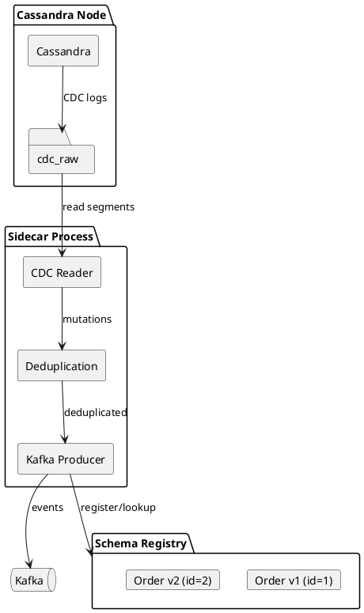
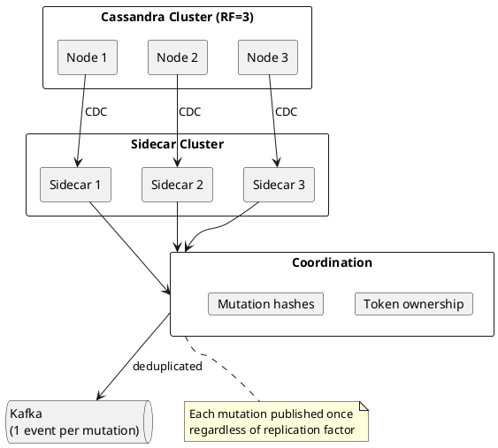
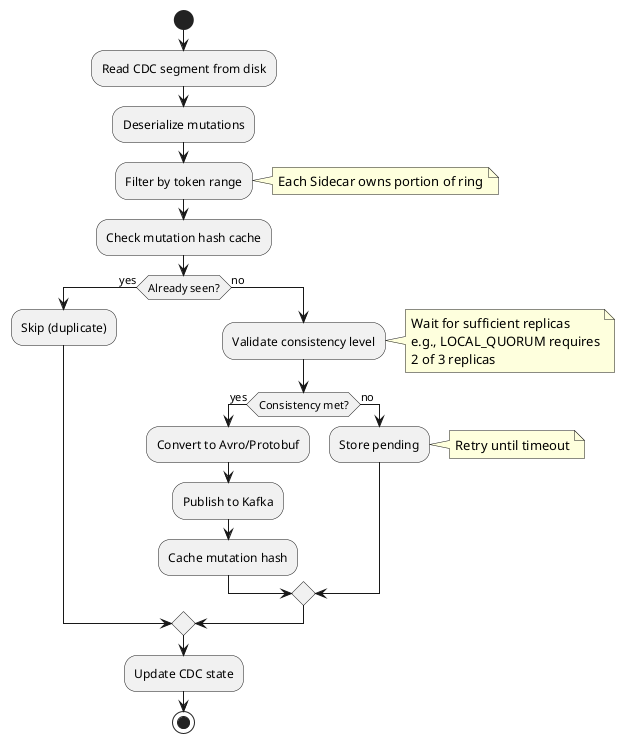
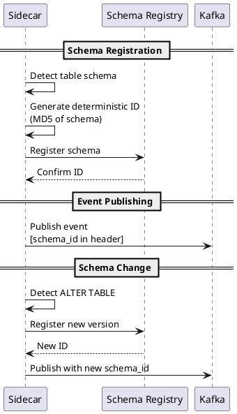

# Sidecar CDC Outbox Pattern

[CEP-44](https://cwiki.apache.org/confluence/display/CASSANDRA/CEP-44:+Kafka+integration+for+Cassandra+CDC+using+Sidecar) introduces official Kafka integration for Cassandra CDC through the Sidecar component. This provides an alternative to the [transactional outbox pattern](outbox.md) with built-in deduplication and Schema Registry support.

!!! info "Status: Accepted"
    CEP-44 has been accepted for implementation. Check Cassandra Sidecar release notes for availability.

---

## What is Cassandra Sidecar?

Cassandra Sidecar is a separate process that runs alongside Cassandra nodes, providing management and operational capabilities without modifying the core database. CEP-44 extends Sidecar to include CDC-to-Kafka streaming.



### Key Components

| Component | Description |
|-----------|-------------|
| **CDC Reader** | Reads commit log segments from `cdc_raw` directory |
| **Deduplication Engine** | Eliminates duplicate mutations across replicas |
| **Kafka Producer** | Publishes events to Kafka topics |
| **Schema Registry Client** | Manages schema versioning (pluggable) |
| **State Manager** | Tracks processing position for recovery |

---

## Why Sidecar CDC?

The Sidecar approach addresses key limitations of other CDC solutions:

| Challenge | Debezium | Sidecar CDC |
|-----------|----------|-------------|
| **Deduplication** | Consumer must deduplicate | Built-in deduplication |
| **Consistency validation** | Not available | Honors consistency levels |
| **Schema management** | Separate configuration | Integrated Schema Registry |
| **Official support** | Third-party | Apache Cassandra project |
| **Configuration** | External config files | CQL syntax + REST API |

### Built-in Deduplication

With replication factor 3, each mutation appears on 3 nodes. Traditional CDC solutions (like Debezium) push this problem to downstream consumers. Sidecar CDC deduplicates at the source:



**Deduplication mechanism:**

1. Each Sidecar owns a token range portion
2. Mutations are hashed (MD5) and cached
3. Only mutations meeting consistency requirements are published
4. Coordination ensures each mutation is published exactly once per token range

---

## Architecture

### Processing Flow



### State Management

Sidecar maintains processing state in Cassandra itself:

```sql
-- Configuration storage
CREATE TABLE sidecar_internal.configs (
    service TEXT,
    config MAP<TEXT, TEXT>,
    PRIMARY KEY (service)
);

-- CDC processing state
CREATE TABLE sidecar_internal.cdc_state (
    job_id TEXT,
    split SMALLINT,
    start VARINT,
    end VARINT,
    state BLOB,
    PRIMARY KEY ((job_id), split)
) WITH default_time_to_live = 2592000;  -- 30-day retention
```

**State contents:**

| Component | Description |
|-----------|-------------|
| **Segment marker** | Last processed segment ID and byte offset |
| **Mutation cache** | MD5 hashes of recent mutations awaiting replica confirmation |
| **Token ranges** | Owned ranges for this Sidecar instance |

---

## Configuration

### REST API

```bash
# Create CDC configuration
curl -X PUT http://sidecar:9043/api/v1/services/cdc/config \
  -H "Content-Type: application/json" \
  -d '{
    "kafka.bootstrap.servers": "kafka:9092",
    "schema.registry.url": "http://schema-registry:8081",
    "tables": ["keyspace.orders"],
    "consistency.level": "LOCAL_QUORUM"
  }'

# Get current configuration
curl http://sidecar:9043/api/v1/services/cdc/config

# Disable CDC streaming
curl -X DELETE http://sidecar:9043/api/v1/services/cdc/config
```

### CQL Syntax (CEP-38)

CEP-44 leverages CEP-38's management syntax for declarative configuration:

```sql
-- Create a Kafka sink
CREATE DATA_SINK order_events_sink
WITH uri = 'kafka://kafka:9092/order-events'
AND options = {
    'schema.registry.url': 'http://schema-registry:8081',
    'value.serializer': 'avro'
};

-- Enable CDC streaming for a table
CREATE DATA_SOURCE cdc ON TABLE keyspace.orders
WITH sink = order_events_sink
AND options = {
    'consistency.level': 'LOCAL_QUORUM'
};

-- Disable CDC streaming
DROP DATA_SOURCE cdc ON TABLE keyspace.orders;
```

---

## Schema Registry Integration

Sidecar CDC integrates with Schema Registry for schema evolution:



### Deterministic Schema IDs

Unlike random assignment, Sidecar generates schema IDs deterministically from table structure:

```
schema_id = MD5(keyspace + table + column_definitions)
```

**Benefits:**

- Schema can be re-registered if Registry is unavailable
- Consistent IDs across Sidecar restarts
- No coordination required for ID assignment

### Supported Types

| Cassandra Type | Avro Type | Notes |
|----------------|-----------|-------|
| `ascii` | `string` | |
| `bigint` | `int` | |
| `blob` | `bytes` | |
| `boolean` | `boolean` | |
| `date` | `int` | Days since epoch |
| `decimal` | `long` | |
| `double` | `long` | |
| `duration` | `long` | |
| `float` | `long` | |
| `frozen` | `bytes` | Serialized bytes |
| `inet` | `string` | IP address as string |
| `int` | `int` | |
| `list<T>` | `array` | Element type must be supported |
| `map<K,V>` | `map` | Key/value types must be supported |
| `set<T>` | `array` | Converted to array |
| `smallint` | `int` | |
| `text` | `string` | |
| `time` | `long` | Nanoseconds since midnight |
| `timestamp` | `long` | Milliseconds since epoch |
| `timeuuid` | `string` | |
| `tinyint` | `int` | |
| `tuple` | `map` | |
| `uuid` | `string` | |
| `varchar` | `string` | |
| `varint` | `int` | |
| UDT (frozen) | `record` | Nested record with supported types |

!!! warning "Unsupported Types"
    - **Counter columns** - Require read-before-write semantics
    - **Unfrozen collections** - Require database reads; index information in mutations not usable by downstream consumers
    - **Custom types** - No automatic conversion

---

## Delivery Guarantees

### At-Least-Once Delivery

Sidecar CDC provides at-least-once delivery:

- Events are published at least once
- Failures after publish but before state update may cause redelivery
- Consumers should be idempotent

### Consistency Level Honoring

Unlike basic CDC which captures all replica writes, Sidecar validates consistency:

```
Configuration: consistency.level = LOCAL_QUORUM (RF=3)

Mutation arrives on Node 1 → Wait
Mutation arrives on Node 2 → 2/3 = QUORUM met → Publish
Mutation arrives on Node 3 → Already published (deduplicated)
```

**Failure handling:**

| Scenario | Behavior |
|----------|----------|
| Insufficient replicas within timeout | Mutation dropped (logged) |
| Sidecar crash | Resume from last checkpoint |
| Kafka unavailable | Backpressure, retry with backoff |
| Schema Registry unavailable | Continue with cached schemas |

---

## Comparison with Outbox Pattern

| Aspect | Transactional Outbox | Sidecar CDC |
|--------|---------------------|-------------|
| **Write overhead** | Extra outbox table write | None (uses existing CDC) |
| **Atomicity** | Same-partition batches | Eventual (consistency level) |
| **Deduplication** | Consumer responsibility | Built-in |
| **Schema evolution** | Manual | Integrated |
| **Ordering** | Controllable | Per-partition in Kafka |
| **Latency** | Polling interval | Near real-time |
| **Operational complexity** | Application code | Sidecar deployment |

### When to Use Each

**Use Transactional Outbox when:**

- Strict atomicity required between entity and event
- Custom event schema independent of table structure
- Fine-grained control over event content
- No Sidecar deployment available

**Use Sidecar CDC when:**

- Table mutations map directly to events
- Built-in deduplication preferred
- Schema Registry integration needed
- Near real-time latency required
- Operational simplicity preferred over application complexity

---

## Monitoring

### Key Metrics

| Metric | Description | Alert Threshold |
|--------|-------------|-----------------|
| `cdc.publish.latency` | Time from mutation to Kafka publish | > 1 second |
| `cdc.events.per.second` | Event throughput | Below baseline |
| `cdc.consistency.failures` | Mutations not meeting consistency | > 0 |
| `cdc.dropped.mutations` | Mutations lost due to timeout | > 0 |
| `cdc.segment.read.lag` | Segments pending processing | > 10 |

### Health Checks

```bash
# Check Sidecar CDC status
curl http://sidecar:9043/api/v1/services/cdc/health

# Response
{
  "status": "healthy",
  "lag_segments": 2,
  "last_published": "2024-01-15T14:30:00Z",
  "events_per_second": 1250,
  "pending_mutations": 45
}
```

---

## Limitations

| Limitation | Description |
|------------|-------------|
| **No exactly-once** | At-least-once only; consumers must be idempotent |
| **No SSTable imports** | Only CQL writes via commit log |
| **No linearizable ordering** | Events may arrive out of order across partitions |
| **Counter tables** | Not supported |
| **Before/after states** | Only current state, not previous values |

---

## Related Documentation

- [Transactional Outbox Pattern](outbox.md) - Application-level outbox implementation
- [CDC Architecture](../../architecture/storage-engine/cdc.md) - Cassandra CDC internals
- [Idempotency Patterns](idempotency.md) - Handling duplicate events
- [Event Sourcing](event-sourcing.md) - Events as source of truth
