# Speed Layer Pattern

The speed layer provides low-latency access to frequently-accessed data: account balances, recent transactions, sessions, and real-time state. While Cassandra serves as both the speed layer and the system of record, optimal performance requires understanding which data is "hot" and designing schemas and access patterns accordingly.

---

## Speed Layer Architecture

Mobile banking has fundamentally changed how customers interact with their accounts. Where customers once checked balances monthly via statements, they now check multiple times daily via mobile apps. This shift has increased read throughput requirements by orders of magnitude—volumes that mainframe systems were never designed to handle.

In enterprise banking environments, Cassandra commonly serves as a speed layer in front of core banking systems. The mainframe remains the system of record for transactions and regulatory compliance, while Cassandra provides low-latency reads for mobile and web applications. CDC (Change Data Capture) keeps the speed layer synchronized.

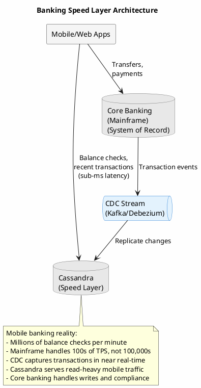

---

## CDC Pipeline

When the core banking system is a mainframe, Cassandra provides a high-performance read layer for account balances and transaction history while CDC keeps data synchronized after each transaction.

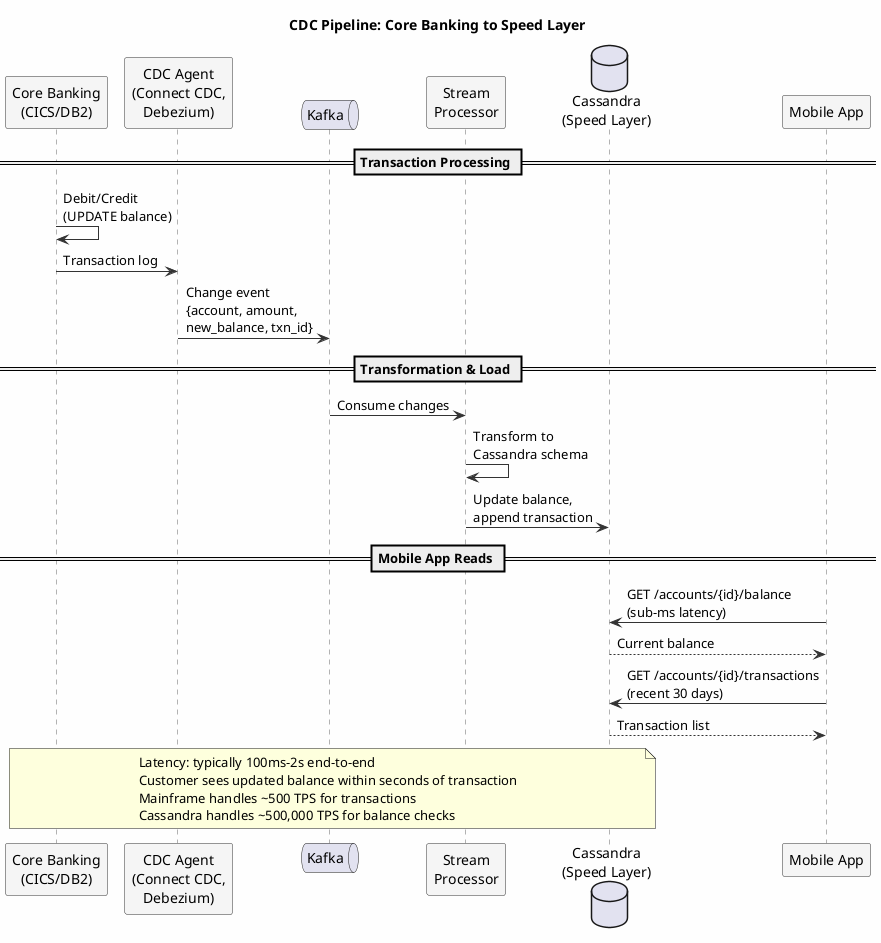

### CDC Consumer Implementation

```java
@KafkaListener(topics = "corebanking.transactions")
public class TransactionCDCConsumer {

    private final CqlSession session;

    // Single INSERT updates static columns (balance) AND adds transaction row
    private final PreparedStatement insertTransaction = session.prepare(
        """
        INSERT INTO account_transactions (
            account_id, transaction_date, transaction_id,
            current_balance, available_balance, last_updated,
            transaction_time, transaction_type, amount,
            balance_after, description, merchant_name, category
        ) VALUES (?, ?, ?, ?, ?, ?, ?, ?, ?, ?, ?, ?, ?)
        """
    );

    public void handleTransaction(TransactionEvent event) {
        // Single write: updates static balance + inserts transaction row
        session.execute(insertTransaction.bind(
            event.getAccountId(),
            event.getTransactionDate(),
            event.getTransactionId(),
            // Static columns (balance) - updated with each insert
            event.getNewBalance(),
            event.getAvailableBalance(),
            event.getTimestamp(),
            // Transaction row columns
            event.getTimestamp(),
            event.getTransactionType(),
            event.getAmount(),
            event.getNewBalance(),
            event.getDescription(),
            event.getMerchantName(),
            event.getCategory()
        ));
    }
}
```

### Handling CDC Lag

CDC introduces latency between the core banking system and speed layer. For most balance checks, sub-second staleness is acceptable. For operations like initiating a transfer, the application may need to verify against the source.

```java
public class AccountSpeedLayer {

    private final CqlSession cassandraSession;
    private final CoreBankingClient coreBankingClient;

    public AccountBalance getBalance(String accountId, BalanceCheckContext context) {
        // Read from speed layer (handles 99.9% of requests)
        AccountBalance cached = readFromCassandra(accountId);

        if (cached == null) {
            // New account not yet replicated - fall back to source
            return readFromCoreBanking(accountId);
        }

        // For display purposes (balance check), cached is fine
        if (context.isPureRead()) {
            return cached;
        }

        // For transfers/payments, verify against source if stale
        if (context.isTransactionInitiation()) {
            Instant sourceTimestamp = getSourceTimestamp(accountId);
            if (cached.getLastUpdated().isBefore(sourceTimestamp)) {
                return readFromCoreBanking(accountId);
            }
        }

        return cached;
    }
}
```

### Write-Through to Core Banking

Transactions (transfers, payments) always go through the core banking system. The speed layer is read-only for balance and transaction history:

```java
public class TransferService {

    public TransferResult initiateTransfer(TransferRequest request) {
        // Transactions MUST go through core banking for:
        // - Regulatory compliance (audit trail)
        // - Fraud detection
        // - Overdraft protection
        // - Inter-bank settlement
        TransferResult result = coreBankingClient.executeTransfer(
            request.getFromAccount(),
            request.getToAccount(),
            request.getAmount()
        );

        // CDC will propagate the balance change to Cassandra
        // within 1-2 seconds. No direct write to speed layer.

        return result;
    }
}
```

---

## The Hot Data Problem

Not all banking data is accessed equally. In a typical mobile banking application:

- **Current balance**: Checked on every app open, often multiple times per day
- **Recent transactions**: Last 7-30 days, accessed frequently
- **Session data**: Read/written multiple times per second during active sessions
- **Historical transactions**: Older than 90 days, accessed occasionally for statements

Treating all data identically leads to either over-provisioning (expensive) or under-serving hot data (slow). The speed layer pattern optimizes for the hot path while maintaining access to the full dataset.

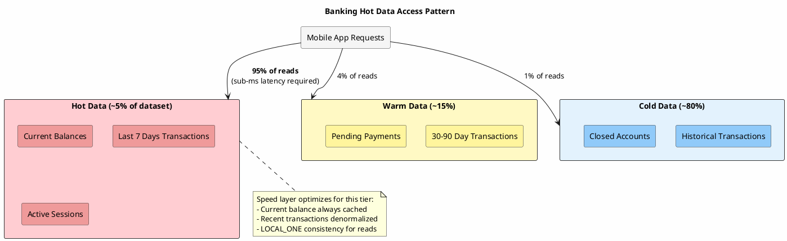

---

## Bank Account Data Architecture

Bank account data is the canonical speed layer use case: accessed constantly, latency-sensitive, and critical to application function. The schema separates current balances (hot) from transaction history (warm/cold).

### Schema Design

```sql
-- Account with transactions (static columns for account-level data)
CREATE TABLE account_transactions (
    account_id TEXT,
    transaction_date DATE,
    transaction_id TEXT,
    -- Static columns: shared across all rows in partition (the account)
    customer_id TEXT STATIC,
    account_type TEXT STATIC,       -- CHECKING, SAVINGS, CREDIT
    currency TEXT STATIC,
    current_balance DECIMAL STATIC,
    available_balance DECIMAL STATIC,
    last_updated TIMESTAMP STATIC,
    -- Per-transaction columns
    transaction_time TIMESTAMP,
    transaction_type TEXT,          -- DEBIT, CREDIT, TRANSFER, FEE
    amount DECIMAL,
    balance_after DECIMAL,
    description TEXT,
    merchant_name TEXT,
    category TEXT,
    PRIMARY KEY ((account_id), transaction_date, transaction_id)
) WITH CLUSTERING ORDER BY (transaction_date DESC, transaction_id DESC)
  AND default_time_to_live = 7776000;  -- 90-day TTL on transactions

-- Customer's accounts (for account list view)
CREATE TABLE accounts_by_customer (
    customer_id TEXT,
    account_id TEXT,
    account_type TEXT,
    account_name TEXT,              -- "Main Checking", "Savings"
    current_balance DECIMAL,
    PRIMARY KEY ((customer_id), account_type, account_id)
);
```

**Design rationale**:

- **Static columns for balance**: Current balance stored once per partition, returned with every transaction query—single read gets balance + transactions
- **TTL on transactions only**: Static columns (balance) are not affected by row TTL; only transaction rows expire
- **Date-clustered transactions**: Partition per account, clustered by date DESC for recent-first queries
- **Denormalized balance in accounts_by_customer**: Dashboard view gets all accounts in one query

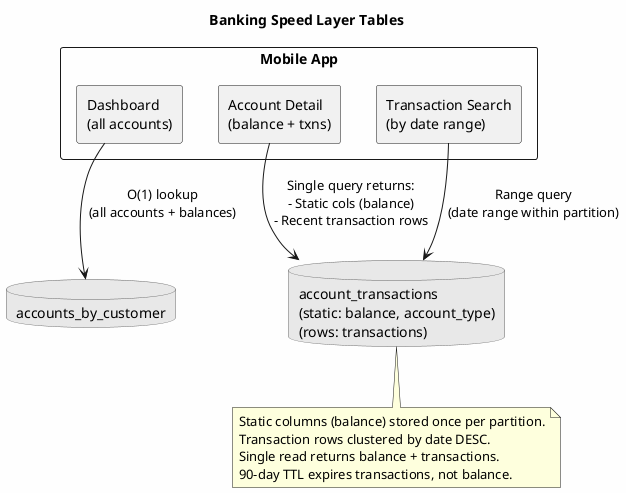

### Optimized Read Path

```java
public class AccountSpeedLayer {

    private final CqlSession session;
    private final LoadingCache<String, AccountBalance> balanceCache;
    private final LoadingCache<String, List<AccountSummary>> customerAccountsCache;

    // Single query gets static columns (balance) + transaction rows
    private final PreparedStatement selectAccountWithTransactions = session.prepare(
        "SELECT * FROM account_transactions WHERE account_id = ? LIMIT ?"
    );

    public AccountSpeedLayer(CqlSession session) {
        this.session = session;

        // Balance cache - very aggressive caching for hot data
        this.balanceCache = Caffeine.newBuilder()
            .maximumSize(1_000_000)            // 1M accounts
            .expireAfterWrite(Duration.ofSeconds(30))
            .refreshAfterWrite(Duration.ofSeconds(5))
            .buildAsync(this::loadBalance);

        // Customer accounts cache - for dashboard view
        this.customerAccountsCache = Caffeine.newBuilder()
            .maximumSize(500_000)              // 500K customers
            .expireAfterWrite(Duration.ofMinutes(1))
            .buildAsync(this::loadCustomerAccounts);
    }

    public AccountWithTransactions getAccountDetail(String accountId, int txnLimit) {
        // Single query returns static cols (balance) + transaction rows
        List<Row> rows = session.execute(
            selectAccountWithTransactions.bind(accountId, txnLimit)
                .setConsistencyLevel(ConsistencyLevel.LOCAL_ONE)
        ).all();

        if (rows.isEmpty()) {
            return null;
        }

        // Static columns are the same on every row
        Row first = rows.get(0);
        AccountBalance balance = new AccountBalance(
            first.getBigDecimal("current_balance"),
            first.getBigDecimal("available_balance"),
            first.getInstant("last_updated")
        );

        // Map transaction rows
        List<Transaction> transactions = rows.stream()
            .filter(row -> row.getString("transaction_id") != null)
            .map(this::mapToTransaction)
            .toList();

        return new AccountWithTransactions(balance, transactions);
    }

    public CompletableFuture<AccountBalance> getBalance(String accountId) {
        return balanceCache.get(accountId);
    }
}
```

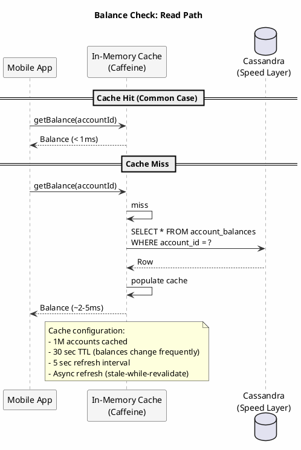

### CDC-Driven Cache Invalidation

Unlike traditional write-through, the speed layer is updated via CDC from core banking. Cache invalidation is event-driven:

```java
@KafkaListener(topics = "corebanking.transactions")
public class BalanceCacheInvalidator {

    private final AccountSpeedLayer speedLayer;

    public void onTransaction(TransactionEvent event) {
        // Invalidate cached balance when transaction occurs
        speedLayer.invalidateBalance(event.getAccountId());

        // Also invalidate customer accounts cache
        // (balances shown in account list)
        speedLayer.invalidateCustomerAccounts(event.getCustomerId());
    }
}
```

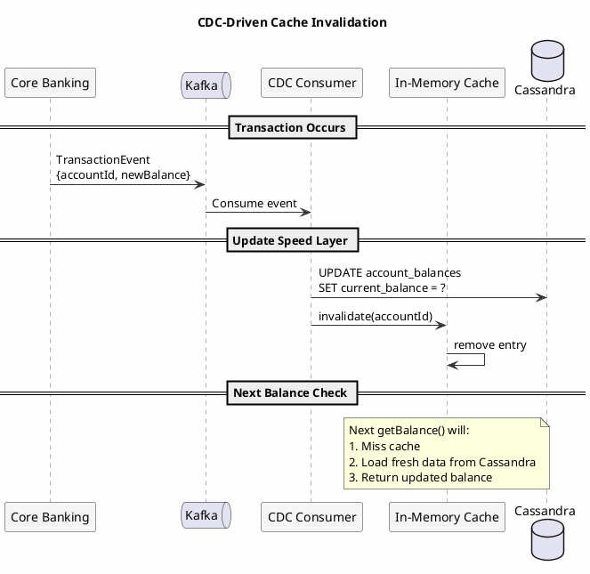

---

## Session Management

Sessions require even lower latency than user data and have unique access patterns.

### Session Schema

```sql
CREATE TABLE sessions (
    session_id TEXT,
    user_id UUID,
    created_at TIMESTAMP,
    last_accessed_at TIMESTAMP,
    expires_at TIMESTAMP,
    ip_address TEXT,
    user_agent TEXT,
    data MAP<TEXT, TEXT>,
    PRIMARY KEY (session_id)
) WITH default_time_to_live = 86400;  -- 24-hour default TTL

-- Sessions by user (for "logout all devices")
CREATE TABLE sessions_by_user (
    user_id UUID,
    session_id TEXT,
    created_at TIMESTAMP,
    last_accessed_at TIMESTAMP,
    device_info TEXT,
    PRIMARY KEY ((user_id), created_at, session_id)
) WITH CLUSTERING ORDER BY (created_at DESC)
  AND default_time_to_live = 86400;
```

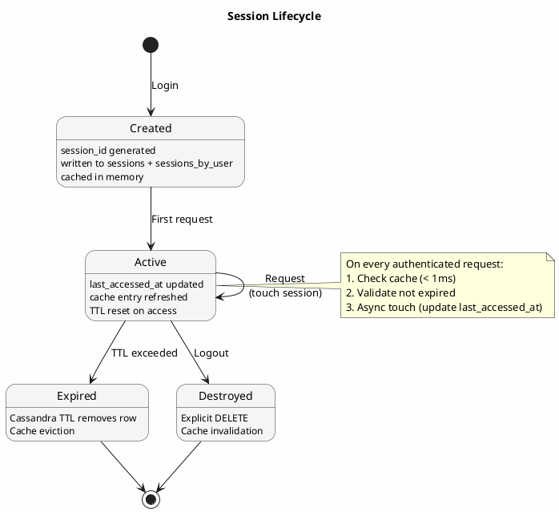

### Session Service

```java
public class SessionSpeedLayer {

    private final CqlSession session;
    private final Cache<String, SessionData> sessionCache;

    public SessionSpeedLayer(CqlSession session) {
        this.session = session;

        // Very aggressive caching for sessions
        this.sessionCache = Caffeine.newBuilder()
            .maximumSize(500_000)              // 500K active sessions
            .expireAfterAccess(Duration.ofMinutes(15))
            .build();
    }

    public SessionData getSession(String sessionId) {
        // Check cache first
        SessionData cached = sessionCache.getIfPresent(sessionId);
        if (cached != null) {
            if (cached.isExpired()) {
                sessionCache.invalidate(sessionId);
                return null;
            }
            return cached;
        }

        // Load from Cassandra
        Row row = session.execute(
            selectSession.bind(sessionId)
                .setConsistencyLevel(ConsistencyLevel.LOCAL_ONE)
        ).one();

        if (row == null) {
            return null;
        }

        SessionData sessionData = mapToSession(row);

        if (sessionData.isExpired()) {
            return null;
        }

        sessionCache.put(sessionId, sessionData);
        return sessionData;
    }

    public String createSession(UUID userId, SessionRequest request) {
        String sessionId = generateSessionId();
        Instant now = Instant.now();
        Instant expiresAt = now.plus(Duration.ofHours(24));

        // Write to both tables
        BatchStatement batch = BatchStatement.newInstance(BatchType.LOGGED)
            .add(insertSession.bind(
                sessionId, userId, now, now, expiresAt,
                request.getIpAddress(), request.getUserAgent(),
                new HashMap<>()
            ))
            .add(insertSessionByUser.bind(
                userId, sessionId, now, now,
                request.getDeviceInfo()
            ));

        session.execute(batch.setConsistencyLevel(ConsistencyLevel.LOCAL_QUORUM));

        SessionData sessionData = new SessionData(
            sessionId, userId, now, expiresAt, new HashMap<>());
        sessionCache.put(sessionId, sessionData);

        return sessionId;
    }

    public void touchSession(String sessionId) {
        Instant now = Instant.now();

        // Update last accessed time
        session.executeAsync(
            updateSessionAccess.bind(now, sessionId)
                .setConsistencyLevel(ConsistencyLevel.LOCAL_ONE)
        );

        // Update cache
        SessionData cached = sessionCache.getIfPresent(sessionId);
        if (cached != null) {
            cached.setLastAccessedAt(now);
        }
    }

    public void destroySession(String sessionId) {
        SessionData sessionData = getSession(sessionId);

        if (sessionData != null) {
            // Delete from both tables
            BatchStatement batch = BatchStatement.newInstance(BatchType.LOGGED)
                .add(deleteSession.bind(sessionId))
                .add(deleteSessionByUser.bind(
                    sessionData.getUserId(),
                    sessionData.getCreatedAt(),
                    sessionId
                ));

            session.execute(batch);
        }

        sessionCache.invalidate(sessionId);
    }

    public void destroyAllUserSessions(UUID userId) {
        // Get all sessions for user
        List<Row> sessions = session.execute(
            selectSessionsByUser.bind(userId)
        ).all();

        // Delete each session
        for (Row row : sessions) {
            destroySession(row.getString("session_id"));
        }
    }
}
```

---

## Real-Time Counters and Aggregates

Some speed layer data is derived: counters, aggregates, and computed values that support real-time features.

### Counter Tables

```sql
-- Real-time user statistics
CREATE TABLE user_stats (
    user_id UUID,
    stat_name TEXT,
    stat_value COUNTER,
    PRIMARY KEY ((user_id), stat_name)
);

-- Global feature counters
CREATE TABLE feature_counters (
    feature_name TEXT,
    time_bucket TEXT,           -- Hour or day bucket
    counter_value COUNTER,
    PRIMARY KEY ((feature_name, time_bucket))
);
```

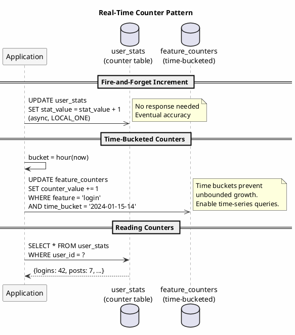

### Counter Service

```java
public class UserStatsService {

    public void incrementStat(UUID userId, String statName) {
        session.executeAsync(
            incrementUserStat.bind(userId, statName)
                .setConsistencyLevel(ConsistencyLevel.LOCAL_ONE)
        );
    }

    public Map<String, Long> getUserStats(UUID userId) {
        return session.execute(
            selectUserStats.bind(userId)
                .setConsistencyLevel(ConsistencyLevel.LOCAL_ONE)
        ).all().stream()
            .collect(Collectors.toMap(
                row -> row.getString("stat_name"),
                row -> row.getLong("stat_value")
            ));
    }
}
```

---

## Materialized Speed Views

Pre-compute expensive queries into speed-optimized views:

### View Schema

```sql
-- Pre-computed user dashboard data
CREATE TABLE user_dashboard (
    user_id UUID,
    last_computed_at TIMESTAMP,
    unread_notifications INT,
    pending_tasks INT,
    recent_activity_summary TEXT,
    recommended_items LIST<UUID>,
    PRIMARY KEY (user_id)
) WITH default_time_to_live = 300;  -- 5-minute TTL forces refresh
```

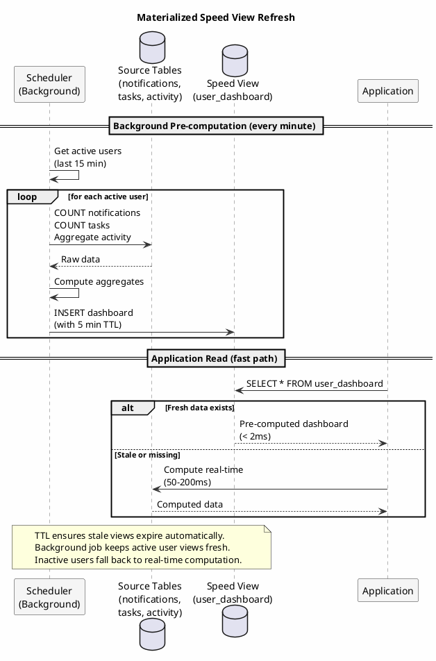

### Background Computation

```java
@Scheduled(fixedDelay = 60000)  // Every minute
public void refreshDashboards() {
    // Get users with recent activity
    List<UUID> activeUsers = getRecentlyActiveUsers(Duration.ofMinutes(15));

    for (UUID userId : activeUsers) {
        try {
            refreshDashboard(userId);
        } catch (Exception e) {
            log.warn("Failed to refresh dashboard for {}", userId, e);
        }
    }
}

private void refreshDashboard(UUID userId) {
    // Compute expensive aggregates
    int unreadNotifications = countUnreadNotifications(userId);
    int pendingTasks = countPendingTasks(userId);
    String activitySummary = computeActivitySummary(userId);
    List<UUID> recommendations = computeRecommendations(userId);

    // Write to speed view
    session.execute(insertDashboard.bind(
        userId, Instant.now(),
        unreadNotifications, pendingTasks,
        activitySummary, recommendations
    ));
}
```

### Reading Speed Views

```java
public class DashboardService {

    public UserDashboard getDashboard(UUID userId) {
        // Try speed view first
        Row row = session.execute(
            selectDashboard.bind(userId)
                .setConsistencyLevel(ConsistencyLevel.LOCAL_ONE)
        ).one();

        if (row != null && isRecent(row.getTimestamp("last_computed_at"))) {
            return mapToDashboard(row);
        }

        // Fall back to real-time computation
        return computeDashboardRealTime(userId);
    }

    private boolean isRecent(Instant lastComputed) {
        return lastComputed != null &&
               lastComputed.isAfter(Instant.now().minus(Duration.ofMinutes(5)));
    }
}
```

---

## Consistency Considerations

Speed layer trades consistency for latency. Understanding the trade-offs is essential.

### Consistency Level Selection

| Data Type | Read CL | Write CL | Rationale |
|-----------|---------|----------|-----------|
| Session validation | LOCAL_ONE | LOCAL_QUORUM | Fast reads, durable writes |
| User profile display | LOCAL_ONE | LOCAL_QUORUM | Stale data acceptable |
| Authentication | LOCAL_QUORUM | LOCAL_QUORUM | Security-critical |
| Counters | LOCAL_ONE | LOCAL_ONE | Approximate is acceptable |
| Dashboard data | LOCAL_ONE | LOCAL_ONE | Pre-computed, non-critical |

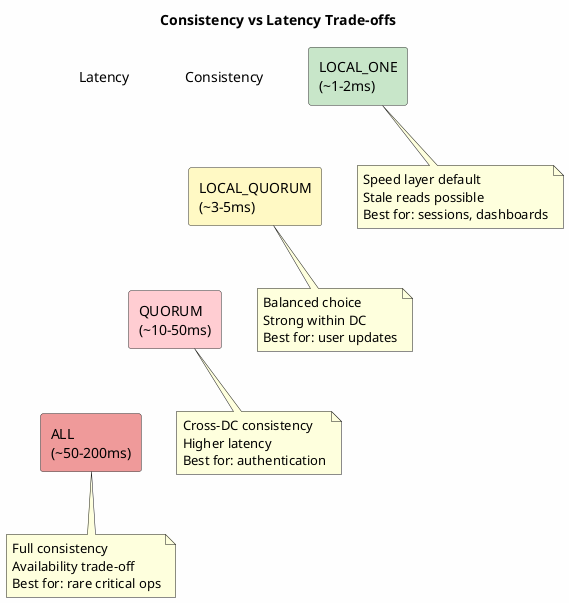

### Stale Read Handling

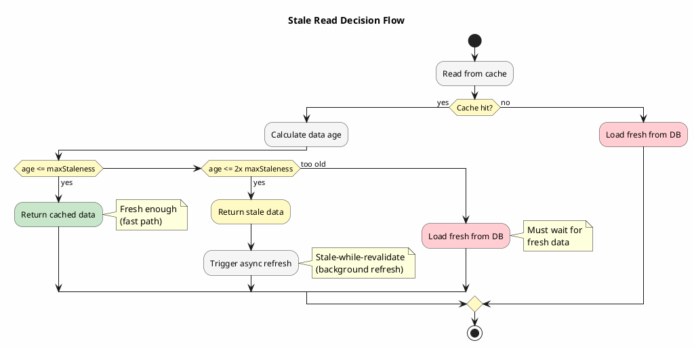

```java
public class StaleDataHandler {

    public User getUserWithStaleness(UUID userId, Duration maxStaleness) {
        // Get from cache with staleness check
        CacheEntry<User> entry = userCache.getEntry(userId);

        if (entry != null) {
            Duration age = Duration.between(entry.getLoadedAt(), Instant.now());

            if (age.compareTo(maxStaleness) <= 0) {
                return entry.getValue();
            }

            // Data too stale - refresh
            if (age.compareTo(maxStaleness.multipliedBy(2)) <= 0) {
                // Return stale data but trigger async refresh
                refreshAsync(userId);
                return entry.getValue();
            }
        }

        // Must load fresh
        return loadUser(userId);
    }
}
```

---

## Cache Invalidation Strategies

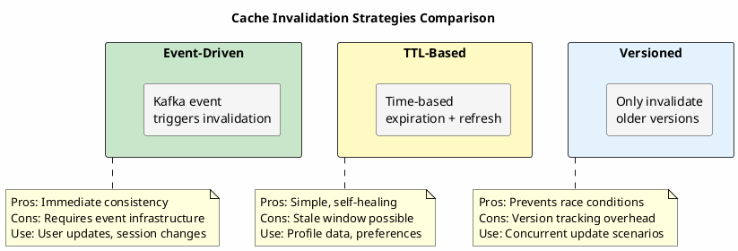

### Event-Driven Invalidation

```java
@KafkaListener(topics = "user-events")
public void handleUserEvent(UserEvent event) {
    switch (event.getType()) {
        case USER_UPDATED:
            speedLayer.invalidateUser(event.getUserId());
            break;
        case USER_DELETED:
            speedLayer.invalidateUser(event.getUserId());
            speedLayer.invalidateEmail(event.getEmail());
            break;
        case PASSWORD_CHANGED:
            // Invalidate all sessions
            speedLayer.invalidateUserSessions(event.getUserId());
            break;
    }
}
```

### TTL-Based Refresh

```java
// Cache configuration with automatic refresh
Cache<UUID, User> userCache = Caffeine.newBuilder()
    .maximumSize(100_000)
    .expireAfterWrite(Duration.ofMinutes(5))
    .refreshAfterWrite(Duration.ofMinutes(1))
    .build(userId -> loadUser(userId));
```

### Versioned Invalidation

```java
public class VersionedCache {

    private final ConcurrentMap<UUID, VersionedEntry<User>> cache;

    public void put(UUID userId, User user, long version) {
        cache.compute(userId, (id, existing) -> {
            if (existing == null || existing.getVersion() < version) {
                return new VersionedEntry<>(user, version);
            }
            return existing;  // Keep newer version
        });
    }

    public void invalidateIfOlder(UUID userId, long version) {
        cache.computeIfPresent(userId, (id, existing) -> {
            if (existing.getVersion() <= version) {
                return null;  // Remove
            }
            return existing;  // Keep newer version
        });
    }
}
```

---

## Monitoring Speed Layer Performance

### Key Metrics

| Metric | Description | Alert Threshold |
|--------|-------------|-----------------|
| `speed_layer.cache_hit_ratio` | Cache hit percentage | < 90% |
| `speed_layer.read_latency_p99` | 99th percentile read latency | > 10ms |
| `speed_layer.cache_size` | Current cache entries | Near maximum |
| `speed_layer.eviction_rate` | Cache evictions per second | Sustained high |
| `speed_layer.stale_reads` | Reads returning stale data | > 5% |

### Health Check

```java
@Component
public class SpeedLayerHealthIndicator implements HealthIndicator {

    @Override
    public Health health() {
        Map<String, Object> details = new HashMap<>();

        // Check cache hit ratio
        double hitRatio = getCacheHitRatio();
        details.put("cache_hit_ratio", hitRatio);

        // Check read latency
        double p99Latency = getP99ReadLatency();
        details.put("p99_read_latency_ms", p99Latency);

        // Check Cassandra connectivity
        boolean cassandraHealthy = checkCassandraHealth();
        details.put("cassandra_healthy", cassandraHealthy);

        if (hitRatio < 0.8 || p99Latency > 50 || !cassandraHealthy) {
            return Health.down().withDetails(details).build();
        }

        return Health.up().withDetails(details).build();
    }
}
```

---

## Summary

The speed layer pattern enables mobile banking at scale by separating read-heavy workloads from transaction processing:

1. **Core banking remains system of record** - All transactions processed by mainframe for compliance, fraud detection, and settlement
2. **CDC synchronization** - Transaction events flow to Cassandra within seconds via Kafka
3. **Schema design for access patterns** - Balances (hot) separated from transactions (warm), denormalized for each query pattern
4. **Aggressive caching** - In-memory cache serves balance checks in sub-millisecond
5. **Appropriate consistency levels** - LOCAL_ONE for reads; staleness is acceptable for display
6. **TTL-based lifecycle** - Older transactions expire from speed layer, served from archival storage

This architecture allows a mainframe handling hundreds of TPS for transactions to support millions of mobile balance checks per minute through the Cassandra speed layer.

---

## Related Documentation

- [CQRS Pattern](cqrs.md) - Separating read and write models
- [Multi-Tenant Isolation](multi-tenant.md) - Per-tenant speed layers
- [Time-Series Data](time-series.md) - Hot vs cold data tiering
