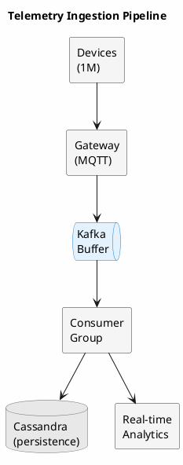
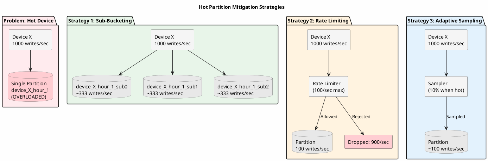
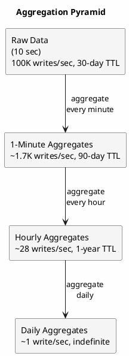

# Telemetry at Scale

IoT telemetry presents extreme data management challenges: millions of devices reporting metrics every second, multi-tenant isolation requirements, and queries spanning both real-time dashboards and historical analysis. This document addresses patterns for handling telemetry at the scale where naive approaches fail.

---

## The Scale Challenge

Consider a fleet telemetry scenario:

- **1 million devices** reporting every 10 seconds
- **100,000 writes per second** sustained
- **10 metrics per report** → 1 million metrics per second
- **30-day retention** at full resolution
- **Multi-tenant** with isolation requirements

At this scale, problems that don't exist at smaller deployments become critical. The figures below are illustrative and vary with hardware, configuration, and workload:

**Hot partitions**: A device reporting every second for a year creates 31 million rows in one partition, far exceeding Cassandra's comfortable limits.

**Write amplification**: With RF=3, 100K writes/second becomes 300K writes/second across the cluster.

**Compaction pressure**: Continuous writes generate SSTables faster than compaction can process them without proper strategy.

**Query fan-out**: A query spanning many devices touches many partitions, potentially overwhelming coordinators.

**Tenant isolation**: One large tenant's workload cannot be allowed to impact others.

---

## Schema Design for Scale

### Multi-Level Bucketing

Partition by device, tenant, and time bucket to bound partition size:

```sql
CREATE TABLE telemetry (
    tenant_id UUID,
    device_id UUID,
    bucket TIMESTAMP,           -- Hourly bucket
    event_time TIMESTAMP,
    metric_name TEXT,
    metric_value DOUBLE,
    tags MAP<TEXT, TEXT>,
    PRIMARY KEY ((tenant_id, device_id, bucket), event_time, metric_name)
) WITH CLUSTERING ORDER BY (event_time DESC, metric_name ASC)
  AND compaction = {
    'class': 'TimeWindowCompactionStrategy',
    'compaction_window_unit': 'HOURS',
    'compaction_window_size': 1
  }
  AND default_time_to_live = 2592000;  -- 30 days
```

**Sizing analysis**:
- Device reporting every 10 seconds: 6 reports/minute × 60 × 10 metrics = 3,600 rows/hour
- 3,600 rows × ~100 bytes = ~360KB per partition
- Well within Cassandra's partition size recommendations

### Adaptive Bucket Sizing

Different devices have different reporting frequencies. Use adaptive bucketing:

```java
public class AdaptiveBucketing {

    public Instant calculateBucket(UUID deviceId, Instant eventTime) {
        DeviceProfile profile = getDeviceProfile(deviceId);

        Duration bucketSize = switch (profile.getReportingFrequency()) {
            case HIGH_FREQUENCY -> Duration.ofMinutes(15);   // > 1/sec
            case MEDIUM_FREQUENCY -> Duration.ofHours(1);    // 1/min - 1/sec
            case LOW_FREQUENCY -> Duration.ofHours(6);       // < 1/min
        };

        long bucketMillis = bucketSize.toMillis();
        long eventMillis = eventTime.toEpochMilli();
        long bucketStart = (eventMillis / bucketMillis) * bucketMillis;

        return Instant.ofEpochMilli(bucketStart);
    }
}
```

---

## Ingestion Architecture

### Write Path Optimization



### Batched Writes

Group writes by partition for efficient batching:

```java
@KafkaListener(topics = "telemetry", containerFactory = "batchListenerFactory")
public void consumeBatch(List<TelemetryEvent> events) {
    // Group by partition key
    Map<PartitionKey, List<TelemetryEvent>> grouped = events.stream()
        .collect(Collectors.groupingBy(e ->
            new PartitionKey(e.getTenantId(), e.getDeviceId(),
                            calculateBucket(e.getDeviceId(), e.getEventTime()))));

    // Write each partition's events as unlogged batch
    grouped.forEach((key, partitionEvents) -> {
        BatchStatement batch = BatchStatement.newInstance(BatchType.UNLOGGED);

        for (TelemetryEvent event : partitionEvents) {
            batch = batch.add(insertTelemetry.bind(
                key.getTenantId(), key.getDeviceId(), key.getBucket(),
                event.getEventTime(), event.getMetricName(),
                event.getMetricValue(), event.getTags()
            ));
        }

        session.executeAsync(batch);
    });
}
```

### Backpressure Handling

When Cassandra cannot keep up, the ingestion pipeline must apply backpressure:

```java
public class BackpressureController {

    private final Semaphore inFlightPermits;
    private final AtomicLong pendingWrites = new AtomicLong(0);

    public BackpressureController(int maxInFlight) {
        this.inFlightPermits = new Semaphore(maxInFlight);
    }

    public CompletableFuture<Void> writeWithBackpressure(
            BatchStatement batch) {

        try {
            // Block if too many in-flight writes
            inFlightPermits.acquire();
            pendingWrites.incrementAndGet();

            return session.executeAsync(batch)
                .toCompletableFuture()
                .whenComplete((result, error) -> {
                    inFlightPermits.release();
                    pendingWrites.decrementAndGet();

                    if (error != null) {
                        metrics.recordWriteError();
                    }
                })
                .thenApply(rs -> null);

        } catch (InterruptedException e) {
            Thread.currentThread().interrupt();
            throw new IngestionException("Interrupted during backpressure", e);
        }
    }

    public boolean isHealthy() {
        return pendingWrites.get() < threshold;
    }
}
```

---

## Hot Partition Mitigation

Some devices report far more frequently than others. A single malfunctioning sensor sending data every millisecond can create a hot partition.



### Detection

Monitor partition-level write rates:

```java
@Scheduled(fixedDelay = 60000)
public void detectHotPartitions() {
    Map<PartitionKey, Long> writeCounts = writeCounter.getAndReset();

    writeCounts.entrySet().stream()
        .filter(e -> e.getValue() > HOT_PARTITION_THRESHOLD)
        .forEach(e -> {
            log.warn("Hot partition detected: {} with {} writes/min",
                e.getKey(), e.getValue());

            // Take action
            handleHotPartition(e.getKey());
        });
}
```

### Mitigation Strategies

**Sub-bucketing for hot devices**:

```java
public PartitionKey getPartitionKey(TelemetryEvent event) {
    UUID deviceId = event.getDeviceId();
    Instant bucket = calculateBucket(deviceId, event.getEventTime());

    if (isKnownHotDevice(deviceId)) {
        // Add sub-bucket to spread writes
        int subBucket = event.getEventTime().getNano() % SUB_BUCKET_COUNT;
        return new PartitionKey(event.getTenantId(), deviceId, bucket, subBucket);
    }

    return new PartitionKey(event.getTenantId(), deviceId, bucket, 0);
}
```

**Rate limiting per device**:

```java
public class DeviceRateLimiter {

    private final LoadingCache<UUID, RateLimiter> limiters = CacheBuilder.newBuilder()
        .expireAfterAccess(Duration.ofMinutes(10))
        .build(new CacheLoader<>() {
            @Override
            public RateLimiter load(UUID deviceId) {
                DeviceProfile profile = getDeviceProfile(deviceId);
                double maxRate = profile.getMaxReportsPerSecond();
                return RateLimiter.create(maxRate);
            }
        });

    public boolean tryAcquire(UUID deviceId) {
        return limiters.get(deviceId).tryAcquire();
    }
}
```

**Sampling for excessive data**:

```java
public boolean shouldSample(TelemetryEvent event) {
    if (!isOverThreshold(event.getDeviceId())) {
        return true;  // Accept all
    }

    // Sample at reduced rate
    double samplingRate = calculateSamplingRate(event.getDeviceId());
    return ThreadLocalRandom.current().nextDouble() < samplingRate;
}
```

---

## Multi-Tenant Isolation

### Tenant-Aware Partitioning

Including tenant ID in partition keys provides natural isolation:

```sql
-- Telemetry is partitioned by tenant
PRIMARY KEY ((tenant_id, device_id, bucket), ...)

-- Tenant-specific indexes
CREATE TABLE telemetry_by_tenant (
    tenant_id UUID,
    bucket TIMESTAMP,
    device_id UUID,
    event_count COUNTER,
    PRIMARY KEY ((tenant_id, bucket), device_id)
);
```

### Resource Quotas

Enforce per-tenant limits:

```java
public class TenantQuotaEnforcer {

    public void enforceQuota(UUID tenantId, TelemetryBatch batch)
            throws QuotaExceededException {

        TenantQuota quota = quotaService.getQuota(tenantId);
        TenantUsage usage = usageService.getCurrentUsage(tenantId);

        // Check write rate
        if (usage.getWritesPerSecond() + batch.size() > quota.getMaxWritesPerSecond()) {
            metrics.recordQuotaExceeded(tenantId, "writes_per_second");
            throw new QuotaExceededException(tenantId, "Write rate limit exceeded");
        }

        // Check storage
        if (usage.getStorageBytes() > quota.getMaxStorageBytes()) {
            metrics.recordQuotaExceeded(tenantId, "storage");
            throw new QuotaExceededException(tenantId, "Storage limit exceeded");
        }

        // Check device count
        long newDevices = countNewDevices(tenantId, batch);
        if (usage.getDeviceCount() + newDevices > quota.getMaxDevices()) {
            metrics.recordQuotaExceeded(tenantId, "devices");
            throw new QuotaExceededException(tenantId, "Device limit exceeded");
        }
    }
}
```

### Tenant-Specific TTL

Different tenants may have different retention requirements:

```java
// Prepared statement with TTL placeholder
private final PreparedStatement insertTelemetry = session.prepare(
    "INSERT INTO telemetry (tenant_id, device_id, ts, value) VALUES (?, ?, ?, ?) USING TTL ?"
);

public int getTTL(UUID tenantId) {
    TenantConfig config = configService.getConfig(tenantId);
    return config.getRetentionDays() * 86400;  // Convert to seconds
}

// Apply per-write - TTL is bound as the last parameter
session.execute(insertTelemetry.bind(
    tenantId, deviceId, timestamp, value, getTTL(tenantId)));
```

---

## Downsampling and Aggregation

Raw telemetry at full resolution is valuable for recent data but impractical for long-term storage and queries.

### Aggregation Pipeline



### Aggregate Schema

```sql
CREATE TABLE telemetry_hourly (
    tenant_id UUID,
    device_id UUID,
    metric_name TEXT,
    hour_bucket TIMESTAMP,
    min_value DOUBLE,
    max_value DOUBLE,
    sum_value DOUBLE,
    count BIGINT,
    stddev DOUBLE,
    percentile_50 DOUBLE,
    percentile_95 DOUBLE,
    percentile_99 DOUBLE,
    PRIMARY KEY ((tenant_id, device_id, metric_name), hour_bucket)
) WITH CLUSTERING ORDER BY (hour_bucket DESC)
  AND default_time_to_live = 31536000;  -- 1 year
```

### Stream Aggregation

Use windowed stream processing for real-time aggregation:

```java
DataStream<TelemetryEvent> raw = /* source */;

raw.keyBy(e -> new AggregationKey(e.getTenantId(), e.getDeviceId(),
                                  e.getMetricName()))
    .window(TumblingEventTimeWindows.of(Time.hours(1)))
    .aggregate(new TelemetryAggregator())
    .addSink(new CassandraSink<>("telemetry_hourly"));

public class TelemetryAggregator implements
        AggregateFunction<TelemetryEvent, TelemetryAccumulator, TelemetryAggregate> {

    @Override
    public TelemetryAccumulator createAccumulator() {
        return new TelemetryAccumulator();
    }

    @Override
    public TelemetryAccumulator add(TelemetryEvent event,
                                    TelemetryAccumulator acc) {
        acc.addValue(event.getMetricValue());
        return acc;
    }

    @Override
    public TelemetryAggregate getResult(TelemetryAccumulator acc) {
        return new TelemetryAggregate(
            acc.getMin(), acc.getMax(), acc.getSum(), acc.getCount(),
            acc.getStdDev(), acc.getPercentile(50),
            acc.getPercentile(95), acc.getPercentile(99)
        );
    }

    @Override
    public TelemetryAccumulator merge(TelemetryAccumulator a,
                                      TelemetryAccumulator b) {
        return a.merge(b);
    }
}
```

---

## Query Optimization

### Time-Range Queries

Querying recent data for a single device is efficient:

```java
public List<TelemetryPoint> getRecentTelemetry(UUID tenantId, UUID deviceId,
                                               String metricName,
                                               Duration lookback) {
    Instant start = Instant.now().minus(lookback);
    List<Instant> buckets = calculateBuckets(deviceId, start, Instant.now());

    // Query each bucket (typically 1-2 for recent data)
    return buckets.stream()
        .flatMap(bucket -> queryBucket(tenantId, deviceId, bucket,
                                       metricName, start).stream())
        .sorted(Comparator.comparing(TelemetryPoint::getEventTime))
        .collect(Collectors.toList());
}
```

### Fleet-Wide Queries

Queries spanning many devices require careful handling:

```java
public FleetMetrics getFleetMetrics(UUID tenantId, String metricName,
                                    Instant start, Instant end) {
    // Get device list (from device registry, not full scan)
    List<UUID> deviceIds = deviceRegistry.getDevicesForTenant(tenantId);

    // Parallel query with controlled concurrency
    int concurrency = Math.min(deviceIds.size(), MAX_CONCURRENT_QUERIES);

    return deviceIds.stream()
        .parallel()
        .map(deviceId -> queryDeviceMetrics(tenantId, deviceId,
                                            metricName, start, end))
        .reduce(FleetMetrics::merge)
        .orElse(FleetMetrics.empty());
}
```

### Pre-Computed Fleet Aggregates

For frequently-queried fleet metrics, pre-compute aggregates:

```sql
CREATE TABLE fleet_telemetry_hourly (
    tenant_id UUID,
    metric_name TEXT,
    hour_bucket TIMESTAMP,
    device_count BIGINT,
    total_readings BIGINT,
    fleet_min DOUBLE,
    fleet_max DOUBLE,
    fleet_avg DOUBLE,
    fleet_stddev DOUBLE,
    PRIMARY KEY ((tenant_id, metric_name), hour_bucket)
) WITH CLUSTERING ORDER BY (hour_bucket DESC);
```

---

## Monitoring at Scale

### Key Metrics

| Metric | Description | Alert Threshold |
|--------|-------------|-----------------|
| `telemetry.ingestion_rate` | Events per second | Below baseline |
| `telemetry.ingestion_latency_p99` | Write latency | > 50ms |
| `telemetry.batch_size_avg` | Events per batch | < minimum efficiency |
| `telemetry.hot_partitions` | Hot partition count | > 0 |
| `telemetry.quota_rejections` | Throttled events | > 1% |
| `telemetry.backpressure_events` | Backpressure triggers | Increasing |
| `cassandra.pending_compactions` | Compaction backlog | Growing unbounded |

### Capacity Planning

```
Raw storage per device per day:
  Reports/day × metrics × row_size = 8,640 × 10 × 100 bytes = 8.64 MB

Fleet storage per day (1M devices):
  8.64 MB × 1,000,000 = 8.64 TB

30-day retention:
  8.64 TB × 30 = 259 TB raw
  + aggregates (~10% of raw) = 285 TB total

With RF=3:
  285 TB × 3 = 855 TB cluster capacity
```

---

## When to Use These Patterns

### Appropriate Use Cases

- **Industrial IoT**: Factory sensors, equipment monitoring
- **Fleet telemetry**: Vehicles, drones, mobile devices
- **Smart infrastructure**: Building management, smart cities
- **Consumer IoT**: Large-scale smart home deployments
- **Environmental monitoring**: Weather stations, pollution sensors

### Consider Alternatives When

- **Low device count**: Under 10,000 devices may not need this complexity
- **Infrequent reporting**: Daily reports don't require these optimizations
- **Single-tenant**: Without multi-tenant requirements, simpler designs work
- **Real-time only**: If historical data isn't needed, in-memory solutions may suffice

---

## Summary

Telemetry at scale requires deliberate architecture:

1. **Multi-level bucketing** bounds partition sizes regardless of reporting frequency
2. **Batched ingestion** through message queues handles write spikes
3. **Hot partition mitigation** through detection, sub-bucketing, and rate limiting
4. **Tenant isolation** via partitioning, quotas, and per-tenant configuration
5. **Downsampling pipelines** maintain query performance across time ranges
6. **Fleet query optimization** through pre-computation and controlled parallelism

Cassandra's linear scalability enables handling millions of devices, but only with schema and application design that respects its constraints. The patterns here transform Cassandra from a database that could handle the load into one that handles it efficiently.

---

## Related Documentation

- [Time-Series Data](time-series.md) - Foundational time-series patterns
- [Digital Twin](digital-twin.md) - Device state management
- [Multi-Tenant Isolation](multi-tenant.md) - SaaS architecture patterns
