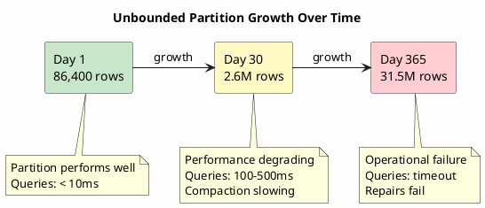
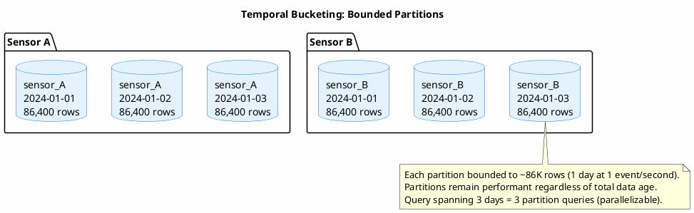
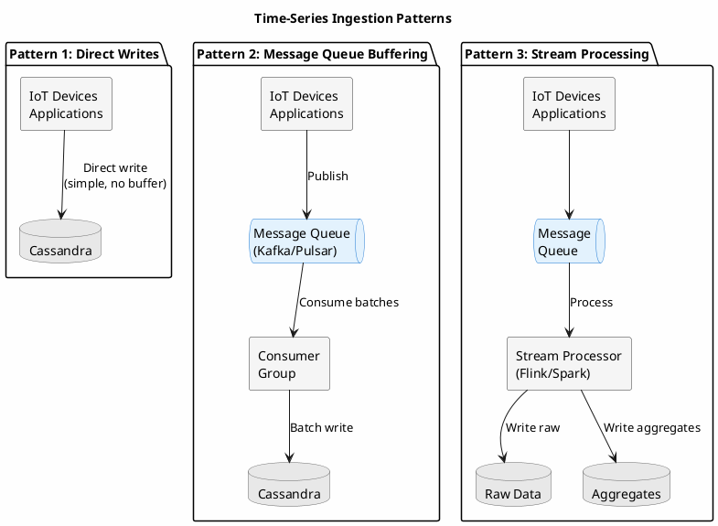
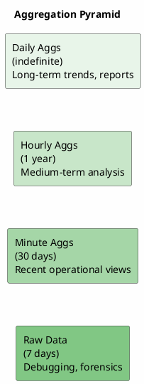
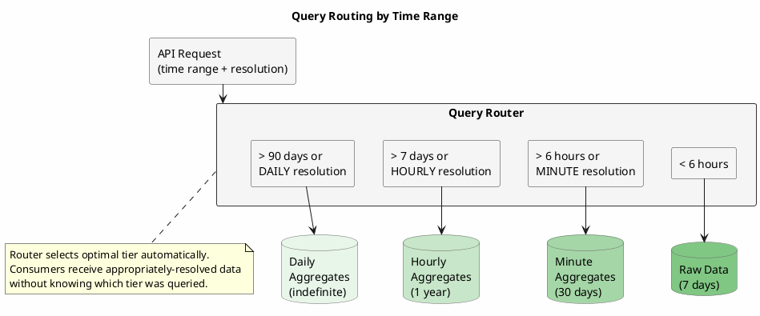
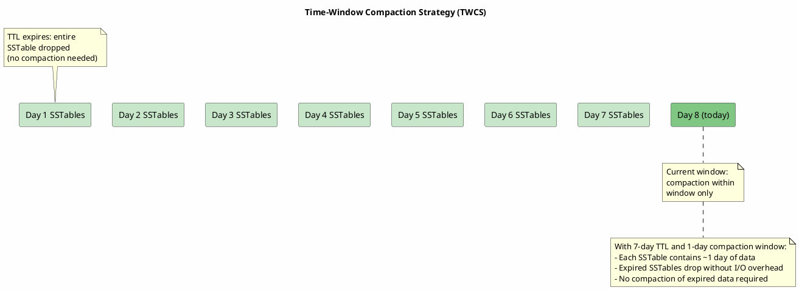
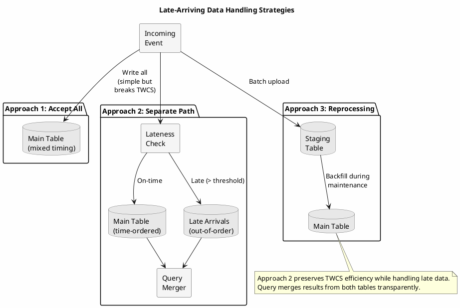
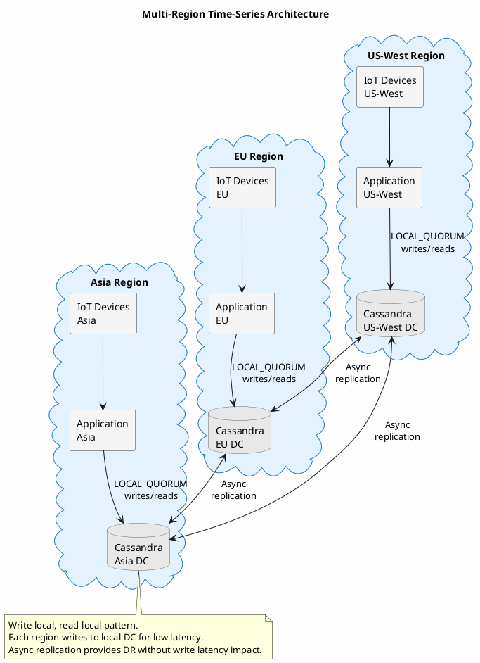

# Time-Series Data

Time-series data (measurements indexed by time) presents distinct architectural challenges. Sensor readings, application metrics, financial transactions, and user activity logs all share characteristics that make them both well-suited to Cassandra and prone to specific failure modes when patterns are misapplied.

---

## The Nature of Time-Series Data

Time-series workloads differ fundamentally from transactional workloads in ways that influence every architectural decision.

**Temporal locality**: Recent data is accessed frequently; older data rarely. A monitoring dashboard queries the last hour repeatedly; last month's data serves occasional investigations. This access pattern suggests that storage and query strategies should differ by age.

**Append-only semantics**: Time-series data is predominantly immutable. A temperature reading at 14:32:07 will not change. This immutability enables optimizations (compaction strategies, caching policies, replication approaches) that would be inappropriate for mutable data.

**High write velocity, low read amplification**: A fleet of 10,000 IoT devices reporting every second generates 10,000 writes per second but perhaps only dozens of dashboard queries. The write path must be optimized for throughput; the read path for efficient range scans.

**Inherent ordering**: Queries almost universally filter or sort by time. "Show me the last 24 hours" is the norm; "show me all readings with value > 100" is the exception. Schema design must privilege time-based access.

**Value decay**: The utility of time-series data typically decreases with age. Real-time alerting requires sub-second data; capacity planning needs daily aggregates; compliance may require raw data retention, but rarely raw data queries. This decay suggests a tiered approach to storage resolution.

---

## The Unbounded Partition Problem

The most common failure mode in time-series applications is the unbounded partition.



Consider a naive schema:

```sql
-- Anti-pattern: unbounded partition growth
CREATE TABLE sensor_readings (
    sensor_id UUID,
    event_time TIMESTAMP,
    value DOUBLE,
    PRIMARY KEY (sensor_id, event_time)
);
```

This schema partitions by sensor, with time as a clustering column. For a sensor reporting every second, the partition grows by 86,400 rows daily, over 31 million rows annually. Cassandra partitions are not designed for this scale; performance tends to degrade as partitions grow large. A common heuristic suggests keeping partitions under approximately 100,000 rows or 100MB, though actual limits depend on row size, access patterns, and hardware.

The degradation is insidious. Queries slow gradually. Compaction takes longer. Repairs timeout. By the time the problem is obvious, remediation requires data migration.

### Temporal Bucketing

The solution is to incorporate time into the partition key, bounding partition size by construction.



Schema implementation:

```sql
CREATE TABLE sensor_readings (
    sensor_id UUID,
    bucket DATE,
    event_time TIMESTAMP,
    value DOUBLE,
    PRIMARY KEY ((sensor_id, bucket), event_time)
);
```

Now each sensor-day combination forms a separate partition. A sensor reporting every second generates 86,400 rows per partition, well within acceptable bounds.

The bucket granularity depends on write velocity:

| Write Rate | Recommended Bucket | Rationale |
|------------|-------------------|-----------|
| < 1 event/minute | Monthly | Avoid excessive partition count |
| 1-100 events/minute | Daily | Balance partition size and count |
| 100-1000 events/minute | Hourly | Keep partitions reasonably sized |
| > 1000 events/minute | Sub-hourly | Custom bucketing required |

The trade-off is query complexity. A query spanning multiple buckets must issue multiple partition queries:

```java
public List<Reading> queryRange(UUID sensorId, Instant start, Instant end) {
    List<LocalDate> buckets = enumerateBuckets(start, end);

    // Each bucket requires a separate query
    return buckets.parallelStream()
        .flatMap(bucket -> queryBucket(sensorId, bucket, start, end).stream())
        .sorted(Comparator.comparing(Reading::getEventTime))
        .collect(Collectors.toList());
}
```

This is an acceptable trade-off. The alternative (unbounded partitions) leads to operational failure. The complexity is mechanical and easily abstracted into a repository layer.

---

## Ingestion Architecture

High-velocity time-series ingestion requires careful attention to the write path. Three patterns emerge, each with distinct trade-offs.



### Direct Writes

The simplest approach: applications write directly to Cassandra.

```java
public class DirectIngestion {

    private final CqlSession session;
    private final PreparedStatement insert;

    public CompletionStage<Void> ingest(SensorReading reading) {
        LocalDate bucket = reading.getTimestamp()
            .atZone(ZoneOffset.UTC)
            .toLocalDate();

        return session.executeAsync(insert.bind(
            reading.getSensorId(),
            bucket,
            reading.getTimestamp(),
            reading.getValue()
        )).thenApply(rs -> null);
    }
}
```

**When appropriate**: Moderate write volumes (< 10,000/second per application instance), simple deployment requirements, tolerance for data loss during application failures.

**Limitations**: No buffering during Cassandra unavailability. No replay capability. Backpressure must be handled at the application level. Each write incurs network round-trip overhead.

### Message Queue Buffering

Introducing a message queue (Kafka, Pulsar, or similar) between producers and Cassandra provides durability, buffering, and replay. The message queue absorbs write spikes, survives downstream unavailability, and enables replay for recovery or reprocessing. Consumers can batch writes for efficiency.

```java
@KafkaListener(topics = "sensor-readings",
               containerFactory = "batchListenerFactory")
public void consumeBatch(List<SensorReading> readings) {
    // Group by partition key for batching
    Map<PartitionKey, List<SensorReading>> grouped = readings.stream()
        .collect(Collectors.groupingBy(r ->
            new PartitionKey(r.getSensorId(), toBucket(r.getTimestamp()))));

    grouped.forEach((key, batch) -> {
        BatchStatement stmt = BatchStatement.newInstance(BatchType.UNLOGGED);
        batch.forEach(reading -> stmt.add(bindInsert(reading)));
        session.execute(stmt);
    });
}
```

The UNLOGGED batch is appropriate here because all statements target the same partition. The batch provides atomicity within the partition without the coordination overhead of logged batches.

**When appropriate**: High write volumes, requirement for durability guarantees, need for replay capability, tolerance for added infrastructure complexity.

**Limitations**: Increased operational complexity. Message queue becomes a critical dependency. Latency from producer to Cassandra increases.

### Stream Processing Integration

For workloads requiring transformation, enrichment, or aggregation before storage, a stream processing system (Flink, Spark Streaming, Kafka Streams) can serve as the ingestion layer. The stream processor handles not just ingestion but also real-time aggregation, enabling the aggregation pyramid pattern discussed below.

**When appropriate**: Complex event processing requirements, real-time aggregation needs, existing stream processing infrastructure.

**Limitations**: Significant infrastructure investment. Increased end-to-end latency. Operational complexity of distributed stream processing.

---

## The Aggregation Pyramid

Raw time-series data at full resolution is valuable for debugging and forensics but impractical for most analytical queries. A dashboard rendering a month of data cannot transfer and plot millions of points. The solution is pre-computed aggregates at multiple resolutions.



Each tier stores less data at lower resolution with longer retention. The tiers are not redundant; they serve different query patterns.

### Aggregate Schema Design

Aggregates should capture sufficient statistics for flexible querying:

```sql
CREATE TABLE sensor_readings_hourly (
    sensor_id UUID,
    bucket DATE,
    hour_start TIMESTAMP,
    min_value DOUBLE,
    max_value DOUBLE,
    sum_value DOUBLE,
    count BIGINT,
    PRIMARY KEY ((sensor_id, bucket), hour_start)
) WITH default_time_to_live = 31536000;  -- 1 year
```

Storing sum and count rather than average enables reaggregation: hourly aggregates can be combined into daily aggregates without re-reading raw data.

### Aggregation Computation

Aggregates can be computed synchronously (during ingestion), asynchronously (via background jobs), or via stream processing.

**Synchronous aggregation** updates aggregates on every write. This ensures aggregates are always current but adds latency to the write path and requires careful handling of concurrent updates.

**Asynchronous aggregation** computes aggregates periodically via scheduled jobs. This decouples write latency from aggregation cost but introduces lag between raw data and aggregates.

**Stream processing aggregation** uses windowed operations to compute aggregates continuously:

```java
DataStream<SensorReading> readings = /* source */;

readings
    .keyBy(SensorReading::getSensorId)
    .window(TumblingEventTimeWindows.of(Time.hours(1)))
    .aggregate(new StatisticsAggregator())
    .addSink(new CassandraSink<>("sensor_readings_hourly"));
```

The choice depends on latency requirements, infrastructure capabilities, and operational preferences.

### Query Routing

Applications must route queries to the appropriate tier based on the requested time range and resolution.



Implementation:

```java
public List<DataPoint> query(UUID sensorId, Instant start, Instant end,
                              Resolution desiredResolution) {
    Duration range = Duration.between(start, end);

    // Select tier based on range and desired resolution
    if (range.toDays() > 90 || desiredResolution == Resolution.DAILY) {
        return queryDailyAggregates(sensorId, start, end);
    } else if (range.toDays() > 7 || desiredResolution == Resolution.HOURLY) {
        return queryHourlyAggregates(sensorId, start, end);
    } else if (range.toHours() > 6 || desiredResolution == Resolution.MINUTE) {
        return queryMinuteAggregates(sensorId, start, end);
    } else {
        return queryRawData(sensorId, start, end);
    }
}
```

This routing should be transparent to consumers. An API requesting "the last 30 days of data" should automatically receive appropriately-resolved data without specifying which storage tier to query.

---

## Retention and Expiration

Time-series data has natural retention requirements: raw data for days, aggregates for months or years. Cassandra's TTL mechanism handles expiration automatically.

```java
// Prepared statement with TTL
PreparedStatement insertWithTtl = session.prepare(
    "INSERT INTO sensor_readings (sensor_id, event_time, value) VALUES (?, ?, ?) USING TTL ?"
);

// Insert with TTL
int ttlSeconds = 7 * 24 * 60 * 60;  // 7 days
session.execute(insertWithTtl.bind(sensorId, eventTime, value, ttlSeconds));
```

### Time-Window Compaction Strategy

For time-series workloads with TTL, the Time-Window Compaction Strategy (TWCS) is essential. TWCS groups SSTables by time window, enabling entire SSTables to be dropped when all contained data expires without the write amplification of compacting expired data.



```sql
ALTER TABLE sensor_readings WITH compaction = {
    'class': 'TimeWindowCompactionStrategy',
    'compaction_window_unit': 'DAYS',
    'compaction_window_size': 1
};
```

The compaction window should align with the data's natural time boundaries. For daily-bucketed data with 7-day TTL, a 1-day compaction window means each SSTable contains roughly one day of data; after 7 days, entire SSTables drop without compaction.

**Critical constraint**: TWCS assumes data arrives in roughly time-order. Out-of-order writes (e.g., late-arriving data, reprocessing historical data) create SSTables spanning multiple windows, undermining TWCS efficiency. If out-of-order writes are common, consider separate tables for real-time and historical ingestion.

---

## Late-Arriving Data

Real-world time-series systems must handle late-arriving data: events that arrive after their timestamp due to network delays, batch uploads, or system recovery.



### Approach 1: Accept and Query

The simplest approach accepts late data into the same tables. Queries over closed time ranges may return different results as late data arrives.

This approach suits analytical workloads where eventual completeness matters more than query stability. It requires no special handling but violates assumptions of time-ordered arrival that TWCS relies upon.

### Approach 2: Separate Late-Arrival Path

Route late-arriving data to separate tables, then merge at query time:

```java
public void ingest(SensorReading reading) {
    Duration lateness = Duration.between(reading.getTimestamp(), Instant.now());

    if (lateness.compareTo(LATE_THRESHOLD) > 0) {
        writeToLateArrivalsTable(reading);
    } else {
        writeToMainTable(reading);
    }
}
```

This preserves TWCS efficiency for the main table while accommodating late arrivals. Query complexity increases, but the late-arrivals table is typically small.

### Approach 3: Reprocessing

For batch-uploaded historical data, ingest to a staging table, then backfill to the main tables during maintenance windows. This keeps the real-time path clean but requires operational procedures for backfill.

---

## Multi-Region Considerations

Time-series applications often deploy globally: IoT devices worldwide, regional user bases, or regulatory requirements for data locality.



### Write-Local, Read-Local

The natural pattern for global time-series: each region writes to its local datacenter, reads from its local datacenter. Cassandra's asynchronous replication propagates data globally for disaster recovery without impacting write latency.

```java
// Driver configured with local DC
CqlSession session = CqlSession.builder()
    .withLocalDatacenter("us-west")
    .build();

// All writes/reads go to local DC
session.execute(insert.bind(...));  // LOCAL_QUORUM
```

### Global Queries

Queries spanning regions face a choice: query one region (accepting incompleteness) or query all regions (accepting latency). For most time-series applications, querying the local region suffices; each region's data is self-contained.

When global aggregation is required, consider:

1. **Federated queries**: Query each region, merge results in the application
2. **Centralized aggregates**: Replicate aggregates (not raw data) to a central region
3. **ETL to analytics platform**: Export to a system designed for global analytical queries

The choice depends on query frequency, latency requirements, and data volumes. For occasional global reporting, federated queries suffice. For real-time global dashboards, centralized aggregates or purpose-built analytics infrastructure may be warranted.

---

## When Not to Use Cassandra

Cassandra excels at time-series workloads, but alternatives may be more appropriate in certain scenarios:

**Complex analytical queries**: If workloads require ad-hoc aggregations, joins across entities, or complex filtering, a columnar analytical database (ClickHouse, TimescaleDB, or cloud analytics services) may be more suitable.

**Very small scale**: For a single application's metrics (thousands of points per day), a simpler solution (PostgreSQL with TimescaleDB, or even SQLite) reduces operational complexity.

**Sub-millisecond latency requirements**: If queries must complete in under a millisecond, an in-memory store (Redis, Dragonfly) for recent data may be necessary, with Cassandra serving as durable backing store.

**Strong consistency requirements**: If time-series queries must reflect all prior writes (true read-after-write consistency), Cassandra's eventual consistency model requires careful consistency level tuning that may impact performance.

The decision should be driven by actual requirements, not assumed scale. Many time-series applications would be adequately served by simpler architectures; Cassandra's value emerges at scale.

---

## Summary

Building time-series applications on Cassandra requires understanding the fundamental characteristics of temporal data and applying patterns suited to those characteristics:

1. **Bound partitions temporally** to prevent unbounded growth
2. **Buffer writes** through message queues for durability and backpressure
3. **Build aggregation pyramids** to serve queries at appropriate resolution
4. **Apply TWCS** for efficient compaction of time-ordered, TTL-expiring data
5. **Handle late arrivals** explicitly rather than assuming time-ordered ingestion
6. **Deploy regionally** with write-local, read-local patterns for global scale

These patterns are not Cassandra-specific; they reflect fundamental properties of time-series data. Cassandra provides the primitives (clustering columns, TTL, tunable consistency, linear scalability) to implement them effectively at scale.

---

## Related Documentation

- [TWCS Compaction](../../architecture/storage-engine/compaction/twcs.md) - Time-Window Compaction Strategy internals
- [Multi-Datacenter](../../architecture/distributed-data/multi-datacenter.md) - Global deployment patterns
- [CQRS Pattern](cqrs.md) - Separating read and write models
