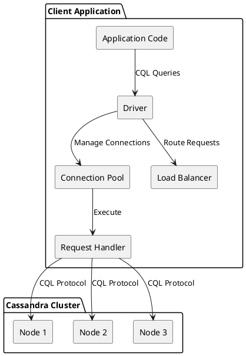
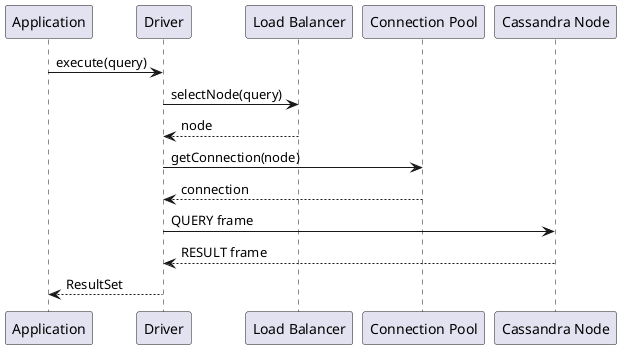

# Client Connection Architecture

Client applications communicate with Cassandra through the CQL Native Protocol, a binary protocol designed for high throughput and low latency. Understanding this architecture is essential for building performant applications and diagnosing connection-related issues.

## Architecture Overview



## Connection Model

Cassandra drivers maintain persistent TCP connections to multiple nodes in the cluster. This connection model provides:

- **Connection pooling** - Reuse of connections across requests
- **Multiplexing** - Multiple concurrent requests per connection
- **Automatic failover** - Transparent retry on node failures
- **Topology awareness** - Routing based on data location

### Connection Lifecycle

```
1. Initial Connection
   └── Driver connects to contact points
       └── Discovers cluster topology via system tables
           └── Establishes connections to discovered nodes

2. Steady State
   └── Maintains connection pools per node
       └── Monitors node health via control connection
           └── Routes requests based on load balancing policy

3. Failure Handling
   └── Detects connection failures
       └── Marks nodes as down
           └── Retries requests per retry policy
               └── Reconnects when nodes recover
```

## Key Components

| Component | Purpose | Documentation |
|-----------|---------|---------------|
| CQL Protocol | Binary wire protocol for client-server communication | [CQL Protocol](cql-protocol.md) |
| Connection Pooling | Manages persistent connections to nodes | [Async Connections](async-connections.md) |
| Authentication | Verifies client identity before allowing operations | [Authentication](authentication.md) |
| Load Balancing | Routes requests to appropriate nodes | [Load Balancing](load-balancing.md) |
| Query Pagination | Handles large result sets efficiently | [Pagination](pagination.md) |
| Query Throttling | Controls request rates to prevent overload | [Throttling](throttling.md) |
| Compression | Reduces network bandwidth usage | [Compression](compression.md) |
| Prepared Statements | Optimizes repeated query execution | [Prepared Statements](prepared-statements.md) |
| Failure Policies | Handles errors and retries | [Failure Handling](failure-handling.md) |

---

## Request Flow

A typical request flows through several layers before reaching the Cassandra node:



### Request Processing Steps

1. **Query Submission** - Application submits a query through the driver API
2. **Token Calculation** - Driver calculates the partition token (for token-aware routing)
3. **Node Selection** - Load balancing policy selects a coordinator node
4. **Connection Acquisition** - Connection pool provides an available connection
5. **Frame Encoding** - Query is encoded into CQL protocol frame
6. **Network Transmission** - Frame is sent over TCP with optional compression
7. **Server Processing** - Coordinator executes query against replicas
8. **Response Handling** - Result frames are decoded and returned to application

---

## Protocol Characteristics

The CQL Native Protocol has several important characteristics:

### Asynchronous and Multiplexed

Multiple requests can be in flight simultaneously on a single connection. Each request is tagged with a stream ID, allowing responses to arrive out of order. This design:

- Maximizes connection utilization
- Reduces connection count requirements
- Enables high-throughput applications

### Binary and Typed

The protocol uses a compact binary format with explicit type information:

- Efficient serialization/deserialization
- Strong type safety
- Consistent behavior across driver implementations

### Version Negotiated

Protocol version is negotiated during connection establishment:

- Backward compatibility with older servers
- Access to newer features when available
- Graceful degradation

---

## Connection Configuration

!!! warning "Local Datacenter Required"
    Most drivers require explicitly setting the local datacenter. Failing to set this parameter may result in cross-datacenter queries with significantly higher latency.

### Essential Parameters

Values shown are typical defaults; exact defaults vary by driver and version.

| Parameter | Description | Typical Value |
|-----------|-------------|---------------|
| Contact Points | Initial nodes for discovery | 2-3 nodes per DC |
| Local Datacenter | Preferred DC for routing | DC name string |
| Port | CQL native port | 9042 |
| Connection Timeout | Time to establish connection | 5 seconds |
| Request Timeout | Time for request completion | 12 seconds |

### Pool Configuration

Values shown are illustrative for Java Driver 4.x; other drivers may differ.

| Parameter | Description | Typical Value |
|-----------|-------------|---------------|
| Core Connections (Local) | Minimum connections per local node | 1-2 |
| Max Connections (Local) | Maximum connections per local node | 8 |
| Core Connections (Remote) | Minimum connections per remote node | 1 |
| Max Connections (Remote) | Maximum connections per remote node | 2 |
| Max Requests per Connection | Concurrent requests per connection | 1024-2048 |

---

## Topology Awareness

Drivers maintain awareness of cluster topology through:

### Control Connection

A dedicated connection to one node that:

- Subscribes to topology change events
- Refreshes metadata periodically
- Monitors cluster health

!!! note "Control Connection Failover"
    If the control connection node becomes unavailable, the driver automatically promotes another connection to serve as the control connection.

### System Table Queries

Metadata queries against:
- `system.local` - Local node information
- `system.peers` - Information about other nodes
- `system_schema.*` - Schema metadata

### Event Handling

Drivers react to server-pushed events:
- `TOPOLOGY_CHANGE` - Node added/removed
- `STATUS_CHANGE` - Node up/down
- `SCHEMA_CHANGE` - Schema modifications

---

## Performance Considerations

### Connection Efficiency

Each TCP connection has overhead:
- Memory for buffers (varies by driver configuration)
- File descriptors on both sides
- TCP keepalive traffic

Optimal configurations balance:
- Enough connections for throughput
- Not so many that they waste resources
- Enough in-flight requests per connection

### Latency Components

Total request latency includes:

| Component | Typical Range (illustrative) | Optimization |
|-----------|------------------------------|--------------|
| Serialization | Varies | Use prepared statements |
| Network RTT | 0.1-2 ms (same DC) | Co-locate clients |
| Queue Time | 0-10 ms | Proper connection sizing |
| Server Processing | 1-50 ms | Data model optimization |
| Deserialization | Varies | Minimize result size |

### Throughput Factors

Maximum throughput depends on:
- Number of connections × requests per connection
- Network bandwidth and latency
- Server capacity and load
- Query complexity and data size

---

## Documentation Structure

### Protocol Details

- **[CQL Protocol](cql-protocol.md)** - Wire protocol specification, frame format, opcodes

### Connection Management

- **[Async Connections](async-connections.md)** - Asynchronous I/O, multiplexing, connection pools
- **[Compression](compression.md)** - LZ4 and Snappy compression

### Security

- **[Authentication](authentication.md)** - SASL authentication, credential management

### Query Execution

- **[Prepared Statements](prepared-statements.md)** - Statement preparation, caching, reprepare
- **[Pagination](pagination.md)** - Result paging, state management
- **[Throttling](throttling.md)** - Rate limiting, backpressure

### Routing and Reliability

- **[Load Balancing](load-balancing.md)** - Policies, token awareness, DC awareness
- **[Failure Handling](failure-handling.md)** - Retry policies, speculative execution, idempotency

---

## Next Steps

- **[CQL Protocol](cql-protocol.md)** - Deep dive into the wire protocol
- **[Load Balancing](load-balancing.md)** - Understanding request routing
- **[Prepared Statements](prepared-statements.md)** - Optimizing query execution
