# Load Balancing Policies

Load balancing policies determine how drivers select coordinator nodes for each request. The choice of policy significantly impacts latency, throughput, and resource utilization across the cluster.

---

## Client-Side Load Balancing

### No External Load Balancer Required

Unlike traditional RDBMS architectures where applications connect through a load balancer (HAProxy, F5, PgBouncer, etc.), Cassandra drivers perform load balancing internally:

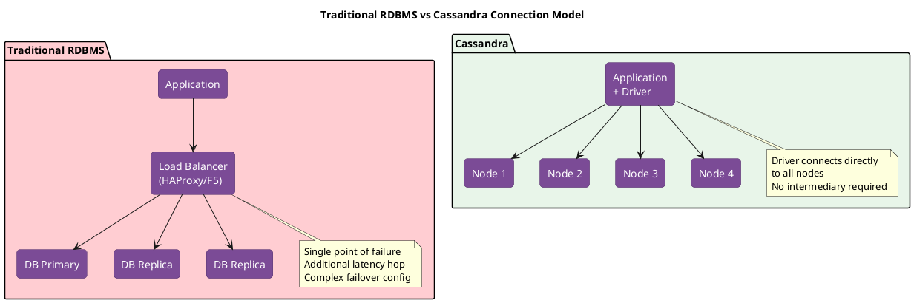

**Problems with External Load Balancers for Distributed Databases:**

| Issue | Impact |
|-------|--------|
| Single point of failure | Load balancer outage = total outage |
| Additional network hop | 0.5-2ms added latency per request |
| No data locality awareness | Cannot route to replica nodes |
| Connection pooling conflicts | LB pools vs driver pools |
| Health check limitations | Cannot assess Cassandra-specific health |
| Cost and complexity | Additional infrastructure to manage |

### Driver Bootstrap Process

When a Cassandra driver initializes, it performs cluster discovery automatically:

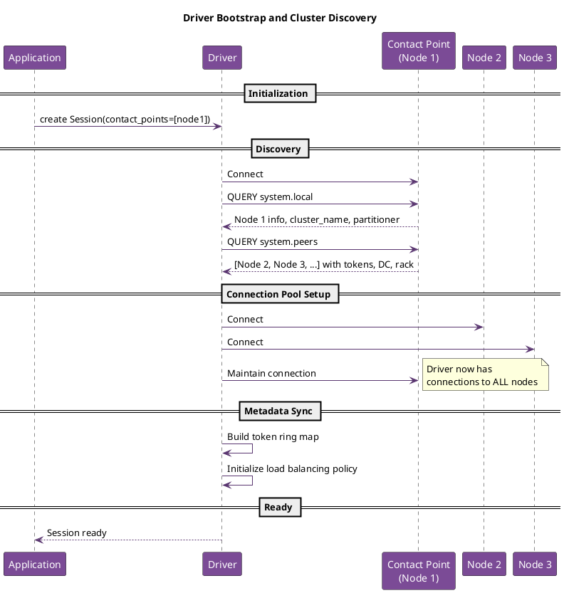

**Bootstrap Steps:**

1. **Contact point connection**: Driver connects to one or more seed addresses provided in configuration
2. **Cluster discovery**: Queries `system.local` and `system.peers` tables to discover all nodes
3. **Metadata retrieval**: Obtains token assignments, datacenter/rack topology, schema information
4. **Connection establishment**: Opens connection pools to all discovered nodes (based on distance policy)
5. **Token ring construction**: Builds internal map of token ranges to nodes for data-aware routing

!!! info "Contact Points Are Not Special"
    Contact points are only used for initial discovery. After bootstrap, the driver treats all nodes equally. If a contact point goes down, the driver continues operating with other nodes. Provide multiple contact points for bootstrap resilience.

### Direct Node Connections

After bootstrap, the driver maintains persistent connections to cluster nodes:

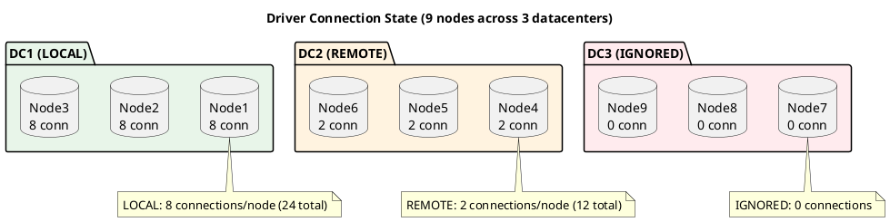

**Benefits of Direct Connections:**

| Benefit | Description |
|---------|-------------|
| No single point of failure | Any node can serve any request |
| Optimal latency | Direct path, no intermediary hop |
| Data-aware routing | Driver routes to replica nodes |
| Automatic failover | Instant reroute on node failure |
| Topology awareness | Respects datacenter boundaries |
| Dynamic scaling | New nodes discovered automatically |

### Load Balancing Policy Role

The load balancing policy determines request routing after connections are established:

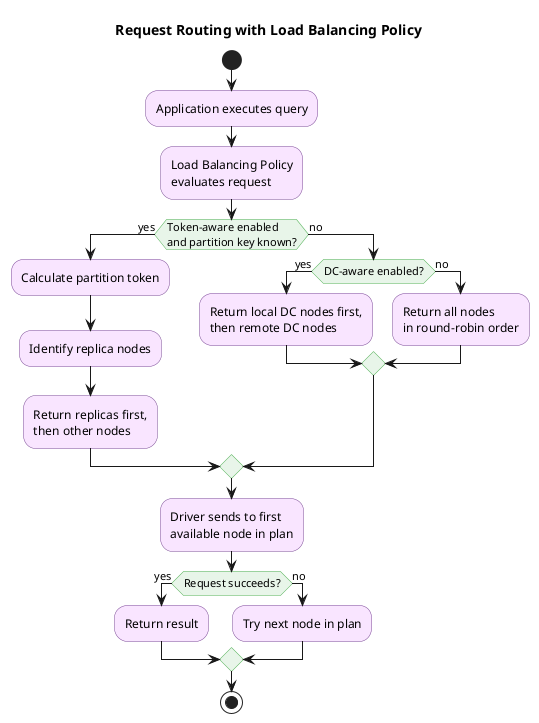

!!! tip "Recommended Production Configuration"
    For most production deployments, use Token-Aware policy wrapping DC-Aware Round Robin:
    ```
    TokenAwarePolicy(DCAwareRoundRobinPolicy(local_dc="dc1"))
    ```
    This routes directly to replica nodes when possible, falls back to local DC round-robin, and only uses remote DCs as a last resort.

---

## Load Balancing Overview

### Role of the Coordinator

Every CQL request is sent to a coordinator node that:

1. Receives the request from the client
2. Determines which replicas hold the data
3. Forwards requests to replicas
4. Collects and aggregates responses
5. Returns results to the client

The load balancing policy selects this coordinator.

### Selection Criteria

| Criterion | Benefit |
|-----------|---------|
| Data locality | Reduces network hops |
| Node health | Avoids failing nodes |
| Load distribution | Prevents hot spots |
| Datacenter proximity | Minimizes latency |
| Connection availability | Uses ready connections |

---

## Policy Architecture

### Policy Interface

Load balancing policies implement a common interface:

```python
# Conceptual interface
class LoadBalancingPolicy:
    def initialize(self, cluster):
        """Called when driver initializes with cluster metadata"""
        pass

    def distance(self, host):
        """Return distance classification for host"""
        # Returns: LOCAL, REMOTE, or IGNORED
        pass

    def new_query_plan(self, keyspace, statement):
        """Return iterator of hosts to try for this query"""
        pass

    def on_add(self, host):
        """Called when node joins cluster"""
        pass

    def on_remove(self, host):
        """Called when node leaves cluster"""
        pass

    def on_up(self, host):
        """Called when node becomes available"""
        pass

    def on_down(self, host):
        """Called when node becomes unavailable"""
        pass
```

### Query Plan

The query plan is an ordered sequence of nodes to try:

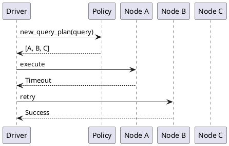

---

## Built-in Policies

### Round Robin

Distributes requests evenly across all nodes:

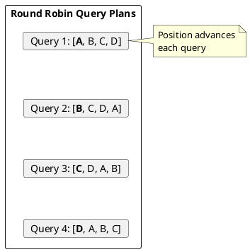

**Characteristics:**

- Simple, predictable distribution
- No awareness of data location
- Good for uniform workloads

!!! info "Not Recommended for Production"
    Round Robin policy ignores data locality and datacenter topology. For production deployments, use DC-aware or Token-aware policies instead.

**Implementation:**
```python
class RoundRobinPolicy:
    def __init__(self):
        self.hosts = []
        self.index = 0

    def new_query_plan(self, keyspace, statement):
        hosts = list(self.hosts)
        start = self.index
        self.index = (self.index + 1) % len(hosts)

        # Rotate to start position
        return hosts[start:] + hosts[:start]
```

### DC-Aware Round Robin

Prioritizes nodes in the local datacenter:

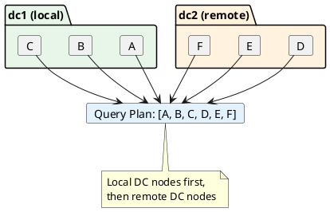

**Configuration:**
| Parameter | Description |
|-----------|-------------|
| local_dc | Preferred datacenter name |
| used_hosts_per_remote_dc | Remote hosts to include (0 = none) |

**Implementation Logic:**
```python
class DCAwareRoundRobinPolicy:
    def distance(self, host):
        if host.datacenter == self.local_dc:
            return DISTANCE_LOCAL
        elif self.used_hosts_per_remote_dc > 0:
            return DISTANCE_REMOTE
        else:
            return DISTANCE_IGNORED

    def new_query_plan(self, keyspace, statement):
        local = self.get_local_hosts()
        remote = self.get_remote_hosts()

        # Round-robin within local, then remote
        plan = rotate(local, self.local_index)
        if self.used_hosts_per_remote_dc > 0:
            plan.extend(rotate(remote, self.remote_index))

        return plan
```

### Token-Aware Policy

Routes requests directly to replica nodes:

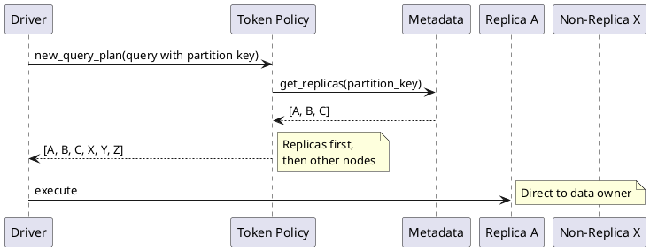

**How Token Awareness Works:**

1. Driver calculates partition token from query
2. Looks up token → replica mapping
3. Places replicas first in query plan
4. Falls back to non-replicas if all fail

**Requirements:**
- Partition key must be known (bound values available)
- Metadata must be synchronized
- Typically wraps another policy for non-token-aware queries

**Partition Key Detection:**

| Query Type | Token Calculable |
|------------|------------------|
| Prepared with PK bound | Yes |
| Simple with PK literal | Sometimes (parsing required) |
| Range queries | No |
| Queries without WHERE | No |

!!! tip "Use Prepared Statements for Token Awareness"
    Token-aware routing works best with prepared statements, which provide partition key metadata. Simple string queries may not benefit from token awareness.

### Latency-Aware Policy

Prefers nodes with lower observed latency:

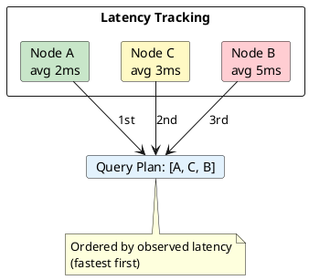

**Characteristics:**
- Adapts to network conditions
- Helps with heterogeneous hardware
- May create hot spots on fast nodes

**Configuration:**
| Parameter | Description |
|-----------|-------------|
| exclusion_threshold | Latency multiplier to exclude (e.g., 2.0) |
| scale | Time scale for averaging (e.g., 100ms) |
| retry_period | How often to retry excluded nodes |
| update_rate | Latency sample rate |

---

## Policy Composition

### Wrapping Policies

Policies can wrap other policies to add behavior:

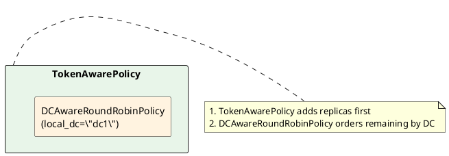

### Common Compositions

| Composition | Use Case |
|-------------|----------|
| Token(DCRoundRobin) | Standard production setup |
| Token(LatencyAware(DCRoundRobin)) | Latency-sensitive apps |
| DCRoundRobin only | When token calculation expensive |
| RoundRobin only | Single-DC, uniform access |

---

## Distance Classification

### Distance Types

Policies classify nodes by distance:

| Distance | Meaning | Connection Behavior |
|----------|---------|---------------------|
| LOCAL | Primary preference | Full connection pool |
| REMOTE | Secondary preference | Reduced pool size |
| IGNORED | Never use | No connections |

### Distance Impact

```yaml
# Typical pool configuration
connection_pool:
  local:
    core_connections: 2
    max_connections: 8
  remote:
    core_connections: 1
    max_connections: 2
```

---

## Multi-Datacenter Considerations

### Local-Only Access

For applications that should never cross datacenters:

```python
DCAwareRoundRobinPolicy(
    local_dc="dc1",
    used_hosts_per_remote_dc=0  # Never use remote
)
```

**Implications:**
- Lower latency (no cross-DC)
- Reduced availability (local failures = unavailable)
- Required for some compliance scenarios

### Remote Fallback

Allow falling back to remote datacenters:

```python
DCAwareRoundRobinPolicy(
    local_dc="dc1",
    used_hosts_per_remote_dc=2  # Include 2 per remote DC
)
```

**Implications:**
- Higher availability
- Possible high-latency responses
- Cross-DC traffic costs

### Multi-Region Writes

For write operations spanning regions:

```
Consistency Level: LOCAL_QUORUM
- Only requires quorum in local DC
- Async replication to remote DCs
- Lowest write latency

Consistency Level: EACH_QUORUM
- Requires quorum in every DC
- Higher latency
- Stronger consistency
```

---

## Node State Handling

### State Transitions

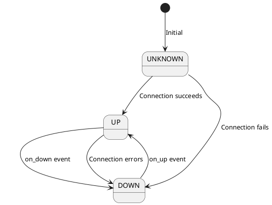

### Reconnection Behavior

When a node goes down:

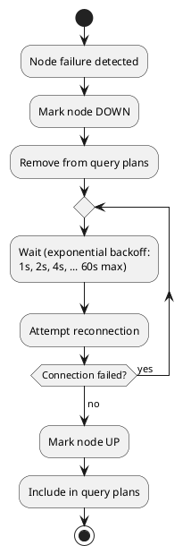

### Speculative Awareness

Load balancing interacts with speculative execution:

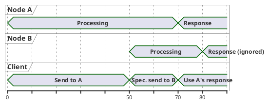

---

## Query Routing Optimization

### Token Calculation

For token-aware routing, drivers calculate partition tokens:

```python
def calculate_token(partition_key, partitioner):
    # Murmur3Partitioner (default)
    if partitioner == "Murmur3Partitioner":
        return murmur3_hash(partition_key)

    # RandomPartitioner (legacy)
    elif partitioner == "RandomPartitioner":
        return md5_hash(partition_key)
```

### Metadata Synchronization

Token awareness requires current metadata:

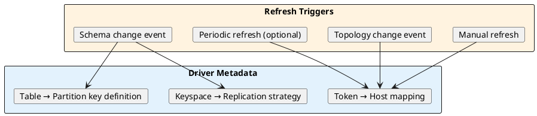

### Prepared Statement Optimization

Prepared statements enable better routing:

```python
# Without preparation - must parse query
session.execute("SELECT * FROM users WHERE id = 12345")
# Parsing may not extract partition key

# With preparation - routing info cached
stmt = session.prepare("SELECT * FROM users WHERE id = ?")
session.execute(stmt, [12345])
# Driver knows exactly which partition
```

---

## Custom Policies

### When to Customize

Custom policies for:
- Special routing requirements
- Custom health checks
- Workload-specific distribution
- Integration with external systems

### Implementation Guidelines

```python
class CustomLoadBalancingPolicy:
    def __init__(self, config):
        self.config = config

    def initialize(self, cluster):
        # Store reference for metadata access
        self.cluster = cluster
        self.hosts = set()

    def distance(self, host):
        # Classify based on custom criteria
        if self.is_preferred(host):
            return DISTANCE_LOCAL
        elif self.is_acceptable(host):
            return DISTANCE_REMOTE
        else:
            return DISTANCE_IGNORED

    def new_query_plan(self, keyspace, statement):
        # Build ordered list based on:
        # - Data locality
        # - Node health
        # - Custom metrics
        # - Business rules
        return self.order_hosts(statement)

    def on_up(self, host):
        self.hosts.add(host)

    def on_down(self, host):
        # Don't remove immediately - allow recovery
        pass

    def on_remove(self, host):
        self.hosts.discard(host)
```

---

## Performance Considerations

### Policy Overhead

| Policy | Overhead per Query |
|--------|-------------------|
| Round Robin | O(1) |
| DC-Aware | O(1) |
| Token-Aware | O(log n) token lookup |
| Latency-Aware | O(n) sorting |

### Caching

Effective policies cache:
- Host lists per datacenter
- Token → host mappings
- Distance calculations
- Query plans for repeated queries

### Monitoring

Key metrics for load balancing:

| Metric | Indicates |
|--------|-----------|
| Requests per node | Distribution evenness |
| Cross-DC requests | Fallback frequency |
| Retry rate | Initial selection quality |
| Speculative executions | Latency issues |

---

## Related Documentation

- **[Failure Handling](failure-handling.md)** - Retry and speculative execution
- **[Async Connections](async-connections.md)** - Connection pools per distance
- **[CQL Protocol](cql-protocol.md)** - Coordinator role in protocol