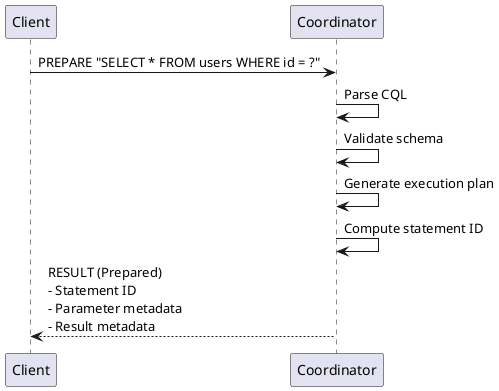
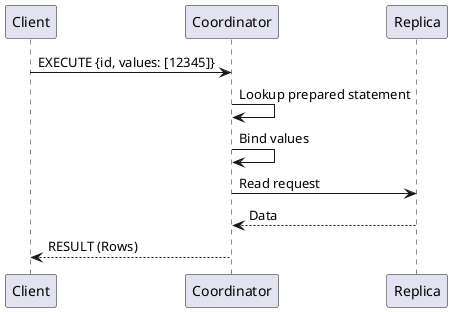
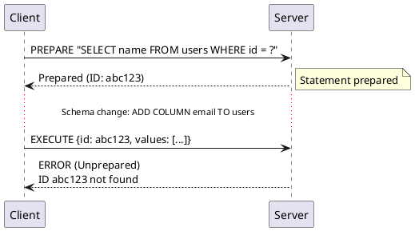
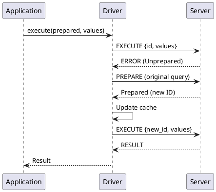

# Prepared Statements Architecture

Prepared statements optimize repeated query execution by separating query parsing from execution. The server parses and validates the query once, returning an identifier that clients use for subsequent executions with different parameter values.

## Preparation Model

### Why Prepare Statements?

Without preparation, every query execution requires:

1. Parse CQL syntax
2. Validate against schema
3. Plan execution
4. Execute query

With prepared statements:

1. **Prepare (once):** Parse, validate, plan → return ID
2. **Execute (many):** Bind values, execute using ID

### Benefits

| Benefit | Impact |
|---------|--------|
| Reduced parsing | Lower server CPU |
| Smaller messages | Less network bandwidth |
| Token-aware routing | Better coordinator selection |
| Type safety | Compile-time validation in drivers |
| Security | No CQL injection possible |

!!! tip "Always Use Prepared Statements"
    Prepared statements should be used for all production queries. They provide security against injection attacks, enable token-aware routing, and reduce message sizes.

---

## Protocol Flow

### Preparation Phase



### Execution Phase



---

## Statement Identification

### Statement ID

The prepared statement ID is a hash that uniquely identifies:

- Query string
- Keyspace context
- Protocol-relevant settings

**ID Computation:**
```
ID = MD5(query_string + keyspace + settings)
     ↓
16-byte identifier
```

### Result Metadata ID (Protocol v5+)

Protocol v5 adds a result metadata ID for optimization:

```
Result Metadata ID = MD5(column_specifications)

Purpose:
- Client caches result metadata
- Server can skip sending metadata if unchanged
- Reduces response size for repeated queries
```

---

## Server-Side Architecture

### Prepared Statement Cache

Cassandra maintains a cache of prepared statements:

```yaml
# cassandra.yaml
prepared_statements_cache_size_mb: 100  # Maximum cache size
```

**Cache characteristics:**
- Per-node cache (not distributed)
- LRU eviction when full
- Survives connection close
- Lost on node restart

### Cache Structure

```
Cache Entry:
  Key: Statement ID (16 bytes)
  Value:
    - Parsed query tree
    - Bound variable metadata
    - Result metadata
    - Partition key indices
    - Keyspace reference
```

### Eviction Behavior

When the cache is full:

1. LRU statement selected for eviction
2. Statement removed from cache
3. Future executions receive UNPREPARED error
4. Client must re-prepare

---

## Client-Side Architecture

### Driver Cache

Drivers maintain their own prepared statement cache:

```python
# Conceptual driver cache
class PreparedStatementCache:
    def __init__(self):
        self.by_query = {}      # query_string → PreparedStatement
        self.by_id = {}         # statement_id → PreparedStatement

    def get_or_prepare(self, session, query):
        if query in self.by_query:
            return self.by_query[query]

        # Prepare on server
        prepared = session.prepare(query)
        self.by_query[query] = prepared
        self.by_id[prepared.id] = prepared
        return prepared
```

### Metadata Caching

Prepared statements include metadata that drivers cache:

```
PreparedStatement:
  - Statement ID
  - Query string
  - Bound variables:
      - Name
      - Type
      - Position
  - Result columns:
      - Keyspace
      - Table
      - Name
      - Type
  - Partition key indices (for routing)
```

---

## Handling Schema Changes

### The Reprepare Problem

When schema changes, prepared statements may become invalid:



### Automatic Reprepare

Drivers handle UNPREPARED errors automatically:



### Schema Change Events

Drivers listen for schema changes to proactively update:

```
SCHEMA_CHANGE event received:
  1. Check affected keyspace/table
  2. Invalidate relevant prepared statements
  3. Reprepare on next use (lazy) or immediately (eager)
```

---

## Token-Aware Routing

### Partition Key Detection

Prepared statements enable precise token-aware routing:

```
SELECT * FROM users WHERE id = ? AND name = ?
                         ↑ Partition key

Preparation response includes:
  pk_indices: [0]  // First bound variable is partition key

Execution:
  1. Driver extracts value at index 0
  2. Computes partition token
  3. Routes to owning replica
```

### Composite Partition Keys

For composite keys:

```sql
CREATE TABLE events (
    year INT,
    month INT,
    day INT,
    event_id UUID,
    PRIMARY KEY ((year, month), day, event_id)
);

SELECT * FROM events WHERE year = ? AND month = ? AND day = ?
                          ↑         ↑ Partition key components

pk_indices: [0, 1]  // First two bound variables
```

### Routing Optimization

With partition key information:

```
Without preparation:
  Driver parses query → May not determine routing
  Falls back to round-robin selection

With preparation:
  Driver knows pk_indices
  Directly calculates token from bound values
  Routes to replica node
```

---

## Batch Statements

### Batches with Prepared Statements

Batches can mix prepared and unprepared statements:

```
BATCH {
    type: LOGGED
    statements: [
        {kind: 1, id: <prepared_id>, values: [...]},  // Prepared
        {kind: 0, query: "INSERT ...", values: [...]},  // Unprepared
        {kind: 1, id: <prepared_id>, values: [...]}   // Prepared
    ]
}
```

### Batch Routing

Batches should target a single partition:

```
Single-partition batch (efficient):
  All statements affect same partition
  Atomic execution guaranteed
  Token-aware routing possible

Multi-partition batch (inefficient):
  Coordinator logs batch
  Contacts multiple replicas
  Higher latency and overhead
```

---

## Performance Characteristics

### Preparation Overhead

| Operation | Typical Time |
|-----------|--------------|
| Parse simple query | 50-200 μs |
| Parse complex query | 200-1000 μs |
| Schema validation | 10-50 μs |
| Plan generation | 10-100 μs |
| Total preparation | 100-1500 μs |

### Execution Efficiency

| Metric | Unprepared | Prepared |
|--------|------------|----------|
| Server CPU | Higher | Lower |
| Request size | Larger | Smaller |
| Response handling | No metadata caching | Metadata cached |
| Routing | May be suboptimal | Token-aware |

### Message Size Comparison

```
Unprepared QUERY:
  Query string: "SELECT * FROM users WHERE id = 12345" (38 bytes)
  Total: ~50 bytes

Prepared EXECUTE:
  Statement ID: 16 bytes
  Value count: 2 bytes
  Value: 4 bytes (int)
  Total: ~22 bytes

Savings: 56% smaller
```

---

## Best Practices

### When to Use Prepared Statements

**Always use for:**
- Repeated queries (even just twice)
- Queries with parameters
- Performance-critical paths
- Production code

**May skip for:**
- One-time administrative queries
- Dynamic schema exploration
- Quick debugging

### Preparation Strategies

**Eager preparation:**
```python
# Prepare at startup
def initialize():
    statements = {
        'get_user': session.prepare("SELECT * FROM users WHERE id = ?"),
        'insert_user': session.prepare("INSERT INTO users ..."),
    }
    return statements
```

**Lazy preparation:**
```python
# Prepare on first use
@lru_cache
def get_prepared(query):
    return session.prepare(query)

# First call prepares, subsequent calls use cache
result = session.execute(get_prepared("SELECT ..."), values)
```

### Avoid Over-Preparation

Don't prepare every unique query:

```python
# Bad: Prepares a new statement for each ID
for user_id in user_ids:
    stmt = session.prepare(f"SELECT * FROM users WHERE id = {user_id}")
    session.execute(stmt)

# Good: Prepare once, execute many
stmt = session.prepare("SELECT * FROM users WHERE id = ?")
for user_id in user_ids:
    session.execute(stmt, [user_id])
```

---

## Troubleshooting

### Common Issues

**UNPREPARED errors:**

- Statement evicted from server cache
- Schema changed
- Connected to new node
- Solution: Driver should auto-reprepare

!!! note "Automatic Reprepare"
    All modern drivers handle UNPREPARED errors transparently by re-preparing the statement and retrying. Applications typically do not need special handling for this scenario.

**Statement not found on all nodes:**
- Prepared on one node only
- Solution: Prepare on each connection

**Cache exhaustion:**
- Too many unique queries
- Solution: Increase cache size or reduce unique queries

### Monitoring

| Metric | Healthy Range |
|--------|---------------|
| Preparation rate | Low, stable |
| Reprepare rate | Near zero |
| Cache size | Below limit |
| Cache hit rate | >99% |

---

## Related Documentation

- **[CQL Protocol](cql-protocol.md)** - PREPARE and EXECUTE opcodes
- **[Load Balancing](load-balancing.md)** - Token-aware routing
- **[Failure Handling](failure-handling.md)** - Handling preparation failures
