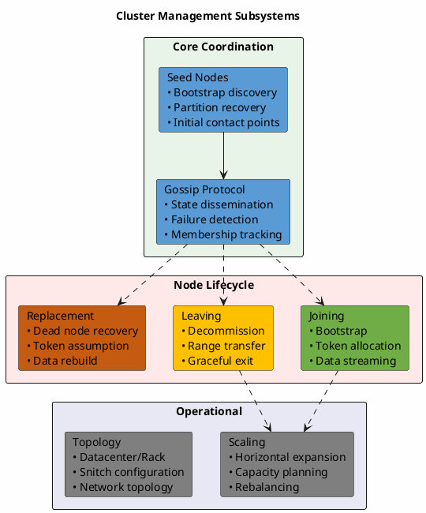

# Cluster Management

This section describes the mechanisms by which Cassandra nodes form, maintain, and modify cluster membership. Unlike centralized database systems that rely on a coordinator or master node, Cassandra employs a fully decentralized peer-to-peer architecture where each node participates equally in cluster coordination.

---

## Architecture Overview

Cassandra's cluster management is built upon several interconnected subsystems:

### Design Principles

Cassandra's cluster management adheres to several key distributed systems principles:

| Principle | Implementation | Benefit |
|-----------|----------------|---------|
| **Decentralization** | No master node; all nodes are peers | No single point of failure |
| **Eventual consistency** | Gossip-based state propagation | Availability over strict consistency |
| **Symmetry** | All nodes run identical code paths | Simplified operations |
| **Partition tolerance** | Continues operating during network splits | High availability |
| **Incremental scalability** | Add/remove nodes without downtime | Elastic capacity |

---

## Core Components

### Gossip Protocol

The gossip protocol forms the foundation of cluster coordination. Every second, each node exchanges state information with randomly selected peers, enabling:

- **Membership tracking**: Discovery and monitoring of all cluster nodes
- **Failure detection**: Probabilistic detection using the Phi Accrual algorithm
- **State dissemination**: Propagation of node metadata (tokens, schema, load)
- **Decentralized coordination**: No reliance on external coordination services

See **[Gossip Protocol](gossip.md)** for detailed protocol mechanics, failure detection algorithms, and internode messaging architecture.

### Seed Nodes

Seed nodes serve as initial contact points for cluster discovery and partition recovery:

- **Bootstrap discovery**: New nodes contact seeds to learn cluster topology
- **Gossip hotspots**: Seeds receive preferential gossip traffic
- **Partition bridging**: Help reconnect fragmented cluster segments

See **[Seeds and Discovery](seeds.md)** for seed selection guidelines, configuration, and operational considerations.

### Token Ring

The token ring determines data ownership and distribution:

- **Consistent hashing**: Maps partition keys to tokens (typically Murmur3)
- **Token ownership**: Each node owns ranges of the token space
- **Virtual nodes (vnodes)**: Multiple token ranges per physical node
- **Replication**: Tokens determine replica placement

See **[Partitioning](../distributed-data/partitioning.md)** for token allocation and consistent hashing details.

---

## Node Lifecycle

### Joining the Cluster

New nodes join the cluster through a multi-phase bootstrap process:

1. **Discovery**: Contact seed nodes, learn cluster topology via gossip
2. **Token allocation**: Determine owned token ranges (automatic with vnodes)
3. **Streaming**: Receive data for owned ranges from existing replicas
4. **Activation**: Begin serving client requests

See **[Node Lifecycle](node-lifecycle.md)** for bootstrap sequence details, token allocation strategies, and join procedures.

### Leaving the Cluster

Nodes leave the cluster through controlled decommission:

1. **Announcement**: Gossip LEAVING status to cluster
2. **Streaming**: Transfer all owned data to new replica owners
3. **Completion**: Gossip LEFT status, exit cluster

See **[Node Lifecycle](node-lifecycle.md)** for decommission procedures and data redistribution.

### Node Failure and Replacement

When nodes fail unexpectedly, replacement procedures restore cluster health:

1. **Detection**: Phi Accrual failure detector marks node as DOWN
2. **Decision**: Operator initiates replacement or removal
3. **Recovery**: New node assumes failed node's tokens, rebuilds data

See **[Node Replacement](node-replacement.md)** for replacement vs removal decisions, procedures, and recovery strategies.

---

## Scaling Operations

### Horizontal Scaling

Cassandra scales horizontally by adding or removing nodes:

| Operation | Effect | Data Movement |
|-----------|--------|---------------|
| **Add nodes** | Increased capacity, reduced load per node | Data streams to new nodes |
| **Remove nodes** | Reduced capacity, increased load per node | Data streams from departing nodes |
| **Rebalance** | Even token distribution | Data moves between existing nodes |

### Capacity Planning

Effective scaling requires understanding:

- **Data distribution**: How tokens map to nodes
- **Replication factor**: Number of copies per partition
- **Workload characteristics**: Read/write ratios, partition sizes
- **Resource utilization**: CPU, memory, disk, network per node

See **[Scaling Operations](scaling.md)** for capacity planning, scaling procedures, and best practices.

---

## Documentation Structure

| Section | Description |
|---------|-------------|
| [Gossip Protocol](gossip.md) | Internode messaging, failure detection, state propagation |
| [Seeds and Discovery](seeds.md) | Seed node configuration, cluster discovery, partition recovery |
| [Node Lifecycle](node-lifecycle.md) | Bootstrap, decommission, node states and transitions |
| [Node Replacement](node-replacement.md) | Dead node handling, replacement procedures, data recovery |
| [Scaling Operations](scaling.md) | Adding/removing nodes, capacity planning, rebalancing |

---

## Related Documentation

- **[Distributed Data](../distributed-data/index.md)** - Partitioning, replication, and consistency
- **[Data Streaming](../distributed-data/streaming.md)** - SSTable transfer during topology changes
- **[Storage Engine](../storage-engine/index.md)** - Local data management on each node
